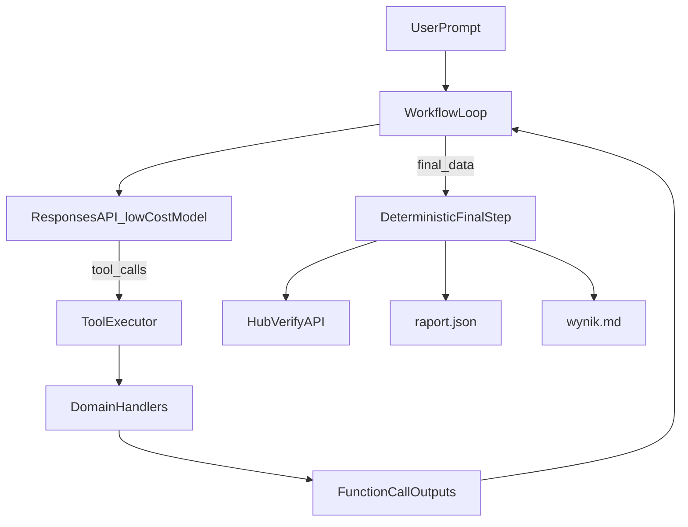

# Plan implementacji findhim (workflow + tools)

## Założenia architektoniczne

- Bazujemy na wzorcu z `[01_02_tools/app.js](01_02_tools/app.js)` i `[01_02_tools/helper.js](01_02_tools/helper.js)`: model decyduje o tool callach, kod JS wykonuje narzędzia i odsyła wyniki do kontekstu.
- Rozdzielamy odpowiedzialności: `tools` (co model może wywołać), `handlers` (co naprawdę robi kod), `workflow loop` (sterowanie), `verify` (deterministyczny finał).
- Używamy taniego modelu jako default (zgodnie z Twoim wymaganiem), a Structured Output tylko tam, gdzie potrzebna klasyfikacja zawodów.

## Checkpointy

### Checkpoint 1 — Architektura i szkielet projektu

- Utworzenie czytelnej struktury plików w `[01_02_zadanie/src](01_02_zadanie/src)`:
  - `[01_02_zadanie/src/main.js](01_02_zadanie/src/main.js)`
  - `[01_02_zadanie/src/workflow.js](01_02_zadanie/src/workflow.js)`
  - `[01_02_zadanie/src/tools.js](01_02_zadanie/src/tools.js)`
  - `[01_02_zadanie/src/handlers.js](01_02_zadanie/src/handlers.js)`
  - `[01_02_zadanie/src/people.js](01_02_zadanie/src/people.js)`
  - `[01_02_zadanie/src/report.js](01_02_zadanie/src/report.js)`
  - `[01_02_zadanie/src/verify.js](01_02_zadanie/src/verify.js)`
- Dodanie minimalnych interfejsów funkcji (bez pełnej logiki), żeby było jasne jak dane płyną.

### Checkpoint 2 — Definicja tools i kontrakty danych

- Definicja narzędzi (JSON Schema) w `[01_02_zadanie/src/tools.js](01_02_zadanie/src/tools.js)`:
  - `load_people`
  - `filter_candidates`
  - `tag_jobs_batch`
  - `build_report`
- Zdefiniowanie formatu wejścia/wyjścia każdego narzędzia i mapy `toolName -> handler`.

### Checkpoint 3 — Pętla workflow + tool calls

- Implementacja pętli analogicznej do `chat()` z lekcji w `[01_02_zadanie/src/workflow.js](01_02_zadanie/src/workflow.js)`:
  - request do Responses API,
  - odczyt tool calls,
  - wykonanie handlerów,
  - dołączenie `function_call_output` do kontekstu,
  - limit kroków ochronny.
- Logging kroków (co model zlecił i co zwróciło narzędzie) dla nauki/debugowania.

### Checkpoint 4 — Logika danych i raport.json

- Implementacja logiki domenowej:
  - wczytanie danych,
  - filtr (M, Grudziądz, wiek 20–40),
  - batch tagging z Structured Output,
  - wybór tagu `transport`.
- Budowanie i zapis `[01_02_zadanie/raport.json](01_02_zadanie/raport.json)`.

### Checkpoint 5 — Deterministyczny finał verify + wynik.md

- Deterministyczny krok końcowy poza modelem:
  - walidacja końcowego payloadu,
  - POST na `/verify` z `task: "people"`,
  - zapis odpowiedzi i flagi do `[01_02_zadanie/wynik.md](01_02_zadanie/wynik.md)`.
- Krótki smoke test całego przepływu end-to-end.

## Przepływ architektoniczny

## Co dokładnie realizujemy najpierw (start Checkpoint 1)

- Ustalenie granic modułów i odpowiedzialności plików.
- Przygotowanie szkieletu importów/eksportów, aby kolejne checkpointy były tylko „wypełnianiem” gotowych miejsc.
- Dodanie prostego punktu wejścia (`main.js`) wywołującego `runWorkflow()` i osobnego `runDeterministicFinalize()`.

Kluczowa idea edukacyjna: model nie „robi wszystkiego”, tylko orkiestruje wywołania narzędzi, a krytyczny krok `verify` pozostaje deterministyczny i kontrolowany przez kod.