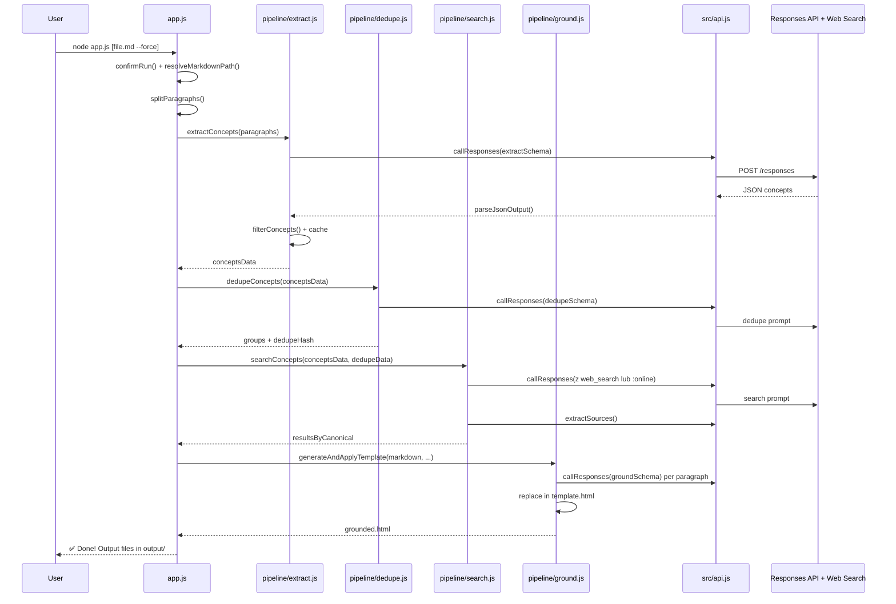
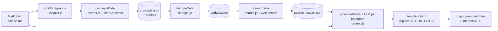

# Architektura projektu `01_01_grounding`

**Wersja: Grok 4.20**  
**Data analizy:** na podstawie rzeczywistego kodu (app.js, src/pipeline/*, src/api.js, schemas, prompts, utils, template.html, config.js, output/*, notes/*)

## 1. Podsumowanie projektu

**Co robi aplikacja**

Aplikacja przyjmuje plik Markdown z folderu `notes/` (domyślnie pierwszy plik `.md` lub podany jako argument), dzieli go na paragrafy i uruchamia 4-etapowy pipeline AI:

1. **Extract** – z każdego paragrafu wyciąga koncepty (claims, terms, definitions itp.) według ścisłej JSON Schema.
2. **Dedupe** – grupuje synonimy i surface forms pod jedną kanoniczną etykietę.
3. **Search** – dla każdego unikalnego kanonicznego konceptu wykonuje web search (natywny tool Responses API) i zapisuje summary + źródła.
4. **Ground** – generuje semantyczny HTML, w którym pasujące frazy są owinięte w `<span class="grounded" data-grounding="...">`. 

Wynikiem jest `output/grounded.html` – nowoczesna, responsywna strona z podświetlonymi faktami. Hover lub kliknięcie pokazuje tooltip z podsumowaniem AI i listą zweryfikowanych źródeł (z faviconami).

**Jaki problem rozwiązuje**

Tworzenie notatek technicznych bez weryfikacji faktów i źródeł. Ręczne fact-checking jest żmudne. Ten pipeline automatyzuje ekstrakcję, weryfikację przez wyszukiwanie w internecie i annotację HTML w jednym przebiegu, z agresywnym cachowaniem.

**Główny scenariusz użycia**

1. Tworzysz/edytujesz notatkę w `notes/nazwa.md` (np. `notes/crypto.md` lub `notes/s01e01-05.md`).
2. Uruchamiasz `npm run lesson1:grounding` (lub `node app.js [--force]`).
3. Otrzymujesz `output/grounded.html` gotowy do otwarcia w przeglądarce.
4. Czytasz notatkę – klikasz podświetlone frazy, widzisz podsumowanie i źródła.

**Najważniejsze elementy techniczne**

- 4-etapowy pipeline z cache'owaniem na podstawie hashów treści + modelu (`src/utils/hash.js` + `sourceHash`, `conceptsHash`, `dedupeHash`).
- Wyłącznie **Responses API** (nie klasyczny Chat Completions) z `textFormat` (structured outputs, `strict: true`) i natywnym web_search.
- Hardcoded concurrency = 5 w każdym stage (`Promise.all` na batchach).
- `template.html` zawiera cały frontend (CSS variables, tooltip system z drag on mobile, stats badge, keyboard support).
- Zero zewnętrznych zależności npm poza tym co jest w root (czysta Node.js ESM).

## 2. Architektura wysokopoziomowa

Projekt to **CLI pipeline** – nie serwer, nie aplikacja webowa, tylko sekwencyjny proces generujący statyczny artefakt. Cała logika biznesowa znajduje się w `src/pipeline/*`. Komunikacja z AI jest scentralizowana w `src/api.js`.

Główne warstwy:
- **Orkiestracja** (`app.js`)
- **Pipeline stages** (extract → dedupe → search → ground)
- **AI Abstraction** (`api.js` + schemas + prompts)
- **Infrastructure** (caching, file I/O, text processing, hashing)
- **Presentation** (`template.html` + inline JS/CSS)

```mermaid
graph TD
    subgraph Wejście
        MD[notes/*.md<br/>Markdown]
    end

    subgraph Orkiestrator
        APP[app.js<br/>main() + confirmRun()]
    end

    subgraph Pipeline[4-etapowy Pipeline]
        EXT[1. extractConcepts<br/>pipeline/extract.js]
        DED[2. dedupeConcepts<br/>pipeline/dedupe.js]
        SEA[3. searchConcepts<br/>pipeline/search.js]
        GRD[4. generateAndApplyTemplate<br/>pipeline/ground.js]
    end

    subgraph AI_Layer[Warstwa AI]
        API[src/api.js<br/>chat() + fetchWithRetry() + extractJson() + extractSources()]
        SCH[sr c/schemas/*.js<br/>JSON Schema strict]
        PRM[src/prompts/*.js<br/>build*Prompt()]
    end

    subgraph Utils
        UTL[src/utils/*<br/>hash, file, text, concept-filter]
        CFG[src/config.js<br/>paths, models, cli]
    end

    subgraph Wyjście
        OUT[output/<br/>concepts.json + dedupe.json + search_results.json + grounded.html]
        HTML[grounded.html<br/>z inline JS tooltip system]
    end

    MD --> APP
    APP --> EXT
    EXT --> DED
    DED --> SEA
    SEA --> GRD
    EXT & DED & SEA & GRD --> API
    API --> SCH & PRM & CFG & UTL
    GRD --> HTML & OUT
```

**Główne odpowiedzialności:**
- `app.js` – potwierdzenie uruchomienia, wczytanie MD, wywołanie pipeline, raportowanie.
- Pipeline – cache check → ewentualne wywołanie AI → persist JSON.
- `api.js` – **jedyny** plik robiący `fetch` do `RESPONSES_API_ENDPOINT`.

## 3. Struktura repozytorium

Najważniejsze elementy (skupione na działaniu):

- **`app.js`** – entry point i orchestrator (67 linii, cały flow w `main()`).
- **`src/config.js`** – wszystkie ścieżki (`paths`), modele (`models.extract/search/ground`), parsowanie CLI (`process.argv`), timeouty, batchSize (choć nie wszędzie używany).
- **`src/pipeline/`** – **główna logika biznesowa**:
  - `extract.js` (176 linii) – najcięższy plik.
  - `dedupe.js`, `search.js`, `ground.js`, `concept-filter.js`.
- **`src/api.js`** (196 linii) – serce integracji z AI (retry z exponential backoff, parsing structured output i web_search_call).
- **`src/schemas/`** – kontrakty (extractSchema, groundSchema itd. + `categories.js`).
- **`src/prompts/`** – precyzyjne instrukcje dla modelu (`EXTRACTION_GUIDELINES` jest kluczowa).
- **`src/utils/`** – `hash.js` (deterministyczne hashowanie obiektów), `file.js` (atomic write z `.tmp`), `text.js` (splitParagraphs, chunk, getParagraphType).
- **`template.html`** (1266 linii) – cały UI/UX (tooltips, mobile drag, stats, print styles).
- **`notes/`** – input (pliki .md).
- **`output/`** – cache + finalny wynik (`grounded_demo.html` do szybkiego podglądu).

Brak klasycznych folderów `components/`, `services/`. To pipeline, nie frameworkowa aplikacja.

## 4. Główny przepływ działania aplikacji

Od uruchomienia do wyniku:

1. `node app.js` → `main()` → `confirmRun()` (polskie ostrzeżenie o tokenach).
2. `resolveMarkdownPath()` (z `utils/file.js`) – wybiera plik z `notes/` lub z argumentu.
3. `readFile` + `splitParagraphs()` (dzieli po pustych liniach).
4. **Extract**: `extractConcepts(paragraphs)` – dla każdego paragrafu (batch 5) buduje prompt (`buildExtractPrompt`), wywołuje `callResponses` z `extractSchema`, filtruje przez `concept-filter.js`, zapisuje `concepts.json` (z `sourceHash`, `conceptsHash`).
5. **Dedupe**: `dedupeConcepts()` – buduje listę needingSearch, jeden duży prompt, `dedupeSchema`, wynik do `dedupe.json`.
6. **Search**: `searchConcepts()` – mapuje grupy dedupe na canonical concepts, batch 5, używa `web_search` tool lub `:online` model, wyciąga źródła przez `extractSources()`, zapisuje `search_results.json`.
7. **Ground**: `generateAndApplyTemplate()` – buduje `groundingItems` (z surfaceForms i data-grounding JSON), dla każdego paragrafu generuje HTML przez LLM (`groundSchema`), łączy z `template.html` zastępując `<!--CONTENT-->`.

Jeśli plik istnieje i cache pasuje – pomija etapy (oprócz ground jeśli `--force`).



## 5. Przepływ danych

**Wejście:** surowy Markdown (`notes/*.md`) → paragrafy (split po `\n\s*\n+`).

**Przetwarzanie:**
- `conceptsData`: `{ paragraphs: [{index, hash, text, concepts: [{label, category, needsSearch, searchQuery, surfaceForms, ...}]}] }`
- `dedupeData`: `{ groups: [{canonical, aliases, ids: [...] }] }`
- `searchData`: `{ resultsByCanonical: { "Label": {summary, keyPoints, sources: [{title, url}]} } }`

**Kluczowe transformacje:**
- `buildConceptEntries()` (używane w dedupe, search, ground).
- `filterConcepts()` w extract (limity, normalizacja surfaceForms, odrzucanie niepasujących).
- W ground: matching paragraphIndices → `data-grounding` JSON (summary + sources).

**Wyjście:** `grounded.html` z `<span class="grounded" data-grounding='{"summary": "...", "sources": [...] }'>fraza</span>` + `output/*.json` (cache).



## 6. Kluczowe moduły i komponenty

**`app.js`**
- Rola: orchestrator + UX.
- Wejście: CLI args.
- Wyjście: wywołanie 4 funkcji pipeline.
- Kluczowe: `main()`, `confirmRun()` (readline), `resolveMarkdownPath()`.

**`src/pipeline/extract.js` (najważniejszy)**
- Rola: ekstrakcja konceptów z cachowaniem per paragraf.
- Kluczowe funkcje: `extractSingleParagraph()`, `updateAndPersist()`, `computeConceptsHash()`, `filterConcepts()` (z `concept-filter.js`).
- Zależności: `api.js`, `prompts`, `schemas`, `utils/hash`, `utils/file`.

**`src/pipeline/search.js`**
- Rola: web grounding.
- Specyfika: `resolveSearchModel()` (różnice OpenRouter/OpenAI), `buildSearchRequest()`.

**`src/pipeline/ground.js`**
- Rola: generowanie finalnego HTML.
- Kluczowe: `buildGroundingItems()`, `groundSingleParagraph()`, `convertToBasicHtml()` (fallback), escape functions.

**`src/api.js`**
- Rola: **jedyna warstwa sieciowa**.
- Kluczowe: `fetchWithRetry()`, `buildRequestBody()`, `extractJson()`, `extractSources()` (rekurencyjne zbieranie `web_search_call` i `url_citation`).

**`src/config.js`**
- Rola: wszystko co konfigurowalne + parsowanie `process.argv`.

**`template.html`**
- Cały frontend: `.grounded`, tooltip system (desktop + mobile bottom sheet z drag), stats badge, keyboard (Esc).

## 7. Runtime i sposób uruchamiania

- Start: `main()` w `app.js` (top-level await).
- Kolejność: confirm → read MD → split → extract → dedupe → search → ground (tylko jeśli nie istnieje lub `--force`).
- Asynchroniczność: `Promise.all` w batchach (concurrency=5 hardcoded w extract/search/ground).
- Brak eventów, job queue, workerów – prosty sekwencyjny skrypt z równoległymi requestami w batchach.
- Lifecycle: jeden przebieg, cache chroni przed powtarzaniem.

## 8. Konfiguracja i środowisko

- `src/config.js`: `paths`, `models` (wszystkie `gpt-5.4`), `api` (timeout 180s, retries 3), `cli` (force, inputFile, batchSize).
- Klucze i provider z `../../config.js` (`AI_API_KEY`, `RESPONSES_API_ENDPOINT`, `AI_PROVIDER`).
- Brak lokalnego `.env` – zakłada parent config/root.
- Najważniejsze: `--force`, modele per stage, concurrency (częściowo konfigurowalne).

**Założenie:** `../../config.js` zawiera standardowe klucze i resolveModelForProvider.

## 9. Jak uruchomić projekt

**Wymagania**
- Node.js (ESM support – v18+).
- Klucz API z dostępem do Responses API + web search (OpenAI lub OpenRouter).

**Instalacja**
```bash
cd 01_01_grounding
npm install   # lub w root repo
```

**Konfiguracja**
- Ustaw `AI_API_KEY` i provider w `../../config.js` lub `.env`.
- Dodaj notatki do `notes/*.md`.

**Komendy**
- `npm start` lub `node app.js`
- `npm run lesson1:grounding` (zalecane, zdefiniowane wyżej w repo)
- Z argumentami: `npm run lesson1:grounding -- crypto.md --force`

**Sprawdzenie**
- Otwórz `output/grounded.html`.
- Sprawdź konsolę – powinno pokazać ile cache'ów użyto i ile requestów wykonano.
- `output/grounded_demo.html` – gotowy przykład.

Brak dedykowanych testów lub build step.

## 10. Jak używać rozwiązania

1. Umieść/edytuj plik `.md` w `notes/`.
2. Uruchom komendę (z `--force` przy zmianach promptów/schematów).
3. Otwórz `output/grounded.html`.
4. Interakcja:
   - Hover (desktop) lub tap (mobile) na żółte/podświetlone frazy.
   - Tooltip pokazuje summary + listę źródeł z linkami.
   - Stats badge w prawym dolnym rogu pokazuje liczbę grounded konceptów.

Input: dowolny techniczny Markdown.  
Output: interaktywny HTML + 3 JSON cache files.

Można modyfikować `notes/s01e01-05.md`, `notes/crypto.md` itp.

## 11. Ważne decyzje architektoniczne

- **Cache-first na hashach** – bardzo mocna strona. Porównuje `sourceHash`, `paragraphHash`, `conceptsHash`, `dedupeHash`, model. Unika niepotrzebnych kosztownych calli.
- **Structured outputs + strict: true** – wymusza poprawny JSON, minimalizuje parsowanie błędów.
- **Centralny `api.js`** – wszystkie call'e idą przez jedną funkcję z retry i timeout.
- **Hardcoded concurrency=5** zamiast użycia `cli.batchSize` – kompromis prostoty vs konfigurowalności (widoczny niedorób).
- **Inline template.html** – zero builda, łatwe do kopiowania, cały UX w jednym pliku.
- **Per-paragraph grounding** – pozwala na kontekstualne highlighty bez wysyłania całego dokumentu.

Mocne strony: przewidywalność cache, separacja prompt/schema od logiki, dobry UX tooltipów.

Kompromisy: koszt tokenów przy `--force`, brak granularnego error handling w batchach, coupling do Responses API.

## 12. Ryzyka, luki i trudniejsze miejsca

- **Koszt**: przy dużym dokumencie i `--force` generuje dziesiątki/hundreds requestów. `confirmRun()` ostrzega o tym.
- **Debugowanie filtrów**: `concept-filter.js` cicho odrzuca koncepty (`filtered N`). Trudno zobaczyć dlaczego coś nie przeszło.
- **Brak użycia `cli.batchSize`**: parsowany w config ale pipeline używa hardcoded 5 – łatwy bug do przeoczenia.
- **XSS**: LLM generuje surowy HTML w ground stage. Brak sanitizacji (choć escapeHtml jest używany w fallbacku).
- **Cache invalidation**: zmiana promptu lub schematu nie zawsze invaliduje cache automatycznie – trzeba `--force`.
- **Error handling**: `Promise.all` – jeden błąd w batchu psuje całość. Retry jest na poziomie pojedynczego requestu.
- **Brak testów** – refaktoring extract.js lub ground.js jest ryzykowny.
- Najtrudniejsze miejsce: `extractConcepts()` – dużo stanów (existing data, pending, update mapy, persist po każdym batchu).

## 13. Szybki przewodnik po kodzie (onboarding)

**Chcesz zrozumieć start aplikacji?**  
→ `app.js` – przeczytaj `main()` i `confirmRun()`. Cały flow jest w 60 liniach.

**Chcesz zmienić co i jak model wyciąga?**  
→ `src/prompts/extract.js` (EXTRACTION_GUIDELINES + buildExtractPrompt)  
→ `src/schemas/extract.js` + `src/schemas/categories.js`  
→ `src/pipeline/concept-filter.js` (reguły surfaceForms, limity MAX_BODY/MAX_HEADER)

**Chcesz zmienić wygląd lub zachowanie tooltipów?**  
→ `template.html` (sekcja CSS `.grounded`, `.tooltip` i cały <script> na końcu – ~400 linii JS).

**Chcesz debugować API / web search?**  
→ `src/api.js` – `fetchWithRetry`, `extractSources`, `parseJsonOutput`.

**Chcesz zrozumieć cache i dlaczego coś się nie uruchamia?**  
→ `src/pipeline/extract.js` (warunki `shouldReuse`, `sameSourceHash`, `sameModel`)  
→ `src/utils/hash.js`

**Chcesz dodać nowy etap lub zmienić kolejność?**  
→ `app.js` (importy i wywołania w `main()`) + wzorzec z `extract.js` (cache + batch + persist).

**Chcesz zmienić modele lub providera?**  
→ `src/config.js` (linie z `models.*` i `resolveModelForProvider`).

**Problem z konkretnym paragrafem?**  
→ Dodaj `console.log` w `extractSingleParagraph` lub uruchom z `--force` i obserwuj logi batchy.

## 14. Najważniejsze pliki do przeczytania (top 10)

1. **`app.js`** (67 linii) – cały flow aplikacji w jednym miejscu. Zacznij tutaj.
2. **`src/pipeline/extract.js`** (176 linii) – najwięcej logiki, cachowanie, batching, filtering. Wzorzec dla reszty.
3. **`src/api.js`** (196 linii) – jak naprawdę działa komunikacja z LLM i wyciąganie źródeł web search.
4. **`src/pipeline/ground.js`** – jak powstaje finalny HTML i `data-grounding` attribute.
5. **`src/pipeline/search.js`** – integracja web search, różnice providerów (`:online`, tools).
6. **`src/config.js`** – wszystkie ustawienia, ścieżki, parsowanie CLI args.
7. **`src/prompts/extract.js`** – najważniejsze wytyczne dla modelu (`EXTRACTION_GUIDELINES`).
8. **`src/pipeline/concept-filter.js`** – dlaczego niektóre koncepty są odrzucane.
9. **`template.html`** – cały interaktywny frontend (CSS + JS tooltip system).
10. **`src/utils/hash.js` + `src/utils/file.js`** – mechanizm cachowania i bezpiecznego zapisu.

**Rekomendowana kolejność onboardingowa:** `app.js` → `src/config.js` → `src/pipeline/extract.js` → `src/api.js` → `template.html`.

---

**Podsumowanie dla developera:**  
Projekt jest zaskakująco dobrze zorganizowany jak na CLI AI pipeline. Najważniejsza logika jest w 4 plikach w `pipeline/`, komunikacja z AI w jednym miejscu, cache jest sprytny. Po przeczytaniu `app.js` i `extract.js` będziesz wiedział 80% tego, co się dzieje. Reszta to detale promptów, schematów i UX w `template.html`.

Dokument gotowy do użycia jako materiał onboardingowy.
