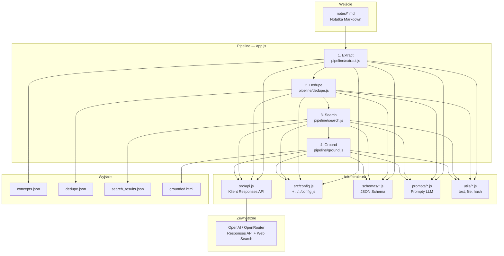
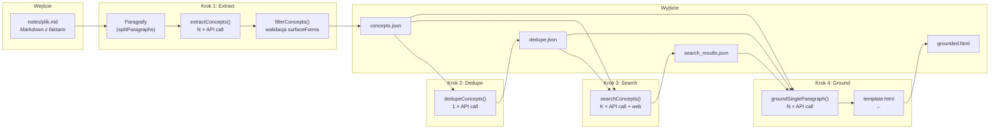

# Architektura projektu `01_01_grounding`

## 1. Podsumowanie projektu

### Co robi aplikacja

Aplikacja przetwarza **notatki Markdown** w **interaktywny dokument HTML** z weryfikacją faktów opartą na wyszukiwaniu internetowym. Kluczowe frazy w tekście (twierdzenia, definicje, daty, fakty) zostają automatycznie rozpoznane, zweryfikowane przez web search i oznaczone w wynikowym HTML — użytkownik klika podświetloną frazę, a tooltip pokazuje podsumowanie ze źródłami.

### Jaki problem rozwiązuje

Notatki techniczne zawierają twierdzenia i fakty bez przypisów. Ręczne wyszukiwanie źródeł jest czasochłonne. Pipeline automatyzuje cały proces: ekstrakcję konceptów → deduplikację → wyszukiwanie w internecie → generowanie HTML z annotacjami.

### Główny scenariusz użycia

1. Użytkownik pisze notatkę Markdown (np. o LLM-ach lub kryptowalutach)
2. Uruchamia `node app.js`
3. Pipeline przetwarza notatkę w 4 krokach, wywołując model AI z web searchem
4. Na wyjściu powstaje `output/grounded.html` — interaktywna strona z podświetlonymi frazami i tooltipami ze źródłami

### Najważniejsze elementy techniczne

- **4-etapowy pipeline AI** (extract → dedupe → search → ground)
- **OpenAI Responses API** z JSON Schema (structured outputs, `strict: true`)
- **Web search** jako narzędzie AI (tool `web_search` w OpenAI, model `:online` w OpenRouter)
- **Cache na każdym etapie** — hashowanie SHA-256 zapobiega powtórnemu przetwarzaniu
- **Zero zależności npm** — wyłącznie natywne moduły Node.js 24+
- **Statyczny HTML** z inline CSS/JS — tooltip system z responsywnością (desktop + mobile bottom sheet)

---

## 2. Architektura wysokopoziomowa

Projekt to **CLI pipeline** w Node.js — sekwencja 4 kroków przetwarzania tekstu przez model AI. Nie ma serwera HTTP, bazy danych ani frontendu w tradycyjnym sensie. Wynik to statyczny plik HTML.



**Warstwy odpowiedzialności:**

| Warstwa | Pliki | Rola |
|---|---|---|
| Orkiestrator | `app.js` | Sekwencyjne uruchamianie 4 kroków, CLI UX |
| Pipeline | `src/pipeline/*.js` | Logika każdego etapu: batching, cache, transformacje |
| Komunikacja z AI | `src/api.js` | Jedyny punkt kontaktu z API: HTTP, retry, parsowanie |
| Kontrakty | `src/schemas/*.js` | JSON Schema wymuszające format odpowiedzi AI |
| Instrukcje AI | `src/prompts/*.js` | Prompty definiujące zadania dla modelu |
| Narzędzia | `src/utils/*.js` | Podział tekstu, I/O, hashowanie |
| Konfiguracja | `src/config.js`, `../../config.js` | Modele, ścieżki, klucze API, CLI args |
| Szablon | `template.html` | HTML/CSS/JS frontendowy (tooltips, responsywność) |

---

## 3. Struktura repozytorium

```
01_01_grounding/
├── app.js                          ← ENTRY POINT — orkiestrator pipeline'u
├── package.json                    ← Manifest (ESM, zero zależności)
├── template.html                   ← Szablon HTML (~1266 linii: CSS + JS tooltipów)
├── README.md
│
├── notes/                          ← WEJŚCIE — pliki Markdown do przetworzenia
│   ├── notes.md                    ← Przykład: notatka o LLM-ach
│   ├── crypto.md                   ← Przykład: notatka o kryptowalutach
│   └── s01e01-05.md                ← Przykład: podsumowanie lekcji AI
│
├── output/                         ← WYJŚCIE — generowane pliki
│   ├── concepts.json               ← Krok 1: wyekstrahowane koncepty
│   ├── dedupe.json                 ← Krok 2: zdeduplikowane grupy
│   ├── search_results.json         ← Krok 3: wyniki web search
│   ├── grounded.html               ← Krok 4: finalny HTML
│   └── grounded_demo.html          ← Gotowy demo (bez uruchamiania pipeline'u)
│
└── src/
    ├── config.js                   ← Konfiguracja: modele, ścieżki, API, CLI args
    ├── api.js                      ← Klient HTTP: Responses API + retry + parsowanie
    │
    ├── pipeline/                   ← GŁÓWNA LOGIKA — 4 etapy przetwarzania
    │   ├── extract.js              ← Krok 1: ekstrakcja konceptów z paragrafów
    │   ├── concept-filter.js       ← Walidacja i filtrowanie konceptów
    │   ├── dedupe.js               ← Krok 2: grupowanie duplikatów
    │   ├── search.js               ← Krok 3: web search per koncept
    │   └── ground.js               ← Krok 4: Markdown → HTML z groundingiem
    │
    ├── schemas/                    ← JSON Schema dla structured outputs
    │   ├── index.js                ← Re-export
    │   ├── categories.js           ← 9 kategorii konceptów
    │   ├── extract.js              ← Schema: concept_extraction
    │   ├── dedupe.js               ← Schema: concept_dedupe
    │   ├── search.js               ← Schema: web_search_result
    │   └── ground.js               ← Schema: grounded_paragraph
    │
    ├── prompts/                    ← Prompty dla modelu AI
    │   ├── index.js                ← Re-export
    │   ├── extract.js              ← Prompt + guidelines ekstrakcji
    │   ├── dedupe.js               ← Prompt deduplikacji
    │   ├── search.js               ← Prompt wyszukiwania
    │   └── ground.js               ← Prompt konwersji do HTML
    │
    └── utils/                      ← Narzędzia pomocnicze
        ├── text.js                 ← splitParagraphs, chunk, truncate
        ├── file.js                 ← resolveMarkdownPath, safeWriteJson
        └── hash.js                 ← SHA-256 (tekst + obiekty)
```

**Gdzie szukać czego:**

| Szukasz... | Zajrzyj do |
|---|---|
| Główna logika biznesowa | `src/pipeline/*.js` |
| Jak startuje aplikacja | `app.js` |
| Jak wywoływane jest API | `src/api.js` |
| Co model ma zwrócić | `src/schemas/*.js` |
| Co model dostaje jako instrukcję | `src/prompts/*.js` |
| Konfiguracja modeli/API | `src/config.js` |
| Klucze API, `.env` | `../../config.js` (nadrzędne repo) |
| Frontend (tooltips, style) | `template.html` |
| Pliki wejściowe | `notes/*.md` |
| Pliki wyjściowe | `output/*.json`, `output/*.html` |

---

## 4. Główny przepływ działania aplikacji

### Krok po kroku

1. **Start** — `node app.js` ładuje globalny config (`.env`, klucz API, provider) i lokalny config (modele, ścieżki)
2. **Potwierdzenie** — skrypt ostrzega o zużyciu tokenów i pyta `yes/y`
3. **Resolve pliku** — wybiera plik `.md` z `notes/` (podany jako argument CLI lub pierwszy alfabetycznie)
4. **Podział na paragrafy** — `splitParagraphs()` dzieli Markdown po podwójnych newline'ach
5. **Extract** — dla każdego paragrafu wywołanie AI → lista konceptów (batched po 5, cached per paragraf)
6. **Dedupe** — jedno wywołanie AI z listą wszystkich konceptów → grupy kanoniczne
7. **Search** — dla każdej grupy kanonicznej wywołanie AI z web search → summary + sources (batched po 5)

```mermaid
sequenceDiagram
    actor User
    participant App as app.js
    participant Cfg as config.js
    participant Ext as extract.js
    participant Flt as concept-filter.js
    participant Ded as dedupe.js
    participant Sch as search.js
    participant Gnd as ground.js
    participant API as api.js
    participant AI as OpenAI API

    User->>App: node app.js [plik.md]
    App->>Cfg: załaduj konfigurację + .env
    App->>User: ⚠️ Potwierdzenie (yes/y)
    User->>App: yes

    App->>App: readFile() + splitParagraphs()

    rect rgb(40, 40, 60)
        Note over App,AI: Krok 1 — Extract (N paragrafów × 1 request, batch po 5)
        App->>Ext: extractConcepts(paragraphs)
        loop Każdy paragraf (jeśli nie w cache)
            Ext->>API: callResponses(prompt + schema)
            API->>AI: POST /v1/responses
            AI-->>API: JSON z konceptami
            API-->>Ext: parsed response
            Ext->>Flt: filterConcepts()
            Flt-->>Ext: zwalidowane koncepty
        end
        Ext->>Ext: safeWriteJson(concepts.json)
        Ext-->>App: conceptsData
    end

    rect rgb(40, 50, 40)
        Note over App,AI: Krok 2 — Dedupe (1 request)
        App->>Ded: dedupeConcepts(conceptsData)
        Ded->>API: callResponses(prompt + schema)
        API->>AI: POST /v1/responses
        AI-->>API: JSON z grupami
        API-->>Ded: parsed response
        Ded->>Ded: safeWriteJson(dedupe.json)
        Ded-->>App: dedupeData
    end

    rect rgb(50, 40, 40)
        Note over App,AI: Krok 3 — Search (K konceptów × 1 request + web search, batch po 5)
        App->>Sch: searchConcepts(conceptsData, dedupeData)
        loop Każdy kanoniczny koncept (jeśli nie w cache)
            Sch->>API: callResponses(prompt + web_search tool)
            API->>AI: POST /v1/responses
            AI-->>API: JSON z summary + sources
            API-->>Sch: parsed response
        end
        Sch->>Sch: safeWriteJson(search_results.json)
        Sch-->>App: searchData
    end

    rect rgb(50, 40, 50)
        Note over App,AI: Krok 4 — Ground (N paragrafów × 1 request, batch po 5)
        App->>Gnd: generateAndApplyTemplate(markdown, ...)
        loop Każdy paragraf (batch po 5)
            Gnd->>API: callResponses(prompt + schema)
            API->>AI: POST /v1/responses
            AI-->>API: HTML fragment
            API-->>Gnd: parsed response
        end
        Gnd->>Gnd: wstaw HTML do template.html
        Gnd->>Gnd: writeFile(grounded.html)
        Gnd-->>App: ścieżka do pliku
    end

    App-->>User: ✅ Done! Pliki w output/
```

8. **Ground** — dla każdego paragrafu wywołanie AI → HTML z `<span class="grounded">` (batched po 5)
9. **Zapis** — HTML wstawiany w `template.html` w miejsce `<!--CONTENT-->` → `output/grounded.html`



---

## 5. Przepływ danych

### Wejście → Przetwarzanie → Wyjście



### Jakie dane przepływają między krokami

| Z → Do | Dane | Format |
|---|---|---|
| Markdown → Extract | Tekst paragrafów + indeksy | `string[]` |
| Extract → `concepts.json` | Koncepty per paragraf: label, category, needsSearch, searchQuery, surfaceForms | JSON (tablica paragrafów z konceptami) |
| Extract → Dedupe | Lista konceptów z `needsSearch=true`, każdy z unikatowym `id` | `conceptEntries[]` |
| Dedupe → `dedupe.json` | Grupy: canonical label, ids, aliases | JSON (tablica grup) |
| Extract + Dedupe → Search | Kanoniczne koncepty z searchQuery i surfaceForms | obiekt per group |
| Search → `search_results.json` | Summary, keyPoints, sources (title + URL) per kanoniczny koncept | JSON (mapa canonical → result) |
| Markdown + Extract + Dedupe + Search → Ground | Paragraf + relevant groundingItems (label, surfaceForms, dataAttr z summary+sources) | obiekt per paragraf |
| Ground + template.html → `grounded.html` | HTML fragmenty wstawione w `<!--CONTENT-->` | HTML string |

### Struktura danych konceptu (po Extract)

```json
{
  "label": "Model Context Protocol",
  "category": "resource",
  "needsSearch": true,
  "searchQuery": "Model Context Protocol MCP tool schemas",
  "reason": "MCP is a named protocol...",
  "surfaceForms": ["the Model Context Protocol (MCP)"]
}
```

### Struktura danych grupy (po Dedupe)

```json
{
  "canonical": "Model Context Protocol",
  "ids": [12, 17],
  "aliases": ["MCP"],
  "rationale": "Same protocol referenced in two paragraphs."
}
```

### Struktura wyniku wyszukiwania (po Search)

```json
{
  "canonical": "Model Context Protocol",
  "summary": "Protokół opracowany przez Anthropic...",
  "keyPoints": ["Standaryzuje komunikację agent–narzędzie", "..."],
  "sources": [
    { "title": "MCP Documentation", "url": "https://..." }
  ]
}
```

---

## 6. Kluczowe moduły i komponenty

### `app.js` — Orkiestrator

- **Rola:** Punkt wejścia. Uruchamia 4 kroki sekwencyjnie, obsługuje CLI UX.
- **Wejście:** Argumenty CLI, plik Markdown
- **Wyjście:** Pliki w `output/`
- **Co robi:**
  1. Pyta o potwierdzenie (`confirmRun`)
  2. Resolve'uje plik Markdown (`resolveMarkdownPath`)
  3. Dzieli tekst na paragrafy (`splitParagraphs`)
  4. Wywołuje `extractConcepts` → `dedupeConcepts` → `searchConcepts` → `generateAndApplyTemplate`
- **Zależności:** Wszystkie moduły pipeline, config, utils

### `src/api.js` — Klient AI API

- **Rola:** Jedyny punkt komunikacji z OpenAI/OpenRouter Responses API
- **Wejście:** `{ model, input, textFormat, tools, include, reasoning }`
- **Wyjście:** Parsed JSON response
- **Kluczowe funkcje:**
  - `chat()` (alias: `callResponses`) — wysyła request z retry (3 próby, exponential backoff) i timeout (180s)
  - `extractText()` — wyciąga tekst z response (obsługuje `output_text` i zagnieżdżone `output.message.content`)
  - `extractJson()` (alias: `parseJsonOutput`) — parsuje JSON z odpowiedzi
  - `extractSources()` (alias: `getWebSources`) — zbiera URL-e z `web_search_call` i `url_citation`
- **Zależności:** `../../config.js` (klucz API), `src/config.js` (endpoint, retry)

### `src/pipeline/extract.js` — Ekstrakcja konceptów

- **Rola:** Najcięższy krok. Dla każdego paragrafu wywołuje AI, żeby wyekstrahować weryfikowalne twierdzenia.
- **Wejście:** `paragraphs[]`, `sourceFile`
- **Wyjście:** `conceptsData` (zapisywany do `concepts.json`)
- **Mechanizm cache:** Hashuje każdy paragraf (SHA-256). Pomija paragrafy, których hash nie zmienił się od ostatniego uruchomienia.
- **Batching:** 5 równoległych requestów (`Promise.all`), zapisuje po każdym batchu
- **Filtrowanie:** Po odpowiedzi AI wywołuje `filterConcepts()` — odrzuca koncepty z nieprawidłowymi surfaceForms
- **Limity:** Max 5 konceptów per paragraf body, max 1 per nagłówek

### `src/pipeline/concept-filter.js` — Walidacja konceptów

- **Rola:** Guard — upewnia się, że koncepty zwrócone przez AI są poprawne
- **Walidacje:**
  - `surfaceForms` muszą istnieć dosłownie w tekście paragrafu
  - Max. 100 znaków na surfaceForm
  - Kategoria musi być z dozwolonej listy (9 kategorii)
  - Deduplikacja po `label`
  - Sortowanie po długości labela (dłuższe = bardziej specyficzne = wyższy priorytet)

### `src/pipeline/dedupe.js` — Deduplikacja

- **Rola:** Grupuje koncepty, które odnoszą się do tego samego pojęcia (np. „LLM" i „Large Language Model")
- **Wejście:** `conceptsData` (z kroku Extract)
- **Wyjście:** `dedupeData` (zapisywany do `dedupe.json`)
- **Mechanizm:** Jedno wywołanie API z listą wszystkich konceptów z `needsSearch=true`
- **Cache:** Porównuje `conceptsHash` — jeśli koncepty się nie zmieniły, pomija

### `src/pipeline/search.js` — Wyszukiwanie webowe

- **Rola:** Weryfikuje każdy kanoniczny koncept przez web search
- **Wejście:** `conceptsData`, `dedupeData`
- **Wyjście:** `searchData` (zapisywany do `search_results.json`)
- **Mechanizm web search:**
  - **OpenAI:** Dodaje `tools: [{ type: "web_search" }]` do requestu
  - **OpenRouter:** Używa modelu z suffixem `:online` (np. `openai/gpt-5.4:online`)
- **Batching:** 5 równoległych requestów, cache per kanoniczny koncept

### `src/pipeline/ground.js` — Generowanie HTML

- **Rola:** Konwertuje każdy paragraf Markdown do HTML, owijając rozpoznane frazy w `<span class="grounded">`
- **Wejście:** `markdown`, `conceptsData`, `dedupeData`, `searchData`
- **Wyjście:** `grounded.html`
- **Mechanizm:**
  1. `buildGroundingItems()` — łączy koncepty, surfaceForms i wyniki search w obiekty z `dataAttr` (JSON z summary+sources, HTML-escaped)
  2. Dla każdego paragrafu filtruje relevantne groundingItems (po `paragraphIndex`)
  3. Wywołuje AI, żeby owinął frazy w `<span>` z atrybutem `data-grounding`
  4. Paragrafy bez konceptów konwertuje lokalnie (`convertToBasicHtml`)
  5. Wstawia wszystko w `template.html` w miejsce `<!--CONTENT-->`

### `src/schemas/*.js` — Kontrakty odpowiedzi AI

- **Rola:** JSON Schema z `strict: true` — AI musi zwrócić dokładnie ten format
- **Kategorie konceptów** (`categories.js`): `claim`, `result`, `method`, `metric`, `resource`, `definition`, `term`, `entity`, `reference`
- Każdy schemat definiuje wymagane pola, typy i opisy — model nie może ich pominąć

### `src/prompts/*.js` — Instrukcje dla AI

- **Rola:** Definiują co model ma zrobić w każdym kroku
- **`extract.js`** — najbardziej rozbudowany: zawiera `EXTRACTION_GUIDELINES` z regułami surfaceForms, kategorii i co ekstrahowaćd
- **`dedupe.js`** — instrukcja: grupuj tylko ścisłe parafrazowania, nie łącz powiązanych-ale-różnych pojęć
- **`search.js`** — instrukcja: użyj web search, zwróć summary + keyPoints + sources
- **`ground.js`** — instrukcja: konwertuj paragraf do HTML, owijaj surfaceForms w `<span class="grounded">`

### `template.html` — Frontend

- **Rola:** Kompletny frontend w jednym pliku — HTML, CSS (~800 linii), JavaScript (~400 linii)
- **Funkcje:** Dark mode, tooltips (hover + click-to-pin), badge z liczbą źródeł, bottom sheet na mobile (drag-to-dismiss), nawigacja klawiaturowa (Esc), licznik grounded konceptów
- **Placeholder:** `<!--CONTENT-->` — zastępowany wygenerowanym HTML-em
- **Interakcja:** Kliknięcie `.grounded` → parsowanie `data-grounding` (JSON) → tooltip z summary i linkami do źródeł

---

## 7. Runtime i sposób uruchamiania

### Jak startuje aplikacja

```
node app.js [plik.md] [--force] [--batch=N] [--no-batch]
```

### Kolejność inicjalizacji

1. **`../../config.js`** (importowany pośrednio przez `src/config.js`)
   - Sprawdza wersję Node.js (≥ 24)
   - Ładuje `.env` z katalogu nadrzędnego
   - Waliduje klucze API i wybiera providera
   - Eksportuje: `AI_PROVIDER`, `AI_API_KEY`, `RESPONSES_API_ENDPOINT`, `EXTRA_API_HEADERS`
2. **`src/config.js`**
   - Buduje ścieżki (`paths.*`)
   - Resolve'uje modele dla providera (`models.*`)
   - Parsuje argumenty CLI (`cli.*`)
   - Konfiguruje API (endpoint, timeout, retry)
3. **`app.js`**
   - Importuje pipeline, utils, config
   - `confirmRun()` — interaktywne potwierdzenie
   - `main()` — sekwencyjne uruchamianie 4 kroków

### Procesy asynchroniczne

- Cały pipeline jest `async/await`
- **Batching z `Promise.all`:** W krokach Extract, Search i Ground — po 5 requestów równolegle
- **Brak workerów, eventów, kolejek** — prosty sekwencyjny flow z równoległością wewnątrz batchy
- **Brak streamingu** — pełne response'y, nie SSE

### Persystencja

- Po każdym batchu w Extract wynik jest zapisywany do `concepts.json` (odporność na przerwanie)
- W Search zapis po każdym batchu do `search_results.json`
- Zapis atomowy: plik `.tmp` + `rename()` (zapobiega korupcji przy przerwaniu)

---

## 8. Konfiguracja i środowisko

### Zmienne środowiskowe (`.env` w root `4th-devs/`)

| Zmienna | Wymagana | Opis |
|---|---|---|
| `OPENAI_API_KEY` | Jedna z dwóch | Klucz API OpenAI (`sk-...`) |
| `OPENROUTER_API_KEY` | Jedna z dwóch | Klucz API OpenRouter (`sk-or-v1-...`) |
| `AI_PROVIDER` | Nie | `openai` lub `openrouter` (auto-detect z dostępnych kluczy) |
| `OPENROUTER_HTTP_REFERER` | Nie | Nagłówek HTTP-Referer dla OpenRouter |
| `OPENROUTER_APP_NAME` | Nie | Nagłówek X-Title dla OpenRouter |

### Konfiguracja lokalna (`src/config.js`)

| Ustawienie | Wartość | Opis |
|---|---|---|
| `models.extract` | `gpt-5.4` | Model do ekstrakcji konceptów |
| `models.search` | `gpt-5.4` | Model do web search |
| `models.ground` | `gpt-5.4` | Model do generowania HTML |
| `api.timeoutMs` | `180000` | Timeout requestu (3 minuty) |
| `api.retries` | `3` | Liczba prób (z exponential backoff) |
| `api.retryDelayMs` | `1000` | Bazowy delay między próbami |

### Argumenty CLI

| Argument | Opis |
|---|---|
| `node app.js notes.md` | Przetwarza konkretny plik z folderu `notes/` |
| `--force` | Ignoruje cache, przetwarza od nowa |
| `--batch=N` | Ustawia rozmiar batcha (1-10). **Uwaga: parsowany ale nieużywany w pipeline** |
| `--no-batch` | Ustawia batch na 1. **Uwaga: j.w.** |

---

## 9. Jak uruchomić projekt

### Wymagania

- **Node.js 24+** (wymuszone w `../../config.js`)
- **Klucz API:** OpenAI lub OpenRouter
- **Brak npm install** — zero zależności npm

### Instalacja

```bash
cd 01_01_grounding

# Upewnij się, że Node.js ≥ 24
node --version

# Utwórz .env w katalogu nadrzędnym (4th-devs/)
# UWAGA: .env jest na poziomie całego repozytorium, nie tego podprojektu
echo "OPENAI_API_KEY=sk-..." > ../.env
```

### Uruchomienie

```bash
# Domyślny plik (pierwszy .md z notes/ alfabetycznie)
node app.js

# Konkretny plik
node app.js crypto.md

# Wymuszenie przetworzenia od nowa
node app.js --force

# Z poziomu root repozytorium (jeśli skonfigurowany)
npm run lesson1:grounding
npm run lesson1:grounding -- crypto.md --force
```

### Sprawdzenie wyniku

```bash
# Otwórz wygenerowany HTML w przeglądarce
start output/grounded.html          # Windows
open output/grounded.html           # macOS

# Sprawdź pliki pośrednie
ls output/
# → concepts.json, dedupe.json, search_results.json, grounded.html
```

### Bez uruchamiania pipeline'u

Gotowy demo HTML jest dostępny w `output/grounded_demo.html` — można go otworzyć bezpośrednio w przeglądarce.

### Testy

Projekt **nie zawiera testów** — brak katalogu `test/`, brak skryptów testowych w `package.json`.

---

## 10. Jak używać rozwiązania

### Scenariusz podstawowy

1. **Napisz notatkę Markdown** i umieść ją w `notes/`:
   ```markdown
   # Temat notatki

   Twierdzenie do zweryfikowania. Jakiś fakt z datą lub liczbą.

   ## Podtemat

   Kolejny paragraf z terminami technicznymi i twierdzeniami.
   ```

2. **Uruchom pipeline:**
   ```bash
   node app.js moja-notatka.md
   ```

3. **Potwierdź uruchomienie** (ostrzeżenie o tokenach) → wpisz `yes`

4. **Poczekaj** — pipeline przetwarza 4 kroki (widoczne w konsoli):
   ```
   1. Extracting concepts...
      Total: 15 concepts
   2. Deduplicating concepts...
      Groups: 8
   3. Web search grounding...
      Results: 8
   4. Generating HTML...
      Created: output/grounded.html
   ✅ Done!
   ```

5. **Otwórz** `output/grounded.html` w przeglądarce

### Co dostaniesz

- Podświetlone frazy (żółty highlight) — kliknij aby zobaczyć tooltip
- Tooltip zawiera: podsumowanie ze źródeł + linki do źródeł webowych
- Badge na frazach pokazujący liczbę źródeł
- Na mobile: bottom sheet z drag-to-dismiss

### Ponowne uruchomienie

- **Bez zmian w notatce** → pipeline używa cache (prawie natychmiast)
- **Po edycji notatki** → przetwarzane są tylko zmienione paragrafy
- **`--force`** → pełne przetworzenie od nowa

### Inputy i outputy

| Typ | Ścieżka | Format | Opis |
|---|---|---|---|
| **Input** | `notes/*.md` | Markdown | Notatka do przetworzenia |
| Output 1 | `output/concepts.json` | JSON | Koncepty per paragraf |
| Output 2 | `output/dedupe.json` | JSON | Grupy kanoniczne |
| Output 3 | `output/search_results.json` | JSON | Wyniki web search |
| **Output 4** | `output/grounded.html` | HTML | **Finalny produkt** |

---

## 11. Ważne decyzje architektoniczne

### Pipeline liniowy zamiast grafu

Architektura to prosty, sekwencyjny pipeline 4 kroków. Każdy krok zależy od poprzedniego. Brak rozgałęzień, brak cykli. To świadoma decyzja — prostota ułatwia debugowanie i zrozumienie.

### Structured Outputs z JSON Schema (`strict: true`)

Zamiast parsować wolny tekst z AI, projekt wymusza dokładny format odpowiedzi przez JSON Schema. Model **musi** zwrócić dane w zdefiniowanej strukturze. To eliminuje klasę błędów związanych z parsowaniem.

### Cache oparty na hashach SHA-256

Każdy etap porównuje hash inputu (tekst, koncepty, dedupe, model) z zapisanym wynikiem. Zmiana czegokolwiek invaliduje cache. To pozwala na:
- Inkrementalne przetwarzanie (zmieniony paragraf → przetworzony tylko on)
- Odporność na przerwanie (zapis po każdym batchu)
- Wymuszenie pełnego przetworzenia flagą `--force`

### Zero zależności npm

Projekt nie instaluje żadnych pakietów. Korzysta wyłącznie z natywnych modułów Node.js 24+ (`fetch`, `crypto`, `fs/promises`, `readline/promises`). To upraszcza deployment i eliminuje supply chain risk.

### Atomowy zapis plików

`safeWriteJson()` zapisuje do `.tmp` i robi `rename()`. Zapobiega to korupcji pliku przy przerwaniu procesu w trakcie zapisu.

### Separacja promptów i schematów od logiki

Prompty (`prompts/`) i schematy (`schemas/`) są w osobnych plikach — można je modyfikować bez dotykania logiki pipeline'u. To ułatwia iterację na jakości odpowiedzi AI.

### Dual-provider (OpenAI + OpenRouter)

Globalny `config.js` abstrakcje providera AI. Zmiana z OpenAI na OpenRouter wymaga tylko zmiany klucza API w `.env`. Różnice w API (web search, nagłówki) są obsługiwane w `search.js` i `api.js`.

### Kompromisy

| Decyzja | Korzyść | Koszt |
|---|---|---|
| Brak TypeScript | Szybszy start, mniej toolingu | Brak typów, łatwiejsze błędy runtime |
| Pipeline sekwencyjny | Prostota, łatwe debugowanie | Brak możliwości równoległego uruchomienia kroków |
| HTML generowany przez AI | Elastyczność formatowania | Potencjalny XSS, nieprzewidywalny output |
| Zmiana promptu nie invaliduje cache | Szybsze iterowanie | Może prowadzić do niespójności |
| Hardcoded `CONCURRENCY = 5` | Prostota | Brak kontroli CLI nad równoległością |

---

## 12. Ryzyka, luki i trudniejsze miejsca

### Bezpieczeństwo

- **XSS w generowanym HTML** — krok Ground polega na AI do generowania surowego HTML. Model może wygenerować `<script>` lub inne niebezpieczne elementy. Brak sanityzacji outputu AI.
- **Klucze API w `.env`** — standardowe ryzyko. Plik `.env` nie jest w `.gitignore` tego podprojektu (jest na poziomie root repo).

### Stabilność

- **`Promise.all` bez error handling per element** — jeśli jeden request w batchu się nie powiedzie, cały batch jest odrzucony. Brak mechanizmu retry per element ani graceful degradation.
- **Rate limiting** — 5 równoległych requestów może powodować błędy 429. Jest retry z backoff, ale brak globalnego rate limitera.
- **Timeout 180s** — przy wolnych odpowiedziach AI timeout może być za krótki, szczególnie dla web search.

### Debugowanie

- **Ciche odrzucanie konceptów** — `concept-filter.js` odrzuca koncepty bez logowania. Jedyny sygnał to `(filtered N)` w konsoli. Nie da się łatwo zobaczyć, co i dlaczego zostało odrzucone.
- **Skrócony error preview** — `parseJsonOutput` pokazuje tylko 200 pierwszych znaków błędnej odpowiedzi. Przy dużych responsach utrudnia to diagnozę.
- **Zmiana promptu nie invaliduje cache** — po edycji promptu trzeba użyć `--force`, inaczej pipeline użyje starych wyników.

### Architektura

- **`cli.batchSize` jest parsowany, ale nigdzie nieużywany** — pipeline korzysta z hardcoded `CONCURRENCY = 5` w trzech plikach. Wygląda na niedokończoną funkcjonalność.
- **Brak limitów globalnych** — duży dokument (50 paragrafów × 5 konceptów) generuje setki requestów API. Brak mechanizmu ograniczenia kosztów.
- **Tight coupling z Responses API** — `api.js` jest ściśle powiązany z formatem OpenAI Responses API (nie Chat Completions). Migracja wymagałaby przepisania.

### Skalowalność

- **Jednorazowy batch w Dedupe** — wszystkie koncepty idą w jednym requeście. Dla bardzo dużych dokumentów może to przekroczyć limit kontekstu modelu.
- **Brak testów** — żadnych testów jednostkowych ani integracyjnych. Refaktoring jest ryzykowny.

---

## 13. Szybki przewodnik po kodzie

### Chcesz zrozumieć, jak startuje aplikacja?

→ `app.js` (67 linii) — przeczytaj `main()`. Widać cały flow w jednej funkcji.

### Chcesz zrozumieć główną logikę przetwarzania?

→ `src/pipeline/extract.js` — najważniejszy krok. Pokazuje batching, cache, filtrowanie.
→ `src/pipeline/ground.js` — jak Markdown staje się HTML z groundingiem.

### Chcesz zmienić, co model wyekstrahuje?

→ `src/prompts/extract.js` — prompt + `EXTRACTION_GUIDELINES`
→ `src/schemas/extract.js` — JSON Schema odpowiedzi
→ `src/schemas/categories.js` — lista dozwolonych kategorii
→ `src/pipeline/concept-filter.js` — reguły walidacji po stronie kodu

### Chcesz zmienić model AI?

→ `src/config.js`, linia 22-25 — `models.extract/search/ground`

### Chcesz debugować błędy API?

→ `src/api.js` — `fetchWithRetry()` (retry logic), `chat()` (budowanie requestu), `extractJson()` (parsowanie odpowiedzi)

### Chcesz zrozumieć cache?

→ `src/pipeline/extract.js` — `extractConcepts()`, porównanie `sourceHash`, `paragraphHash`, `model`
→ `src/utils/hash.js` — SHA-256 z deterministyczną serializacją

### Chcesz zrozumieć, jak działa web search?

→ `src/pipeline/search.js` — `resolveSearchModel()`, `buildSearchRequest()`, `searchSingleConcept()`
→ `src/api.js` — `extractSources()` — wyciąganie URL-i z response

### Chcesz zmienić wygląd/UX tooltipów?

→ `template.html` — CSS (linie ~11-809), JavaScript (linie ~859-1263)

### Chcesz zrozumieć konfigurację (klucze, provider)?

→ `../../config.js` (root repo) — `.env`, provider resolution, model name prefixing

### Chcesz dodać nowy plik wejściowy?

→ Umieść `.md` w folderze `notes/` i uruchom `node app.js nazwa.md`

---

## 14. Najważniejsze pliki do przeczytania

| # | Plik | Dlaczego warto przeczytać | Linii |
|---|---|---|---|
| 1 | `app.js` | **Cały flow w 67 liniach.** Zrozumiesz co robi aplikacja bez czytania czegokolwiek innego. | 67 |
| 2 | `src/pipeline/extract.js` | **Najcięższy moduł.** Batching, cache per paragraf, wywołania AI, filtrowanie. Wzorzec powtarzany w search i ground. | 176 |
| 3 | `src/api.js` | **Jedyny punkt kontaktu z AI.** Retry, timeout, parsowanie JSON, wyciąganie źródeł web. Jeśli coś nie działa z API — tu szukaj. | 196 |
| 4 | `src/pipeline/ground.js` | **Jak Markdown staje się HTML.** Budowanie groundingItems, konwersja paragrafów, wstawianie do template. | 180 |
| 5 | `src/pipeline/search.js` | **Integracja z web search.** Różnice OpenAI vs OpenRouter, budowanie requestów z narzędziami. | 163 |
| 6 | `src/config.js` | **Centralna konfiguracja.** Modele, ścieżki, API params, parsowanie CLI. Szybko zrozumiesz jakie parametry sterują pipeline'm. | 57 |
| 7 | `../../config.js` | **Globalny config.** `.env`, klucze API, provider resolution. Musisz to znać, żeby uruchomić projekt. | 321 |
| 8 | `src/prompts/extract.js` | **Najważniejszy prompt.** Definiuje co to "koncept", jakie są kategorie, reguły surfaceForms. Zmiana tu = zmiana jakości outputu. | 47 |
| 9 | `src/pipeline/concept-filter.js` | **Guard jakości.** Walidacja surfaceForms, limity per paragraf. Zrozumiesz, dlaczego niektóre koncepty "znikają". | 120 |
| 10 | `template.html` | **Cały frontend.** Jeśli chcesz zmienić wygląd, interakcje, lub zrozumieć jak tooltips działają. | 1266 |
