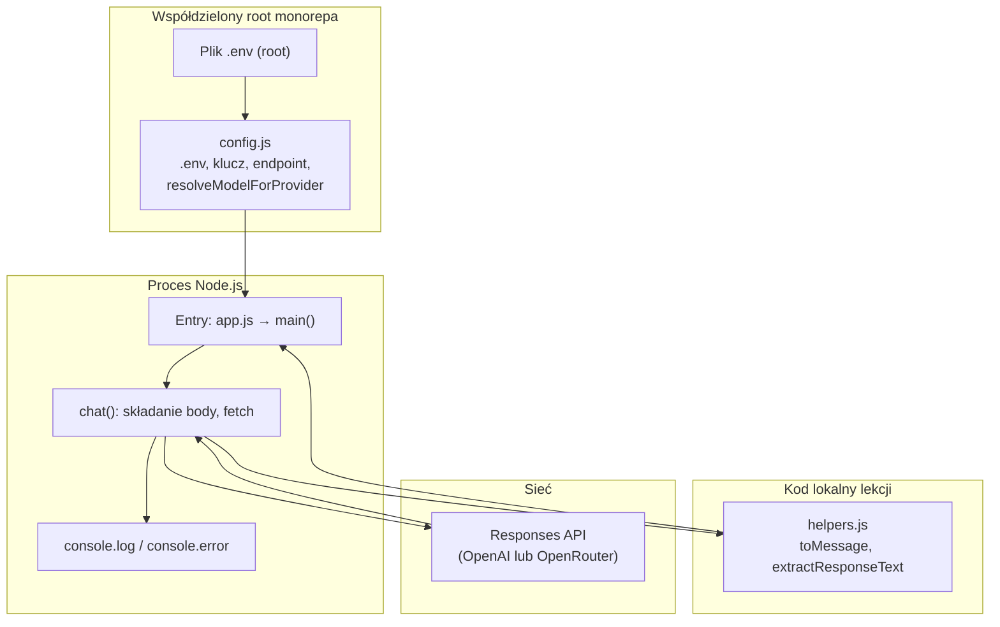
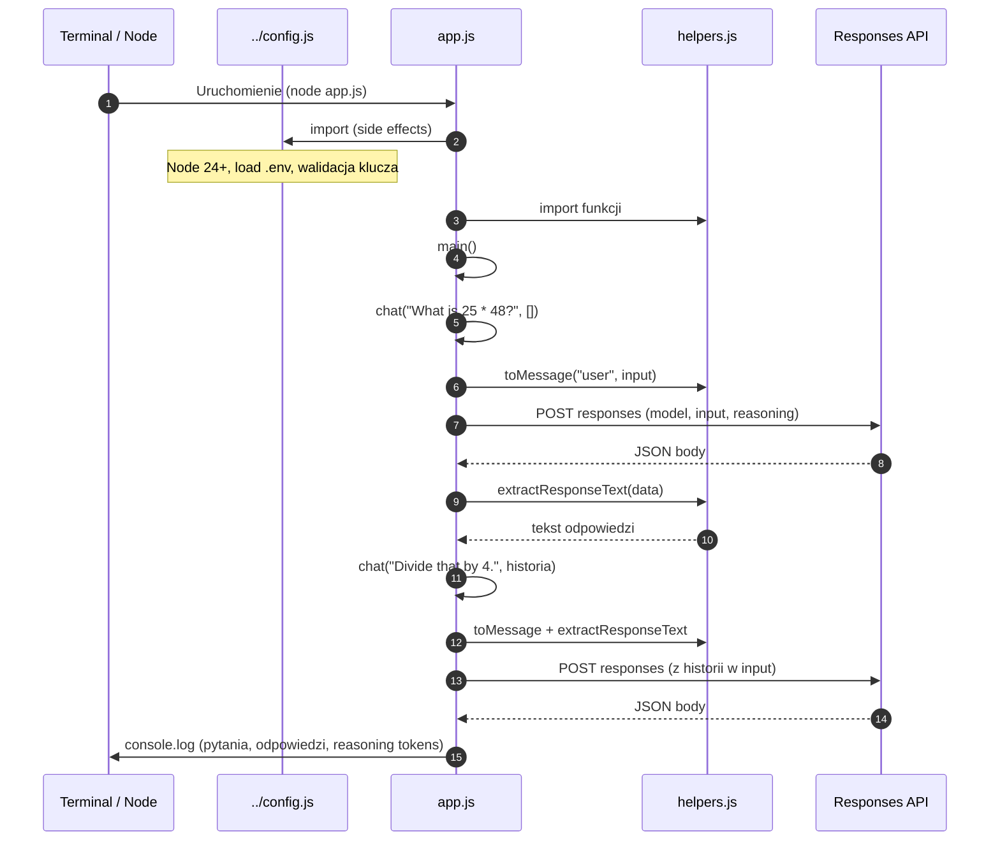
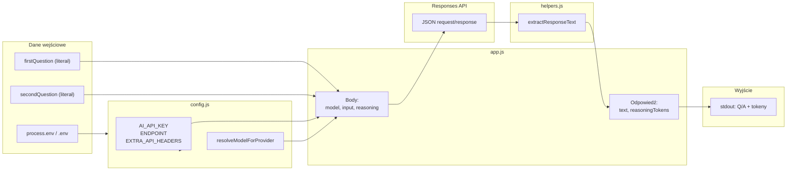

# Architektura `01_01_interaction` — dokument techniczny

Ten dokument opisuje **rzeczywiste działanie** lekcji **`01_01_interaction`** w monorepozytorium **`ai-devs-examples`** (katalog nadrzędny `4th-devs`). Kod tej lekcji jest napisany w **JavaScript (ESM)** — w tym podprojekcie **nie ma** plików TypeScript ani `tsconfig.json`.

---

## 1. Podsumowanie projektu

### Co robi aplikacja

Jednorazowo uruchamiany **skrypt Node.js** wykonuje **dwie kolejne rozmowy** z modelem przez **HTTP endpoint Responses API** (OpenAI lub OpenRouter — zależnie od konfiguracji w katalogu głównym repo):

1. Wysyła pytanie: *„What is 25 * 48?”*
2. Wysyła kontynuację: *„Divide that by 4.”* wraz z **historią poprzedniej wymiany** (wiadomość użytkownika + odpowiedź asystenta).
3. Wypisuje na **stdout** obie pary pytanie–odpowiedź oraz **szacowaną liczbę tokenów rozumowania** (`reasoning tokens`) zwróconą przez API.

Implementacja: `app.js` (funkcje `chat`, `main`).

### Jaki problem rozwiązuje

Pokazuje **minimalny, działający wzorzec multi-turn**: jak złożyć pole `input` w żądaniu Responses API (tablica wiadomości), jak ustawić `reasoning`, oraz jak **wyciągnąć tekst odpowiedzi** z różnych kształtów JSON zwracanych przez API (`helpers.js`).

### Główny scenariusz użycia

Developer z działającym środowiskiem (Node 24+, klucz API w `.env` w root repo) uruchamia skrypt z monorepa (`lesson1:interaction`) lub lokalnie `npm start` **z zachowaniem poprawnej ścieżki względem `../config.js`**, obserwuje log w terminalu.

### Najważniejsze elementy techniczne

| Element | Rola |
|---------|------|
| `01_01_interaction/app.js` | Orkiestracja scenariusza, `fetch` do Responses API, obsługa błędów. |
| `01_01_interaction/helpers.js` | `toMessage`, `extractResponseText` — normalizacja treści odpowiedzi. |
| `config.js` (root) | Wczytanie `.env`, wybór providera, URL endpointu, klucz, `resolveModelForProvider`, nagłówki OpenRouter. |
| Node **ESM** + wbudowany **`fetch`** | Transport HTTP bez dodatkowych zależności npm w tej lekcji. |

---

## 2. Architektura wysokopoziomowa

System ma **trzy warstwy logiczne**:

1. **Warstwa uruchomieniowa** — pojedynczy proces Node, entry point `app.js`, na końcu pliku wywołanie `main()` z `.catch()` kończącym proces kodem 1 przy błędzie.
2. **Warstwa konfiguracji** — moduł `config.js` w katalogu **nadrzędnym** względem `01_01_interaction`; wykonuje się przy pierwszym `import` i **kończy proces** (`process.exit`) przy braku klucza API, złej wersji Node itd.
3. **Warstwa integracji zewnętrznej** — HTTPS do Responses API; odpowiedź JSON trafia do parsowania w `helpers.js`.

**Nie występują:** serwer HTTP w tej lekcji, kolejki, workerzy, baza danych, warstwa UI w kodzie.

### Diagram — architektura wysokopoziomowa



### Odpowiedzialności

- **`app.js`:** scenariusz biznesowy lekcji, dwa wywołania `chat`, budowa historii dla drugiej tury.
- **`helpers.js`:** odporność na warianty struktury JSON odpowiedzi (tekst z `output_text` lub z `output[].content[]`).
- **`config.js`:** polityka środowiska i providera; udostępnia stałe używane w `Authorization` i URL.

---

## 3. Struktura repozytorium

Monorepo ma wiele lekcji; **ten dokument dotyczy wyłącznie `01_01_interaction` i jego bezpośredniej zależności od root `config.js`**.

### Najważniejsze ścieżki

| Ścieżka (względem root `4th-devs`) | Znaczenie |
|-----------------------------------|-----------|
| `01_01_interaction/app.js` | **Główna logika**, **entry point** wykonania scenariusza. |
| `01_01_interaction/helpers.js` | **Utility** — ekstrakcja tekstu i helper wiadomości. |
| `01_01_interaction/package.json` | `type: module`, skrypt `start` → `node app.js`. Brak `dependencies`. |
| `01_01_interaction/README.md` | Instrukcja uruchomienia z monorepa. |
| `config.js` | **Konfiguracja** i **integracja** z providerami (współdzielona z innymi lekcjami). |
| `package.json` (root) | Skrypt `lesson1:interaction` → `node ./01_01_interaction/app.js`. |

### Gdzie szukać typowych kategorii (repo-specyficznie)

| Kategoria | Stan w tej lekcji |
|-----------|-------------------|
| **Główna logika** | `01_01_interaction/app.js` (`chat`, `main`). |
| **Konfiguracja** | `config.js` (root) + `.env` (root, poza VCS — **Założenie:** plik tworzy developer lokalnie). |
| **Typy (TypeScript)** | **Brak** w `01_01_interaction`. |
| **Komponenty UI** | **Brak** — wyjście to konsola. |
| **Serwisy (osobna warstwa)** | **Brak** — wywołanie HTTP jest w `chat` w `app.js`. |
| **Utility** | `01_01_interaction/helpers.js`. |
| **Integracje** | HTTP Responses API (URL z `RESPONSES_API_ENDPOINT` w `config.js`). |
| **Entry pointy** | `app.js`; import `config.js` uruchamia inicjalizację przed `main()`. |

---

## 4. Główny przepływ działania aplikacji

### Krok po kroku (od uruchomienia)

1. **Uruchomienie:** `node` ładuje `01_01_interaction/app.js` (np. przez `npm run lesson1:interaction` z root lub `npm start` z folderu lekcji).
2. Ewaluacja **importów:** najpierw ładowany jest `../config.js` — wykonuje się m.in. sprawdzenie wersji Node (≥ 24), wczytanie `.env`, walidacja obecności klucza API, wybór `AI_PROVIDER`, eksport m.in. `AI_API_KEY`, `RESPONSES_API_ENDPOINT`, `resolveModelForProvider`.
3. Ładowany jest `./helpers.js` (eksporty funkcji).
4. W `app.js` obliczane jest `MODEL = resolveModelForProvider("gpt-5.2")` na poziomie modułu.
5. Wywoływane jest **`main()`** (asynchronicznie).
6. **Tura 1:** `chat(firstQuestion)` — `history` domyślnie `[]`; do `input` trafia wyłącznie bieżąca wiadomość użytkownika (`toMessage("user", input)`).
7. **`chat`:** `POST` na `RESPONSES_API_ENDPOINT` z JSON: `model`, `input`, `reasoning: { effort: "medium" }`; nagłówki `Authorization: Bearer ${AI_API_KEY}` i ewentualnie `EXTRA_API_HEADERS`.
8. Odpowiedź: parsowanie JSON; przy `!response.ok` lub `data.error` — rzucany jest `Error` z komunikatem z API lub ze statusem.
9. **`extractResponseText(data)`** — jeśli brak tekstu, błąd „Missing text output…”.
10. Zwracany obiekt: `{ text, reasoningTokens }` z `usage.output_tokens_details.reasoning_tokens` (lub 0).
11. **Tura 2:** ręcznie budowana tablica `secondQuestionContext` (poprzedni user + assistant), potem `chat(secondQuestion, secondQuestionContext)`.
12. **Zakończenie:** `console.log` czterech linii (dwie pary Q/A z licznikami tokenów). Przy nieobsłużonym wyjątku w `main().catch`: `console.error`, `process.exit(1)`.

### Diagram — sequence (główny flow)



---

## 5. Przepływ danych

### Wejścia

- **Pytania:** na stałe wpisane w `main()` (`firstQuestion`, `secondQuestion`) — **brak** argumentów CLI, stdin ani plików wejściowych w kodzie.
- **Konfiguracja runtime:** zmienne środowiskowe wczytane przez `config.js` z `.env` root (oraz istniejące już w `process.env`).
- **Historia (tura 2):** tablica obiektów `{ type: "message", role, content }` zbudowana z pierwszego pytania i `firstAnswer.text`.

### Przetwarzanie

- **Żądanie:** obiekt JSON serializowany w `chat`: `model` (po `resolveModelForProvider`), `input` (spread historii + nowa wiadomość użytkownika), `reasoning`.
- **Odpowiedź:** surowy JSON → walidacja błędu → `extractResponseText` → `reasoningTokens` z `usage`.

### Wyjścia

- **stdout:** linie z `console.log` — Q/A i liczniki.
- **stderr + exit code 1:** przy błędzie w `main().catch`.

### Diagram — przepływ danych



---

## 6. Kluczowe moduły i komponenty

### `01_01_interaction/app.js`

| Aspekt | Opis |
|--------|------|
| **Rola** | Entry point wykonania; scenariusz dwóch tur; warstwa transportu HTTP w funkcji `chat`. |
| **Wejście** | Przez `chat(input, history)`: string pytania + opcjonalna tablica historii; scenariusz `main` używa literałów. |
| **Wyjście** | `chat` → `{ text, reasoningTokens }`; proces → logi na konsoli. |
| **Odpowiedzialność** | Złożenie poprawnego body Responses API, obsługa błędów HTTP/API, orkiestracja demo. |
| **Zależności** | `../config.js`, `./helpers.js`, globalne `fetch`, `JSON`, `console`, `process`. |
| **Ważne symbole** | `MODEL`, `chat`, `main`, `main().catch(...)`. |

### `01_01_interaction/helpers.js`

| Aspekt | Opis |
|--------|------|
| **Rola** | Ujednolicenie wyciągania tekstu z odpowiedzi API; fabryka obiektów wiadomości. |
| **Wejście** | `extractResponseText(data)` — obiekt odpowiedzi API; `toMessage(role, content)`. |
| **Wyjście** | String tekstu lub `""`; obiekt wiadomości `{ type, role, content }`. |
| **Odpowiedzialność** | Obsługa `output_text` oraz ścieżki `output` → `message` → `content` → `output_text`. |
| **Zależności** | Brak importów — czysty JS. |
| **Ważne symbole** | `extractResponseText`, `toMessage`. |

### `config.js` (katalog główny monorepa)

| Aspekt | Opis |
|--------|------|
| **Rola** | Centralna konfiguracja dla wielu lekcji; dla tej lekcji kluczowe są eksporty importowane w `app.js`. |
| **Wejście** | `.env` w root, `process.env`, wersja Node. |
| **Wyjście** | M.in. `AI_API_KEY`, `RESPONSES_API_ENDPOINT`, `EXTRA_API_HEADERS`, `resolveModelForProvider` oraz szereg innych eksportów używanych przez **inne** lekcje (np. `buildResponsesRequest`). |
| **Odpowiedzialność** | Bezpieczny start (walidacja), wybór providera, mapowanie modeli pod OpenRouter (`openai/...` gdy brak `"/"` w nazwie modelu). |
| **Zależności** | `node:fs`, `node:path`, `node:url`, `process`. |
| **Ważne symbole (dla tej lekcji)** | `loadEnvFile` (wewnętrzna), `resolveModelForProvider`, stałe endpointów i klucza. |

---

## 7. Runtime i sposób uruchamiania

### Start

- Proces: **pojedynczy** `node` bez forków.
- **Kolejność inicjalizacji:** przez mechanizm ESM — **najpierw** pełna ewaluacja `config.js` (skutki uboczne: exit przy błędzie), potem `helpers.js`, potem reszta `app.js`, na końcu wywołanie `main()`.

### Lifecycle

- **Brak** explicit shutdown, hooków sygnałów, serwera nasłuchującego — po zakończeniu `main()` i opróżnieniu kolejki mikrozadań proces **kończy się naturalnie** przy sukcesie.
- **Przy błędzie:** `process.exit(1)` w handlerze `catch` przy `main()`.

### Asynchroniczność

- `main` i `chat` są **`async`** — cały flow opiera się na **`await fetch`** i **`await response.json()`**.
- **Brak** `setInterval`, kolejek zadań własnych, worker threads (w kodzie tej lekcji).

### Zdarzenia / joby

- **Brak** modelu zdarzeniowego aplikacji (poza standardowym cyklem Promise w Node).

---

## 8. Konfiguracja i środowisko

### Pliki konfiguracyjne

| Plik | Rola |
|------|------|
| `config.js` (root) | Logika ładowania env, walidacji, eksport stałych dla HTTP. |
| `.env` (root) | **Założenie:** lokalny plik tworzony przez developera; ścieżka twardo ustawiona w `config.js` jako `path.join(ROOT_DIR, ".env")` gdzie `ROOT_DIR` to katalog zawierający `config.js`. |

### Zmienne środowiskowe (potwierdzone w `config.js`)

- **Co najmniej jeden klucz:** `OPENAI_API_KEY` lub `OPENROUTER_API_KEY` (trimowane); brak → komunikat błędu i `process.exit(1)`.
- **`AI_PROVIDER`** (opcjonalnie): `openai` lub `openrouter`; musi być spójny z dostępnym kluczem.
- **OpenRouter (opcjonalnie):** `OPENROUTER_HTTP_REFERER`, `OPENROUTER_APP_NAME` → trafiają do `EXTRA_API_HEADERS` jako `HTTP-Referer` i `X-Title` gdy ustawione.

### Wymagania środowiskowe

- **Node.js:** w `config.js` wymagane **minimum wersja 24** (sprawdzenie `process.versions.node` przy starcie).
- **Dostęp do sieci:** wywołania HTTPS do hosta wybranego providera.

### Ważne ustawienia w żądaniu API (w kodzie lekcji)

- `reasoning: { effort: "medium" }` — część body w `chat`.
- Model: literał `"gpt-5.2"` przekazywany do `resolveModelForProvider` w `app.js`.

---

## 9. Jak uruchomić projekt

### Wymagania

- **Node 24+** (wymuszone w `config.js`).
- Plik **`.env` w katalogu głównym monorepa** (obok `config.js`) z prawidłowym kluczem — zgodnie z komunikatami błędów generowanymi przy starcie.

### Instalacja

- Z katalogu głównego repo (tam gdzie jest `lesson1:install`):

```bash
npm run lesson1:install
```

Instaluje m.in. `--prefix ./01_01_interaction`; **sam pakiet `01_01_interaction` nie deklaruje `dependencies`** — instalacja służy głównie spójności z innymi lekcjami w skrypcie.

### Konfiguracja

- Utwórz lub uzupełnij **`4th-devs/.env`** (ścieżka root monorepa): minimum jeden z kluczy opisanych w sekcji 8.

### Komendy uruchomieniowe (potwierdzone w `package.json`)

**Zalecane (README lekcji):** z katalogu głównego monorepa:

```bash
npm run lesson1:interaction
```

Alias uruchamia: `node ./01_01_interaction/app.js`.

**Z folderu lekcji** (`01_01_interaction`):

```bash
npm start
```

co odpowiada `node app.js` — **warunek:** nadal musi istnieć poprawny import `../config.js` (czyli struktura katalogów monorepa bez zmian).

### Build

- **Brak** skryptu `build` w `01_01_interaction/package.json` — nie dotyczy.

### Testy

- **Brak** skryptu `test` w `01_01_interaction/package.json` — **Założenie:** testów jednostkowych dla tej lekcji w tym pliku nie ma.

### Jak sprawdzić, że działa

- Uruchomienie kończy się **czterema liniami** `Q:` / `A:` w terminalu bez tracebacka; odpowiedzi zależą od modelu i API.
- Błąd konfiguracji (klucz, Node) objawia się **czerwonymi komunikatami** i natychmiastowym wyjściem z `config.js` jeszcze przed logiką `main`.

---

## 10. Jak używać rozwiązania

### Główny scenariusz

1. Skonfiguruj `.env` w root monorepa.
2. Uruchom `npm run lesson1:interaction` z root **lub** `npm start` z `01_01_interaction`.

### Inputy

- **Tylko te wbudowane w `main()`** — aby zmienić pytania lub dodać kolejne tury, trzeba edytować `app.js` (w repo nie ma interfejsu CLI do podawania pytań).

### Outputy

- Tekst na stdout: pytania, odpowiedzi modelu, przybliżona liczba **reasoning tokens** z pola `usage` odpowiedzi API.

### Praktyczne korzystanie jako baza pod własne eksperymenty

- Kopiuj wzorzec `chat` + `toMessage` + `extractResponseText`.
- Rozszerz `main()` lub wydziel własny entry point — **pamiętając** o tym, że `config.js` jest poza folderem lekcji.

---

## 11. Ważne decyzje architektoniczne

### Podział odpowiedzialności

- **Cienki podział:** jedna funkcja `chat` trzyma protokół HTTP i reguły body; **parsowanie odpowiedzi** jest w `helpers.js`, aby nie rozrostu w jednym bloku warunków w `chat`.
- **Konfiguracja globalna monorepa** zamiast lokalnego `.env` w `01_01_interaction` — jedna ścieżka dla wielu przykładów.

### Widoczne wzorce

- **Side-effect import** dla konfiguracji — szybkie „fail fast”, ale **sprzęga** lekcję z lokalizacją `config.js` (`../config.js`).
- **Funkcja wyższego poziomu `chat`** jako prosty wrapper nad `fetch` bez abstrakcji repozytorium HTTP.

### Mocne strony

- Minimalna liczba plików, **zero zewnętrznych paczek npm** w tej lekcji, łatwe śledzenie przepływu od `main` do `fetch`.
- `extractResponseText` centralizuje **odporność na format** odpowiedzi.

### Kompromisy

- **Brak warstwy „service”** — zmiana sposobu wołania API dotknie bezpośrednio `chat`.
- **Historialna druga tura** budowana ręcznie — duplikacja formatu względem `toMessage` (pierwsza tura używa `toMessage` tylko dla bieżącego inputu; historia drugiej tury to obiekty wpisane literalnie z tymi samymi polami).

---

## 12. Ryzyka, luki i trudniejsze miejsca

- **Zależność ścieżki `../config.js`:** przeniesienie folderu lub uruchomienie spoza struktury monorepa psuje start — błąd modułu importu.
- **Rozbieżność dokumentacji lokalnej vs root:** README sugeruje `npm run lesson1:interaction` (root); `package.json` lekcji ma `start` — oba są poprawne **w odpowiednim katalogu roboczym**.
- **`extractResponseText` zwraca `""` zamiast rzucać** — pusty tekst jest wykryty dopiero w `chat` jako „Missing text output…”; debugowanie wymaga podejrzenia surowego `data`.
- **Zachowanie API poza repo:** pełny kontrakt pól `usage` i `reasoning` zależy od wersji API providera — kod zakłada obecność opisanej ścieżki do `reasoning_tokens`.
- **Model `gpt-5.2` na sztywno:** jeśli provider lub konto nie obsługuje nazwy, błąd ujawni się w odpowiedzi HTTP/API, nie w typowaniu statycznym (brak TS w lekcji).
- **Duży `config.js`:** czytanie „od góry do dołu” może mylić — dla tej lekcji wystarczy znajomość eksportów użytych w `app.js` i fragmentu ładującego `.env`.

---

## 13. Szybki przewodnik po kodzie

| Cel | Gdzie zajrzeć |
|-----|----------------|
| Zrozumieć **start i kolejność init** | Koniec `app.js` (`main().catch`) + początek `app.js` (importy) + pierwsze sekcje `config.js` (load env, walidacja). |
| Zmienić **logikę scenariusza** (pytania, tury) | `main()` w `app.js`. |
| Zmienić **sposób wołania API** (body, nagłówki) | `chat()` w `app.js` + stałe z importu `config.js`. |
| Debugować **pustą lub dziwną odpowiedź** | `extractResponseText` w `helpers.js`; tymczasowy log surowego `data` przed ekstrakcją (**nie commitować** sekretów). |
| Zrozumieć **konfigurację środowiska** | `config.js` (root): `loadEnvFile`, `resolveProvider`, eksporty `AI_API_KEY`, `RESPONSES_API_ENDPOINT`. |
| Zrozumieć **mapowanie modelu OpenRouter** | Funkcja `resolveModelForProvider` w `config.js`. |

---

## 14. Najważniejsze pliki do przeczytania (top 10)

1. **`01_01_interaction/app.js`** — cały scenariusz i integracja HTTP; pierwszy plik do czytania jako nowy developer.
2. **`01_01_interaction/helpers.js`** — jak wyciągany jest tekst z JSON; kluczowe przy zmianach po stronie API.
3. **`config.js`** (root) — inicjalizacja, `.env`, wybór providera i endpointu; bez tego nie ma poprawnego uruchomienia.
4. **`01_01_interaction/README.md`** — zwięzły opis intencji lekcji i komendy z monorepa.
5. **`package.json`** (root monorepa) — skrót: jak woła się tę lekcję (`lesson1:interaction`) i wymaganie Node w polu `engines`.
6. **`01_01_interaction/package.json`** — `type: module`, skrypt `start`, brak zależności — świadczy o charakterze projektu.
7. **`01_01_interaction/package-lock.json`** — stan meta-pakietu npm (praktycznie puste zależności); przydatne przy audycie narzędzi npm, nie przy logice AI.
8. **Ten dokument (`ARCHITECTURE_EXPLAINED_Auto.md`)** — mapa onboardingowa dla struktury i flow (metapoziom).
9. **Plik `.env` w root monorepa** — *nie jest częścią repozytorium w wielu setupach*, ale jest **wymagany w runtime**; treści nie opisuje kod źródłowy lekcji — tylko szablony komunikatów w `config.js`.
10. **Dokumentacja Responses API u wybranego providera (zewnętrzna)** — **Założenie:** pełna specyfikacja pól żądania/odpowiedzi nie znajduje się w tym podprojekcie; kod pokazuje tylko użyty podzbiór pól.

---

*Dokument wygenerowany na podstawie aktualnej zawartości repozytorium (`app.js`, `helpers.js`, `config.js`, pliki `package.json`, `README.md`).*
