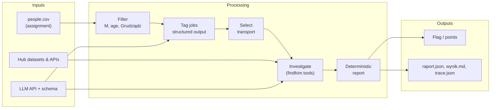
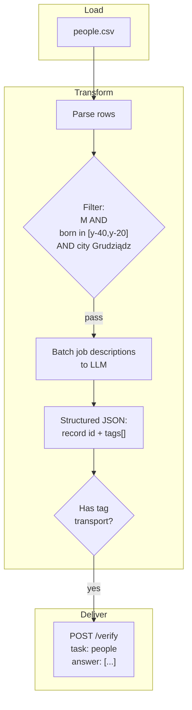
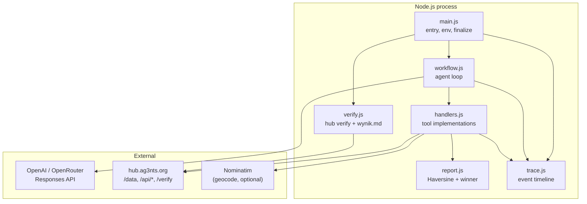
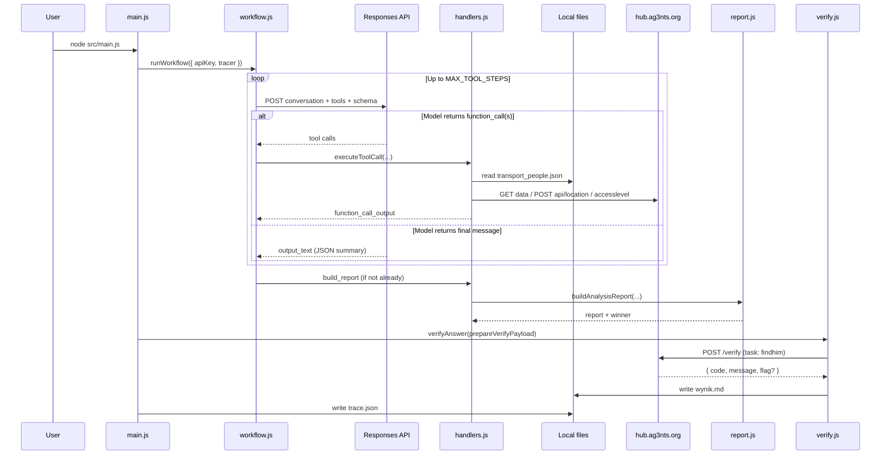
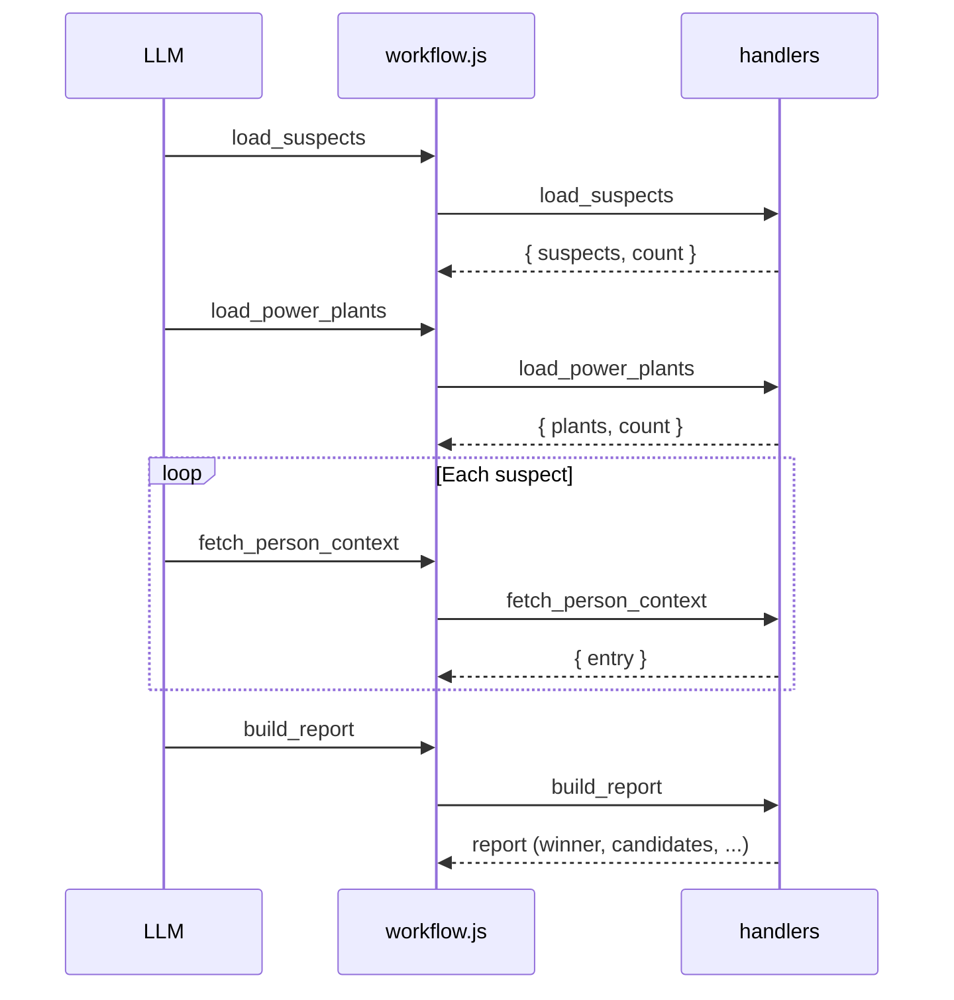
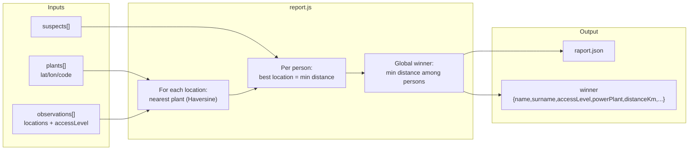
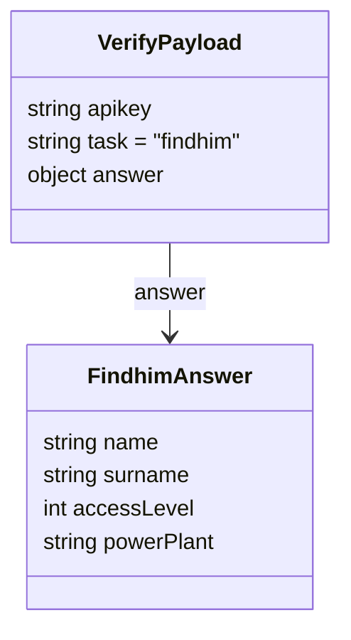
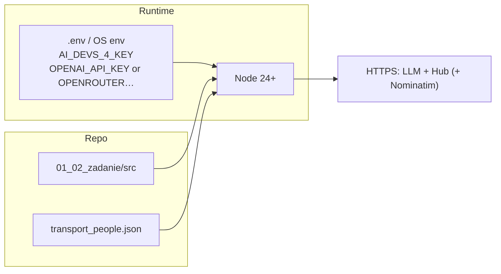

# Architecture and business — `01_02_zadanie` solution

This document describes the **business intent** defined in [`01_02_zadanie.md`](./01_02_zadanie.md) and how the **implemented system** in this folder realizes a full automation path: prepared candidate data, an LLM-orchestrated investigation workflow, deterministic scoring, and hub verification.

> **Security note:** API keys must live only in environment variables or secret stores. Do not commit keys or paste them into documentation.

---

## 1. Business context

### 1.1 Problem domain

The course task is a small **data + AI pipeline** combined with **platform integration**:

| Concern | Description |
|--------|-------------|
| **Goal** | Produce a correct answer for the hub task and obtain a flag (`{FLG:…}`) for course credit. |
| **Data source** | Person records with demographics and job descriptions (assignment: `people.csv`; this repo: precomputed `transport_people.json`). |
| **Business rules** | Filter people by gender (M), age band (20–40 via birth year), birthplace (Grudziądz), classify jobs with an LLM using **structured output**, keep only **`transport`** tag. |
| **Delivery** | POST JSON to `https://hub.ag3nts.org/verify` with task name and answer payload in the shape required by that task. |

The **written assignment** targets task name **`people`** and an answer that is an **array of objects** (with integer `born`, string array `tags`, etc.).

The **code in `src/`** implements a **follow-on operational workflow** named **`findhim`**: it treats the filtered, transport-tagged people as **suspects**, enriches them via hub APIs, computes the best match to power plants, and verifies with task **`findhim`**.

### 1.2 Value chain



### 1.3 Stakeholders and success criteria

| Stakeholder | Success criterion |
|-------------|-------------------|
| **Learner** | Understand structured LLM output, batching, and hub integration; obtain `{FLG:…}`. |
| **Course platform** | Receives well-formed verify payloads; returns deterministic validation and flags. |
| **Operators** | Reproducible runs, traceability (`trace.json`), inspectable reports (`raport.json`, `wynik.md`). |

---

## 2. Assignment-aligned pipeline (`people` task)

This is the **business process** as specified in the assignment document (conceptual ETL + LLM + filter).

### 2.1 High-level data flow



### 2.2 Filtering logic (business rules)

- **Gender:** male (`M`).
- **Age:** between 20 and 40 years — in practice implemented via **birth year** relative to a reference year (assignment implies deriving eligible years from “today” or a fixed course year).
- **Birthplace:** Grudziądz (assignment text: *miejsce urodzenia*).
- **Tagging:** send **job** strings to the LLM with a **JSON Schema** in `response_format` so the model cannot return invalid shapes.
- **Batching:** one request for many numbered job descriptions reduces cost and latency versus per-row calls.

### 2.3 Mapping to files in this repository

| Assignment step | Representation in repo |
|-----------------|------------------------|
| Filter + tag + select `transport` | [`transport_people.json`](./transport_people.json) — array of `{ name, surname, gender, born, city, tags }` with `tags` containing `"transport"`. |
| Structured output practice | Also used in runtime workflow via `finalSummarySchema` in [`src/schemas.js`](./src/schemas.js) (different schema, same mechanism). |
| Hub verify for **`people`** | Not implemented in `verify.js` (current code posts **`findhim`**). To submit the `people` answer, the same endpoint pattern applies with `task: "people"` and `answer` as the array. |

---

## 3. Runtime architecture (`findhim` workflow)

The runnable application wires **orchestration** (LLM + tools), **integrations** (hub + optional geocoding), and **deterministic analytics** (Haversine nearest plant).

### 3.1 Logical components



### 3.2 Module responsibilities

| Module | Responsibility |
|--------|----------------|
| [`src/main.js`](./src/main.js) | Resolve `AI_DEVS_4_KEY`, run workflow, call verify, print summary, persist trace. |
| [`src/workflow.js`](./src/workflow.js) | Multi-step **Responses API** loop: model may return **tool calls** or final **structured JSON** (`finalSummarySchema`). |
| [`src/tools.js`](./src/tools.js) | Tool definitions exposed to the model (`load_suspects`, `load_power_plants`, `fetch_person_context`, `build_report`). |
| [`src/handlers.js`](./src/handlers.js) | Execute tools: read `transport_people.json`, fetch hub data, call location/access APIs, write cached files, invoke report builder. |
| [`src/people.js`](./src/people.js) | Load and normalize suspect list from local JSON (name, surname, birth year). |
| [`src/report.js`](./src/report.js) | Pure **deterministic** winner selection: nearest power plant per observation, global minimum distance. |
| [`src/verify.js`](./src/verify.js) | Build **`findhim`** verify payload from `report.winner`, POST to `/verify`, write [`wynik.md`](./wynik.md). |
| [`src/schemas.js`](./src/schemas.js) | JSON Schema for the model’s **final structured** assistant message. |
| [`src/trace.js`](./src/trace.js) | Append-only event log → [`trace.json`](./trace.json). |

### 3.3 Configuration (repo root)

[`config.js`](../config.js) (parent directory) selects LLM provider, model, and `Responses` endpoint; requires **Node 24+** and can load `.env`. Workflow uses `AI_API_KEY` from that config for the LLM, separate from `AI_DEVS_4_KEY` for the hub.

---

## 4. Control flow and sequences

### 4.1 End-to-end sequence (main path)



### 4.2 Tool orchestration (instructed order)

The system prompt in `workflow.js` steers the model to:

1. `load_suspects` — load [`transport_people.json`](./transport_people.json).
2. `load_power_plants` — fetch plant metadata from hub data URL (and optionally geocode cities).
3. For each suspect: `fetch_person_context(name, surname, birthYear)` — hub location list + access level.
4. `build_report` — merge observations and compute winner.



### 4.3 Deterministic report data flow



---

## 5. Data models

### 5.1 Suspect record (`transport_people.json`)

Aligned with the assignment’s **filtered + tagged** population (illustrative shape):

```json
{
  "name": "string",
  "surname": "string",
  "gender": "M",
  "born": 1987,
  "city": "Grudziądz",
  "tags": ["transport"]
}
```

Used by `load_suspects` as the **candidate universe** for `findhim`.

### 5.2 Verify payload (`findhim`)

Built in [`src/verify.js`](./src/verify.js):



### 5.3 Final LLM summary schema

[`src/schemas.js`](./src/schemas.js) constrains the **assistant’s closing JSON** (human-readable rationale + key fields), separate from the machine-verified `report.winner` used for `/verify`.

---

## 6. External systems

| System | Role | Protocol |
|--------|------|----------|
| **Responses API** | Multi-turn chat with **function calling** and **structured final output**. | HTTPS JSON |
| **hub.ag3nts.org/data/...** | Download task-specific datasets (e.g. power plant locations). | HTTPS GET |
| **hub.ag3nts.org/api/location** | Observed coordinates for a person. | HTTPS POST JSON |
| **hub.ag3nts.org/api/accesslevel** | Numeric clearance; requires `birthYear`. | HTTPS POST JSON |
| **hub.ag3nts.org/verify** | Validates answer; returns flag text on success. | HTTPS POST JSON |
| **Nominatim (OSM)** | City → lat/lon when hub returns city-keyed plant data. | HTTPS GET (rate-limit friendly) |

---

## 7. Observability and artefacts

| Artefact | Purpose |
|----------|---------|
| [`trace.json`](./trace.json) | Ordered **events**: LLM requests/responses, tool args/results, HTTP to hub and geocoder, file writes. |
| [`raport.json`](./raport.json) | Full **analytical report**: all candidates, per-location matches, **winner**. |
| [`wynik.md`](./wynik.md) | Short **human summary** + raw verify JSON (flag message). |
| [`findhim_locations.json`](./findhim_locations.json) | Cached hub plant payload after `load_power_plants`. |

Enable verbose step logging with environment flag `FINDHIM_DEBUG` (see `workflow.js`).

---

## 8. Business vs technical decisions

| Decision | Rationale |
|----------|-----------|
| **Structured output** | Eliminates brittle JSON parsing for both job tags (assignment) and final summaries (workflow). |
| **Batch LLM tagging** (assignment) | Fewer round trips, lower cost, more consistent tagging context. |
| **Agent + tools for findhim** | Hub APIs and file paths are **opaque to the prompt**; the model decides call order within guardrails. |
| **Deterministic `report.js`** | Distance and winner are **not** left to the LLM — reduces hallucinated winners. |
| **Separate keys** | `AI_DEVS_4_KEY` for hub, provider key for LLM — least privilege and clear billing boundaries. |

---

## 9. Deployment and execution (conceptual)



Typical invocation from repository root (exact command depends on your `package.json` scripts, if any): run `main.js` with working directory and `NODE_PATH` such that `config.js` resolves and environment variables are set.

---

## 10. Summary

- **Business view:** The assignment defines a **people** pipeline (filter → LLM structured tagging → `transport` → hub). In this folder, **`transport_people.json`** materializes that outcome for a concrete cohort.
- **Architecture view:** A **tool-using LLM workflow** enriches those suspects via **hub APIs**, then a **deterministic geospatial report** picks a **winner** and **`verify.js`** submits the **`findhim`** answer to the hub.
- **Cross-cutting:** **Tracing**, **JSON reports**, and **structured schemas** make the system **auditable** and **aligned** with course learning goals (structured output, batching, integration).

For the original **`people`** verify contract (array answer, `task: "people"`), reuse the same hub endpoint and payload structure described in [`01_02_zadanie.md`](./01_02_zadanie.md); the current `verify.js` is specialized for **`findhim`**.
