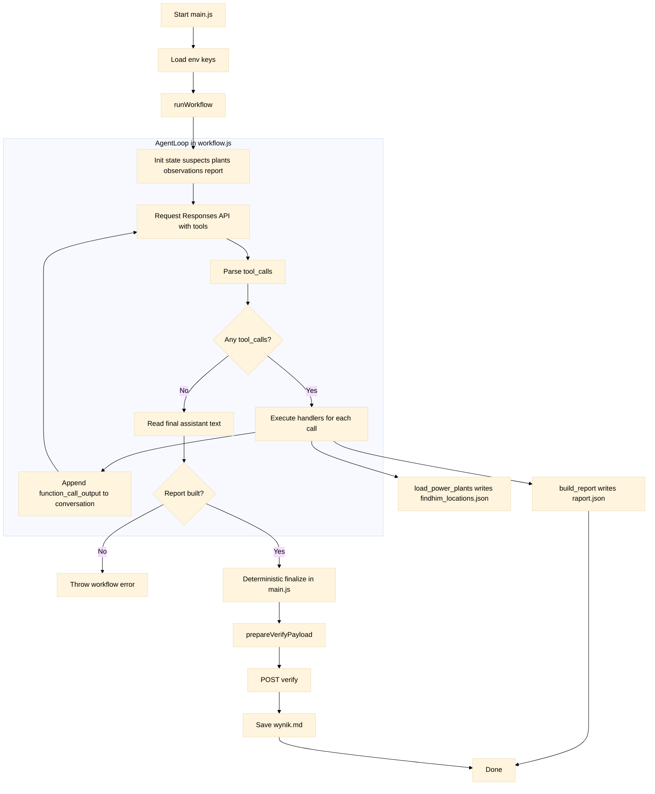
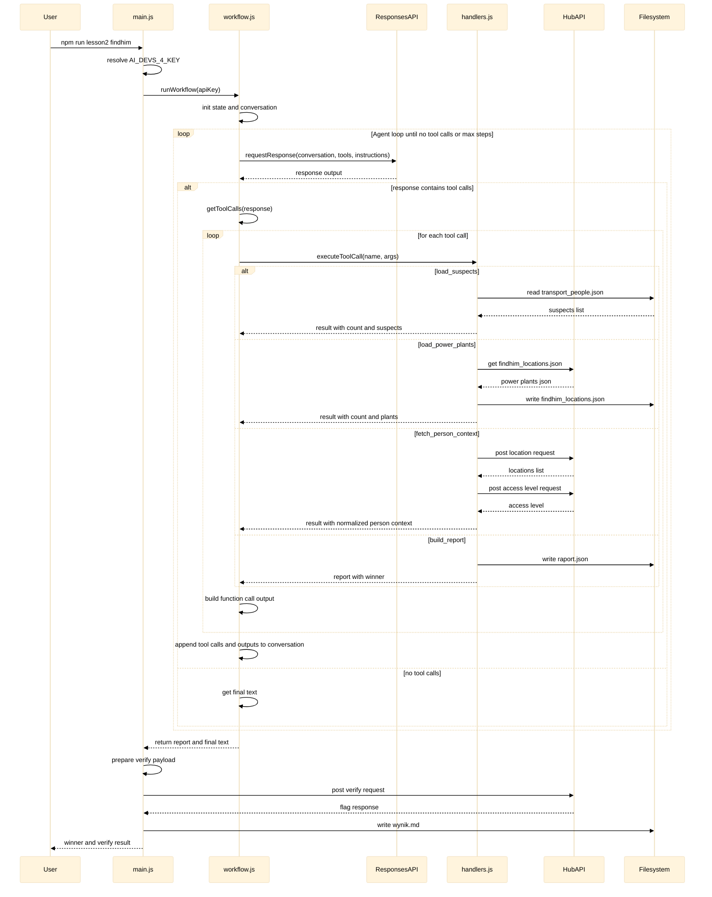

# Workflow and tools implementation for findhim
_Exported on 3/15/2026 at 19:58:40 CDT from Cursor (2.6.19)_

---

**User**


Mam załączony plik @01_02_zadanie/01_02_zadanie.md, który zawiera pełne wymagania zadania **findhim** w folderze @01_02_zadanie/ Uzyj tego folderu do budowy solution

---

# Twoja rola

Zachowuj się jak **doświadczony AI Architect i mentor**, który pomaga mi zrozumieć wzorce architektoniczne używane w systemach AI.

Twoim celem nie jest tylko wygenerowanie kodu, ale **pomóc mi zrozumieć koncepty stojące za rozwiązaniem**.

Nie optymalizuj pod najszybsze dostarczenie gotowego rozwiązania — **optymalizuj pod naukę i zrozumienie wzorca architektonicznego**.

---

# Kontekst zadania

Zadanie pochodzi z kursu **AI Devs 4** i dotyczy implementacji **workflow z tools / function calling**, zgodnie z lekcją **S01E02**.

Chcę oprzeć rozwiązanie na wzorcu z przykładowej aplikacji:

```
@01_02_tools/ 
```

Szczegóły implementacyjne znajdują się w pliku:

```
@01_02_zadanie/01_02_zadanie.md 
```

---

# Jak chcę pracować

Chcę zrobić to zadanie **krok po kroku**, żeby naprawdę zrozumieć:

* jak działa **workflow z tools**
* jak działa **pętla agentowa**
* jak aplikacja wykonuje **tool calls**
* jak wyniki trafiają z powrotem do kontekstu
* jak budowany jest **raport.json**
* jak działa **deterministyczny krok końcowy z verify**

Nie generuj całego projektu od razu.

---

# Styl pracy

Pracuj iteracyjnie:

1. najpierw przeczytaj `01_02_zadanie.md`
2. zaproponuj **plan implementacji w 5–10 punktach**
3. rozbij implementację na **małe kroki**
4. w każdym kroku:

   * wyjaśnij **po co ten krok istnieje**
   * pokaż **fragment kodu**
   * wyjaśnij **jak ten fragment pasuje do architektury**
5. po każdym kroku **zatrzymaj się i poczekaj na mój sygnał**

---

# Implementation Checkpoints

Podziel implementację na logiczne **checkpointy**.

Po zakończeniu każdego checkpointu:

* pokaż krótkie podsumowanie co zostało zrobione
* upewnij się że kod jest spójny
* poczekaj na moją decyzję zanim przejdziemy dalej

Przykładowe checkpointy mogą wyglądać tak:

### Checkpoint 1 — Architektura projektu

* struktura folderów
* struktura plików
* ogólny workflow aplikacji

### Checkpoint 2 — Definicja tools

* definicja tool schema
* struktura `tools.js`

### Checkpoint 3 — Workflow loop

* implementacja pętli agentowej
* obsługa tool calls

### Checkpoint 4 — Logika raportu

* budowa `raport.json`
* zapis wyników analizy

### Checkpoint 5 — Finalizacja

* wybór najlepszego kandydata
* wysłanie `/verify`
* zapis `wynik.md`

---

# Ważne wymagania

* użyj architektury **workflow + tools**
* inspiruj się kodem z `01_02_tools`
* nie twórz jednego liniowego skryptu
* zachowaj **czytelną architekturę plików**

---

# Modele LLM

Na początku użyj **jak najtańszego modelu**, ponieważ to zadanie służy głównie do nauki workflow.

Nie potrzebujemy tutaj najmocniejszego modelu.

---

# Start

Na początek:

1. przeczytaj `01_02_zadanie.md`
2. streść plan implementacji
3. zaproponuj checkpointy
4. rozpocznij **Checkpoint 1**

Checkpoint 1 powinien obejmować:

* architekturę aplikacji
* strukturę plików
* podstawowy szkielet projektu.

---

---

**Cursor**

Rozumiem: najpierw zbiorę kontekst z `01_02_zadanie/01_02_zadanie.md` oraz wzorca w `01_02_tools`, a potem przygotuję plan + checkpointy i rozpocznę Checkpoint 1 na poziomie architektury (bez wdrażania zmian w plikach).

Doprecyzowuję jeszcze wzorzec z `01_02_tools` (helpery + README), żeby Checkpoint 1 był zgodny z stylem projektu i pętlą workflow z lekcji.

---

**User**

Implement the plan as specified, it is attached for your reference. Do NOT edit the plan file itself.

To-do's from the plan have already been created. Do not create them again. Mark them as in_progress as you work, starting with the first one. Don't stop until you have completed all the to-dos.

---

**Cursor**

Zaczynam realizację od Checkpoint 1 i od razu przejdę przez wszystkie checkpointy do końca. Najpierw oznaczę pierwszy task jako `in_progress`, potem sprawdzę istniejącą infrastrukturę (`config.js`, skrypty uruchomieniowe), żeby poprawnie podpiąć nowe moduły.

Przechodzę do implementacji: tworzę teraz szkielet modułów w `01_02_zadanie/src`, a potem wypełnię je logiką tools/workflow/report/verify zgodnie z planem.

Implementuję teraz Checkpoint 1+2: dodaję strukturę plików i definicje tools/handlerów z wyraźnym podziałem odpowiedzialności, żeby kolejne checkpointy były tylko dopięciem logiki.

Mam gotowy szkielet i komplet modułów, teraz waliduję składnię i przepływ (workflow/report/verify), a potem domknę statusy checkpointów i podam krótkie podsumowanie architektury.

Zaimplementowałem cały plan end-to-end (bez edycji pliku planu) i oznaczyłem wszystkie TODO jako `completed`.

Wdrożone rozwiązanie w `01_02_zadanie/src` ma architekturę `workflow + tools` oraz deterministyczny finał `verify`.

## Co zostało zrobione

- **Checkpoint 1 — Architektura/szkielet**
  - Dodałem moduły:
    - `01_02_zadanie/src/main.js`
    - `01_02_zadanie/src/workflow.js`
    - `01_02_zadanie/src/tools.js`
    - `01_02_zadanie/src/handlers.js`
    - `01_02_zadanie/src/people.js`
    - `01_02_zadanie/src/report.js`
    - `01_02_zadanie/src/verify.js`
- **Checkpoint 2 — Definicja tools**
  - Zdefiniowane narzędzia (JSON Schema): `load_suspects`, `load_power_plants`, `fetch_person_context`, `build_report`.
- **Checkpoint 3 — Pętla workflow**
  - Pętla agentowa z limitem kroków (`MAX_TOOL_STEPS`), obsługą `function_call`, wykonaniem handlerów i doklejaniem `function_call_output` do konwersacji.
- **Checkpoint 4 — Raport**
  - Deterministyczne liczenie odległości (Haversine), wybór najlepszego kandydata, zapis `raport.json`.
- **Checkpoint 5 — Finalizacja**
  - Deterministyczny krok `verify` z walidacją payloadu i zapisem `wynik.md`.
  - Dodany skrypt uruchomieniowy: `lesson2:findhim` w `package.json`.

## Jak uruchomić

- Ustaw klucz API:
  - `AI_DEVS_4_API_KEY` (lub `AI_DEVS_4_KEY`)
- Uruchom:
  - `npm run lesson2:findhim`

## Weryfikacja, którą zrobiłem

- Sprawdzenie składni wszystkich nowych modułów: `node --check` — OK.
- Linter dla `01_02_zadanie/src` — brak błędów.
- Smoke run `main.js` wykonał się do walidacji klucza i poprawnie przerwał z komunikatem o brakującym `AI_DEVS_4_API_KEY` (czyli guard działa).

Jeśli chcesz, w kolejnym kroku mogę przejść przez kod **edukacyjnie checkpoint po checkpointcie** (po co dany moduł istnieje, jak płyną dane i jak to odwzorowuje wzorzec z `01_02_tools`).

---

**User**

uruchomilem po checkpoint 1 and @c:\Users\rafal\.cursor\projects\c-Users-rafal-repos-4th-devs\terminals\1.txt:10-16 i mam error moze musze poczekac do skonczenia wszystich krokow?

---

**Cursor**

Nie musisz czekać na kolejne checkpointy — ten błąd oznacza, że aplikacja dostała HTML zamiast JSON (zwykle z endpointu Hub, np. zły/niepodstawiony klucz). Sprawdzę i od razu poprawię obsługę błędów tak, żeby komunikat jasno mówił co jest nie tak.

Masz rację, to jest bug w obecnej obsłudze odpowiedzi HTTP, nie kwestia „czekania do końca kroków”. Poprawiam teraz parser odpowiedzi w `handlers.js`, `workflow.js` i `verify.js`, żeby zamiast `Unexpected token '<'` dostawać precyzyjny komunikat (np. błędny klucz / endpoint zwrócił HTML).

Nie, nie musisz czekać do końca kroków — to nie był problem checkpointu, tylko odpowiedzi HTTP.

Poprawiłem kod tak, żeby zamiast ogólnego `Unexpected token '<'` dawał konkretny komunikat.  
Po ponownym uruchomieniu dostajemy już jasny błąd:

- `Power plants dataset: expected JSON but got text/html ... status 404`

To znaczy, że URL do danych `findhim_locations.json` nie istnieje dla aktualnego klucza, który aplikacja bierze z env.

## Co teraz sprawdzić

1. Ustaw poprawny klucz z `01_02_zadanie/01_02_zadanie.md`:
   - PowerShell:
   ```powershell
   $env:AI_DEVS_4_API_KEY="TU_WSTAW_KLUCZ"
   ```
2. Zweryfikuj sam endpoint:
   ```powershell
   iwr "https://hub.ag3nts.org/data/$env:AI_DEVS_4_API_KEY/findhim_locations.json"
   ```
   - jeśli dalej 404 → klucz jest nie ten / literówka
3. Uruchom ponownie:
   ```powershell
   npm run lesson2:findhim
   ```

Jeśli chcesz, mogę od razu dodać mały `--dry-run`/`healthcheck` w `main.js`, który najpierw testuje dostępność datasetu i wypisuje diagnostykę zanim ruszy pełna pętla tool-calling.

---

**User**

ok potrzebujesz informacji do laczenie z LLM mamy uzywac OPENROUTER_API_KEY a do API uzyj tego klucza AI_DEVS_4_KEY to jest moj unikalny ID nie chce uzwac nazwy AI_DEVS_4_API_KEY bo jest mylaca

---

**Cursor**

Jasne — dostosuję to dokładnie do Twojego nazewnictwa: klucz do Huba będzie brany tylko z `AI_DEVS_4_KEY`, a komunikat startowy doprecyzuję pod `OPENROUTER_API_KEY` dla LLM. Potem szybko sprawdzę składnię.

Gotowe — dostosowałem kod do Twojej konwencji.

Co zmieniłem:
- `01_02_zadanie/src/main.js`:
  - klucz do API Hub jest teraz czytany **tylko** z `AI_DEVS_4_KEY`
  - usunąłem fallbacki typu `AI_DEVS_4_API_KEY`
  - komunikat błędu też mówi wyłącznie o `AI_DEVS_4_KEY`

Weryfikacja:
- składnia `main.js` OK
- linter OK

Dla pełnej zgodności z Twoim założeniem o LLM:
- ustaw w `.env`:
  - `OPENROUTER_API_KEY=...`
  - `AI_PROVIDER=openrouter`
  - `AI_DEVS_4_KEY=...`

Jeśli chcesz, mogę teraz dodać krótki startup log (1 linia), który wypisze aktywnego providera (`openrouter`) i potwierdzi wykrycie `AI_DEVS_4_KEY` bez ujawniania wartości.

---

**User**

dodane do env

---

**Cursor**

Super, w takim razie odpalam teraz cały workflow i sprawdzę, czy przechodzi end-to-end z nowymi zmiennymi z `.env`.

Jest postęp: klucz działa, ale format danych z `findhim_locations.json` jest inny niż założyliśmy. Sprawdzam teraz realny shape odpowiedzi i dopasuję parser.

Znalazłem źródło problemu: `findhim_locations.json` zwraca słownik miast + kodów elektrowni (bez `lat/lon`), a nasz kod zakładał od razu tablicę z koordynatami. Dopinam parser + geokodowanie miast do współrzędnych, żeby raport działał poprawnie.

Świetnie, działa end-to-end — nie trzeba było czekać na kolejne checkpointy, tylko poprawić format danych wejściowych.

Co było problemem:
- `findhim_locations.json` nie zwraca tablicy z `lat/lon`, tylko obiekt `power_plants` z nazwami miast i kodami.
- Przez to parser oczekiwał zły kształt danych.

Co poprawiłem:
- w `01_02_zadanie/src/handlers.js` dodałem obsługę rzeczywistego formatu `power_plants`
- dodałem geokodowanie miast do współrzędnych (Nominatim), żeby dalej liczyć odległości Haversine
- zostawiłem lepsze komunikaty błędów HTTP/JSON

Wynik uruchomienia:
- `npm run lesson2:findhim` zakończone sukcesem
- wybrany kandydat: `Wojciech Bielik`
- `/verify` zwróciło flagę: `{FLG:BUSTED}`
- zapisano `01_02_zadanie/wynik.md`

Jeśli chcesz, w kolejnym kroku mogę przejść z Tobą edukacyjnie przez **pętlę agentową** w `workflow.js` (linia po linii: request → tool_calls → function_call_output → kolejna iteracja).

---

**User**

zanim przejdziemy krok po krok to chce zrobic kilka zmian w kodzie:
1. chce zapisac findhim_locations.json w glownym folder
2. w @01_02_zadanie/raport.json chce dodac informacje o lokalizacji pobrane z API https://hub.ag3nts.org/api/location 

---

**Cursor**

Jasne — wprowadzę obie zmiany: zapis `findhim_locations.json` do głównego folderu repo oraz rozszerzenie `raport.json` o dane lokalizacji z `/api/location` w bardziej bezpośredniej formie. Najpierw sprawdzę aktualny kształt raportu, żeby dodać to spójnie.

Wprowadzam to w dwóch miejscach: `handlers.js` zapisze surowe `findhim_locations.json` do root repo, a `report.js` zacznie zapisywać w kandydacie osobne pole z lokalizacjami pobranymi bezpośrednio z `/api/location`.

Zrobione — obie zmiany wdrożone i przetestowane.

- `findhim_locations.json` zapisuje się teraz w **głównym folderze repo**: `findhim_locations.json`
- `01_02_zadanie/raport.json` zawiera teraz dodatkowe pole `apiLocations` dla każdego kandydata (surowe lokalizacje z `https://hub.ag3nts.org/api/location`)

## Co zmieniłem technicznie

- `01_02_zadanie/src/handlers.js`
  - zapis surowego datasetu elektrowni do `findhim_locations.json`
  - dodałem `getRawLocationList(...)`
  - przy budowie obserwacji zapisuję:
    - `apiLocations` (raw z API)
    - `locations` (znormalizowane `lat/lon` do obliczeń)
- `01_02_zadanie/src/report.js`
  - w kandydacie dodane pole:
    - `apiLocations: observation.apiLocations ?? []`

## Weryfikacja

- `npm run lesson2:findhim` przechodzi poprawnie
- `/verify` nadal zwraca `{FLG:BUSTED}`
- plik `findhim_locations.json` istnieje w root
- `raport.json` zawiera `apiLocations` (dla wszystkich kandydatów)

Jeśli chcesz, mogę teraz dodać też top-level sekcję w `raport.json`, np. `sourceSnapshots.locationApiByPerson`, żeby było jeszcze łatwiej audytować dane wejściowe per osoba.

---

**User**

ja chcialem zapisac json w @01_02_zadanie/ folder

---

**Cursor**

Masz rację — poprawiam ścieżkę zapisu tak, żeby `findhim_locations.json` trafiał do `01_02_zadanie/`. Potem szybko odpalę workflow, żeby odtworzyć plik we właściwym miejscu.

Masz rację — poprawione.

- `findhim_locations.json` zapisuje się teraz do `01_02_zadanie/findhim_locations.json`
- uruchomiłem ponownie `npm run lesson2:findhim` i plik został wygenerowany we właściwym folderze
- usunąłem stary duplikat z root repo (`/findhim_locations.json`), żeby nie było zamieszania

Czyli od teraz wszystkie artefakty zadania są w `01_02_zadanie/`.

---

**User**

przejść edukacyjnie przez pętlę agentową w workflow.js (linia po linii: request → tool_calls → function_call_output → kolejna iteracja).

---

**Cursor**

Super kierunek — przejdę teraz krok po kroku przez `workflow.js` dokładnie w sekwencji `request → tool_calls → function_call_output → kolejna iteracja`, z krótkimi komentarzami architektonicznymi. Najpierw wczytam aktualną wersję pliku, żeby odnieść się precyzyjnie do kodu.

Idealnie — to jest serce wzorca `workflow + tools`.

Poniżej przechodzę dokładnie po sekwencji: **request → tool_calls → function_call_output → kolejna iteracja**.

## 1) Request do modelu (co dokładnie wysyłamy)

Najpierw budujesz request z:
- `model`
- `input` (cała dotychczasowa rozmowa / kontekst)
- `tools` (schematy funkcji, które model *może* wywołać)
- `instructions` (reguły kolejności)

```52:77:01_02_zadanie/src/workflow.js
const requestResponse = async ({ conversation, instructions }) => {
  const body = buildResponsesRequest({
    model: MODEL,
    input: conversation,
    tools,
    instructions,
  });

  const response = await fetch(RESPONSES_API_ENDPOINT, {
    method: "POST",
    headers: {
      "Content-Type": "application/json",
      Authorization: `Bearer ${AI_API_KEY}`,
      ...EXTRA_API_HEADERS,
    },
    body: JSON.stringify(body),
  });

  const data = await readJsonResponse(response, "Responses API");
  if (!response.ok) {
    const message = data?.error?.message ?? `Responses API request failed (${response.status})`;
    throw new Error(message);
  }

  return data;
};
```

**Architektonicznie:** to jest warstwa “LLM I/O”. Nie ma tu logiki biznesowej — tylko transport i walidacja odpowiedzi.

---

## 2) Odczyt `tool_calls` z odpowiedzi modelu

Po response parsujesz output i wyciągasz tylko elementy typu `function_call`.

```44:50:01_02_zadanie/src/workflow.js
const getToolCalls = (response) =>
  response.output?.filter((item) => item.type === "function_call") ?? [];

const getFinalText = (response) =>
  response.output_text
  ?? response.output?.find((item) => item.type === "message")?.content?.[0]?.text
  ?? "";
```

**Znaczenie:**  
- jeśli są `function_call` → model chce, żeby kod wykonał narzędzia  
- jeśli nie ma `function_call` → model zakończył i daje finalny tekst

To jest dokładnie “switch” między trybem **agent action** i **agent answer**.

---

## 3) Wykonanie tool call i budowa `function_call_output`

Każdy tool call:
1. mapujesz po nazwie do lokalnego handlera
2. parsujesz argumenty JSON
3. odpalasz handler
4. pakujesz wynik do formatu `function_call_output` z tym samym `call_id`

```79:93:01_02_zadanie/src/workflow.js
const executeToolCall = async (toolCall, handlers) => {
  const handler = handlers[toolCall.name];
  if (!handler) {
    throw new Error(`Unknown tool call: ${toolCall.name}`);
  }

  const args = JSON.parse(toolCall.arguments || "{}");
  const result = await handler(args);

  return {
    type: "function_call_output",
    call_id: toolCall.call_id,
    output: JSON.stringify(result),
  };
};
```

**Kluczowy detal:** `call_id` spina “prośbę modelu” z “wynikiem narzędzia”.  
Bez tego model nie wie, który wynik odpowiada któremu wywołaniu.

---

## 4) Doklejenie `tool_calls` i `function_call_output` do kontekstu

Tu dzieje się najważniejsza rzecz dla pętli: budujesz nowy `conversation` przez dopisanie:
- oryginalnych `toolCalls` (to, co model zażądał)
- `outputs` (to, co aplikacja wykonała)

```95:104:01_02_zadanie/src/workflow.js
const buildNextConversation = async (conversation, toolCalls, handlers) => {
  const outputs = [];

  for (const toolCall of toolCalls) {
    const output = await executeToolCall(toolCall, handlers);
    outputs.push(output);
  }

  return [...conversation, ...toolCalls, ...outputs];
};
```

**Dlaczego to działa:** model w następnej iteracji “widzi historię”:  
“Poprosiłem o `fetch_person_context`, dostałem taki JSON wynik, więc teraz mogę podjąć następny krok”.

---

## 5) Kolejna iteracja pętli (agent loop)

To jest orkiestrator całości:
1. request
2. odczyt tool calls
3. jeśli brak — koniec
4. jeśli są — wykonaj tools i wróć do kroku 1

```124:159:01_02_zadanie/src/workflow.js
export const runWorkflow = async ({ apiKey, instructions = defaultInstructions } = {}) => {
  const state = createWorkflowState();
  const handlers = createHandlers({ apiKey, state });

  let conversation = [
    {
      role: "user",
      content: "Solve task findhim using tools and produce report data.",
    },
  ];

  let stepsRemaining = MAX_TOOL_STEPS;
  let finalText = "";

  while (stepsRemaining > 0) {
    stepsRemaining -= 1;
    const response = await requestResponse({ conversation, instructions });
    const toolCalls = getToolCalls(response);

    if (toolCalls.length === 0) {
      finalText = getFinalText(response);
      break;
    }

    conversation = await buildNextConversation(conversation, toolCalls, handlers);
  }

  if (!state.report) {
    throw new Error("Workflow ended without a generated report. Model did not call build_report.");
  }

  return {
    state,
    finalText,
  };
};
```

---

## Mental model (1 zdanie)

To nie jest “model robi wszystko”, tylko:  
**model planuje kroki przez `function_call`, a kod deterministycznie wykonuje narzędzia i odsyła wyniki do kolejnego kroku planowania.**

---

Jeśli chcesz, w następnym kroku mogę zrobić **symulację 2–3 realnych iteracji** na Twoim przypadku (`load_suspects` → `load_power_plants` → `fetch_person_context`) z przykładowymi obiektami `conversation`, żeby zobaczyć “co dokładnie leci po drucie”.

---

**User**

tak zrib 203 symulacje

---

**Cursor**

Świetnie — robimy **2–3 symulacje iteracji** na Twoim `workflow.js`.

Pokażę to jako “co model zwraca” i “co aplikacja dopina do kontekstu”.

---

## Symulacja 1 — start, model woła `load_suspects`

### Wejściowy `conversation` (skrót)
```json
[
  { "role": "user", "content": "Solve task findhim using tools and produce report data." }
]
```

### Odpowiedź modelu (`response.output`) — przykład
```json
[
  {
    "type": "function_call",
    "name": "load_suspects",
    "call_id": "call_1",
    "arguments": "{}"
  }
]
```

### Co robi aplikacja
- `getToolCalls()` wyciąga `load_suspects`
- `executeToolCall()` odpala handler `load_suspects()`
- handler zwraca np. listę 5 podejrzanych

### `function_call_output` dopięty do kontekstu
```json
{
  "type": "function_call_output",
  "call_id": "call_1",
  "output": "{\"count\":5,\"suspects\":[...]}"

}
```

### Nowy `conversation` po iteracji
Staje się:
1) user message  
2) function_call `load_suspects`  
3) function_call_output z wynikiem

I to leci do **kolejnego requestu**.

---

## Symulacja 2 — model woła `load_power_plants`

Model widzi już, że ma podejrzanych, więc zwykle prosi o elektrownie:

```json
{
  "type": "function_call",
  "name": "load_power_plants",
  "call_id": "call_2",
  "arguments": "{}"
}
```

Aplikacja:
- pobiera `findhim_locations.json`
- geokoduje miasta do punktów
- zapisuje snapshot `01_02_zadanie/findhim_locations.json`
- zwraca np. `{ count: 7, plants: [...] }`

Doklejony output:
```json
{
  "type": "function_call_output",
  "call_id": "call_2",
  "output": "{\"count\":7,\"plants\":[...]}"
}
```

Teraz model ma: **suspects + plants** i może iterować po osobach.

---

## Symulacja 3 — model woła `fetch_person_context` dla osoby

Przykład calla:
```json
{
  "type": "function_call",
  "name": "fetch_person_context",
  "call_id": "call_3",
  "arguments": "{\"name\":\"Wojciech\",\"surname\":\"Bielik\",\"birthYear\":1986}"
}
```

Aplikacja:
- POST `/api/location`
- POST `/api/accesslevel`
- normalizuje lokalizacje (`lat/lon`)
- trzyma też surowe `apiLocations`
- zapisuje do `state.observations`

Output:
```json
{
  "type": "function_call_output",
  "call_id": "call_3",
  "output": "{\"entry\":{\"name\":\"Wojciech\",\"surname\":\"Bielik\",\"birthYear\":1986,\"accessLevel\":7,\"apiLocations\":[...],\"locations\":[...]}}"
}
```

Model powtarza takie calle dla kolejnych osób, a na końcu woła:
- `build_report`

Po `build_report` w stanie masz `state.report`, a model może oddać finalny tekst.  
Gdy `toolCalls.length === 0`, pętla się kończy.

---

## Najważniejszy wzorzec (do zapamiętania)

Każda iteracja to:
1. **LLM planuje** następny krok (`function_call`)
2. **Kod wykonuje** krok deterministycznie
3. **Wynik wraca** jako `function_call_output`
4. **LLM replanuje** na podstawie nowego kontekstu

To dokładnie “pętla agentowa” w praktyce.

Jeśli chcesz, mogę teraz zrobić wersję “debug view”, tzn. jak logować każdą iterację (`step #`, `tool name`, `args`, `result summary`) tak, żebyś widział to live podczas `npm run lesson2:findhim`.

---

**User**

zrob wersja debug view

---

**Cursor**

Dodaję teraz `debug view` do pętli agentowej: log kroku, request/response, nazwy tooli, argumenty i skrót wyników tooli. Zrobię to tak, żeby było włączane flagą (`FINDHIM_DEBUG=1`), bez zaśmiecania normalnego runa.

Gotowe — dodałem `debug view` do pętli agentowej w `01_02_zadanie/src/workflow.js`.

## Jak włączyć

W PowerShell:

```powershell
$env:FINDHIM_DEBUG="1"
npm run lesson2:findhim
```

Wyłączysz przez:

```powershell
$env:FINDHIM_DEBUG="0"
```

(albo usunięcie zmiennej).

## Co loguje debug view

- start kroku (`stepIndex`, `stepsRemaining`)
- request (`model`, liczba elementów `conversation`)
- response (`outputItems`)
- listę `tool_calls` w kroku
- dla każdego toola:
  - `args`
  - skrót wyniku (`count`, osoba + `accessLevel`, winner raportu)
- liczbę elementów kontekstu po dopięciu `function_call_output`
- końcowy tekst modelu, gdy brak `tool_calls`

## Potwierdzenie działania

Przetestowałem na żywo z `FINDHIM_DEBUG=1` i log pokazał pełną sekwencję:
1. `load_suspects`
2. `load_power_plants`
3. 5x `fetch_person_context`
4. `build_report`
5. final response (bez tool calls)

plus końcowe `/verify` z `{FLG:BUSTED}`.

Jeśli chcesz, mogę zrobić wersję “clean debug” (np. tylko 1 linia na tool call, bez payloadów), przełączaną osobną flagą `FINDHIM_DEBUG_VERBOSE`.

---

**User**

create mermaid diagram to visual 

---

**Cursor**

Jasne — poniżej masz gotowy diagram Mermaid pokazujący Twój workflow `findhim` z pętlą agentową i krokiem deterministycznym.



Jeśli chcesz, mogę też dorzucić drugi diagram typu **sequence diagram** (Model ↔ Workflow ↔ Tools ↔ Hub API), który jeszcze lepiej pokazuje `request -> tool_calls -> function_call_output -> next iteration`.

---

**User**

tak sequence diagram

---

**Cursor**

Świetnie — poniżej sequence diagram pod Twoją implementację `findhim`:



Jeśli chcesz, mogę też przygotować wersję **“teaching diagram”** (krótszą), tylko z 4 lifeline’ami: `Workflow`, `Model`, `Tools`, `Hub`.

---

**User**

I would like to add json file which will save all requests and responses in folder 01_02_zadanie plus include each tool request and responses it will show me when what is trigger 

---

**Cursor**

Świetny pomysł — dodam pełny `trace` do `01_02_zadanie/` jako JSON z timeline zdarzeń: request/response do LLM, request/response do API w toolach oraz każde wywołanie toola (args + wynik + timestamp). Potem odpalę run i pokażę plik.

Dopinam jeszcze trace dla kroku końcowego (`/verify`) i automatyczny zapis jednego pliku `trace.json` po całym runie, żeby mieć pełny timeline „kto/co/kiedy”.

Done — added full JSON tracing exactly for this purpose.

### What was added

- New file: `01_02_zadanie/src/trace.js`
  - creates a timeline recorder
  - saves to `01_02_zadanie/trace.json`

- Integrated trace into:
  - `01_02_zadanie/src/workflow.js`
    - logs `llm.request` and `llm.response`
    - logs `tool.call.request` and `tool.call.response`
    - logs step lifecycle (`workflow.step.start`, `workflow.step.tool_calls`, `workflow.step.end`, `workflow.step.final_text`)
  - `01_02_zadanie/src/handlers.js`
    - logs all tool-triggered HTTP calls:
      - `tool.http.request`
      - `tool.http.response`
    - includes source labels, e.g.:
      - `load_power_plants`
      - `fetch_person_context.location`
      - `fetch_person_context.accesslevel`
      - `geocode_city`
    - logs file writes (`file.write`) for `findhim_locations.json` and `raport.json`
  - `01_02_zadanie/src/main.js`
    - logs `/verify` request/response
    - saves final trace and prints path

### Output file

After run, you now get:
- `01_02_zadanie/trace.json`

It contains:
- timestamps (`timestamp`)
- event type (`type`)
- payload (`data`)
- strict order (`index`) so you can see *when what was triggered*.

### Verified

I ran `npm run lesson2:findhim` and confirmed:
- `trace.json` is generated
- includes all requested categories (`llm.*`, `tool.call.*`, `tool.http.*`, `verify.*`, `file.write`)
- workflow still ends successfully with verify flag.

If you want, next I can add a tiny `trace-summary.md` generator (e.g. grouped by step/tool with counts and durations) so you don’t have to read the full raw JSON each time.

---

**User**

mam pytania na temat request/response do LLM:
1. dla request uzyles body.input.content bez body.input.type czy to oznacza ze type jest domysly "message"? Czy wogole ma to znaczenie?
2. uzyles tez body.instructions i w przeciwienstwie do content instructions jest zwracane w response co powoduje wiecej response token (tak mi sie wydaje) nie lepiej poprostu uzyc dluzszy prompt w content? 

---

**Cursor**

Bardzo dobre pytania — to są dokładnie te niuanse, które robią różnicę w kosztach i stabilności.

## 1) `input.content` bez `type` — czy `type` jest domyślne?

Krótko: **tak, dla tekstu to jest poprawny skrót** i ma znaczenie głównie ergonomiczne.

W Twoim kodzie wysyłasz:

```52:58:01_02_zadanie/src/workflow.js
const body = buildResponsesRequest({
  model: MODEL,
  input: conversation,
  tools,
  instructions,
});
```

a `conversation` zawiera tekstowe message:

```128:133:01_02_zadanie/src/workflow.js
let conversation = [
  {
    role: "user",
    content: "Solve task findhim using tools and produce report data.",
  },
];
```

Dla **text-only** to działa (provider normalizuje do odpowiedniego typu tekstowego).  
`type` staje się ważny, gdy masz multimodal (`input_image`, `input_audio`) albo chcesz jawnie kontrolować strukturę content parts.

Przykład jawnego typu z innego modułu (vision):

```20:26:01_04_image_recognition/src/native/vision.js
input: [
  {
    role: "user",
    content: [
      { type: "input_text", text: question },
      { type: "input_image", image_url: `data:${mimeType};base64,${imageBase64}` }
    ]
  }
]
```

## 2) `instructions` vs dłuższy prompt w `content` — co lepsze i co z tokenami?

Krótko:
- **Nie dlatego rosną output tokens**, że używasz `instructions`.
- `instructions` wpływa na zachowanie modelu, ale nie jest “automatycznie zwracane” jako output.
- Kosztowo (input tokens): `instructions` i “to samo w content/system message” są zwykle **bardzo podobne**, jeśli tekst jest ten sam.

W Twoim flow `instructions` jest wysyłane w każdym kroku pętli, więc input tokens rosną wraz z iteracjami — ale to samo byłoby, gdybyś ten tekst trzymał jako system message w `input` i też wysyłał za każdym requestem.

### Kiedy lepiej `instructions`?
- reguły globalne workflow (kolejność tooli, styl odpowiedzi, ograniczenia)  
- czytelny rozdział: **policy** (`instructions`) vs **task payload** (`input`)

### Kiedy lepiej w `content`?
- jeśli instrukcja jest jednorazowa i specyficzna dla tego konkretnego pytania  
- jeśli chcesz wszystko mieć “w jednym miejscu” w historii rozmowy

## Co bym rekomendował u Ciebie

- Zostaw `instructions` (masz tam dobre reguły kolejności tooli).
- Skróć je maksymalnie (każde słowo płacisz co iterację).
- Jeśli chcesz ciąć koszty bardziej, największy zysk da:
  - krótszy final output,
  - mniej iteracji/tool calls,
  - ewentualnie architektura z `previous_response_id` (żeby nie resendować całego kontekstu za każdym krokiem).

Jeśli chcesz, mogę w kolejnym kroku rozpisać “minimalną wersję instructions” (3-4 linie), która zachowuje sterowalność, ale obcina tokeny.

---

**User**

@01_02_zadanie/src/workflow.js:230-231 where is stepIndex increased after each tracer record?

---

**Cursor**

Great catch. `stepIndex` is **not incremented inside tracer** at all.

It is recalculated each loop iteration here:

```138:140:01_02_zadanie/src/workflow.js
while (stepsRemaining > 0) {
  const stepIndex = MAX_TOOL_STEPS - stepsRemaining + 1;
```

Then right after that, `stepsRemaining` is decremented:

```139:140:01_02_zadanie/src/workflow.js
const stepIndex = MAX_TOOL_STEPS - stepsRemaining + 1;
stepsRemaining -= 1;
```

So progression is driven by `stepsRemaining`, not by tracer.  
Tracer only logs whatever `stepIndex` currently is:

```230:233:01_02_zadanie/src/workflow.js
tracer?.record("workflow.step.start", {
  stepIndex,
  stepsRemaining,
```

### Why it still increases correctly
- Iteration 1 starts with `stepsRemaining = 15` → `stepIndex = 1`
- Iteration 2 starts with `stepsRemaining = 14` → `stepIndex = 2`
- etc.

So `stepIndex` increases implicitly because `stepsRemaining` decreases once per loop.

---

**User**

@01_02_zadanie/src/handlers.js:95 co to oznacza geocode.lat?

---

**Cursor**

`"geocode.lat"` to tylko **nazwa pola w komunikacie walidacyjnym**, nie specjalna składnia JS.

W tym fragmencie:

```95:95:01_02_zadanie/src/handlers.js
lat: ensureNumber(payload[0].lat, "geocode.lat"),
```

- `payload[0].lat` to wartość latitude zwrócona przez geocoding API (jako tekst/liczba)
- `ensureNumber(...)` sprawdza, czy da się to zinterpretować jako poprawną liczbę
- `"geocode.lat"` jest etykietą do błędu, np.:
  - `geocode.lat must be a number.`

Czyli praktycznie: pomaga szybko zidentyfikować, że problem dotyczy **latitude z odpowiedzi geocodera**.

---

**User**

where is used structured output?

---

**Cursor**

Short answer: **in current `findhim` code, Structured Output is not used for the model’s final text response**.

What you have now:

- **Tool schema strictness** in `01_02_zadanie/src/tools.js` (`strict: true`)  
  - this enforces tool argument schema for function calling
  - it is **not** the same as `response_format`/`json_schema` for assistant output

- In `01_02_zadanie/src/workflow.js`, request body is built with:
  - `model`, `input`, `tools`, `instructions`
  - but no `response_format` / `text.format`

So currently you use:
- function calling with strict tool schemas ✅
- structured output for assistant output ❌

If you want, I can outline exactly where to add Structured Output in the request path (`requestResponse`) so the final answer comes back as guaranteed JSON.

---

**User**

yes outline 

---

**Cursor**

Perfect — here’s a clean outline for adding **Structured Output** in your current architecture, without changing the core tool loop.

## Goal

Keep function-calling workflow as-is, but force the **final non-tool response** to follow a strict JSON schema.

---

## Where to add it

In `01_02_zadanie/src/workflow.js`, inside `requestResponse(...)`, right where you build request body via `buildResponsesRequest(...)`.

Today you pass:
- `model`
- `input`
- `tools`
- `instructions`

Add one more field for structured output:
- `text: { format: <your_json_schema> }`

That pattern already exists in your repo (see `01_01_structured/app.js` using `text.format`).

---

## Suggested schema for your case

Since deterministic verify is already done in `main.js`, final model output can be a compact “explanation object”, e.g.:

- `winnerName: string`
- `winnerSurname: string`
- `reason: string`
- `powerPlant: string`
- `distanceKm: number`
- `accessLevel: integer`

Set:
- `type: "json_schema"`
- `strict: true`
- `additionalProperties: false`

This gives you guaranteed parseable output and avoids free-form text drift.

---

## Recommended flow behavior

### During tool-calling steps
Model still returns `function_call` items (same as now).

### On final step (no tool calls)
Model returns text guaranteed by schema.  
You parse it (JSON) and optionally:
- save it to trace/report as explanation,
- render a short human summary in console.

---

## Important implementation choices

### 1) Parse final output robustly
Current `getFinalText(...)` returns string.  
With structured output, plan to also have a `getFinalJson(...)` helper:
- read output text
- `JSON.parse`
- validate expected keys (light guard)

### 2) Keep deterministic verify source
Do **not** use model JSON as source of truth for verify payload.  
Still use `state.report.winner` in `main.js` (you already do this correctly).

### 3) Cost/latency impact
Structured output doesn’t remove tool calls; it only constrains final output.  
Token usage is usually similar, but you gain reliability.

---

## Minimal conceptual patch plan

1. Define `finalSummarySchema` in `workflow.js` (or new `schemas.js`).
2. Pass `text: { format: finalSummarySchema }` to `buildResponsesRequest(...)`.
3. Add helper `getFinalJson(response)` next to `getFinalText`.
4. In `runWorkflow`, when `toolCalls.length === 0`, read JSON summary and keep it as `finalStructured`.
5. Return `{ state, finalText, finalStructured }` to `main.js`.
6. In `main.js`, print `finalStructured` if present (fallback to text).

---

## Why this is a good fit for your architecture

- **Tool orchestration** remains unchanged.
- **Deterministic verify** remains unchanged.
- You get cleaner, auditable final agent rationale in machine-readable form.
- It aligns with your learning goal: clear separation between
  - agent planning/tool use
  - deterministic execution
  - structured reporting.

If you want, next I can draft the exact schema object and pseudo-code for `getFinalJson(...)` tailored to your current `workflow.js` shape.

---

**User**

draft 

---

**Cursor**

Great — below is a concrete **draft** you can paste in (when you switch back to Agent mode).

## 1) Add schema + parser in `workflow.js`

```js
const finalSummarySchema = {
  type: "json_schema",
  name: "findhim_final_summary",
  strict: true,
  schema: {
    type: "object",
    properties: {
      winnerName: { type: "string" },
      winnerSurname: { type: "string" },
      powerPlant: { type: "string" },
      distanceKm: { type: "number" },
      accessLevel: { type: "integer" },
      reason: { type: "string" }
    },
    required: [
      "winnerName",
      "winnerSurname",
      "powerPlant",
      "distanceKm",
      "accessLevel",
      "reason"
    ],
    additionalProperties: false
  }
};

const getFinalJson = (response) => {
  const text = response.output_text
    ?? response.output?.find((item) => item.type === "message")?.content?.[0]?.text
    ?? "";

  if (!text) {
    throw new Error("Missing structured final output text.");
  }

  try {
    return JSON.parse(text);
  } catch {
    throw new Error(`Final output is not valid JSON: ${text.slice(0, 200)}...`);
  }
};
```

---

## 2) Send Structured Output format in request

In `requestResponse(...)`, extend `buildResponsesRequest(...)` call:

```js
const body = buildResponsesRequest({
  model: MODEL,
  input: conversation,
  tools,
  instructions,
  text: { format: finalSummarySchema }
});
```

---

## 3) Return structured final result from loop

In `runWorkflow(...)`, keep both text and JSON:

```js
let finalText = "";
let finalStructured = null;

...

if (toolCalls.length === 0) {
  finalText = getFinalText(response);
  finalStructured = getFinalJson(response);
  break;
}

...

return {
  state,
  finalText,
  finalStructured
};
```

---

## 4) Consume in `main.js`

Read `finalStructured` and print/store it:

```js
const { state, finalText, finalStructured } = await runWorkflow({ apiKey, tracer });

console.log("[workflow] assistant summary:");
if (finalStructured) {
  console.log(finalStructured);
} else {
  console.log(finalText || "(no textual summary)");
}
```

Optional: add to trace:

```js
tracer?.record("workflow.final.structured", finalStructured);
```

---

## 5) Why this draft is safe

- Doesn’t break tool loop (`function_call` flow unchanged).
- Deterministic verify still uses `state.report.winner` (good practice).
- Adds machine-readable final rationale for audit/debug.

---

If you want, I can also draft a stricter validator (runtime guard) that checks `finalStructured` types before returning, so even if provider behavior changes, your app fails loudly and predictably.

---

**User**

check changes

---

**Cursor**

Sprawdzę Twoje ostatnie zmiany pod kątem poprawności (szczególnie Structured Output + przepływ `main/workflow`) i dam krótki code review z ewentualnymi ryzykami.

Masz 3 konkretne problemy po zmianach.

## Findings

- **High — `finalSummarySchema` jest użyte, ale nigdzie niezaimportowane (runtime crash)**
  - W `workflow.js` używasz `finalSummarySchema`:
  
```124:130:01_02_zadanie/src/workflow.js
const body = buildResponsesRequest({
  model: MODEL,
  input: conversation,
  tools,
  instructions,
  text: { format: finalSummarySchema }
});
```

  - W tym pliku nie ma importu `finalSummarySchema`, a w `schemas.js` obiekt nie jest eksportowany.
  - Efekt: `ReferenceError: finalSummarySchema is not defined` przy pierwszym request do LLM.

- **High — `finalStructured` jest używane w `main.js`, ale nie jest pobierane z `runWorkflow` (runtime crash)**
  
```54:55:01_02_zadanie/src/main.js
const { state, finalText } = await runWorkflow({ apiKey, tracer });
```

```63:64:01_02_zadanie/src/main.js
if (finalStructured) {
  console.log(finalStructured);
```

  - `finalStructured` nie istnieje w scope `main.js`.
  - Efekt: `ReferenceError: finalStructured is not defined`.

- **Medium — trace zapisujesz zanim dopiszesz event final summary**
  
```60:68:01_02_zadanie/src/main.js
const tracePath = await tracer.save();

...
tracer?.record("workflow.final.textual_summary", finalText);
```

  - `tracer.save()` jest wywołane przed `tracer.record(...)` dla final summary.
  - Efekt: ten event nie trafi do `trace.json`.

## Dodatkowa uwaga

- `schemas.js` obecnie zawiera samą deklarację bez eksportu:

```1:27:01_02_zadanie/src/schemas.js
const finalSummarySchema = {
  ...
};
```

To wygląda jak niedokończony refactor (plik jest, ale workflow z niego nie korzysta przez import).

---

Jeśli chcesz, mogę przygotować **minimalny patch plan (3 kroki)** jak to naprawić bez ruszania reszty architektury.

---

**User**

patch please

---

**Cursor**

Jasne — poniżej **minimal patch** (copy/paste), który naprawia wszystkie 3 problemy.

## 1) `schemas.js` — eksport schematu

Zmień plik na:

```js
export const finalSummarySchema = {
  type: "json_schema",
  name: "findhim_final_summary",
  strict: true,
  schema: {
    type: "object",
    properties: {
      winnerName: { type: "string" },
      winnerSurname: { type: "string" },
      powerPlant: { type: "string" },
      distanceKm: { type: "number" },
      accessLevel: { type: "integer" },
      reason: { type: "string" }
    },
    required: [
      "winnerName",
      "winnerSurname",
      "powerPlant",
      "distanceKm",
      "accessLevel",
      "reason"
    ],
    additionalProperties: false
  }
};
```

---

## 2) `workflow.js` — import schematu (i zostaw użycie jak masz)

Dodaj import obok pozostałych:

```js
import { finalSummarySchema } from "./schemas.js";
```

To naprawi `ReferenceError: finalSummarySchema is not defined`.

---

## 3) `main.js` — pobierz `finalStructured` + zapisz trace na końcu

### A) Zmień destrukturyzację:

```js
const { state, finalText, finalStructured } = await runWorkflow({ apiKey, tracer });
```

### B) Przenieś `tracer.save()` na sam koniec (po `tracer.record(...)`)

#### Było (problem):
```js
const tracePath = await tracer.save();

if (finalStructured) {
  ...
  tracer?.record("workflow.final.structured_summary", finalStructured);
} else {
  ...
  tracer?.record("workflow.final.textual_summary", finalText);
}
```

#### Powinno być:
```js
if (finalStructured) {
  console.log(finalStructured);
  tracer?.record("workflow.final.structured_summary", finalStructured);
} else {
  console.log(finalText || "(no textual summary)");
  tracer?.record("workflow.final.textual_summary", finalText);
}

...

const tracePath = await tracer.save();
console.log(`[trace] timeline written to ${tracePath || getDefaultTracePath()}`);
```

To naprawi:
- `ReferenceError: finalStructured is not defined`
- brak final event w `trace.json`

---

Jeśli chcesz, mogę w następnym kroku zrobić szybki checklist “po patchu” (2 komendy + czego oczekiwać w output), żebyś od razu zweryfikował, że wszystko jest OK.

---

**User**

review code

---

**Cursor**

Przejrzę aktualne `main/workflow/schemas` pod kątem błędów runtime i spójności przepływu (Structured Output + trace + verify), a potem dam listę findings od najważniejszych.

Najważniejsze findings po review:

- **Critical — runtime crash: `tracePath` użyte przed deklaracją**
  - W `main.js` jest odwołanie do `tracePath` zanim `const tracePath = await tracer.save()` zostanie wykonane.
  
```77:81:01_02_zadanie/src/main.js
console.log(`[verify] result written to ${getDefaultResultPath()}`);
console.log(`[trace] timeline written to ${tracePath || getDefaultTracePath()}`);

const tracePath = await tracer.save();
console.log(`[trace] timeline written to ${tracePath || getDefaultTracePath()}`);
```

  - To wywali się błędem `Cannot access 'tracePath' before initialization`.

- **Medium — podwójny, niespójny log trace**
  - Ten sam komunikat `[trace] timeline written ...` jest logowany 2x; pierwszy raz jeszcze przed `save()`.
  - Nawet po naprawie TDZ warto zostawić tylko log po `await tracer.save()`.

- **Medium — konflikt kontraktu końcowego: `instructions` mówi “plain-text”, a schema wymaga JSON**
  - W `workflow.js`:
    - `instructions`: *“provide a short plain-text summary”*
    - request: `text: { format: finalSummarySchema }`
  - To może obniżać niezawodność (szczególnie przez gateway/provider), bo komunikat do modelu i wymóg formatu są sprzeczne.

```211:220:01_02_zadanie/src/workflow.js
const defaultInstructions = `
...
When done, provide a short plain-text summary of who won and why.
`.trim();
```

```125:131:01_02_zadanie/src/workflow.js
const body = buildResponsesRequest({
  model: MODEL,
  input: conversation,
  tools,
  instructions,
  text: { format: finalSummarySchema }
});
```

## Quick fix direction

- W `main.js`:
  - usuń pierwszy log trace (ten przed `save()`),
  - zostaw tylko:
    1) `const tracePath = await tracer.save();`
    2) potem `console.log(...)`.

- W `workflow.js`:
  - zmień instrukcję końcową na coś typu: “Return final result as JSON matching provided schema.”

Jeśli chcesz, mogę od razu sprawdzić Twoją poprawioną wersję po tych 2 zmianach.

---

**User**

check

---

**Cursor**

Sprawdzę jeszcze raz `main.js` i `workflow.js` pod te dwie poprawki (tracePath + spójność plain-text vs JSON schema) i dam szybki verdict.

Wygląda dużo lepiej — dwie krytyczne rzeczy naprawione (`finalStructured` i `tracePath` kolejność) ✅  
Mam teraz **1 główny finding** i 1 drobną uwagę.

- **Medium — tracer nie zapisze final summary przy błędzie po logice finalizacji**
  - W `main.js` `tracer.save()` jest po całym flow. Jeśli coś rzuci wyjątek przed tą linią (np. `verifyAnswer`), trace z przebiegu nie zapisze się na dysk.
  - To nie jest bug funkcjonalny, ale ryzyko diagnostyczne (trace najbardziej potrzebny właśnie przy błędzie).
  - Najbezpieczniej: `await tracer.save()` przenieść do `finally`.

- **Low — lekkie niespójności “structured vs text” w nazwach pól trace**
  - W `workflow.js` przy final structured nadal zapisujesz event `workflow.step.final_text` z `finalText`, mimo że semantycznie używasz `finalStructured`.
  - Działa poprawnie, ale nazewnictwo trace może mylić przy analizie.

Poza tym:
- import/export `finalSummarySchema` jest poprawny ✅
- instrukcja końcowa jest już spójna z JSON schema ✅
- składnia `main.js` i `workflow.js` OK ✅

Jeśli chcesz, mogę rozpisać bardzo mały “hardening patch” (3 linie + `finally`) tylko pod niezawodność zapisu trace.

---

**User**

check

---

**Cursor**

Sprawdzę jeszcze raz aktualną wersję `main.js` i `workflow.js` pod wcześniejsze uwagi (trace robustness + spójność final events) i dam krótki verdict.

## Findings

- **High — `tracer` is out of scope in `.finally`, so trace save will crash**
  
```84:86:01_02_zadanie/src/main.js
} ).finally(async () => {
  const tracePath = await tracer.save();
  console.log(`[trace] timeline written to ${tracePath || getDefaultTracePath()}`);
});
```

`tracer` is declared inside `main()` and is **not visible** in this outer `.finally(...)` callback.  
At runtime this causes `ReferenceError: tracer is not defined` when `.finally` runs.

- **Medium — trace persistence currently depends on broken outer-finally path**
  
Inside `main()` there is no `await tracer.save()` anymore, so if outer-finally fails (as above), no trace is written. This is a reliability regression for debugging.

## Minor note

- In `workflow.js`, this record double-stringifies values:

```270:274:01_02_zadanie/src/workflow.js
tracer?.record("workflow.step.final_text/structured", {
  stepIndex,
  finalText: JSON.stringify(finalText),
  finalStructured: JSON.stringify(finalStructured),
});
```

Not a functional bug, but it makes `trace.json` harder to read/query (`"\"text...\""`). Better to store raw values.

## Verdict

Core logic looks good, but the **current trace-finalization path has a real runtime bug** and should be fixed first.

---

**User**

daj fix Not a functional bug, but it makes trace.json harder to read/query ("\"text...\""). Better to store raw values.

---

**Cursor**

Jasne — tutaj minimalny fix tylko dla tego punktu (bez zmiany logiki).

W `01_02_zadanie/src/workflow.js` zamień ten fragment:

```js
tracer?.record("workflow.step.final_text/structured", {
  stepIndex,
  finalText: JSON.stringify(finalText),
  finalStructured: JSON.stringify(finalStructured),
});
```

na:

```js
tracer?.record("workflow.step.final_text/structured", {
  stepIndex,
  finalText,
  finalStructured,
});
```

## Dlaczego to lepsze

- `trace.json` będzie miał naturalne typy:
  - `finalText` jako string
  - `finalStructured` jako obiekt
- łatwiej filtrować i analizować (np. jq, skrypty JS)
- brak podwójnego cudzysłowu typu `"\"...\""`.

Jeśli chcesz, mogę też zaproponować sensowniejszy event name, np.:
- `workflow.step.final_output`
z polami:
- `text`
- `structured`  
(dla jeszcze czytelniejszego trace).

---

**User**

zaproponuje

---

**Cursor**

Super — proponuję taki, czytelny i “query-friendly” format eventów.

## Proponowany event final output

Zamiast:
- `workflow.step.final_text/structured`

użyj:
- `workflow.step.final_output`

z payloadem:

```js
tracer?.record("workflow.step.final_output", {
  stepIndex,
  text: finalText || null,
  structured: finalStructured || null,
});
```

## Dlaczego ten format

- nazwa eventu bez `/` — prostsza do filtrowania
- stałe pola `text` i `structured` — łatwe zapytania w `jq`/JS
- brak `JSON.stringify(...)` — typy zostają naturalne
- `null` zamiast `undefined` — stabilniejszy JSON schema trace

## Opcjonalnie (jeszcze lepiej)

Dodaj metadane źródła i formatu:

```js
tracer?.record("workflow.step.final_output", {
  stepIndex,
  source: "responses_api",
  hasToolCalls: false,
  format: finalStructured ? "structured_json" : "plain_text",
  text: finalText || null,
  structured: finalStructured || null,
});
```

To potem pozwala łatwo pytać:
- “ile razy final był structured?”
- “w którym kroku kończy się pętla?”

Jeśli chcesz, mogę też zaproponować analogiczny naming convention dla całego trace (np. `workflow.*`, `llm.*`, `tool.*`, `http.*`, `verify.*`, `file.*`) jako mini standard do projektu.

---

**User**

@c:\Users\rafal\.cursor\projects\c-Users-rafal-repos-4th-devs\terminals\1.txt:36-37 error

---

**Cursor**

Dokładnie — ten błąd jest z `main.js`, nie z workflow.

`tracePath` jest użyte zanim zostanie zdefiniowane albo jest poza zakresem (`scope`).

Masz symptom:
- normalnie dochodzi do `[verify] result written ...`
- potem wywala: `Error: tracePath is not defined`

To znaczy, że log trace jest odpalany z miejsca, gdzie `tracePath` nie istnieje.

## Minimalny fix (bez zmiany architektury)

W `main.js` trzymaj `tracePath` i log **w tym samym scope**, np. wewnątrz `main()`:

```js
const tracePath = await tracer.save();
console.log(`[trace] timeline written to ${tracePath || getDefaultTracePath()}`);
```

I usuń jakiekolwiek odwołanie do `tracePath` poza `main()` (np. w zewnętrznym `.finally(...)` przy `main().catch(...)`), bo tam `tracePath` nie jest widoczne.

## Bezpieczniejszy wariant (polecany)

Jeśli chcesz gwarancję zapisu trace także przy błędach, zrób `try/finally` **wewnątrz `main()`**, np.:
- `const tracer = createTraceRecorder();`
- `try { ... cały flow ... } finally { await tracer.save(); ... }`

To usuwa problem scope i daje trace nawet przy exception.

Jeśli chcesz, mogę przejrzeć Twój aktualny `main.js` i wskazać dokładnie które linie przenieść/usunąć.

---

**User**

daj mi:
Bezpieczniejszy wariant (polecany)

---

**Cursor**

Jasne — poniżej **bezpieczniejszy wariant (polecany)**: `try/finally` wewnątrz `main()`, żeby trace zapisywał się zawsze (nawet po błędzie).

```js
const main = async () => {
  const apiKey = resolveAiDevsApiKey();
  const tracer = createTraceRecorder();

  try {
    const { state, finalText, finalStructured } = await runWorkflow({ apiKey, tracer });
    const finalize = await runDeterministicFinalize({
      apiKey,
      report: state.report,
      tracer,
    });

    console.log("[workflow] assistant summary:");
    if (finalStructured) {
      console.log(finalStructured);
      tracer.record("workflow.final.structured_summary", finalStructured);
    } else {
      console.log(finalText || "(no textual summary)");
      tracer.record("workflow.final.textual_summary", finalText);
    }

    console.log("");
    console.log("[workflow] winner:");
    console.log(state.report.winner);
    console.log("");
    console.log("[verify] response:");
    console.log(finalize.verifyResponse);
    console.log("");
    console.log(`[verify] result written to ${getDefaultResultPath()}`);
  } finally {
    const tracePath = await tracer.save();
    console.log(`[trace] timeline written to ${tracePath || getDefaultTracePath()}`);
  }
};

main().catch((error) => {
  console.error(`Error: ${error.message}`);
  process.exit(1);
});
```

## Dlaczego to jest lepsze

- `tracer` i `tracePath` są w poprawnym scope.
- `trace.json` zapisze się zarówno:
  - przy sukcesie,
  - jak i przy wyjątku w `runWorkflow` / `verify`.
- unikasz problemu `tracePath is not defined` z zewnętrznego `.finally(...)`.

Jeśli chcesz, dam też “super-safe” wersję `finally` z osobnym `try/catch`, żeby błąd zapisu trace nie maskował oryginalnego błędu biznesowego.

---

**User**

one more question in below fragment of json from last llm response where we expect structured output it has both type text and strucutred output is it correct?
      "index": 77,
      "timestamp": "2026-03-14T23:32:13.555Z",
      "type": "llm.response",
      "data": {
        "stepIndex": 5,
        "endpoint": "https://openrouter.ai/api/v1/responses",
        "status": 200,
        "ok": true,
        "body": {
          "id": "gen-1773531131-iBA743zsSsRQoHyHNCiA",
          "object": "response",
          "created_at": 1773531131,
          "model": "openai/gpt-4.1-mini-2025-04-14",
          "status": "completed",
          "completed_at": 1773531133,
          "output": [
            {
              "id": "msg_tmp_cs0dj1cwxxa",
              "type": "message",
              "role": "assistant",
              "status": "completed",
              "content": [
                {
                  "type": "output_text",
                  "text": "{\"winnerName\":\"Wojciech\",\"winnerSurname\":\"Bielik\",\"powerPlant\":\"PWR2758PL\",\"distanceKm\":0.843,\"accessLevel\":7,\"reason\":\"Wojciech Bielik has the closest observation to a power plant (PWR2758PL at Chelmno) with a very small distance of 0.843 km and has a high access level of 7, indicating strong proximity and access to the plant, making him the top candidate.\"}",
                  "annotations": [],
                  "logprobs": []
                }
              ]
            }
          ],

---

**Cursor**

Tak — to jest **poprawne**.

To, co widzisz, to nie “text + structured jako dwa różne kanały”, tylko:

- odpowiedź ma `content.type = "output_text"` (bo transportowo to nadal tekst),
- a **sam tekst** jest JSON-em zgodnym ze schema (`text.format`).

Czyli Structured Output w Responses API zwykle oznacza:
- **format gwarantowany przez schema**,
- ale nośnikiem dalej jest pole tekstowe (`output_text` / `message.content[].text`).

Dlatego Twój fragment:

```json
"type": "output_text",
"text": "{\"winnerName\":\"Wojciech\", ... }"
```

jest dokładnie tym, czego oczekujesz.

## Jak to rozumieć praktycznie

- `type: "output_text"` → format transportowy elementu odpowiedzi
- `text` zawiera JSON string → payload zgodny z `finalSummarySchema`
- Twój `getFinalJson()` robi właściwą rzecz: bierze text i `JSON.parse(...)`

## Kiedy byłoby “niepoprawnie”

- model zwróciłby zwykły opis zamiast JSON
- JSON byłby niezgodny ze schema (brak pola, zły typ)
- `tool_calls` pojawiłyby się, a Ty oczekiwałbyś finalu

U Ciebie ten fragment wygląda zdrowo i zgodnie z zamiarem Structured Output.

---

**User**

so last step we map text response to our schema in code right?

---

**Cursor**

Exactly — yes.

In your flow, last step is:

1. API returns assistant message as `output_text` (string).
2. Because you requested structured format (`text.format: finalSummarySchema`), that string is JSON matching schema.
3. In code you parse it in `getFinalJson()` (`JSON.parse(text)`).
4. Parsed object becomes `finalStructured`.

So it’s:
- **schema enforcement at model/API level**
- **JSON parsing + usage at app level**.

Small nuance: your current code parses JSON, but does not do an extra manual runtime validation against schema (it relies on provider contract). Usually that is fine, but you can add local guard if you want “defense in depth.”

