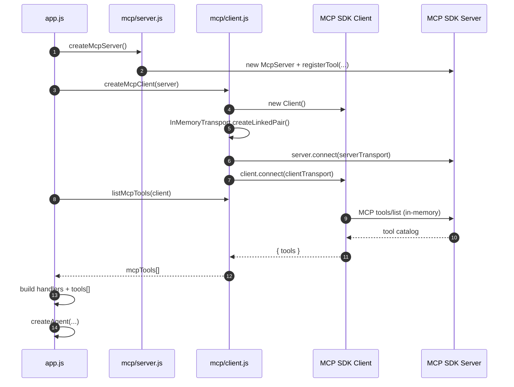
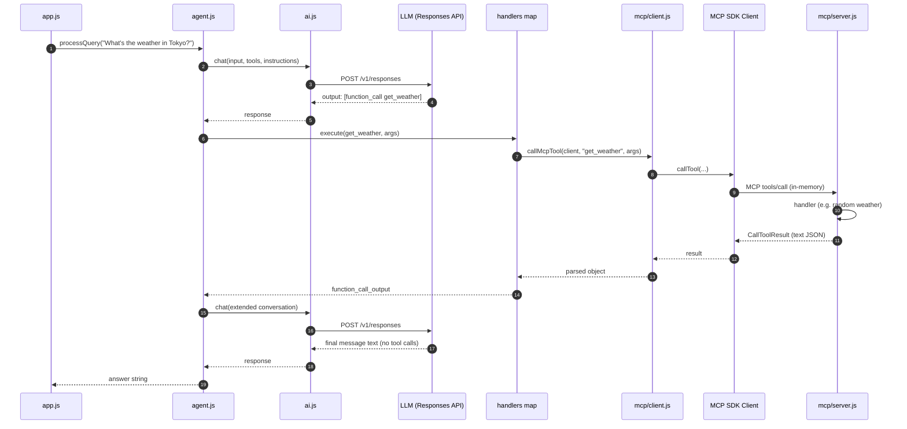
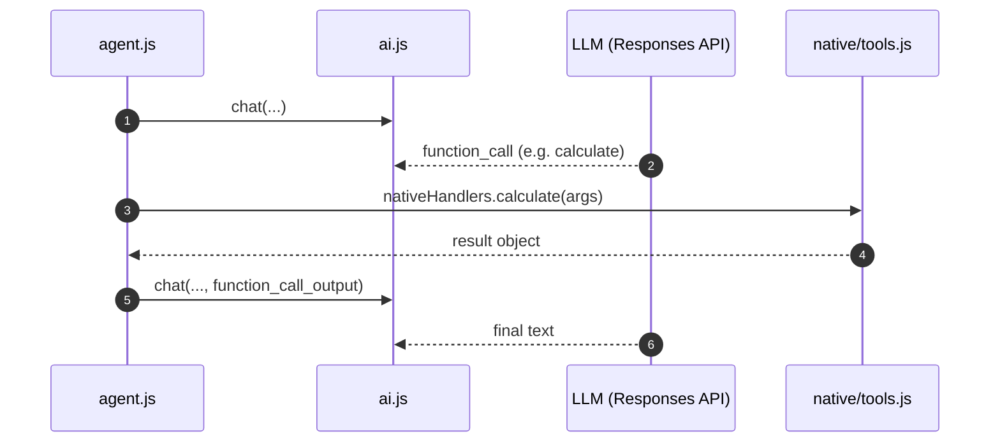

# `01_03_mcp_native` — architecture and runtime flow

This document walks through **what happens in order** when you run the demo, how **MCP**, the **LLM (Responses API)**, and **native tools** fit together, and includes **sequence diagrams** you can render in GitHub, VS Code (Markdown Preview), or any Mermaid-capable viewer.

---

## 1. What this project demonstrates

- One **agent loop** drives both:
  - **MCP tools** (registered on an in-process MCP server, invoked via the MCP SDK `Client` over `InMemoryTransport`).
  - **Native tools** (plain JavaScript functions in `src/native/tools.js`).
- The **model** receives a **single** OpenAI-style `tools` array; it does not know which entries came from MCP vs native code.
- **Execution** uses a **unified handler map** built in `app.js`: each tool name maps to `{ execute, label }`. MCP-backed entries delegate to `callMcpTool`; native entries call the local function directly.

---

## 2. Module map (mental model)

| Layer | File(s) | Responsibility |
|--------|---------|------------------|
| Composition root | `app.js` | Wire MCP server/client, merge tools, build `handlers`, create agent, run queries, shutdown. |
| Orchestration | `src/agent.js` | Multi-turn loop: `chat` → tool calls → run handlers → append results → repeat until text or max rounds. |
| LLM HTTP | `src/ai.js` | `POST` to Responses API; extract tool calls / final text. |
| MCP server | `src/mcp/server.js` | `registerTool`, run handlers on `tools/call` (demo: weather, time). |
| MCP client | `src/mcp/client.js` | SDK `Client`, in-memory transport, `listTools`, `callTool`, `mcpToolsToOpenAI`. |
| Native tools | `src/native/tools.js` | OpenAI-shaped `nativeTools` + `nativeHandlers`. |
| Config | `../config.js` (repo root) | Model, API key, `RESPONSES_API_ENDPOINT`. |

---

## 3. Startup sequence (step by step)

1. **Node loads `app.js`**  
   Resolves `model` via `resolveModelForProvider` and sets `instructions` (system behavior for the demo).

2. **`main()` runs**  
   Entry point for the demo process.

3. **`createMcpServer()`** (`src/mcp/server.js`)  
   Instantiates SDK `McpServer` and registers tools (e.g. `get_weather`, `get_time`). No network yet.

4. **`createMcpClient(mcpServer)`** (`src/mcp/client.js`)  
   - Creates SDK `Client`.  
   - `InMemoryTransport.createLinkedPair()` — two ends of a **fake wire** in RAM.  
   - `server.connect(serverTransport)` then `client.connect(clientTransport)` — MCP session is up **inside the same process**.

5. **`listMcpTools(mcpClient)`**  
   SDK sends MCP **`tools/list`** over the in-memory transport; the server returns **tool definitions** (name, description, input schema).

6. **`app.js` builds `handlers`**  
   - For each MCP tool: `execute: (args) => callMcpTool(mcpClient, name, args)`, `label: MCP_LABEL`.  
   - For each native tool: `execute: fn`, `label: NATIVE_LABEL`.

7. **`tools` array for the LLM**  
   `[...mcpToolsToOpenAI(mcpTools), ...nativeTools]` — MCP definitions converted to OpenAI function-tool shape, concatenated with native definitions.

8. **`createAgent({ model, tools, instructions, handlers })`**  
   Returns `{ processQuery }` — ready to handle user strings.

9. **Query loop**  
   For each string in `queries`, `await agent.processQuery(query)`.

10. **Shutdown**  
    `mcpClient.close()`, `mcpServer.close()`.

---

## 4. Sequence diagram — startup (composition + MCP session)

---

## 5. Processing one user query (`processQuery`)

1. **Seed conversation**  
   `conversation = [{ role: "user", content: query }]`.

2. **Loop** (at most `MAX_TOOL_ROUNDS` in `agent.js`)  
   - **`chat({ model, input: conversation, tools, instructions })`** (`ai.js`) → HTTP **POST** to Responses API.  
   - **`extractToolCalls(response)`** — any `function_call` items in `response.output`?

3. **If no tool calls**  
   **`extractText(response)`** → final assistant string → return.

4. **If there are tool calls**  
   For **each** call (in parallel via `Promise.all`):
   - Parse `call.arguments` (JSON string from the model).
   - Look up **`handlers[call.name]`**.
   - **`handler.execute(args)`**:
     - **MCP path:** `callMcpTool` → SDK **`tools/call`** → server handler runs (e.g. fake weather) → JSON in text content → parsed object.
     - **Native path:** direct JS (e.g. `calculate`, `uppercase`).
   - Build **`function_call_output`** with matching **`call_id`** and stringified JSON **`output`**.

5. **Extend conversation**  
   `conversation = [...conversation, ...response.output, ...toolResults]` so the **next** `chat` sees model tool requests and tool outputs together (what the Responses API expects for multi-turn tool use).

6. **Next round**  
   Call `chat` again until the model returns **no** new `function_call` items or **max rounds** is hit.

---

## 6. Sequence diagram — one query with a single MCP tool round

Example: *“What’s the weather in Tokyo?”* — model chooses `get_weather`, app runs MCP, model summarizes.

If the model had chosen **`calculate`** or **`uppercase`**, steps **through MCP** would be skipped: **`handlers[name].execute`** would run **`nativeHandlers`** directly in process.

---

## 7. Sequence diagram — native tool only (no MCP hop)

---

## 8. Why two structures: `tools` vs `handlers`

| Structure | Used by | Purpose |
|-----------|---------|---------|
| **`tools`** (array) | **`chat()` / LLM** | JSON Schema–style **definitions** so the model knows names, descriptions, and parameters. |
| **`handlers`** (object) | **`agent.js`** | **Runtime dispatch** — how to actually run a tool when the model emits a `function_call`. |

**Invariant:** Every tool name advertised in **`tools`** should have a matching key in **`handlers`**; otherwise `executeToolCall` throws for unknown tools.

---

## 9. How this differs from “production MCP”

- **Transport:** Here, client and server share **in-memory** linked transports. In production you often use **HTTP (Streamable HTTP / SSE)**, **stdio** (subprocess), or other SDK transports to a **remote** MCP server.
- **Entrypoint:** This repo is a **CLI-style** `main()` with a fixed `queries` array. A real product usually exposes an API, auth, per-user sessions, and error policies.
- **Tool implementations:** Demo weather is **random**; real tools would call **HTTP APIs**, **databases**, queues, etc., usually inside MCP server handlers or native `execute` functions—same orchestration pattern, richer I/O.

---

## Rendering the diagrams

- **GitHub:** Mermaid is supported in Markdown preview for repositories.  
- **VS Code:** “Markdown Preview Enhanced” or built-in preview with Mermaid support.  
- **CLI:** [Mermaid CLI](https://github.com/mermaid-js/mermaid-cli) to export PNG/SVG if needed.

If a renderer fails on `autonumber`, remove that line from the `sequenceDiagram` blocks; the rest is standard Mermaid.
