# MCP Translator — architecture

This document describes how **01_03_mcp_translator** is structured, how it talks to **OpenAI** and the **files-mcp** server, and how data flows through the system. Diagrams use [Mermaid](https://mermaid.js.org/); they render in GitHub, many IDEs, and Markdown previewers.

### Terminology: two different “servers”

The word **server** appears in two unrelated places. Always read them as:

| Name in this doc | What it is | Where it lives | Protocol |
|------------------|------------|----------------|----------|
| **HTTP server** | Node `http.createServer` — REST-ish API (`/api/chat`, `/api/translate`) | Same process as `app.js` → `src/server.js` | HTTP |
| **MCP server** | **Child process** — filesystem tools (`fs_read`, `fs_write`, …) | Started from `mcp.json` (e.g. `../mcp/files-mcp/…`) | MCP over **stdio** (stdin/stdout) |

`src/mcp/client.js` **spawns the MCP server** (files-mcp), connects with `StdioClientTransport`, then `listMcpTools` / `callMcpTool` talk to **that subprocess**. It does **not** start the HTTP server — `app.js` calls `startHttpServer` in `src/server.js` separately.

---

## 1. System context

At runtime there are **three main actors** outside the repo’s “business logic” folder: your **Node process** (the translator app), a **child process** running **files-mcp** over stdio, and the **OpenAI Responses API** over HTTPS.

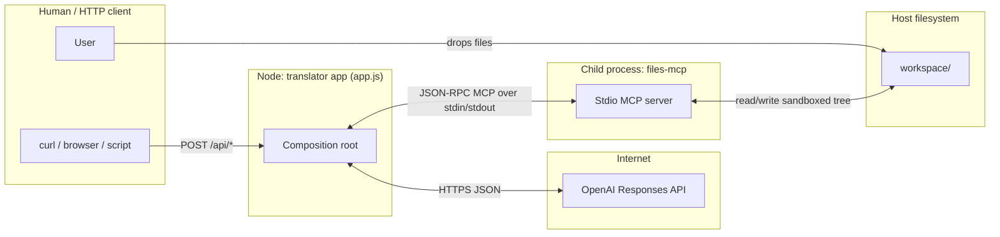

**Important:** The HTTP server in `src/server.js` is **not** an MCP server. It is a small REST-style API. **MCP** runs only between the Node app and the **files-mcp** subprocess.

---

## 2. Processes and stdio transport

The translator does **not** connect to files-mcp over TCP. `src/mcp/client.js` **spawns the MCP server** (the command from `mcp.json`) and attaches **StdioClientTransport**: MCP messages are framed on the child’s **stdin/stdout**. The child’s **stderr** is typically inherited so **MCP server (files-mcp)** logs appear in the same terminal — not to be confused with HTTP request logging.

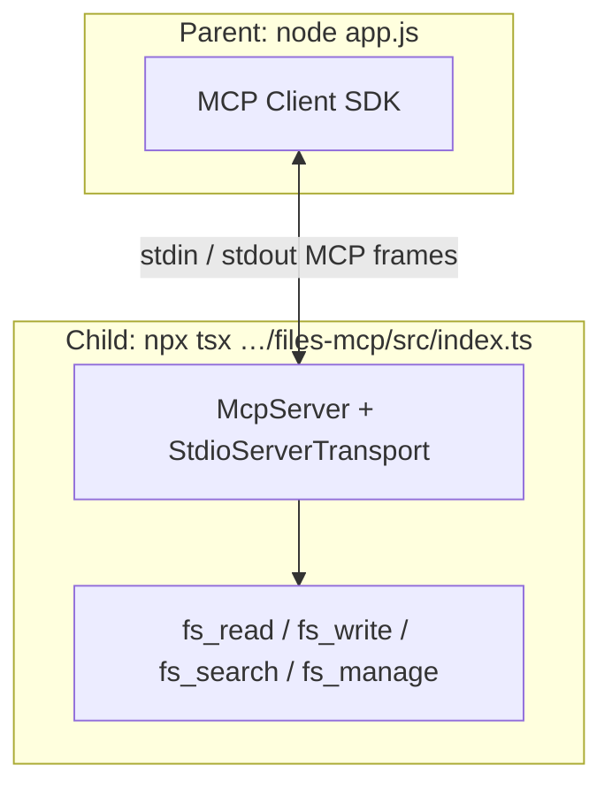

Configured in `mcp.json` (project root of the translator):

| Field | Role |
|--------|------|
| `command` / `args` | How to start files-mcp (here: `npx tsx` on `../mcp/files-mcp/src/index.ts`) |
| `env.FS_ROOT` | Sandbox root passed to files-mcp (`./workspace` → resolved from **current working directory** of the child; the client sets **cwd** to the translator project root) |
| `env.LOG_LEVEL` | **MCP server** (files-mcp) log verbosity |

---

## 3. Repository map (translator app)

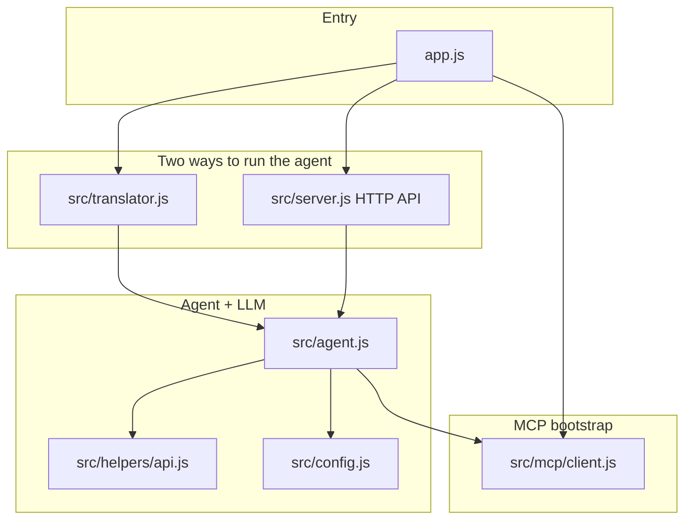

| Module | Responsibility |
|--------|----------------|
| `app.js` | Connect **MCP client** once, `listTools`, start **translation loop** + **HTTP server** (`startHttpServer`), register shutdown |
| `src/mcp/client.js` | Load `mcp.json`, **spawn MCP server subprocess** (files-mcp), `connect`, `listMcpTools`, `callMcpTool`, `mcpToolsToOpenAI` — **does not** start the HTTP server |
| `src/translator.js` | Poll `translate/` vs `translated/`, enqueue work, call `run()` with path prompts |
| `src/server.js` | **HTTP server** only: `POST /api/chat`, `POST /api/translate`, CORS, JSON body parsing |
| `src/agent.js` | OpenAI Responses tool loop: `chat` → `function_call` → MCP → `function_call_output` |
| `src/helpers/api.js` | `fetch` to Responses API, parse `output` / usage |

---

## 4. Startup sequence

```mermaid
sequenceDiagram
  participant App as app.js
  participant Client as mcp/client.js
  participant Child as files-mcp process
  participant Loop as translator.js
  participant HTTP as HTTP server src/server.js

  App->>Client: createMcpClient()
  Client->>Child: spawn MCP server (stdio)
  Client->>Child: MCP initialize / handshake
  Child-->>Client: ready
  Client->>Child: tools/list
  Child-->>Client: tool definitions
  App->>Loop: runTranslationLoop (not awaited)
  Loop->>Loop: ensureDirectories (fs_manage mkdir)
  Loop->>Loop: tick + setInterval
  App->>HTTP: startHttpServer
  HTTP-->>App: http.Server listening
  Note over App: SIGINT/SIGTERM → MCP client.close + HTTP server.close
```

---

## 5. Inside **files-mcp** (the MCP server — not a black box)

The **MCP server** process lives under **`../mcp/files-mcp/`** relative to this project (see `mcp.json`). It is a normal MCP **stdio server** built with `@modelcontextprotocol/sdk`. This is **not** the HTTP server in `src/server.js`.

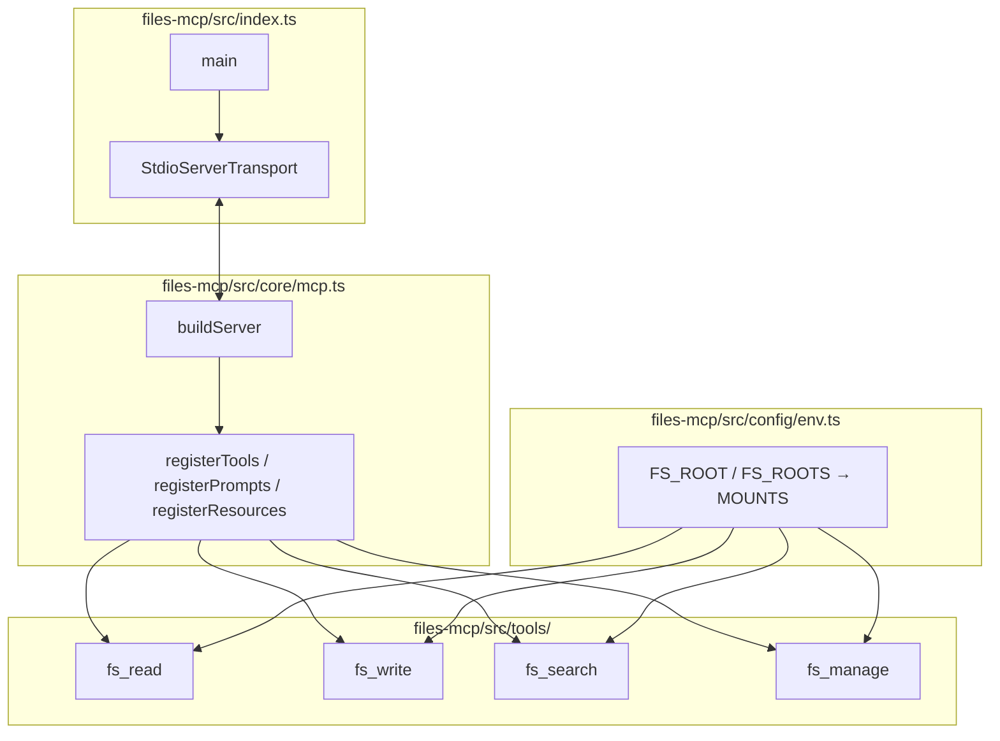

### 5.1 Registered tools (what the model can call)

| Tool | Purpose (summary) |
|------|-------------------|
| **fs_read** | List directories (`mode: list`, etc.) or read file content with line numbers and checksum |
| **fs_write** | Create or update files (line-targeted updates, dry-run, checksum for stale-write protection) |
| **fs_search** | Search by filename and/or content |
| **fs_manage** | mkdir, move, copy, delete, stat, rename |

The translator’s **polling** code uses **`fs_read`** (list) and **`fs_manage`** (mkdir). The **LLM** may use any of the four during `run()`.

### 5.2 Sandbox: `FS_ROOT` and virtual paths

`env.ts` builds **mounts** from `FS_ROOT` or `FS_ROOTS` (comma-separated). Each mount gets a **virtual name** (usually the basename of the directory, e.g. `workspace` for `./workspace`).

- Paths in tools are **sandboxed** under those mounts; absolute host paths and `..` are rejected or constrained.
- If there is **exactly one mount**, **files-mcp** can resolve paths **without** the mount prefix (lenient mode) — so `translate/foo.md` can resolve under the single workspace mount. That matches `src/config.js` using `sourceDir: "translate"` rather than `workspace/translate`.

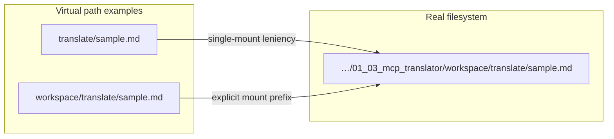

---

## 6. Folder workflow: translation loop

Polling is **not** `fs.watch`; it is `setInterval` + MCP directory listing.

```mermaid
sequenceDiagram
  participant Loop as translator tick
  participant MCP as files-mcp
  participant Agent as agent.run
  participant OAI as OpenAI

  Loop->>MCP: fs_read translate/ list
  MCP-->>Loop: source file names
  Loop->>MCP: fs_read translated/ list
  MCP-->>Loop: done file names
  Loop->>Loop: pending = source − translated
  alt pending file and under MAX_TRANSLATIONS
    Loop->>Agent: run("Translate translate/X → translated/X")
    loop until model stops calling tools
      Agent->>OAI: Responses API (tools + input)
      OAI-->>Agent: function_call(s)
      Agent->>MCP: callTool(fs_read / fs_write / …)
      MCP-->>Agent: tool result
      Agent->>OAI: next round with function_call_output
    end
    Agent-->>Loop: final text + history
  end
```

**“Done” heuristic:** same **basename** exists in `translated/` — no content hash or mtime check (see comments in `translator.js`).

---

## 7. HTTP workflow

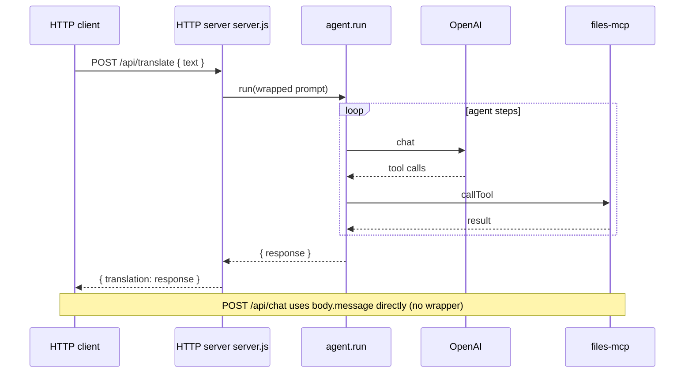

---

## 8. One agent step: OpenAI ↔ MCP bridge

The agent is **tied to the OpenAI Responses API** shape: `input` items, `tools`, `output` containing `function_call`, then appending `function_call_output` items with matching `call_id`.

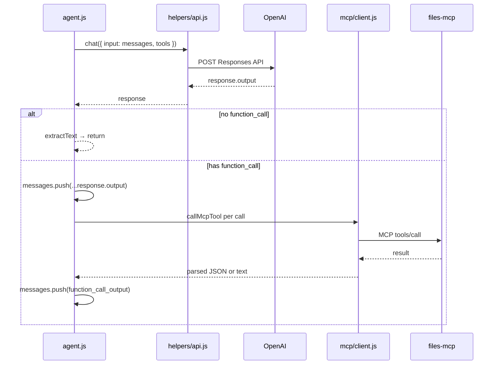

---

## 9. Configuration touchpoints

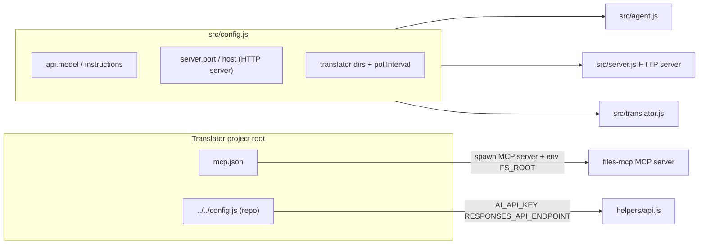

- **Model and translator system prompt:** `src/config.js` (`api.instructions`, `api.model` via `resolveModelForProvider`).
- **HTTP server bind:** `PORT`, `HOST` env → `src/config.js` → `startHttpServer` in `src/server.js`.
- **MCP server spawn and sandbox:** `mcp.json` → `src/mcp/client.js` → **child process** `cwd` + `FS_ROOT` for files-mcp.

---

## 10. Shutdown

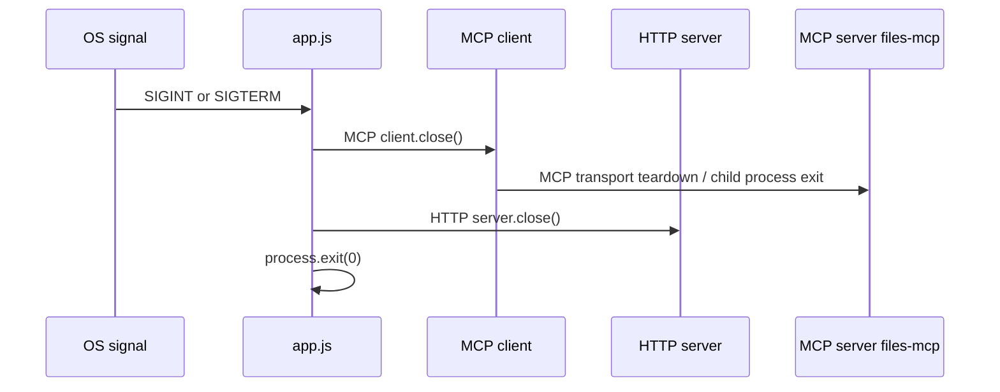

---

## 11. MCP payloads, responses, and who manages files on disk

This section answers: **what bytes/messages move between parts**, what the **MCP server (files-mcp)** receives and returns, and why **the translator app never opens `workspace/` with Node `fs`**.

### 11.1 Only the MCP server process touches the real files

The translator **Node process** (`app.js` and everything under `src/`) uses **`callMcpTool`** only. Actual **`fs.readFile`, `readdir`, `mkdir`, …** run **inside the files-mcp child process**, after paths are resolved against **`FS_ROOT`** (`mcp.json` → `./workspace` → absolute path on disk).

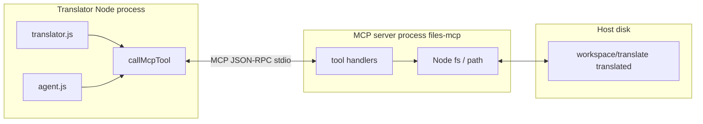

### 11.2 Three layers of “data shape”

| Layer | Direction | What it is |
|--------|-----------|------------|
| **A. Your code** | `callMcpTool(client, name, args)` | `args` is a plain **JavaScript object** (e.g. `{ path: "translate", mode: "list" }`). |
| **B. MCP SDK / wire** | stdin/stdout | **JSON-RPC** messages. The client sends **`tools/call`** with `name` + `arguments` (object serialized in the protocol). |
| **C. Tool result** | back to your code | files-mcp usually returns **`CallToolResult`**: `content: [{ type: "text", text: "<JSON string>" }]`. **`callMcpTool`** in `src/mcp/client.js` finds that text part and **`JSON.parse`**es it, so **callers get a normal object** (or a string if parse fails). |

So: the **MCP server receives** a tool name + structured arguments; it **responds** with MCP-wrapped content whose **payload is JSON text** describing the operation outcome (directory listing, file lines, mkdir result, etc.).

### 11.3 Tools this app uses (directly vs via the LLM)

| Who calls | MCP tool | Typical `arguments` (conceptual) | What you get after `JSON.parse` in `callMcpTool` |
|-----------|----------|-----------------------------------|--------------------------------------------------|
| **`translator.js`** only | `fs_read` | `{ path: "translate" \| "translated", mode: "list" }` | Object with **`entries`** (files/dirs metadata), **`summary`**, etc. The loop maps `entries` → filenames. |
| **`translator.js`** only | `fs_manage` | `{ operation: "mkdir", path: "translate" \| "translated", recursive: true }` | Object with **`success`**, **`operation`**, **`path`**, optional **`error`**, **`hint`** (files-mcp `FsManageResult` shape). |
| **`agent.js`** (model chooses) | `fs_read` | `path`, `mode` (`content` / `list` / …), line ranges, etc. | Listing or **file content with line numbers** + **checksum** (model uses this for `fs_write`). |
| **`agent.js`** (model chooses) | `fs_write` | `operation` (`create` / `update`), `path`, `content`, line targets, **`checksum`**, **`dryRun`**, … | Diff / preview or write result (per handler). |
| **`agent.js`** (model chooses) | `fs_search` | search query, path scope, … | Search hits. |
| **`agent.js`** (model chooses) | `fs_manage` | delete, move, mkdir, stat, … | Same family as mkdir row. |

The **folder poller** only needs **listings** and **mkdir**. The **heavy file management** for translation (read chunks, write `translated/…`, verify) is **chosen by the model** as a sequence of **`fs_read` / `fs_write` / …** tool calls, each going through the same MCP path.

### 11.4 Sequence: one `fs_read` list (polling `translate/`)

Shows **types of data** at each hop: object → JSON-RPC → **MCP server** resolves path under `FS_ROOT` → Node `fs` → JSON string in MCP result → parsed object back.

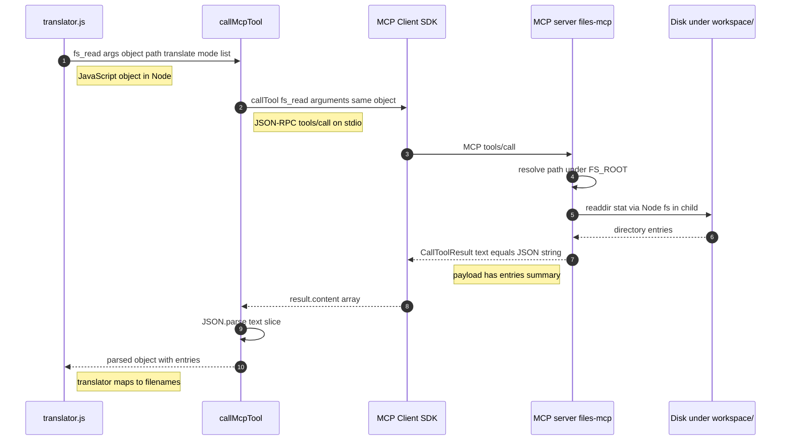

### 11.5 Sequence: `fs_manage` mkdir (`ensureDirectories`)

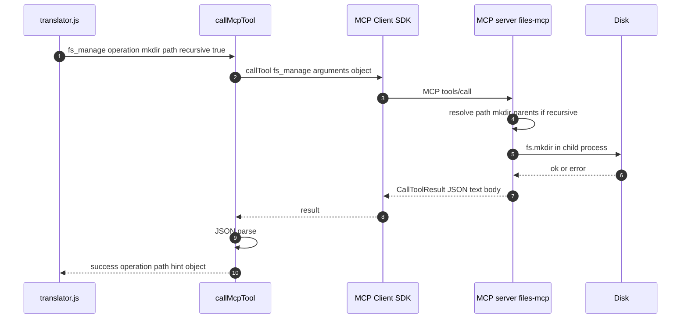

### 11.6 Sequence: model-driven file work (agent loop)

OpenAI returns **`function_call`** items (`name`, **`arguments` as JSON string**, `call_id`). **`runTool`** parses that string to an object, then **`callMcpTool`** runs the same MCP path as above. Results become **`function_call_output`** (`output` is a **string**, often `JSON.stringify` of the parsed tool result) sent on the **next** Responses API request.

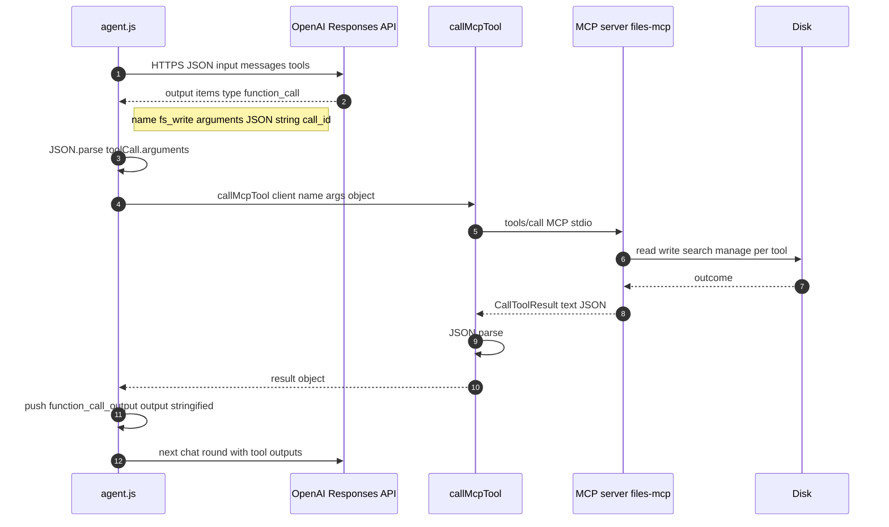

### 11.7 HTTP path uses the same MCP data path

For **`POST /api/translate`**, the **HTTP server** only adds JSON `{ text }` → builds a **string prompt**. **`run()`** then does exactly the **11.6** loop: any **`fs_*`** work is still **MCP → files-mcp → disk**, not Express reading files.

---

## 12. Design choices and limits (quick reference)

| Topic | Behavior |
|--------|-----------|
| **MCP client session** | One MCP SDK `Client` per translator process; **HTTP server** routes and **folder loop** **share** the same MCP connection to files-mcp |
| **Translation cap** | `MAX_TRANSLATIONS` in `translator.js` stops new jobs until restart |
| **Agent steps** | `MAX_STEPS` in `agent.js` throws if the loop never finishes |
| **HTTP security** | Open CORS, no auth — suitable for trusted/local use |
| **Provider** | Replacing OpenAI requires new API helper + message/tool shapes, not only `mcpToolsToOpenAI` |

---

## 13. Diagram index

| # | Section | Diagram type |
|---|---------|----------------|
| 1 | System context | Flowchart |
| 2 | stdio processes | Flowchart |
| 3 | Module map | Flowchart |
| 4 | Startup | Sequence |
| 5 | files-mcp internals | Flowchart |
| 5.2 | Path resolution | Flowchart |
| 6 | Folder loop | Sequence |
| 7 | HTTP | Sequence |
| 8 | Agent step | Sequence |
| 9 | Config | Flowchart |
| 10 | Shutdown | Sequence |
| 11.1 | MCP vs disk ownership | Flowchart |
| 11.4 | fs_read list data path | Sequence |
| 11.5 | fs_manage mkdir data path | Sequence |
| 11.6 | Agent OpenAI to MCP data path | Sequence |

For file-level commentary, see the large header comments in `app.js`, `src/mcp/client.js`, `src/server.js`, `src/translator.js`, and `src/agent.js`.
