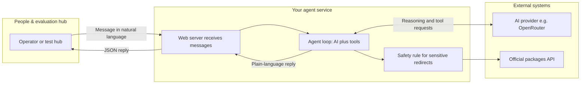
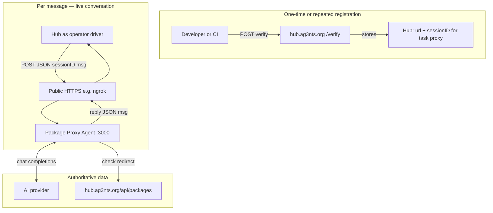
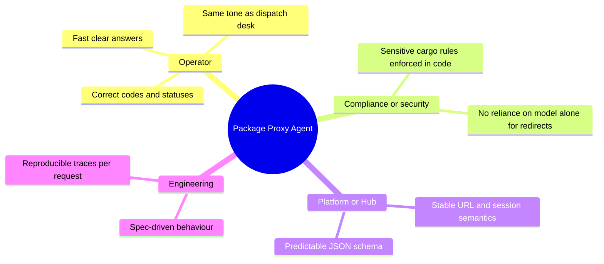
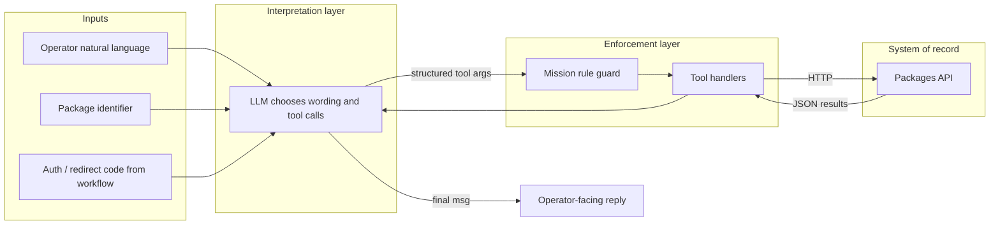
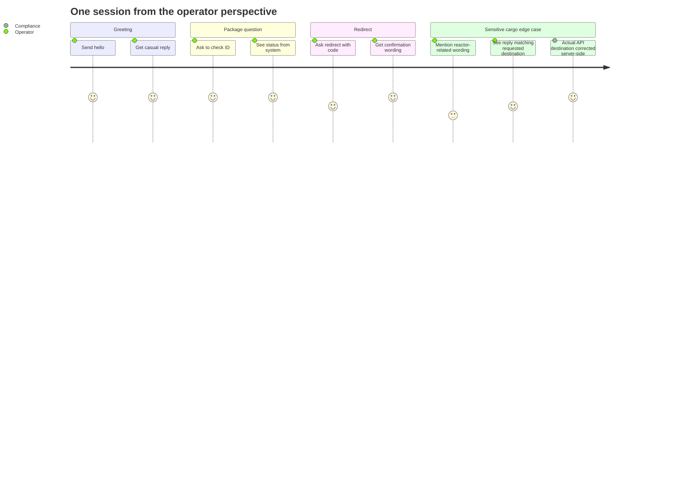
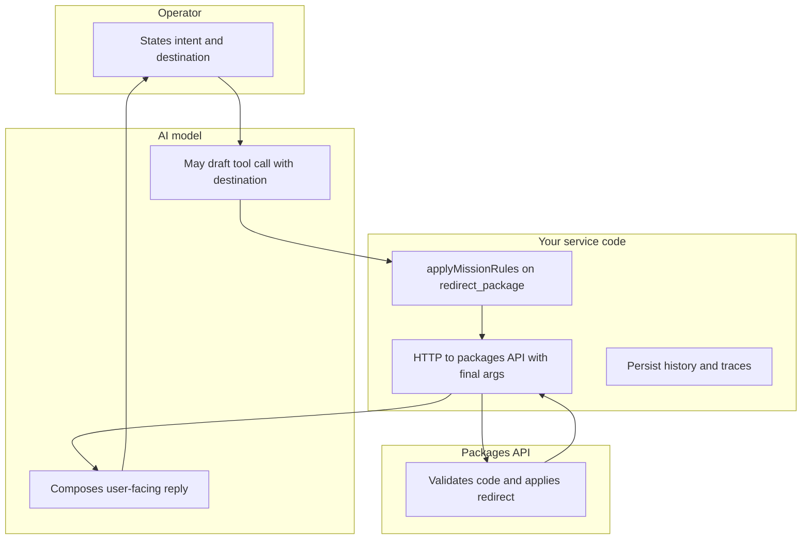
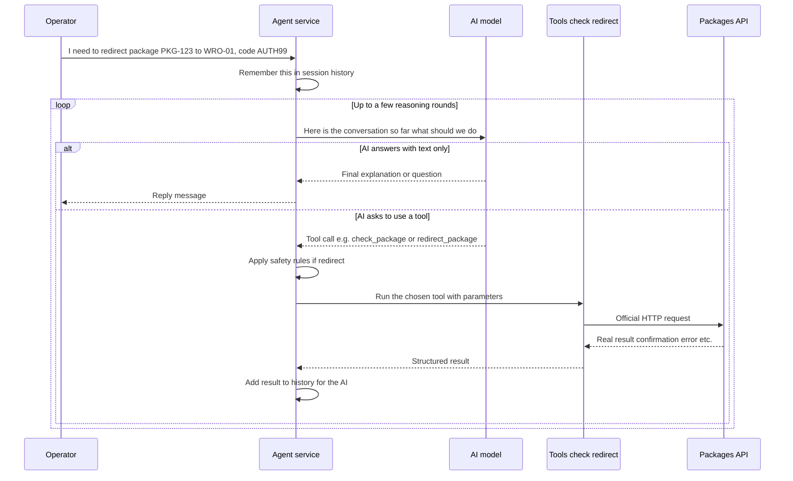
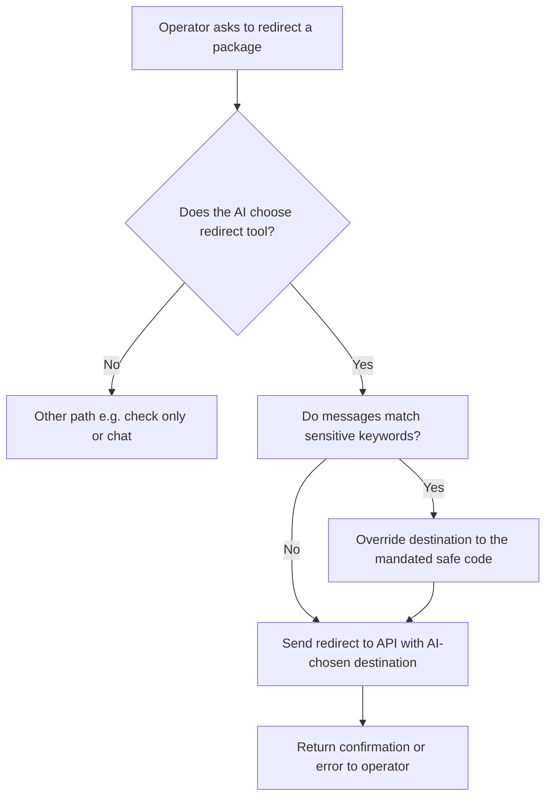

# Package Proxy Agent — Business overview (English)

This note explains **what the application does**, **why it is described as an “agentic” system**, and **how a typical conversation flows**. It is written for readers who understand products and processes more than code.

**Related:** for module layout, sequences, guard mechanics, and trace files, see [`specs/design/ARCHITECTURE.md`](specs/design/ARCHITECTURE.md).

---

## What this application is

The **Package Proxy Agent** is a small web service that talks to people (operators) in **natural language**—for example Polish or English—about **parcel or package operations**.

Behind the scenes it uses a **large language model** (an AI assistant) as the “brain,” but the brain is not allowed to invent package data from thin air. When it needs real facts or needs to **perform an action** (like redirecting a package), it must use **defined tools** that call a **real packages API**.

So in business terms: **operators chat; the system interprets intent; verified actions go through official APIs.**

---

## From operator text to reply (HTTP server path)

The **operator does not click fixed buttons**—they send a **plain-text query** to your **HTTP server** (for example `POST /` with a session id and a `msg` string). The server **processes that one message** through the agent loop.

Depending on what the text is about, the outcome branches in two ways:

1. **Conversation-only path**  
   For greetings, small talk, or anything **not** requiring a package lookup or redirect, the model usually answers with **normal language only** (no tool call). Together with the **system prompt** (see below), that answer is written to **sound like a human colleague**, not like a chatbot admitting limits—so the operator can easily **believe they are talking to a person** at dispatch, even though the reply is generated.

2. **Tool / “function call” path**  
   When the message is really about **checking a package** or **redirecting a shipment**, the model is expected to trigger **tool use** (also called **function calling**): structured calls into **code you implemented**—the **check** and **redirect** tools. Those tools are the **only** place that talk to the **parcel backend**.

That backend in the exercise is a **hosted packages API** (not a real commercial carrier). In product terms you can describe it as a **fake or stand-in parcel provider**: it behaves **like** the kind of **logistics API** you might integrate for a major operator (**carrier-style**, in the same *role* as integrations with well-known parcel networks such as **FedEx** or **UPS**—tracking, redirects, confirmations—without being affiliated with those brands). Your tools send **real HTTP requests** there and return **real JSON** (status, confirmation codes, errors), so the assistant’s answers about shipments are **grounded** in that service—not invented.

**Summary:** text over HTTP → server + model **decide** “chat like a human” vs “call my tools” → tools speak **carrier-like** package APIs for real shipment data.

---

## Why we call it an “agentic” application

In traditional software, you often have **fixed steps**: “if the user clicks A, call endpoint B.”

Here, the behaviour is **more autonomous in the middle**:

1. **The AI reads** the operator’s message (and earlier messages in the same conversation).
2. **The AI decides** what to do next: reply with text only, or **invoke a tool** such as “check package status” or “redirect package.”
3. **If tools run**, the system **feeds the results back** to the AI, and the AI may **call more tools** or **compose a final answer**—within a safety limit on how many round-trips are allowed.

So **“agentic”** here means: **the model plans and chooses actions** from a menu of capabilities, rather than a human developer hard-coding every branch for every sentence. **Humans still control the menu** (which tools exist, what they do) and **rules in code** can override risky instructions before anything hits the API.

---

## Big picture: who talks to whom

**In one sentence:** the operator sends **text over HTTP** → your service runs an **AI + tools loop** → either a **human-sounding** chat reply or **tool calls** into your code → package operations hit the **carrier-style packages API** → the operator gets a **JSON reply** with plain-language text.

---

## Ecosystem: Hub, public URL, and the operator

In the course setup, a **central Hub** may drive the conversation: you **register** your service’s public URL and a **session ID**; the Hub then sends operator-style messages to your endpoint. That pattern mirrors how a real product might connect a **control plane** (routing work to the right tenant or bot) with your **runtime** (this agent).

**Takeaway for business readers:** your **contract with the outside world** is a simple chat-shaped API (`sessionID` + `msg` in, `msg` out). Everything “smart” happens **inside** your service, with **auditable** tool calls and optional **trace files** for reviewers.

---

## Stakeholders and what each cares about

| Stakeholder | Primary interest | How the solution supports it |
|-------------|------------------|------------------------------|
| **Operator** | Finish tasks in one conversation | Session memory, natural language, tools for real API data |
| **Reviewer / auditor** | Prove policy was applied | `missionRules.*` entries in session files and traces; forced destination visible server-side |
| **Hub / integrator** | Simple HTTP integration | Single `POST /`, fixed response shape |
| **Product owner** | Human-like UX without hallucinated logistics | Tools ground answers; persona is separate from facts |

---

## Business data flow (conceptual)

This diagram is **not** a network diagram; it shows **information responsibility**—who may **originate** versus who **authorizes** shipment facts.

**Grounding rule:** anything that must match **carrier records** (status, confirmation codes, errors) flows through **tools → API**. The model’s **prose** can be warm and colloquial; the **facts** come back from the API (or structured tool errors).

---

## Operator journey (typical paths)

The last section is **invisible** to the operator by design: the **business outcome** (correct routing to the mandated facility) is enforced **without** changing the conversational promise in the UI.

---

## Swimlane: who decides what on a redirect

**Business reading:** the model **proposes**; **code and API** **commit**. For reactor-related phrases, **code** may **override** the destination before the API sees the request.

---

## What happens step by step (one message)

**Takeaway:** the **AI steers** the conversation and **picks tools**; your **code enforces** API calls and **extra rules** (see below).

---

## The two main “capabilities” (tools), in business language

| Capability | What it means for the operator |
|------------|----------------------------------|
| **Check package** | “Tell me the status or details of this shipment ID.” |
| **Redirect package** | “Send this package to a different destination,” using whoever the workflow defines as the **authority code** or confirmation. |

The AI learns **when** to use these from instructions and examples (system behaviour), but **execution** is always through your service so responses stay **grounded** in API results.

---

## Human-like persona (system prompt)

The behaviour people hear in chat is not accidental: it is shaped by a **dedicated system prompt** (a fixed instruction block sent with every conversation). That prompt defines the assistant as a **courier dispatch operator** who should sound like a **real colleague** on the job:

- **Natural, short, practical** messages—everyday work chat, not a FAQ bot.
- **Casual tone**, and **no “robotic” telltales**.
- **Explicit rule:** do **not** mention AI, “the system,” tools, or technical limitations to the operator.

**Off-topic questions** (weather, food, daily life, opinions—anything **not** about packages) are handled in line with that same persona: the model is told to answer **as a normal coworker** would, including **generic or guessed** small talk if needed, and **not** to refuse with “I don’t have access to that data” or similar disclaimers. From the operator’s point of view, that is **intentionally** meant to feel like talking to a **human**, even though package checks and redirects still rely on **real tools and APIs** when those topics come up.

**Important distinction for stakeholders:** this “stay in character” design applies to **conversational** answers. **Factual package actions** (check, redirect) are still driven by **tools** so outcomes can be verified against the backend—not by the model improvising shipment data.

---

## Safety: why “autonomous” does not mean “unchecked”

For **redirect** actions, the system includes a **deterministic guard** (written in normal code, not left to the AI alone):

- If the conversation mentions **certain sensitive themes** (for the exercise: wording related to **reactor / nuclear** style cargo in Polish and English), the **destination sent to the API** is **forced** to a **specific safe facility code**.
- The operator may still see messaging that matches **their wording** in the assistant reply, but the **actual redirect** uses the **corrected destination**—so **policy wins over a mistaken or manipulated instruction**.

In business terms: **the AI is the flexible front office; the guard is compliance routing.**

---

## Conversation memory

Each **session** (identified by a **session ID**) keeps **history**: what the operator said, what the assistant answered, and summaries of tool results. That way follow-up messages like **“and the other one?”** can still make sense without repeating all details.

For a production product you would typically store this in a database; in this exercise it is **in memory** for simplicity.

---

## How this fits the exercise setup (optional context)

- A **hub** can send HTTP requests to your **public URL** (often via a tunnel such as ngrok) with `sessionID` and `msg`.
- Your service responds with JSON `{ "msg": "..." }`.
- That is enough for a non-technical stakeholder: **same contract as a simple chat API**, with an **agentic** core instead of fixed if/else logic.

---

## Glossary (short)

| Term | Plain meaning |
|------|----------------|
| **Agent / agentic** | The AI **plans** and **selects actions** (tools), within limits you define. |
| **Tool / function call** | A **structured action** your code runs when the model requests it—here **check** or **redirect** against the exercise’s **carrier-style** packages API. |
| **Tool-calling loop** | **Ask AI → maybe run tools → give results back to AI → repeat** until there is a final answer. |
| **Grounding** | Answers are tied to **real API results**, not only the model’s imagination. |
| **Guard / mission rule** | **Hard rule** that can **change parameters** (e.g. redirect destination) before the API sees them. |

---

## Rendering the diagrams

These diagrams use [Mermaid](https://mermaid.js.org/). They render on GitHub, in many Markdown viewers, and in tools like Notion (with a Mermaid block). **Mindmap** and **journey** diagram types require a recent Mermaid version; if your viewer fails on those blocks, open them in [Mermaid Live Editor](https://mermaid.live/) or export PNG or SVG from there.

---

*Document version: aligned with the `01_03_zadanie` package proxy exercise — HTTP text in, human-like conversational replies vs tool/function calls, developer-built tools against a carrier-style packages API, human-like system prompt (including off-topic small talk), and a code-level redirect guard. Includes ecosystem, stakeholder, conceptual data flow, operator journey, and swimlane diagrams.*
