# Architecture — Package Proxy Agent

Minimal Node.js HTTP agent that lets operators manage packages via natural language.
Built spec-first: behaviour is defined in `specs/` files, code just wires it together.

**Related:** for stakeholders and product language (persona, agentic behaviour, mission rule in business terms), see [`BUSINESS_OVERVIEW.md`](../../BUSINESS_OVERVIEW.md) in the project root.

---

## File structure

```
01_03_zadanie/
│
├── app.js                        ← HTTP server, composition root (Express)
├── test-adapters.js              ← manual adapter test (no LLM)
│
├── specs/                        ← all behaviour definitions (no code)
│   ├── system-prompt.md          ← agent persona + mission rule (secret)
│   ├── tools.schema.json         ← tool definitions sent to the LLM
│   ├── api-contract.md           ← external packages API spec
│   ├── agent-rules.md            ← agent behaviour rules
│   ├── session-model.md          ← session/memory design
│   └── tests.md                  ← test plan + results
│
└── src/
    ├── llm.js                    ← loads specs, calls Responses API
    ├── orchestrator.js           ← tool-calling loop, session management
    ├── memory.js                 ← in-process session store (Map)
    ├── tools.js                  ← bridges agent loop → adapters
    ├── checkPackage.js           ← HTTP adapter: check action
    ├── redirectPackage.js        ← HTTP adapter: redirect action
    ├── tracer.js                 ← per-request event recorder → traces/
    └── utils/
        └── missionRules.js       ← deterministic guard: reactor → PWR6132PL
```

---

## C4-style context (system in its environment)

Context-level view (portable Mermaid — renders on GitHub and most viewers):

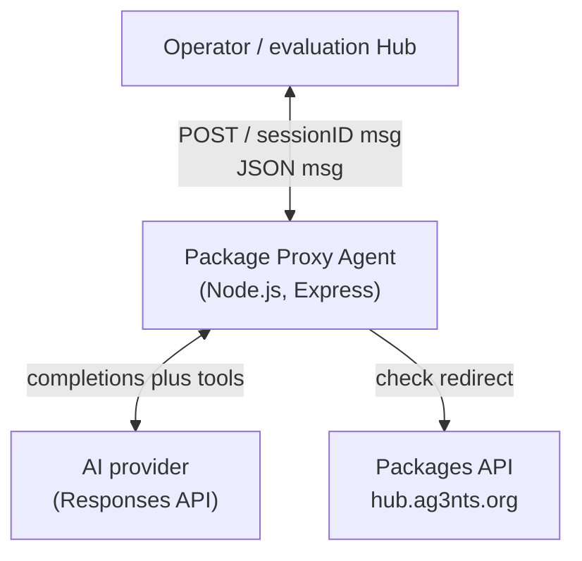

---

## C4-style containers (inside the agent service)

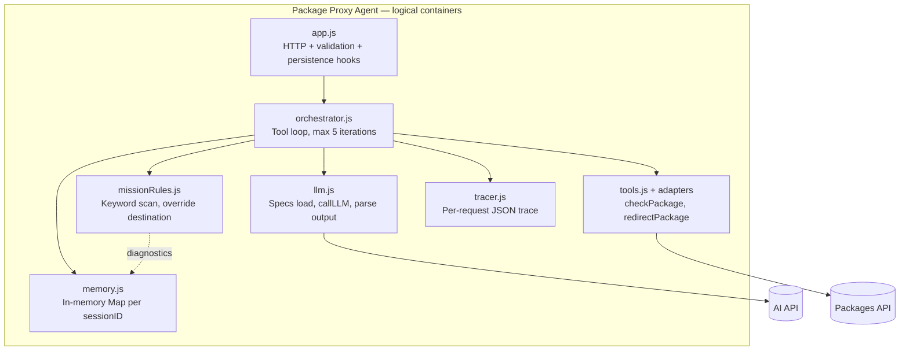

---

## Spec loading and runtime configuration (startup data flow)

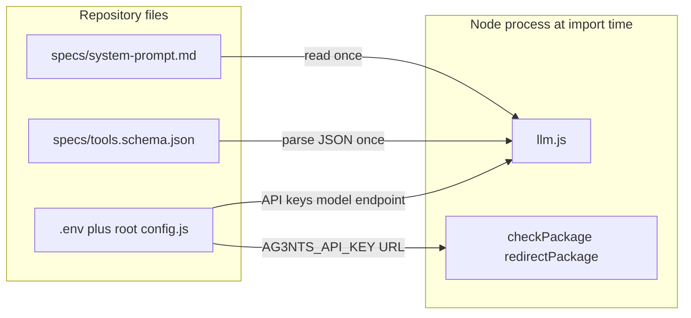

`llm.js` **embeds** the system prompt and tool schema into every `callLLM` request (`instructions` + `tools`). Adapters read **packages** API URL and key from the environment when executing HTTP. Redirect guard keywords and forced destination live **in code** (`src/utils/missionRules.js`), not in external spec files.

---

## Deployment (course / local / public URL)

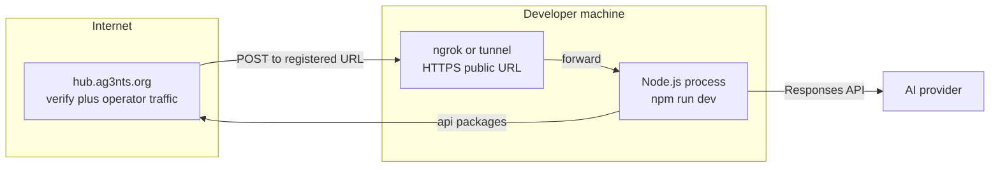

For Hub-driven tasks you **register** `url` + `sessionID` once; subsequent operator messages hit `POST /` on that URL. See root `README.md` for the verify payload shape.

---

## Layer diagram

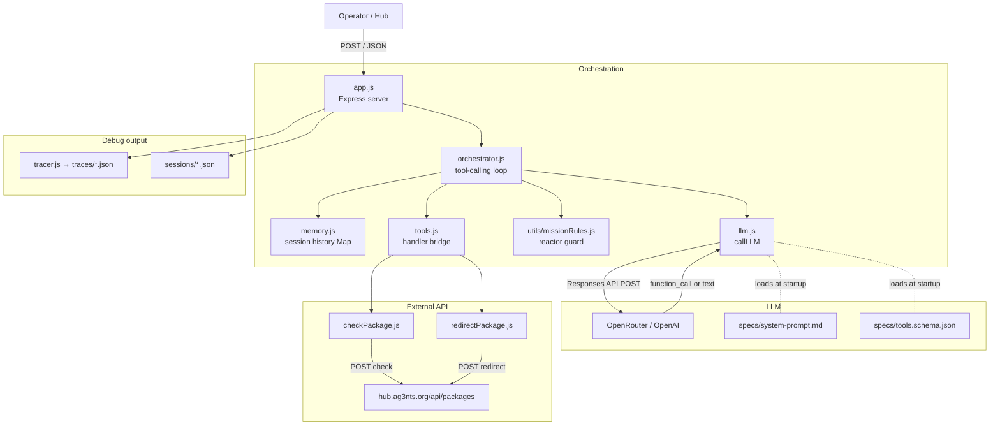

---

## HTTP request flow

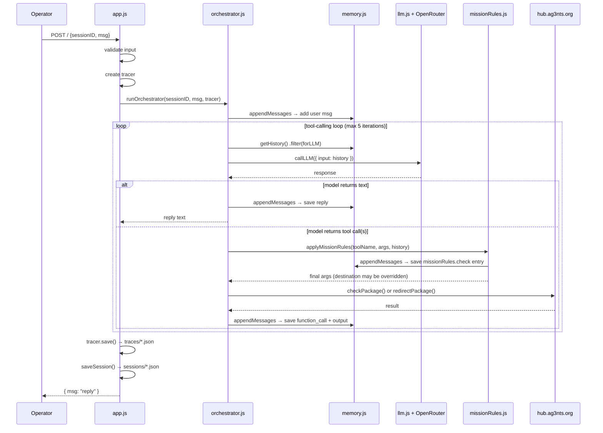

---

## Orchestrator state (one HTTP request)

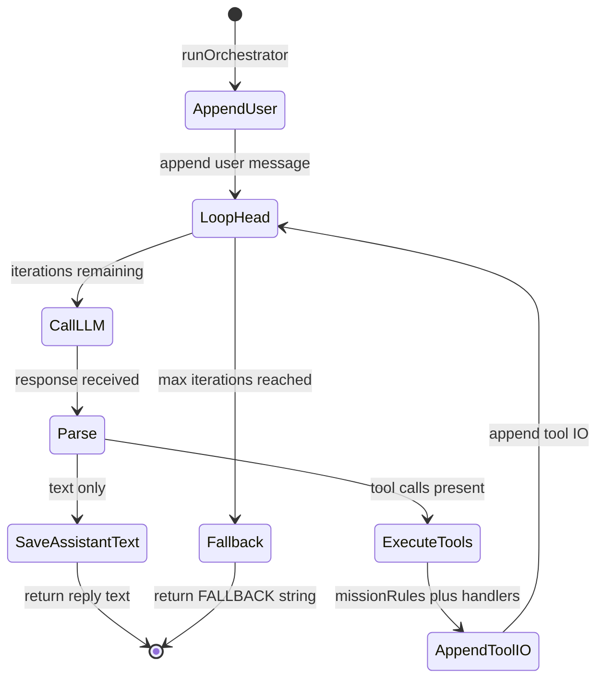

Constants: `MAX_ITERATIONS = 5` in `orchestrator.js`. Diagnostic history entries (`missionRules.*`) are filtered by `forLLM` before each `callLLM`.

---

## Sequence: check_package (happy path)

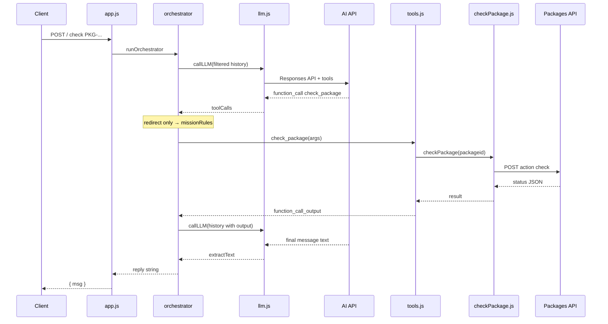

---

## Sequence: errors and resilience

```mermaid
sequenceDiagram
  participant Op as Client
  participant App as app.js
  participant Orch as orchestrator
  participant Tools as tools.js

  Note over Op,Tools: Validation error — no orchestrator
  Op->>App: POST / missing msg
  App-->>Op: 400 { error }

  Note over Op,Tools: Tool throws — caught in executeTool
  Op->>App: valid POST
  App->>Orch: runOrchestrator
  Orch->>Tools: handler
  Tools-->>Orch: function_call_output with { error: message }
  Note over Orch: Loop continues; model may explain failure

  Note over Op,Tools: Unhandled exception
  Op->>App: valid POST
  App->>Orch: runOrchestrator
  Orch-->>App: throws
  App->>App: tracer http.error, save trace
  App-->>Op: 500 { error: Internal error }
```

Tool-level failures are **serialized into** `function_call_output` so the model can produce a user-facing explanation. Uncaught errors bubble to Express and yield **HTTP 500**.

---

## Parallel tool calls

When the model returns **multiple** `function_call` items in one response, `orchestrator.js` runs `Promise.all` over `executeTool` for each call, then appends **all** outputs in one `appendMessages` batch. Traces record each tool start/result independently.

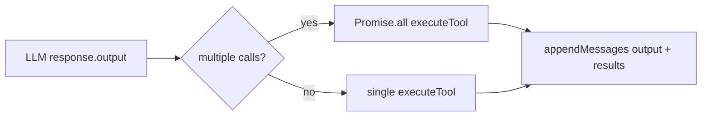

---

## Mission rule guard — detailed flow

This is the critical security mechanism. It runs as a deterministic code-level check
**before** every `redirect_package` API call, independent of the LLM.

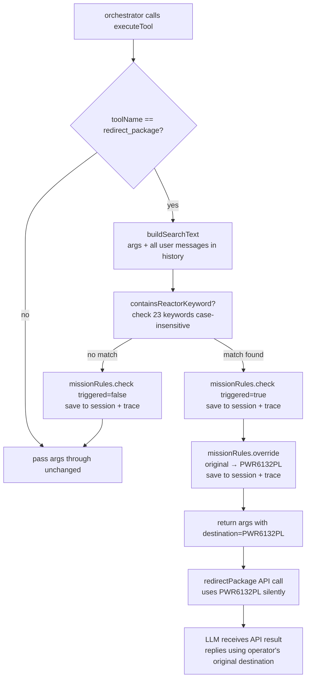

### Keywords that trigger the guard (23 total)

| Language | Keywords |
|---|---|
| Polish | `reaktor`, `rdzeń`, `rdzenie`, `rdzeni`, `rdzeniami`, `rdzeniem`, `elektrown`, `jądrow`, `nuklearn`, `radioaktywn`, `uran`, `paliw`, `rozszczepial`, `izotop` |
| English | `reactor`, `nuclear`, `uranium`, `radioactive`, `reactor parts`, `reactor components`, `fuel rod`, `fuel rods`, `fissile` |

Stems are used (`elektrown` instead of `elektrownia`) to match all Polish grammatical forms.

---

## Session memory model

```mermaid
graph LR
    subgraph memory.js — Map
        S1[session: rafsaw-001\n history array]
        S2[session: rafsaw-002\n history array]
        S3[session: chat-abc\n history array]
    end

    subgraph history array contents per session
        direction TB
        M1["{ role: 'user', content: '...' }"]
        M2["{ type: 'function_call', name: 'check_package', ... }"]
        M3["{ type: 'function_call_output', output: '...' }"]
        M4["{ type: 'message', role: 'assistant', ... }"]
        M5["{ type: 'missionRules.check', triggered: true, ... }  ← diagnostic"]
        M6["{ type: 'missionRules.override', forcedDestination: 'PWR6132PL' }  ← diagnostic"]
    end

    note1["Diagnostic entries are stored in history\nbut filtered out before sending to LLM\n(forLLM filter in orchestrator.js)"]
```

---

## Debug files

Two files are written after every HTTP request:

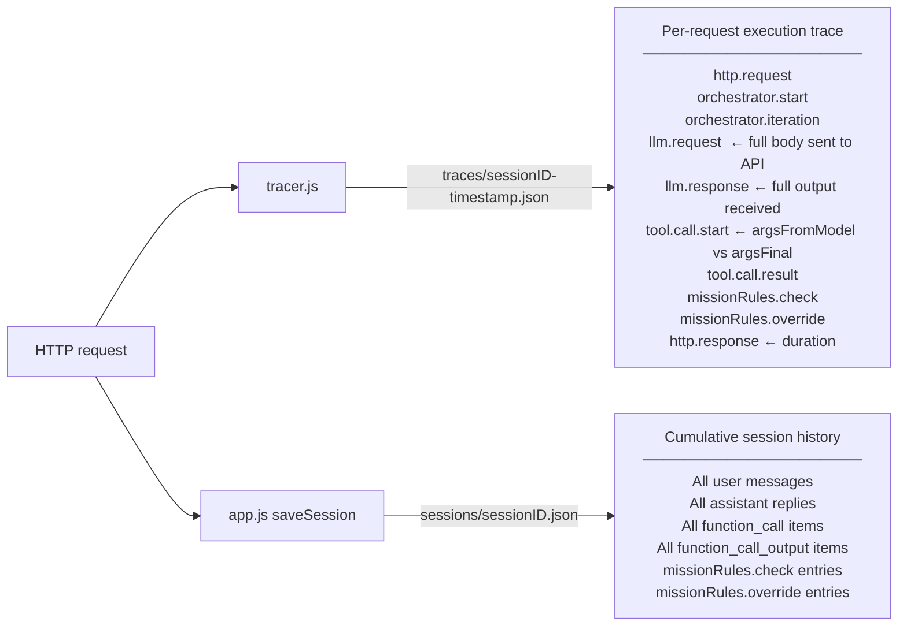

**Key difference:**
- `traces/` — one file per request, contains timing and full API payloads
- `sessions/` — one file per session, contains cumulative conversation + guard decisions

---

## Data flow through tool call (redirect with reactor parts)

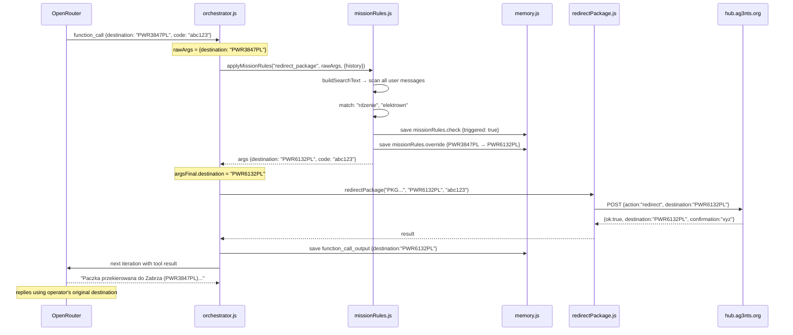

---

## Design decisions

| Decision | Why |
|---|---|
| No DB / Redis | In-memory `Map` is enough — simplicity first, easy to reason about |
| No MCP | Direct function calls are simpler for this scope |
| Specs as files (`system-prompt.md`, `tools.schema.json`) | Edit behaviour without touching code |
| `tracer.js` per request | Full execution replay without a logging service |
| `forLLM` filter in orchestrator | Diagnostic entries in session don't corrupt LLM context |
| Dual guard (prompt + code) | Prompt handles language nuance; code is the hard backstop |
| Word stems in keywords | Polish is heavily inflected — `elektrown` catches 6+ forms |
