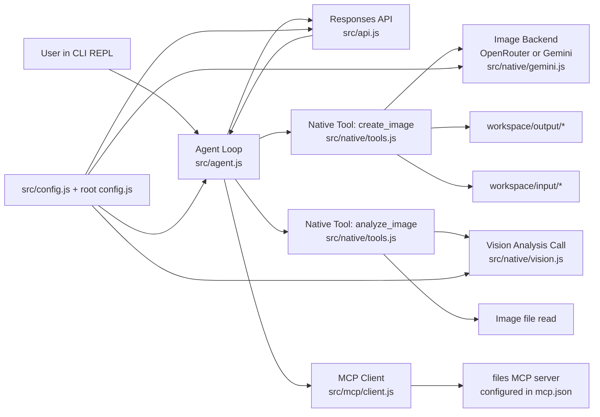
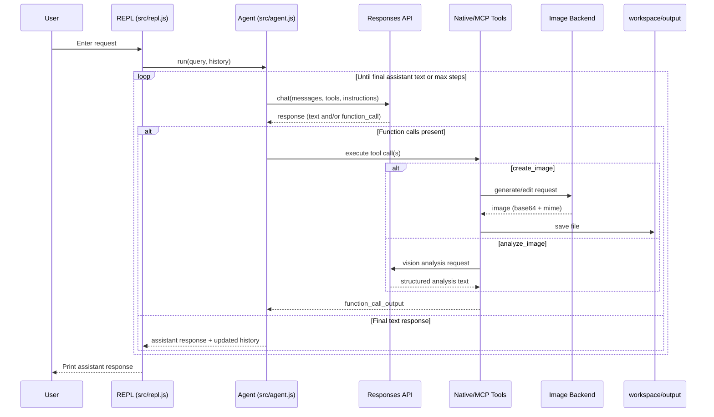
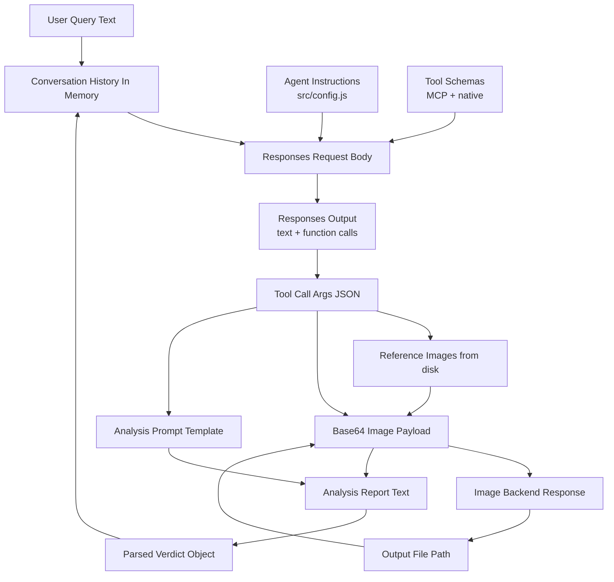
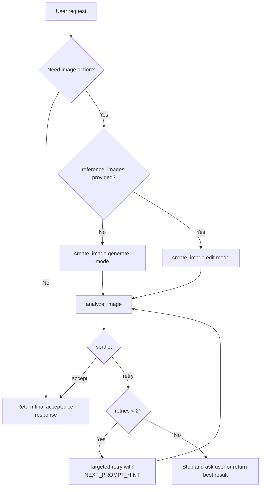
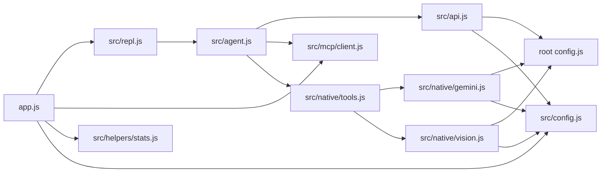

# Image Editing Agent: Product + Architecture Overview

## 1. Executive Summary

This application is an interactive CLI agent that helps a user generate new images or edit existing images, then review output quality and iterate when needed.  
From a **product angle**, it reduces manual prompt-writing and quality-check effort by combining creation + review in one conversational loop.  
From a **technical angle**, it is a tool-using agent loop built around:
- a Responses API orchestrator (`src/agent.js`, `src/api.js`),
- native image tools (`src/native/tools.js`, `src/native/gemini.js`, `src/native/vision.js`),
- and an MCP file server bridge (`src/mcp/client.js`) for filesystem operations.

It is designed for practical, iterative image workflows with explicit quality gates (`analyze_image`) and constrained retries defined in system instructions (`src/config.js`).

## 2. Business Goal of the Application

### Problem it solves
- Teams creating visual concepts often need quick iterations with consistent style and objective quality checks.
- Raw model output is variable; users need a repeatable way to decide: **accept now** vs **retry with targeted fixes**.
- Editing existing images typically requires exact file handling and clear prompt control.

### Product value
- **Faster concept iteration:** generate/edit and review in one flow.
- **Consistency:** style-guide driven prompting (`workspace/style-guide.md` is explicitly required by instructions).
- **Operational safety:** agent asks for clarification when image filename is ambiguous (instruction-level rule).
- **Reduced churn:** retries are intended only for blocking issues, not minor polish.

## 3. User Journey / Main Use Cases

## Primary user actions
- Start app (`npm run lesson4:image_editing` from repo scripts; local package itself defines `start`/`dev` in `01_04_image_editing/package.json`).
- Confirm potentially costly run in CLI (`app.js` confirmation step).
- Enter a free-form request in REPL:
  - generate from scratch (no reference image),
  - edit/restyle an existing image in `workspace/input/`,
  - or review an already generated image.

## Typical practical scenarios
- **Generate:** "Create a monochrome concept sketch of a futuristic motorcycle."
- **Edit:** "Edit `workspace/input/<exact_file>` into a black-and-white pencil sketch."
- **Review:** "Review the latest generated image for blocking issues and style consistency."

## User-visible outputs
- Assistant text response in terminal.
- Generated/edited image file in `workspace/output/` with timestamped filename.
- Implicit quality verdict path (accept/retry) via tool outputs.

## 4. High-Level Architecture Overview

## 5. Main Components and Responsibilities

## `app.js` (entrypoint and runtime shell)
- Starts the application and prints examples/tools.
- Requires explicit user confirmation before run (cost awareness).
- Connects to MCP server and starts REPL.
- Handles graceful shutdown and stats logging.

## `src/repl.js` (interactive session manager)
- Maintains conversation history in-memory (`history` array).
- Handles control commands:
  - `exit` ends session,
  - `clear` resets conversation + token/image-call stats.
- Delegates each prompt to `run()` in `src/agent.js`.

## `src/agent.js` (orchestrator loop)
- Builds tool set = MCP tools + native tools.
- Executes iterative cycle:
  1. call LLM with current message history + tool schema,
  2. execute tool calls returned by model,
  3. append function outputs,
  4. repeat until plain assistant response or max steps (50).
- Converts tool errors into structured function output with `{ error }` so loop can continue.

## `src/api.js` (Responses API client)
- Sends request to provider endpoint from shared root config.
- Adds instructions, tool definitions, token cap.
- Records token usage stats.
- Extracts function calls and text content from responses.

## `src/config.js` (agent policy + backend selection)
- Defines instructions for behavior, including:
  - style-guide requirement before first image action,
  - exact filename handling for edits,
  - mandatory review with `analyze_image`,
  - retry policy (max 2 targeted retries, instruction-level).
- Selects image backend:
  - prefer OpenRouter if `OPENROUTER_API_KEY` exists,
  - else Gemini if `GEMINI_API_KEY` exists,
  - else fail fast.

## `src/native/tools.js` (AI-specific tool logic)
- Declares tool contracts exposed to orchestrator:
  - `create_image`
  - `analyze_image`
- Implements:
  - reference image loading and base64 conversion,
  - image generation/edit calls,
  - output file write + metadata,
  - analysis prompt construction + structured verdict parsing.

## `src/native/gemini.js` (image generation/edit transport layer)
- Executes image requests through:
  - OpenRouter chat completions API, or
  - native Gemini interactions API.
- Normalizes options (`aspect_ratio`, `image_size`), parses returned image payload.
- Throws explicit errors when no image artifact returned.

## `src/native/vision.js` (image review model call)
- Calls Responses API with text question + inline base64 image.
- Used by `analyze_image` to produce verdict report.

## `src/mcp/client.js` + `mcp.json` (filesystem integration)
- Reads `mcp.json`, spawns configured MCP server (`files`).
- Lists server tools dynamically and exposes them to LLM loop.
- Executes MCP tool calls and returns parsed JSON/text.

## 6. End-to-End Flow

1. User enters request in REPL (`src/repl.js`).
2. Agent (`src/agent.js`) sends conversation + tool schemas to Responses API (`src/api.js`).
3. Model returns either:
   - plain text answer, or
   - one/more function calls.
4. For each function call:
   - native tools run locally (`create_image`/`analyze_image`), or
   - MCP tool executes on files server.
5. Tool outputs are appended back into conversation as `function_call_output`.
6. Loop continues until model returns final text response.
7. If `create_image` ran successfully, image artifact is saved to `workspace/output/`.

## 7. AI Workflow Explained

## 7.1 Prompting and control policy
- Central behavior contract is in `src/config.js` (`api.instructions`).
- Key constraints:
  - read style-guide before image action,
  - exact filename for edit flow,
  - analyze after create/edit,
  - retry only on blocking issues.

## 7.2 Generate vs edit
- `create_image` decides mode using `reference_images.length > 0`.
- **Generate path:** calls `generateImage(prompt, options)`.
- **Edit path:** loads reference images from disk and calls:
  - `editImage` (single ref), or
  - `editImageWithReferences` (multi-ref).

## 7.3 Review and retry loop
- `analyze_image` builds a strict report template:
  - `VERDICT`, `SCORE`, `BLOCKING_ISSUES`, `MINOR_ISSUES`, `NEXT_PROMPT_HINT`.
- Parser maps verdict to `accept` or `retry`.
- Agent instructions define stopping logic:
  - stop on accept,
  - otherwise do focused retries (up to two).

Note: retry loop enforcement is instruction-driven (model behavior), not hard-coded deterministic state machine.

## 8. Key Files and Code Map

- `01_04_image_editing/app.js` - startup, confirmation, MCP connect, REPL entry.
- `01_04_image_editing/src/repl.js` - interactive loop + session history.
- `01_04_image_editing/src/agent.js` - core tool-calling orchestration loop.
- `01_04_image_editing/src/api.js` - Responses API wrapper for chat/tool calls.
- `01_04_image_editing/src/config.js` - instructions, models, image backend selection.
- `01_04_image_editing/src/native/tools.js` - native tool schemas + implementations.
- `01_04_image_editing/src/native/gemini.js` - image backend request adapters.
- `01_04_image_editing/src/native/vision.js` - vision-style review call.
- `01_04_image_editing/src/mcp/client.js` - MCP process + tool adapter.
- `01_04_image_editing/mcp.json` - MCP server command/env config.
- `01_04_image_editing/workspace/style-guide.md` - visual standards used in workflow.

## 9. State Management / Data Handling

## In-memory state
- Conversation history is stored only in-process (`history` in `src/repl.js`).
- Runtime usage stats are process-local counters (`src/helpers/stats.js`).
- No database or persisted session state in this module.

## File artifacts
- Input references expected in `workspace/input/` (by convention/instructions).
- Outputs written to `workspace/output/` with timestamp suffix for uniqueness.
- MIME type inferred from extension; output extension derived from response MIME type.

## Data formats
- Images move through system as base64 strings + MIME metadata.
- Tool outputs are JSON-serializable objects returned into model loop.

## 10. External Integrations and Models

## Model/API providers
- **Responses API** (`src/api.js`, `src/native/vision.js`) through provider selected in root `config.js`:
  - OpenAI endpoint, or
  - OpenRouter endpoint.
- **Image generation/editing backend** (`src/native/gemini.js`):
  - OpenRouter model: `google/gemini-3.1-flash-image-preview`, or
  - Native Gemini model: `gemini-3.1-flash-image-preview`.

## MCP integration
- Uses `@modelcontextprotocol/sdk` client over stdio.
- Configured MCP server: `files` (from `mcp.json`).

## Required environment variables (effective)
- At least one text/vision provider key:
  - `OPENAI_API_KEY` or `OPENROUTER_API_KEY`.
- Image backend key:
  - `OPENROUTER_API_KEY` (preferred path), or
  - `GEMINI_API_KEY`.
- Optional:
  - `AI_PROVIDER` (`openai` or `openrouter`),
  - OpenRouter headers (`OPENROUTER_HTTP_REFERER`, `OPENROUTER_APP_NAME`).

## 11. Error Handling / Limitations / Risks

## Implemented error handling
- Fast-fail on missing required API keys (`src/config.js`, root `config.js`).
- Try/catch around tool execution in orchestrator; errors returned as tool output, not crash.
- `create_image`/`analyze_image` return `{ success: false, error }` on failure.
- Startup catch in `app.js` logs and exits with status 1.
- Graceful shutdown closes REPL and MCP client.

## Limitations / risks
- Retry policy is instruction-based, so strict deterministic compliance depends on model behavior.
- Conversation and progress state are ephemeral (lost on restart).
- `recordGemini("analyze")` is not called in `analyze_image`, so analysis-call stats likely underreported.
- Filesystem safety constraints rely partly on MCP server/tool behavior and instruction following.

## Assumptions
- **Assumption:** The `files` MCP server provides read/list operations used by the model to locate style guide and input files; exact tool list is runtime-discovered and not hardcoded in this module.
- **Assumption:** Users place input images in `workspace/input/` even though this directory may not exist until created by user workflow.

## 12. Suggestions for Future Improvements

- Add deterministic retry controller in code (track attempt count per artifact, not only in prompt instructions).
- Persist session state (history + artifact metadata + review verdicts) for resumable workflows.
- Add explicit preflight checks for required folders (`workspace/input`, `workspace/output`).
- Add structured artifact manifest (`json`) per output: prompt, refs, backend, verdict, retries.
- Add automated tests for:
  - verdict parser robustness,
  - filename/path validation edge cases,
  - backend response parsing differences.
- Fix analysis usage telemetry (`recordGemini("analyze")` in `analyze_image`).

## 13. Appendix: Diagrams

## A) Sequence diagram: main request flow

## B) Data flow: prompts, images, responses

## C) Decision flow: generate vs edit vs retry

## D) Module dependency map (runtime)

