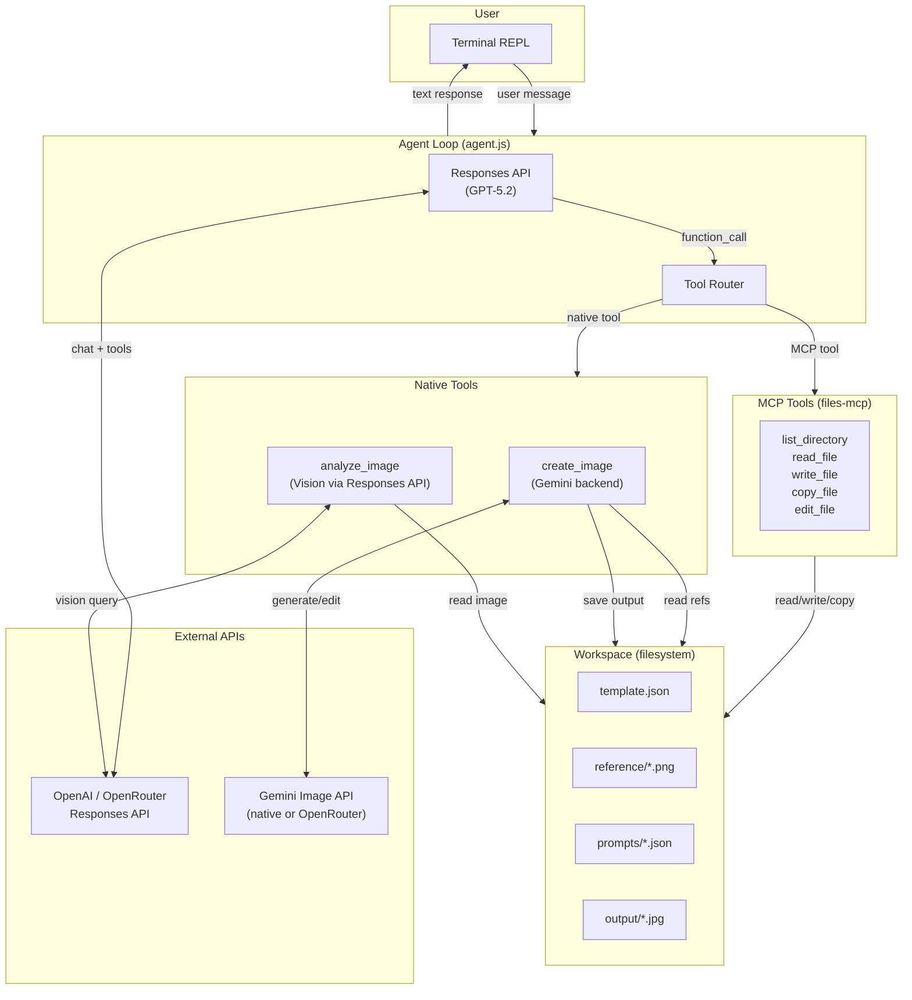
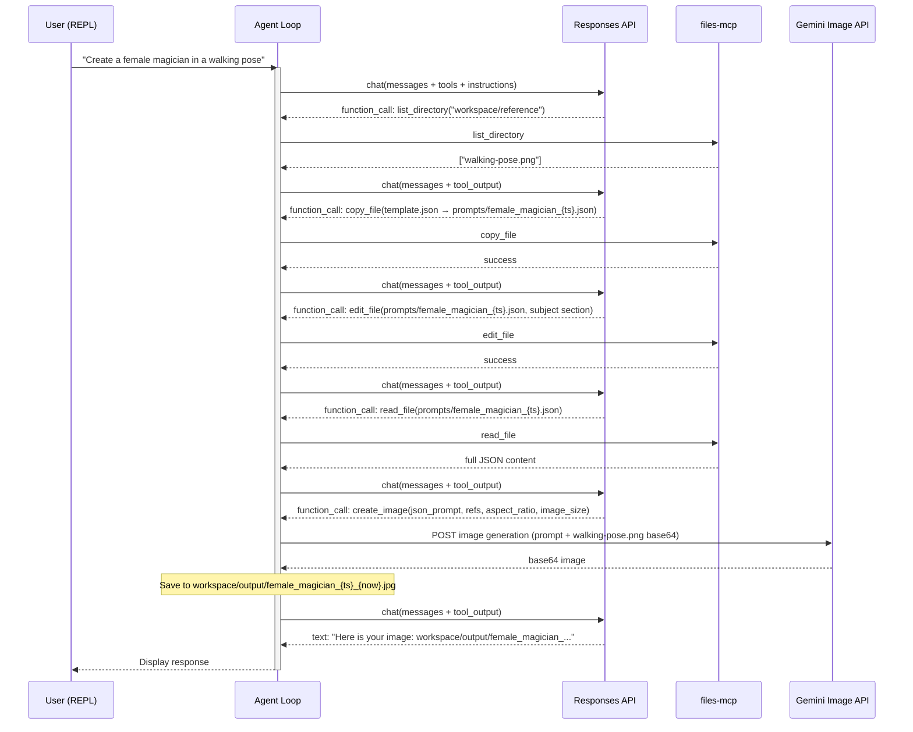
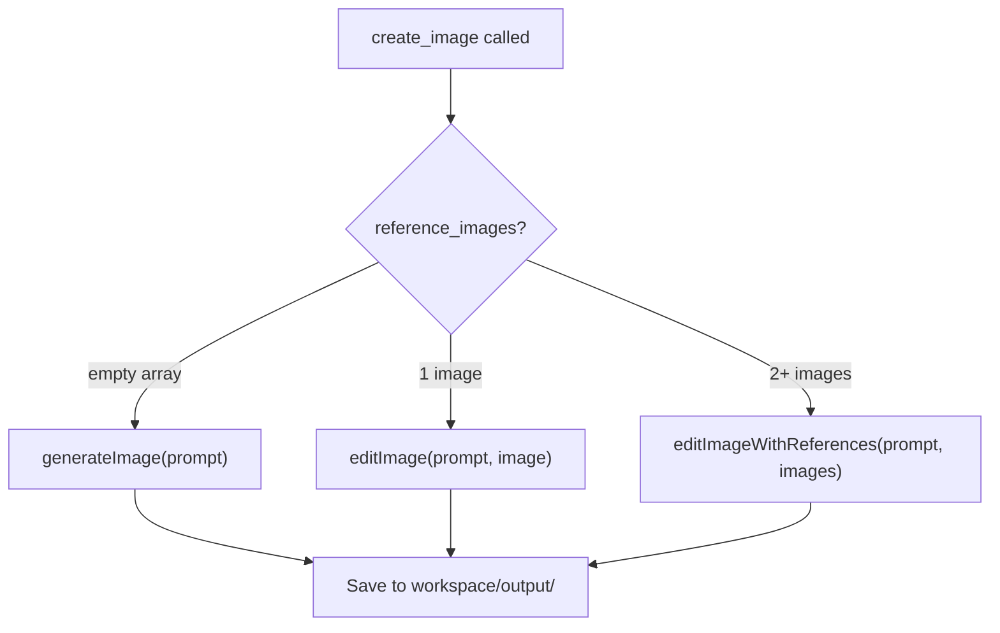
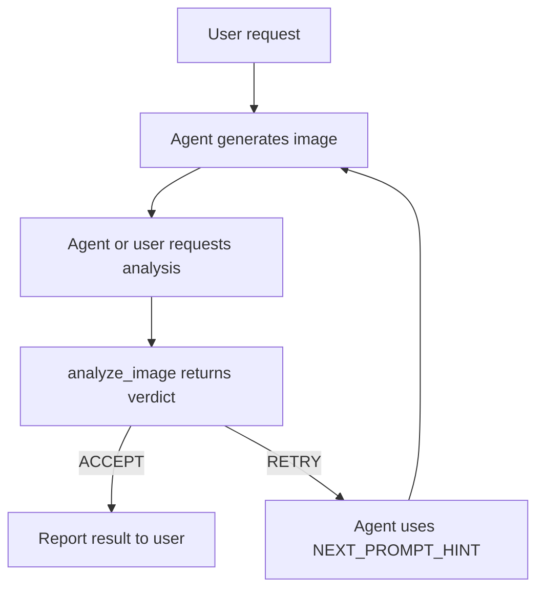
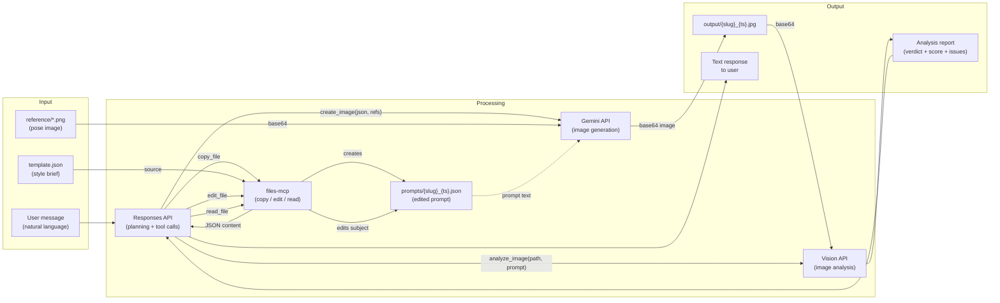
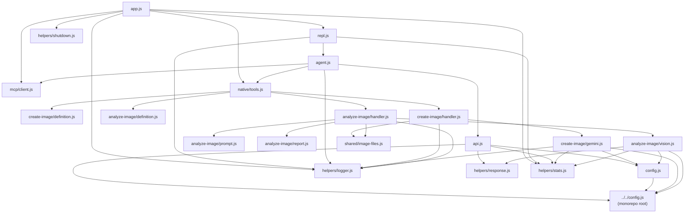
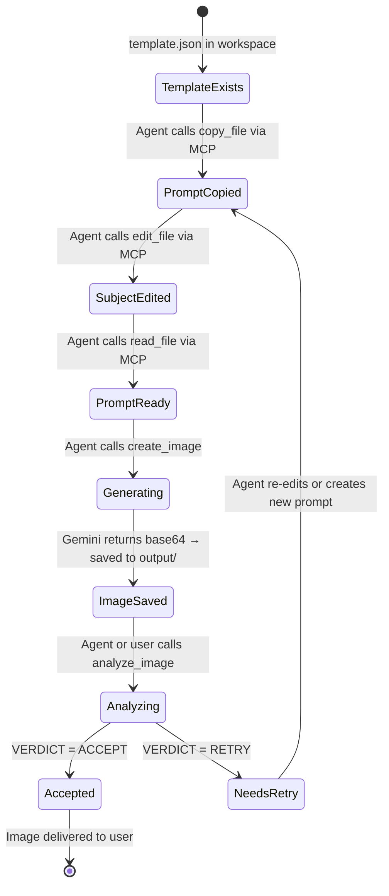
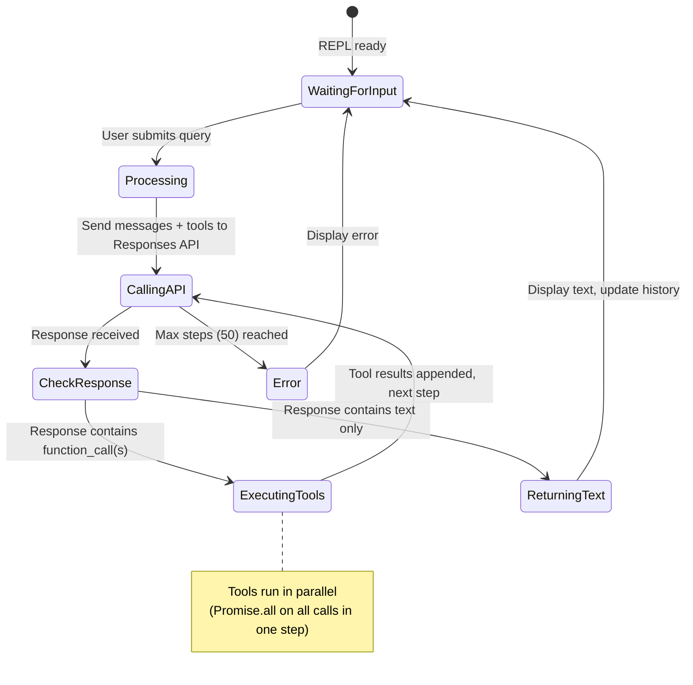
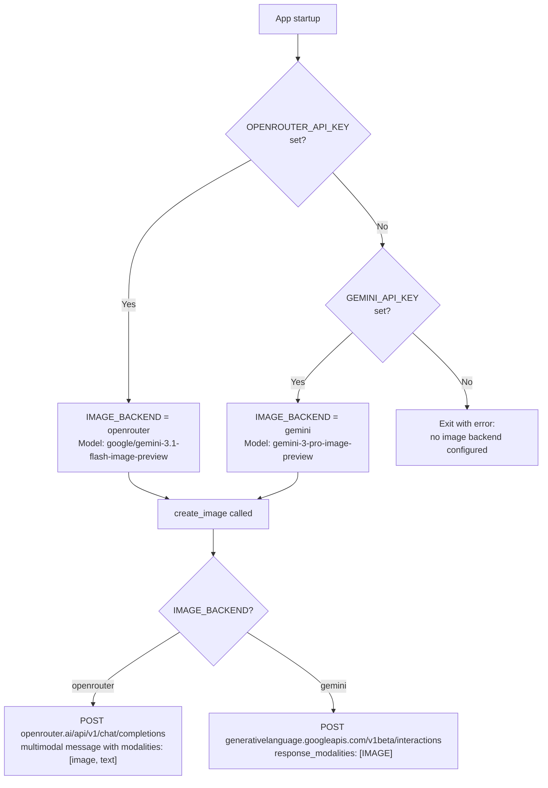

# Image Guidance Agent — Architecture & Business Overview

## 1. Executive Summary

The Image Guidance Agent is an interactive CLI application that generates **pose-guided, cell-shaded character illustrations** from natural-language descriptions. A user describes a character (e.g. "a medieval knight"), and the system combines a structured JSON style template with a pose reference image to produce a consistent, stylized illustration via the Gemini image-generation API.

The agent orchestrates three AI capabilities in a single conversation loop:

| Capability | Provider | Purpose |
|---|---|---|
| **Reasoning / tool use** | OpenAI or OpenRouter Responses API (GPT-5.2) | Understands user intent, plans tool calls, drives the workflow |
| **Image generation / editing** | Gemini (native API or via OpenRouter) | Produces or edits images from prompt + reference |
| **Vision analysis** | OpenAI or OpenRouter Responses API (GPT-5.2) | Reviews generated images for quality and pose adherence |

The application is a teaching example from the AI Devs course, demonstrating how an LLM agent can use file-system tools, image generation, and vision feedback in a multi-step loop.

---

## 2. Business Goal

**Problem:** Generating consistent character art with AI is hard. Every generation can drift in style, pose, and composition. Manual prompt engineering is tedious and error-prone.

**Solution:** The agent automates the entire workflow:

1. Maintains a **canonical style template** (`template.json`) so every image shares the same cell-shaded aesthetic.
2. Uses **pose reference images** so body position is guided, not random.
3. Provides a **vision-based review tool** so the agent (or user) can evaluate results and decide whether to retry.
4. Wraps everything in a **conversational REPL** so the user just types plain English.

**Value proposition:** Consistent, repeatable character generation with minimal user effort — the user describes *what*, the agent handles *how*.

---

## 3. User Journey / Main Use Cases

### Primary flow — Character generation

1. User launches the app (`node app.js`) and confirms the cost warning.
2. User types: *"Create a female magician in a walking pose"*.
3. The agent autonomously:
   - Lists available pose references in `workspace/reference/`.
   - Copies `template.json` → `workspace/prompts/female_magician_{ts}.json`.
   - Edits only the `subject` section of the copied JSON.
   - Reads the full prompt JSON back.
   - Calls `create_image` with the JSON prompt + pose reference.
4. The agent reports the output file path to the user.

### Secondary flow — Image analysis

1. User types: *"Analyze the latest generated image for pose consistency and style quality"*.
2. The agent calls `analyze_image` with the image path and the original prompt.
3. Vision model evaluates the image and returns a structured verdict (ACCEPT/RETRY), score, issues, and hints.
4. If RETRY, the agent can use the hints to regenerate with an improved prompt.

### Conversation controls

| Command | Effect |
|---|---|
| `clear` | Resets conversation history and token/generation counters |
| `exit` | Gracefully shuts down MCP connection and exits |

---

## 4. High-Level Architecture Overview



---

## 5. Main Components and Responsibilities

### Entry & UI layer

| File | Role |
|---|---|
| `app.js` | Entry point. Cost-confirmation gate, MCP client initialization, tool listing, REPL bootstrap, graceful shutdown. |
| `src/repl.js` | Interactive readline loop. Manages conversation history array, delegates to `run()`, handles `clear`/`exit`. |

### Orchestration layer

| File | Role |
|---|---|
| `src/agent.js` | Core agent loop. Sends messages + tool schemas to Responses API, dispatches tool calls (MCP or native), appends results, repeats up to 50 steps until the LLM produces a text response. |
| `src/api.js` | Thin wrapper around the Responses API. Handles auth headers, provider switching, token recording. Exports `chat()`, `extractToolCalls()`, `extractText()`. |
| `src/config.js` | Application-level configuration. Contains the full system prompt (instructions), model selection, Gemini backend config, output folder path. |

### Tool layer — Native

| File | Role |
|---|---|
| `src/native/tools.js` | Tool registry. Maps tool names to definitions + handlers. Exports `nativeTools`, `isNativeTool()`, `executeNativeTool()`. |
| `src/native/create-image/definition.js` | OpenAI function-calling schema for `create_image`. |
| `src/native/create-image/handler.js` | Dispatches to `generateImage`, `editImage`, or `editImageWithReferences` based on the number of reference images. Saves output to disk. |
| `src/native/create-image/gemini.js` | Dual-backend image generation. Builds payloads for either native Gemini Interactions API or OpenRouter multimodal chat. Handles response parsing, base64 extraction, error messages. |
| `src/native/analyze-image/definition.js` | Function-calling schema for `analyze_image`. |
| `src/native/analyze-image/handler.js` | Loads image from disk, builds analysis prompt, calls vision, parses structured report. |
| `src/native/analyze-image/prompt.js` | Prompt template for the vision model. Defines 6 check aspects and the ACCEPT/RETRY output format with decision rules. |
| `src/native/analyze-image/report.js` | Regex-based parser for the vision model's structured text output. Extracts verdict, score, issues, and hints. |
| `src/native/analyze-image/vision.js` | Sends an image + question to the Responses API using `input_image` content type. |

### Tool layer — MCP

| File | Role |
|---|---|
| `src/mcp/client.js` | MCP stdio client. Reads `mcp.json`, spawns the `files-mcp` server as a child process, provides `callMcpTool()` and `mcpToolsToOpenAI()` for schema conversion. |
| `mcp.json` | Declares the `files` MCP server config (command, args, env). The files-mcp server provides filesystem operations scoped to the project root. |

### Shared utilities

| File | Role |
|---|---|
| `src/native/shared/image-files.js` | Image I/O: load reference images as base64, read project images, save generated images with timestamped filenames. |
| `src/helpers/logger.js` | ANSI-colored terminal logger with domain-specific methods (query, api, tool, vision, gemini). |
| `src/helpers/response.js` | Extracts text content from Responses API payloads (handles both `output_text` shorthand and `output[].content[]` arrays). |
| `src/helpers/stats.js` | Tracks Responses API token usage and Gemini generation/edit/analyze counts. |
| `src/helpers/shutdown.js` | SIGINT/SIGTERM handler with once-guard for clean shutdown. |

### Workspace (data)

| Path | Role |
|---|---|
| `workspace/template.json` | Canonical JSON style brief. Defines style, color palette, composition, lighting, pose reference, constraints, and negative prompt. |
| `workspace/reference/` | Pose reference images (e.g. `walking-pose.png`). User-provided, gitignored. |
| `workspace/prompts/` | Per-request prompt JSON files. Copies of `template.json` with edited `subject` section. Gitignored. |
| `workspace/output/` | Generated images. Gitignored. |

### Monorepo integration

| File | Role |
|---|---|
| `../../config.js` | Root config shared across all lessons. Loads `.env`, resolves AI provider (OpenAI vs OpenRouter), exports API keys, endpoints, headers, and `resolveModelForProvider()`. |

---

## 6. End-to-End Flow



---

## 7. AI Workflow Explained

### 7.1 The System Prompt (instructions)

The agent's behavior is defined by a detailed system prompt in `src/config.js`. Key directives:

- **Style lock:** Cell-shaded 3D illustration, sketchy outlines, hard-edged shadows, Western style.
- **Pose is mandatory:** Every image generation *must* include a pose reference from `workspace/reference/`. The agent infers the appropriate pose from the user's description (e.g. "charging" → `running-pose.png`).
- **Template workflow:** Copy → edit subject only → read → generate. The agent never modifies `template.json` directly.
- **Minimal edits:** Only `subject.main`, `subject.details`, and `subject.pose` fields are changed.

### 7.2 Generate vs. Edit decision

The `create_image` handler in `handler.js` branches based on reference image count:



In the standard workflow, the agent always passes one pose reference, so the **edit path** is the common case. The Gemini API receives both the text prompt (full JSON) and the pose image as multimodal input.

### 7.3 Dual image backend

The app supports two backends for image generation, selected at startup based on available API keys:

| Backend | Condition | Model | Endpoint |
|---|---|---|---|
| **OpenRouter** | `OPENROUTER_API_KEY` is set (preferred) | `google/gemini-3.1-flash-image-preview` | `openrouter.ai/api/v1/chat/completions` |
| **Native Gemini** | Only `GEMINI_API_KEY` is set | `gemini-3-pro-image-preview` | `generativelanguage.googleapis.com/v1beta/interactions` |

Both backends receive the same logical payload (prompt text + reference image base64) but use different HTTP formats. The `gemini.js` module abstracts this behind `requestImage()`.

### 7.4 Image analysis / review

When the user (or agent) requests analysis, the `analyze_image` tool:

1. Loads the generated image from disk as base64.
2. Builds a structured evaluation prompt covering up to 6 aspects: prompt adherence, visual artifacts, anatomy, text rendering, style consistency, composition.
3. Sends image + prompt to the Responses API vision endpoint.
4. Parses the response into a structured report:
   - **VERDICT:** `accept` or `retry`
   - **SCORE:** 1–10
   - **BLOCKING_ISSUES:** list
   - **MINOR_ISSUES:** list
   - **NEXT_PROMPT_HINT:** targeted retry guidance

### 7.5 Review / retry loop

The retry loop is **agent-driven, not hard-coded**. There is no explicit retry counter or loop in the code. Instead:

1. The LLM sees the analysis verdict in its conversation history.
2. If the verdict is `retry`, the instructions and the `NEXT_PROMPT_HINT` guide the LLM to call `create_image` again with an improved prompt.
3. The loop continues naturally within the agent's 50-step budget.



**Assumption:** The agent's decision to auto-analyze and retry depends on the LLM's judgment within the conversation. The system prompt does not explicitly mandate auto-retry; the user can also trigger analysis manually.

---

## 8. Data Flow Diagram



---

## 9. Key Files and Code Map

```
01_04_image_guidance/
│
├── app.js                          # Entry: confirm → MCP connect → REPL
├── mcp.json                        # MCP server config (files-mcp)
├── package.json                    # Dependencies: @modelcontextprotocol/sdk, @google/genai
│
├── src/
│   ├── config.js                   # System prompt, model IDs, Gemini backend config
│   ├── agent.js                    # Agent loop: chat → tool calls → results (max 50 steps)
│   ├── api.js                      # Responses API wrapper (chat, extractToolCalls, extractText)
│   ├── repl.js                     # REPL: readline loop, history management
│   │
│   ├── mcp/
│   │   └── client.js               # MCP stdio client: spawn, connect, callTool, schema conversion
│   │
│   ├── native/
│   │   ├── tools.js                # Tool registry: name → {definition, handler}
│   │   ├── shared/
│   │   │   └── image-files.js      # Image I/O: load, read, save (base64 ↔ file)
│   │   ├── create-image/
│   │   │   ├── definition.js       # create_image function schema
│   │   │   ├── handler.js          # Dispatch: generate vs edit vs multi-edit
│   │   │   └── gemini.js           # Dual-backend image API (OpenRouter / native Gemini)
│   │   └── analyze-image/
│   │       ├── definition.js       # analyze_image function schema
│   │       ├── handler.js          # Load image → build prompt → vision → parse report
│   │       ├── prompt.js           # Analysis prompt template (6 aspects, ACCEPT/RETRY rules)
│   │       ├── report.js           # Regex parser for structured verdict output
│   │       └── vision.js           # Responses API call with input_image
│   │
│   └── helpers/
│       ├── logger.js               # ANSI-colored domain-specific logger
│       ├── response.js             # Extract text from Responses API payloads
│       ├── stats.js                # Token + Gemini call counters
│       └── shutdown.js             # Graceful SIGINT/SIGTERM handler
│
└── workspace/
    ├── template.json               # Canonical style brief (121 lines of JSON)
    ├── reference/                   # User-provided pose PNGs (gitignored)
    ├── prompts/                     # Generated per-request JSON prompts (gitignored)
    └── output/                      # Generated images (gitignored)
```

---

## 10. State Management / Data Handling

### Conversation state

- Stored as a plain **JavaScript array** (`history` in `repl.js`).
- Each element follows the Responses API message format: `{role, content}` for user/assistant messages, `{type: "function_call", ...}` for tool calls, `{type: "function_call_output", ...}` for results.
- The full history is passed to `chat()` on every step, giving the LLM complete context.
- `clear` command resets the array to `[]`.

### File-based state (workspace)

| Artifact | Lifecycle | Naming convention |
|---|---|---|
| `template.json` | Permanent, never modified directly | Fixed name |
| `prompts/*.json` | Created per request via MCP `copy_file` + `edit_file` | `{subject_slug}_{timestamp}.json` |
| `output/*.jpg` | Created per `create_image` call | `{output_name}_{Date.now()}.{ext}` |
| `reference/*.png` | User-managed, read-only during generation | User-chosen names |

### Token / generation statistics

- Tracked in memory by `src/helpers/stats.js`.
- Two counters: Responses API tokens (input/output/requests) and Gemini calls (generations/edits/analyses).
- Printed on shutdown (`logStats()`) and reset on `clear`.

---

## 11. External Integrations and Models

### API dependencies

| Service | Usage | Auth | Config source |
|---|---|---|---|
| **OpenAI Responses API** | Agent reasoning, tool orchestration, vision analysis | `OPENAI_API_KEY` | Root `.env` via `config.js` |
| **OpenRouter Responses API** | Alternative to OpenAI (same capabilities) | `OPENROUTER_API_KEY` | Root `.env` via `config.js` |
| **Gemini Interactions API** | Native image generation/editing | `GEMINI_API_KEY` | Root `.env`, read in `src/config.js` |
| **OpenRouter Chat Completions** | Image generation via OpenRouter (alternative Gemini path) | `OPENROUTER_API_KEY` | Root `.env` via `config.js` |

### Model versions

| Role | Model ID (OpenAI) | Model ID (OpenRouter) |
|---|---|---|
| Reasoning / orchestration | `gpt-5.2` | `openai/gpt-5.2` |
| Vision analysis | `gpt-5.2` | `openai/gpt-5.2` |
| Image generation (OpenRouter) | — | `google/gemini-3.1-flash-image-preview` |
| Image generation (native) | — | `gemini-3-pro-image-preview` |

### Environment variables

| Variable | Required | Purpose |
|---|---|---|
| `OPENAI_API_KEY` | One of OPENAI or OPENROUTER required | Responses API authentication |
| `OPENROUTER_API_KEY` | One of OPENAI or OPENROUTER required | Alternative provider + image generation |
| `AI_PROVIDER` | Optional | Force `openai` or `openrouter` |
| `GEMINI_API_KEY` | Required if no `OPENROUTER_API_KEY` | Native Gemini image generation |
| `OPENROUTER_HTTP_REFERER` | Optional | OpenRouter tracking header |
| `OPENROUTER_APP_NAME` | Optional | OpenRouter tracking header |

### MCP server dependency

The app requires a running `files-mcp` server (spawned automatically via `mcp.json`). The server source lives at `../mcp/files-mcp/src/index.ts` in the monorepo and provides filesystem operations scoped to the project root.

---

## 12. Error Handling / Limitations / Risks

### Error handling

| Layer | Strategy |
|---|---|
| **Agent loop** (`agent.js`) | Tool execution errors are caught and returned as `{error: message}` in `function_call_output`, allowing the LLM to react gracefully. Max 50 steps guard prevents infinite loops. |
| **Image generation** (`handler.js`) | Returns `{success: false, error}` on failure — no throw, so the agent can inform the user. |
| **Image analysis** (`handler.js`) | Same pattern: catches errors, returns structured failure. |
| **Gemini backends** (`gemini.js`) | Checks `response.ok` and `data.error`, throws descriptive errors. Extracts text from non-image responses to surface model refusal messages. |
| **MCP client** (`client.js`) | Connection failure throws from `main()`, causing process exit with error message. |
| **Responses API** (`api.js`) | Non-OK responses throw with the API error message. |
| **Startup** (`config.js`) | Missing API keys cause immediate `process.exit(1)` with clear instructions. |

### Limitations

- **No persistent state:** Conversation history lives in memory. Restarting the app loses all context.
- **No automatic retry loop:** Retry after a RETRY verdict depends on the LLM choosing to re-generate. There is no hard-coded retry mechanism.
- **Single-user:** The REPL is a single-session CLI tool; no web server or multi-user support.
- **Pose reference required:** The system prompt mandates a reference image. If no suitable pose file exists, the agent is instructed to refuse and ask the user to provide one.
- **No image preview in terminal:** The CLI reports file paths; the user must open images in an external viewer.
- **Template is style-locked:** The JSON template enforces cell-shaded style. Changing styles requires editing `template.json`.
- **Stats label inaccuracy:** `stats.js` labels token counters as "OpenAI Stats" even when using OpenRouter.

### Risks

- **Token consumption:** Each agent step sends the full conversation history. Long sessions with many tool calls can consume significant tokens.
- **Image generation cost:** Each Gemini API call has associated cost; failed generations still incur charges.
- **Model refusals:** Image generation models may refuse certain prompts. The app surfaces refusal messages but does not implement fallback strategies.
- **No rate limiting:** Rapid interactions could hit API rate limits; no backoff/retry logic exists.

---

## 13. Suggestions for Future Improvements

1. **Automatic retry loop with budget:** Add a configurable max-retry count for the generate→analyze→retry cycle, with an explicit loop rather than relying on LLM judgment.
2. **Image preview:** Integrate terminal image preview (e.g. iTerm2 inline images or sixel) so the user can see results without leaving the CLI.
3. **Web UI:** Replace the REPL with a web interface showing conversation, generated images, and analysis reports side by side.
4. **Persistent conversation:** Save/load conversation history to disk so sessions can be resumed.
5. **Multi-template support:** Allow switching between style templates (e.g. anime, realistic, pixel art) via user command.
6. **Pose library management:** Add a tool to list, preview, and import pose references from a shared library.
7. **Parallel generation:** Generate multiple variations in parallel and let the user pick the best one.
8. **Cost tracking:** Display estimated cost per generation alongside token counts.
9. **Configurable models:** Allow model overrides via environment variables or CLI flags.
10. **Fix stats labels:** Use the actual provider name in `logStats()` output instead of hardcoded "OpenAI".

---

## 14. Appendix: Diagrams

### A. Module Dependency Map



### B. Image Artifact Lifecycle



### C. Agent Loop State Machine



### D. Backend Selection Flow



### E. Prompt Template Structure

```mermaid
graph TD
    T["template.json"]
    T --> Subject["subject<br/><i>main, details, pose,<br/>orientation, position, scale</i>"]
    T --> Style["style<br/><i>medium, rendering,<br/>line_work, finish</i>"]
    T --> Color["color_palette<br/><i>approach, shadow_style,<br/>highlight_style, rules</i>"]
    T --> Comp["composition<br/><i>format, placement,<br/>padding, ground_plane</i>"]
    T --> BG["background<br/><i>color, texture,<br/>elements, style</i>"]
    T --> Light["lighting<br/><i>direction, type,<br/>shadows, rim_light</i>"]
    T --> Tech["technical<br/><i>resolution, aspect_ratio</i>"]
    T --> Pose["pose_reference<br/><i>source, usage,<br/>interpretation</i>"]
    T --> Constraints["constraints<br/><i>must_have, must_not_have</i>"]
    T --> Negative["negative_prompt<br/><i>[list of terms to avoid]</i>"]

    style Subject fill:#ffd700,stroke:#333,color:#000
    style Style fill:#e0e0e0,stroke:#333,color:#000
    style Color fill:#e0e0e0,stroke:#333,color:#000
    style Comp fill:#e0e0e0,stroke:#333,color:#000
    style BG fill:#e0e0e0,stroke:#333,color:#000
    style Light fill:#e0e0e0,stroke:#333,color:#000
    style Tech fill:#e0e0e0,stroke:#333,color:#000
    style Pose fill:#e0e0e0,stroke:#333,color:#000
    style Constraints fill:#e0e0e0,stroke:#333,color:#000
    style Negative fill:#e0e0e0,stroke:#333,color:#000
```



> The **subject** section (highlighted) is the only part the agent edits per request. All other sections define the locked visual style.
