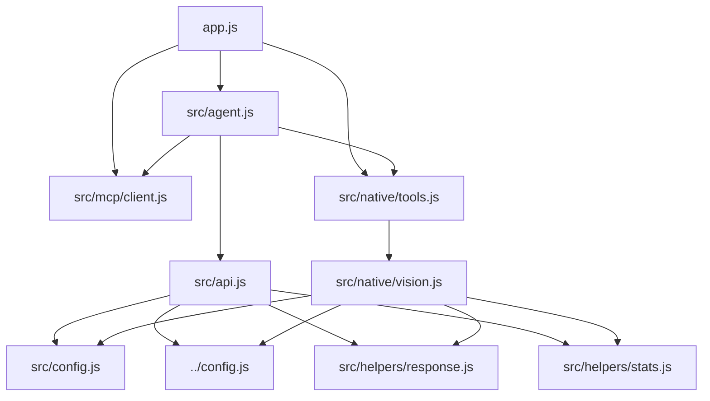
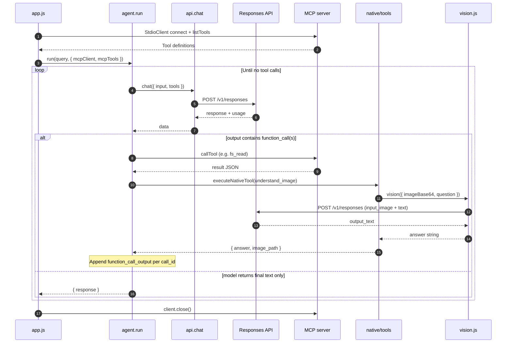

# Image recognition example — technical architecture

Audience: engineers extending this lesson, integrating similar patterns, or reviewing agent + MCP + multimodal design.

For stakeholder-oriented behavior and diagrams, see [DESIGN.md](./DESIGN.md).

## Scope and constraints

- **Single-process agent** in Node.js (ESM). No separate API server; `app.js` is the entrypoint.
- **Two tool sources**: MCP tools from `files-mcp` (dynamic list) and **native** tools defined in-repo (`understand_image`).
- **One provider surface for LLM + vision**: HTTP `POST` to the OpenAI-compatible **Responses** endpoint, configured via the **repo root** [`config.js`](../config.js) (not inside this folder).
- **Working directory**: MCP server `cwd` is this package root (`01_04_image_recognition/`); paths in prompts and tools are relative to that root.

## How to run (integration context)

From the monorepo root:

- `npm run lesson4:image_recognition` — runs `node ./01_04_image_recognition/app.js` after `ensure:files-mcp`.

The lesson script assumes `.env` at the **repo root** (loaded by `../config.js` when modules import it).

## Directory layout

| Path | Role |
|------|------|
| `app.js` | Wires MCP client, builds the classification query string, calls `run()`, closes MCP in `finally`. |
| `mcp.json` | MCP server launch: `npx tsx ../mcp/files-mcp/src/index.ts`, `FS_ROOT: "."`, cwd = this folder. |
| `src/agent.js` | Generic tool loop: `chat` → `function_call` items → execute → append `function_call_output` → repeat. |
| `src/api.js` | `chat()`: Responses API request; `extractToolCalls` / `extractText` helpers. |
| `src/config.js` | Model IDs, `max_output_tokens`, **system instructions** for classification behavior. |
| `src/mcp/client.js` | Stdio MCP client, `listTools`, `callTool`, schema → OpenAI function tool shape. |
| `src/native/tools.js` | Native tool definitions + `executeNativeTool` registry. |
| `src/native/vision.js` | Minimal Responses call with `input_image` (base64 data URL) + `input_text`. |
| `src/helpers/response.js` | Normalizes assistant text from `output_text` or `output[].content[]`. |
| `src/helpers/stats.js` | Aggregates `usage` from chat + vision calls. |
| `src/helpers/logger.js` | Structured console logging for steps and tools. |
| `knowledge/`, `images/` | Data directories referenced by instructions and the default query. |

## Module dependency graph

## Control flow: agent loop

The loop is intentionally small and provider-agnostic aside from the request/response shapes assumed in `api.js` and `vision.js`.

1. **Initialize** `messages = [{ role: "user", content: query }]` (string `content` as in current code).
2. **Merge tools**: `mcpToolsToOpenAI(mcpTools)` plus `nativeTools` from `src/native/tools.js`.
3. **Call** `chat({ input: messages, tools })` — see [`src/api.js`](./src/api.js): sends `model`, `input`, `tools`, `tool_choice: "auto"`, `instructions`, `max_output_tokens` from [`src/config.js`](./src/config.js).
4. **Parse** `response.output`: items with `type === "function_call"` are tool calls (`call_id`, `name`, `arguments` JSON string).
5. If **no** tool calls: return `extractText(response)` as the final string.
6. If **yes**: append **entire** `response.output` to `messages`, then append one `function_call_output` per call (`call_id` + stringified JSON result).
7. **Execute tools in parallel** via `Promise.all` — each failure becomes `{ error: message }` in the output payload, not a thrown escape from the loop.
8. Repeat until step cap: **`MAX_STEPS = 100`** in [`src/agent.js`](./src/agent.js), then throw.

Implications for architects:

- **Ordering**: Multiple tool calls in one turn run concurrently; do not assume serial side effects unless you change `runTools`.
- **State**: Conversation state is only `messages`; there is no separate planner memory.
- **Idempotency**: File operations depend on MCP tool semantics and model behavior; the loop does not deduplicate calls.

### Sequence diagram (runtime)

Bootstrap, one illustrative tool round (MCP + native), and termination when the model returns no further `function_call` items. When several tools are emitted in one turn, they run in parallel (`Promise.all`); the diagram shows both paths in one iteration for clarity.

## Responses API usage

### Chat / tool-use turns

[`src/api.js`](./src/api.js) posts to `RESPONSES_API_ENDPOINT` from root [`config.js`](../config.js) (`https://api.openai.com/v1/responses` or OpenRouter equivalent). Auth: `Authorization: Bearer ${AI_API_KEY}` plus `EXTRA_API_HEADERS` for OpenRouter.

Text extraction supports:

- Top-level `output_text`, or
- `output` items of type `message` with `content` containing `output_text` (see [`src/helpers/response.js`](./src/helpers/response.js)).

### Vision (native path only)

[`src/native/vision.js`](./src/native/vision.js) uses the **same endpoint** but a different body shape: `input` is a single user message whose `content` is `[input_text, input_image]`, with `image_url` set to a `data:<mime>;base64,...` URL.

`api.model` (chat) and `api.visionModel` (vision) both default to `resolveModelForProvider("gpt-5.2")` in [`src/config.js`](./src/config.js). You can split models (e.g. cheaper vision, stronger reasoning) by editing that file.

### Provider switching

Root [`config.js`](../config.js) picks provider from `AI_PROVIDER` or from which key is set, and rewrites bare model names for OpenRouter via `resolveModelForProvider` (e.g. prefixing `openai/` when needed). This example imports that helper through `../../config.js` from `src/` and `../../../config.js` from `src/native/`.

## MCP integration

### Process model

[`src/mcp/client.js`](./src/mcp/client.js) uses `@modelcontextprotocol/sdk` `Client` + `StdioClientTransport`:

- Spawns the command in `mcp.json` with `cwd: PROJECT_ROOT` (this package).
- Forwards `PATH`, `HOME`, `NODE_ENV`, and server-specific `env` (here `FS_ROOT: "."`).

So the sandbox root for `files-mcp` is **`01_04_image_recognition/`**, not the monorepo root.

### Tool surface

The running server exposes **`files-mcp`** tools (typically `fs_read`, `fs_search`, `fs_write`, `fs_manage`). Schemas arrive at runtime via `listTools()` and are converted with `strict: false` in `mcpToolsToOpenAI`.

[`callMcpTool`](./src/mcp/client.js) parses the first **text** content block as JSON when possible; otherwise returns raw text or the full result object.

### Native vs MCP dispatch

[`src/agent.js`](./src/agent.js): `isNativeTool(name)` checks membership in `nativeHandlers` in [`src/native/tools.js`](./src/native/tools.js). Any other name is assumed to be MCP.

## Native tool: `understand_image`

| Field | Purpose |
|-------|---------|
| `image_path` | Relative to package root; joined with `PROJECT_ROOT` in `tools.js`. |
| `question` | Free-form; drives what the vision model attends to. |

Execution: `readFile` → base64 → MIME from extension → `vision()` → `{ answer, image_path }` or `{ error, image_path }` on failure.

Tool schema is **`strict: true`** (OpenAI function calling). To add tools, extend `nativeTools`, `nativeHandlers`, and rely on `name` uniqueness vs MCP tool names.

## Configuration surfaces

### `src/config.js` — agent behavior

- **`api.instructions`**: Long system prompt defining goal, process, and matching rules (evidence, ambiguity, composites, recovery). This is the main **policy lever** for classification quality.
- **`api.model` / `api.visionModel` / `api.maxOutputTokens`**: Passed into `chat()` and vision requests.

### `app.js` — task prompt

- **`CLASSIFICATION_QUERY`**: User message for the run. Changing this changes the concrete objective without touching the agent loop.

### `mcp.json` — filesystem boundary

- Changing `FS_ROOT`, command, or args alters **where** MCP tools can operate; keep paths in `instructions` and `CLASSIFICATION_QUERY` consistent.

### Repo root `config.js` — secrets and endpoints

- **`OPENAI_API_KEY`** or **`OPENROUTER_API_KEY`** (required).
- **`AI_PROVIDER`**: optional override `openai` | `openrouter`.

## Observability and cost

- **`recordUsage`** in [`src/helpers/stats.js`](./src/helpers/stats.js) increments on every successful chat and vision response that includes `usage`.
- **Logger** traces steps, tool args, and truncated results (see [`src/helpers/logger.js`](./src/helpers/logger.js)).

For capacity planning: cost scales with **(agent turns × chat tokens) + (vision calls × image + question tokens)**. Parallel tool calls in one step still incur separate vision requests if the model emits multiple `understand_image` calls.

## Extension patterns

1. **New native capability** — Add a handler in `native/tools.js`, export in `nativeTools` with a unique `name`, implement idempotent behavior where possible.
2. **Replace or augment MCP** — Add servers in `mcp.json` (would require client changes to multiplex transports; current code assumes one `createMcpClient()` connection).
3. **Stricter filesystem** — Tighten `files-mcp` mounts / `FS_ROOT` or run from a subdirectory dedicated to the lesson.
4. **Structured outputs** — Would require Responses API response-format options and parsing changes in `extractText` / agent termination logic (not present today).
5. **Streaming** — Not implemented; `chat` uses full JSON response.

## Failure modes

| Failure | Behavior |
|---------|----------|
| MCP spawn / connect | Throws from `app.js` startup; client closed in `finally` if partially created. |
| Responses API HTTP error | `chat()` or `vision()` throws; run aborts unless you wrap `run()` (currently unwrapped aside from top-level catch in `app.js`). |
| Tool throws | Caught in `runTool`; model receives `{ error: message }` stringified. |
| Max steps | `Error` thrown from `run()` after 100 iterations. |

## Security notes (short)

- API keys live only in environment (root `.env`); never committed.
- Disk access for file tools is whatever **`files-mcp`** allows under `FS_ROOT` for this package; treat agent tool access as **privileged** within that tree.
- Images are read from disk and sent to the configured cloud API; classify data accordingly.

## Related code outside this folder

- [`../mcp/files-mcp/`](../mcp/files-mcp/) — MCP server implementation and tool contracts.
- [`../config.js`](../config.js) — Provider resolution, endpoints, env loading, Node version gate (≥ 24).
