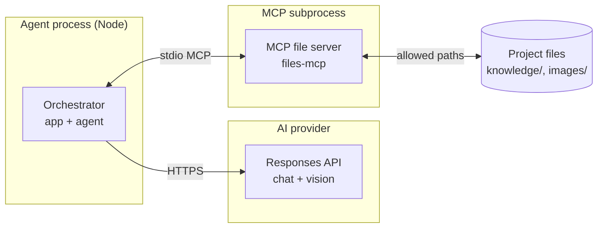
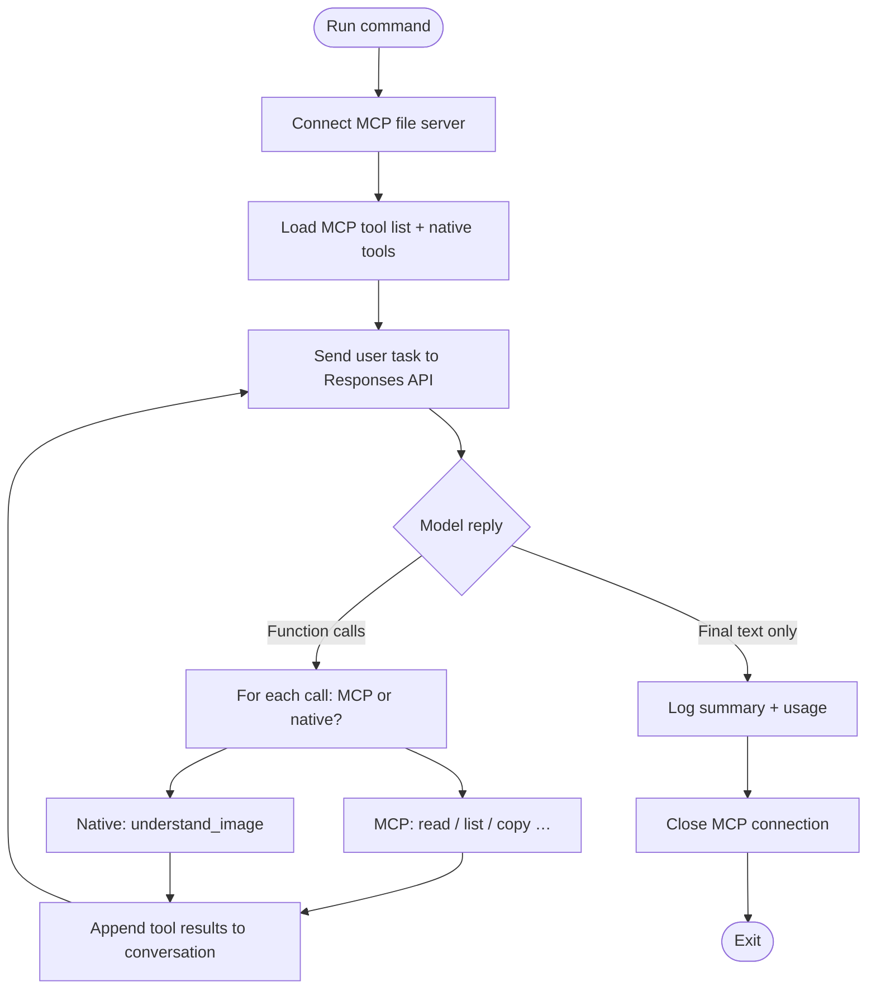
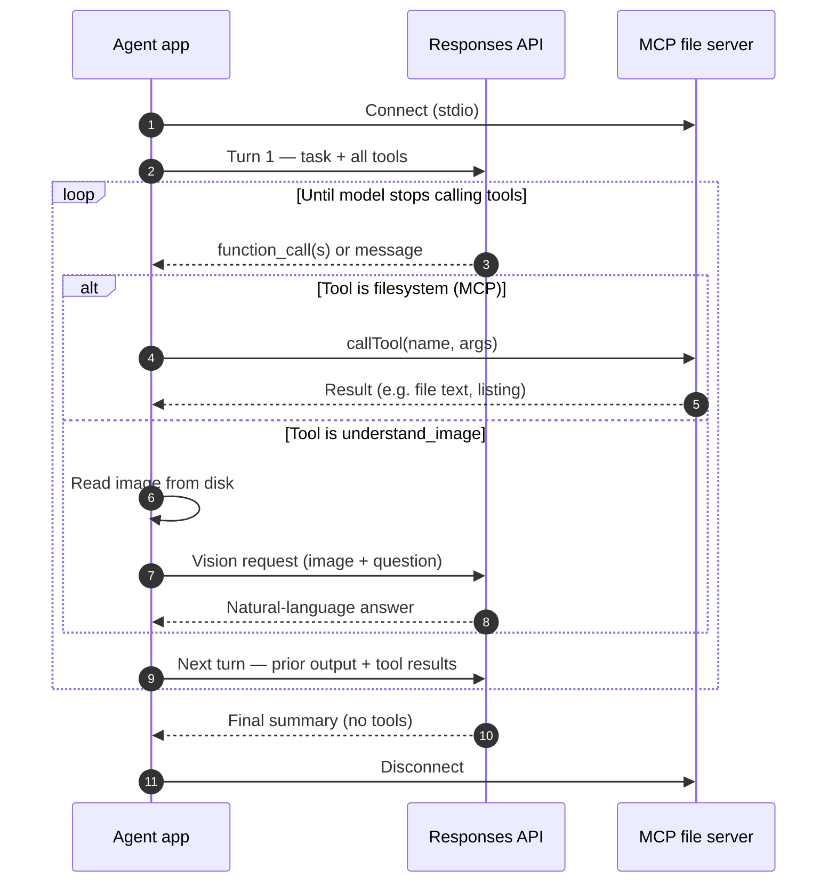
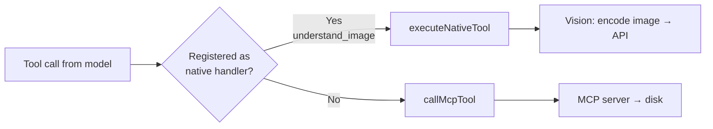
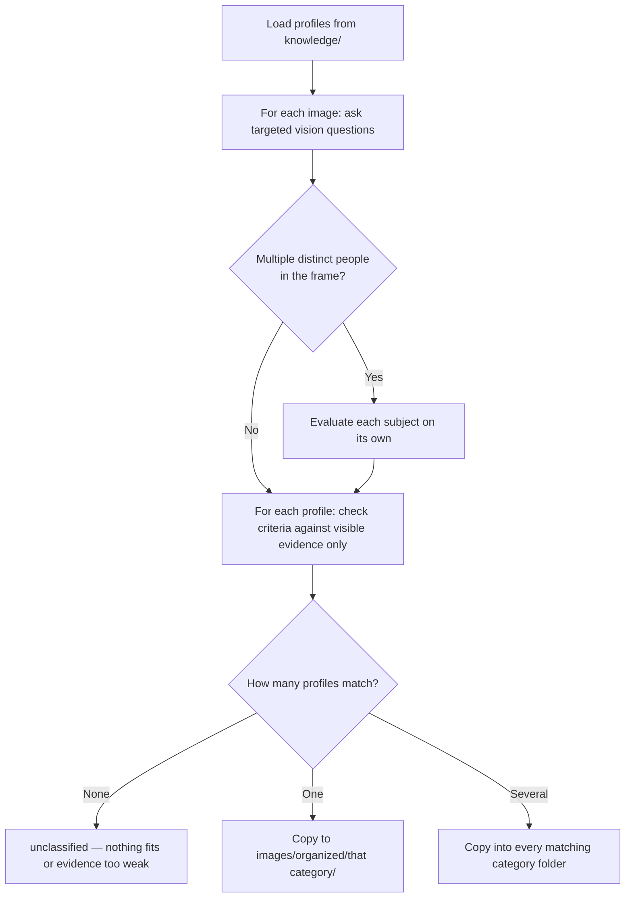

# Image recognition example — design overview

This document explains what the example does and how the pieces fit together, in language aimed at product owners, stakeholders, and anyone who needs the “why” and “what,” not just the code.

## What problem does it solve?

Teams often have a folder of photos or graphics that should be sorted into categories (here: **character profiles**). Doing that by hand is slow and inconsistent. This example shows an **automated assistant** that:

1. Reads your **rules** (who belongs in which category) from simple text files.
2. Looks at each **image** and decides which category it fits.
3. **Organizes** files by copying them into the right subfolders under `images/organized/`.

You keep control of the rules by editing markdown files in `knowledge/`; the system applies those rules to whatever you put in `images/`.

## How it works at a glance

Think of three roles working together:

| Role | Plain-language job | How it is implemented |
|------|--------------------|-------------------------|
| **Planner & decision-maker** | Chooses the next step, interprets answers, and matches images to profiles | A large language model (LLM) via the Responses API |
| **Eyes** | Answers specific questions about what appears in a picture | A dedicated **vision** call that sends the image and a question to the same family of models |
| **Hands** | Reads folder listings, reads file contents, copies/moves files on disk | A **file server** connected through the [Model Context Protocol (MCP)](https://modelcontextprotocol.io/) — a standard way to give an AI controlled access to files |

The **orchestrator** is not a separate product: it is a small program that starts the file server, sends your high-level task to the model, and then **repeatedly** sends back whatever the model asks for (tool results) until the model says it is done.

## End-to-end flow

1. **Startup** — The app connects to the MCP “files” server (configured in `mcp.json`) so the model can use file operations on your project folder. It also registers one **built-in** tool: “look at this image and answer this question.”
2. **Task** — You give a single instruction (in code today): load knowledge, classify every image, copy files into the right places under `images/organized/<category>/`.
3. **Loop** — The model may respond with **tool calls** (e.g. list `knowledge/`, read a profile, analyze an image, copy a file). The app runs those tools, returns the results, and the model continues until it responds with a **final summary** instead of more tools.
4. **Result** — Files end up organized; the console shows progress and a short completion message.

So in business terms: **one automated worker** follows **your written policies**, uses **vision** where needed, and uses **file operations** to execute the filing work.

## Diagrams

The diagrams below use [Mermaid](https://mermaid.js.org/) syntax. They render automatically in GitHub, many IDEs (including VS Code with a Mermaid preview), and most internal doc tools.

### System context

Who talks to whom at runtime: one Node process runs the agent loop, speaks to the same cloud API for both “thinking” and “seeing,” and speaks to a separate MCP process for filesystem work.

### Agent lifecycle (flow)

From startup to shutdown: connect tools, then repeat “ask the model → run tools → feed results back” until the model returns plain text instead of tool calls.

### Typical request flow (sequence)

One simplified pass: the model might first read `knowledge/`, then list `images/`, then alternate vision questions and file copies. In practice there are many turns; this shows the pattern.

### How a tool call is routed

The orchestrator does not care about business rules here; it only dispatches by tool name.

### Classification logic (conceptual)

This is the **policy** the instructions encode—not a separate code module. It helps to see it as a decision flow when reading `knowledge/` files or debugging misfiles.

## Your inputs and outputs

**You provide**

- **`knowledge/*.md`** — Short profiles that define each category (what must be visible for a match). These are your classification policy.
- **`images/`** — Source images to classify.
- **API access** — A key for the chosen AI provider (see repo root `env.example`).

**You get**

- **`images/organized/<category>/`** — Copies of images placed per category (and an **unclassified** path when no profile fits or the picture is unclear).
- **Logs** — What tools ran and usage stats, useful for demos and debugging.

## How matching is intended to behave

The model is instructed to behave like a careful reviewer, not a guesser:

- **Evidence-based** — Only traits that are **clearly visible** count. If something is hidden, that criterion is not assumed false; it is **unknown**, which usually means **no match** for strict criteria.
- **Profiles are minimum bars** — If a profile lists one requirement, satisfying that one requirement is enough; extra details in the photo that are not in the profile do not block a match.
- **Ambiguity** — If more than one profile fits, the image may be copied to **more than one** folder. If nothing fits or the image is too unclear, it goes to **unclassified**.
- **Multiple people in one image** — Each person is evaluated separately; traits must not be mixed across subjects.

This keeps the example aligned with **auditable, rule-driven** sorting rather than opaque “vibes-based” labeling.

## Why two kinds of tools (MCP vs “native”)?

- **MCP file tools** — Filesystem work is delegated to a **separate, configurable service**. That mirrors how real products plug in corporate drives, sandboxes, or different storage backends without changing the core agent code.
- **Native `understand_image`** — Image understanding is implemented **inside this app** as one function call to the vision-capable API. That keeps image Q&A fast to wire up and easy to read in the codebase.

Both appear to the model as **tools**; the model does not need to know which is which.

## Limitations and expectations

- **Cost and latency** — Every image analysis and every model step uses the API; large batches mean more calls.
- **Quality** — Results depend on image quality, lighting, and how clearly your `knowledge/` criteria are written.
- **Copy vs move** — The described workflow emphasizes **copying** into organized folders; the exact operations follow the model’s tool use within the file server’s allowed actions.

## Summary

This example demonstrates a **policy-driven, vision-assisted filing assistant**: markdown rules define categories, an LLM plans and decides, vision answers “what do we see?,” and MCP-backed file tools perform the physical organization — all in one automated loop until the task is complete.

For setup and commands, see `README.md`.
