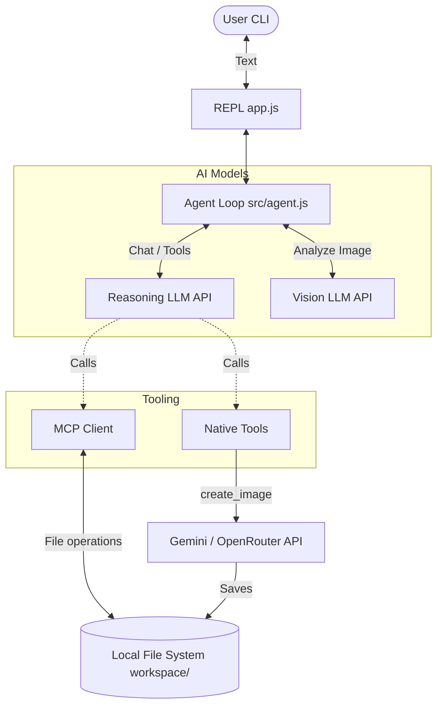
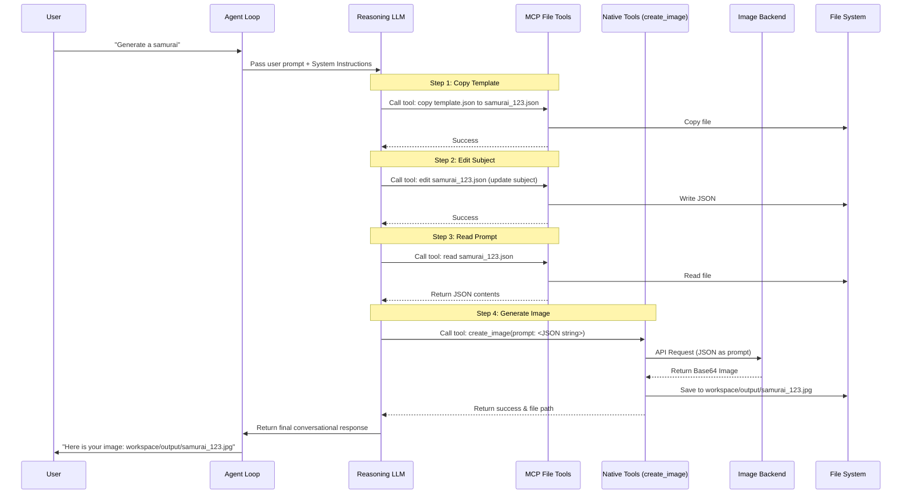
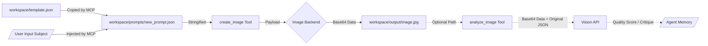

# JSON Image App - Architecture & Product Overview

## 1. Executive Summary
The **JSON Image Agent** is a Node.js-based interactive CLI application that provides a token-efficient, highly reproducible approach to AI image generation. Instead of generating monolithic free-text prompts, the application uses structured JSON templates to separate the variable "subject" from the constant "style" and "composition" guidelines. This ensures brand and style consistency while saving LLM output tokens.

## 2. Business Goal of the Application
When generating visual assets for a product or brand, consistency is critical. Standard text-to-image prompts often suffer from style drift as users forget to include specific modifiers. 
This application solves that by:
1. **Ensuring Consistency:** Locking style, palette, and composition into a JSON template (`template.json`).
2. **Improving Reproducibility:** Every generated image has a corresponding, versioned JSON file acting as a strict blueprint.
3. **Saving Tokens:** The reasoning LLM only needs to write a tiny JSON object (the subject) rather than a 500-word stylistic description.

## 3. User Journey / Main Use Cases
- **Generate an Image:** The user types a simple request (e.g., "Draw a flying phoenix"). The agent creates a specific JSON prompt based on the request and generates the image.
- **Edit an Image (Assumption):** The user can ask to modify an existing generated image. The agent can use the `create_image` tool with `reference_images` to perform an edit.
- **Analyze Quality:** The user can ask the agent to evaluate an image. The agent uses the `analyze_image` tool (powered by a Vision model) to score the image on prompt adherence, visual artifacts, anatomy, etc.

## 4. High-Level Architecture Overview
The system follows a classic Agentic Loop architecture, augmented by local file system access (via MCP) and specialized native tools for image processing.

- **REPL / CLI:** The entry point where user input is collected.
- **Agent Loop (`src/agent.js`):** The orchestrator that maintains conversation history and continuously prompts the Text/Reasoning LLM until the user's request is fulfilled.
- **Responses API (`src/helpers/api.js`):** The abstraction layer over the primary reasoning LLM (e.g., GPT-5.2) and Vision LLM.
- **MCP Client (`src/mcp/client.js` & `mcp.json`):** Connects to a local Model Context Protocol server (`files-mcp`) allowing the LLM to read, copy, and edit JSON templates on the local file system.
- **Native Tools (`src/native/tools.js` & `src/native/gemini.js`):** Custom functions exposed to the LLM for generating/editing images (via Gemini or OpenRouter) and analyzing images.

## 5. Main Components and Responsibilities
- **`app.js`**: Application entry point. Initializes MCP client, loads tools, and starts the REPL.
- **`src/agent.js`**: Core agent loop. Handles the chat-tool-result cycle (up to 50 steps).
- **`src/config.js`**: System instructions, prompts, and API configurations. Dictates the strict workflow the LLM must follow.
- **`src/native/tools.js`**: Defines the schemas and handlers for `create_image` and `analyze_image`.
- **`src/native/gemini.js`**: Backend wrapper for image generation. Routes requests to either Google Gemini's native API or OpenRouter's API based on available keys.
- **`workspace/template.json`**: The core structural blueprint. Contains detailed definitions for style, composition, color palette, lighting, and negative prompts.

## 6. End-to-End Flow
1. User enters a prompt: *"Generate a cool robot"*
2. Agent reads `workspace/template.json` via MCP tools (or relies on instructions to copy it).
3. Agent copies the template to a new file: `workspace/prompts/cool_robot_12345.json` (via MCP file tools).
4. Agent edits *only* the `subject` section of the new JSON file (via MCP file tools).
5. Agent reads the completed JSON file.
6. Agent calls the native `create_image` tool, passing the stringified JSON as the `prompt` and extracting `aspect_ratio` and `image_size` from the technical section.
7. The `create_image` handler sends the request to the Image Backend (Gemini/OpenRouter).
8. The image is returned as base64, decoded, and saved to `workspace/output/`.
9. The Agent reports the file path back to the user.

## 7. AI Workflow Explained
The application employs a strict instruction set (`src/config.js`) that forces the reasoning LLM to act as a **JSON payload builder**:
- **Prompt:** "You are an image generation agent using JSON-based prompting with minimal token usage... COPY template... EDIT subject only... READ prompt file... GENERATE"
- **Model Calls:** The text model acts as the brain. The vision model acts as the critic (`analyze_image`). The image model (Gemini/Flash) is the renderer.
- **Iteration Loop:** If an image is generated, the user can request a review. The agent uses `analyze_image` to check specific aspects (anatomy, style). If it fails, the agent could theoretically update the JSON and re-run `create_image`.

## 8. Key Files and Code Map
- `/app.js`: Bootstrap.
- `/src/agent.js`: The recursive LLM loop.
- `/src/helpers/api.js`: Fetch wrappers for `chat` and `vision`.
- `/src/native/tools.js`: Exposes `create_image` and `analyze_image` schemas to the LLM.
- `/src/native/gemini.js`: Dual-backend image generator (Native Gemini vs OpenRouter).
- `/workspace/template.json`: The "Secret Sauce". A heavily engineered text prompt formatted as JSON.

## 9. State Management / Data Handling
- **Conversation State:** Stored in memory within the agent loop (`conversationHistory` array).
- **Application State (Data):** Entirely file-system based.
  - Prompts are saved permanently in `workspace/prompts/`.
  - Generated images are saved in `workspace/output/`.
  - *Advantage:* Zero database required, full traceability of which JSON generated which image.

## 10. External Integrations and Models
- **Reasoning / Vision Model:** Fetched from `RESPONSES_API_ENDPOINT` (configured to use `gpt-5.2` / vision variants).
- **Image Generation Model:** Configurable via environment variables. Prefers OpenRouter (`google/gemini-3.1-flash-image-preview`) or falls back to native Gemini API (`gemini-3-pro-image-preview`).
- **MCP:** Runs a local sub-process (`files-mcp`) using `npx tsx` to grant the LLM safe filesystem operations.

## 11. Error Handling / Limitations / Risks
- **Error Handling:** Tool execution errors are caught in `runTool()` and returned to the LLM as JSON `{"error": "message"}`. The LLM can then decide to retry or inform the user.
- **Limitations:**
  - Hardcoded `MAX_STEPS = 50` in the agent loop. A failing loop could spin 50 times.
  - LLM might fail to strictly follow the JSON copy/edit workflow and attempt to use raw text.
- **Risks:** The agent has MCP file access; while constrained to the workspace, unexpected edits to `template.json` could break future generations if the LLM ignores instructions.

## 12. Suggestions for Future Improvements
- **Automated Retry Loop:** Implement an autonomous self-correction loop where the agent *automatically* calls `analyze_image` after `create_image`, and if the score is below 7, it alters the JSON and regenerates without user prompting.
- **Template Selector:** Allow multiple templates (e.g., `sketch_template.json`, `3d_render_template.json`) and let the LLM route the user to the correct style.
- **Read-Only Template Mount:** Prevent accidental overwrites of `template.json` by making it strictly read-only at the filesystem or MCP level.

---

## 13. Appendix: Diagrams

### High-Level Architecture

### Main User Request Sequence Flow

### Data Flow Diagram (Artifact Lifecycle)

