# Sendit Declaration Agent — Technical Architecture

This document describes the **technical** architecture of the solution in `01_04_zadanie`: runtime topology, components, data flows, sequences, and observability. For domain context, actors, and business rules, see [BUSINESS_OVERVIEW.md](./BUSINESS_OVERVIEW.md). A longer combined narrative also exists in [specs/ARCHITECTURE.md](./specs/ARCHITECTURE.md).

---

## 1. System context

The agent is a **Node.js** process that orchestrates an LLM (OpenAI-compatible Responses API), a **stdio MCP** filesystem server, and **HTTP** calls to public documentation and a verification API.

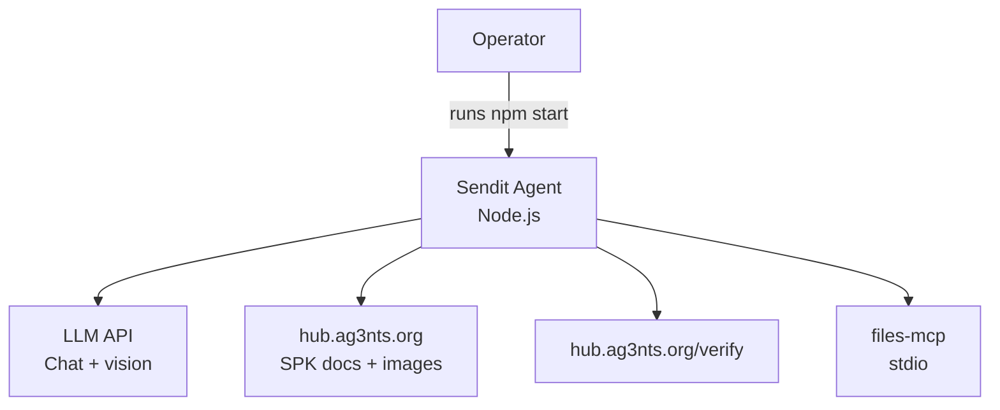

---

## 2. Container / deployment view

At runtime, **two OS processes** cooperate: the main agent and the MCP server child process.

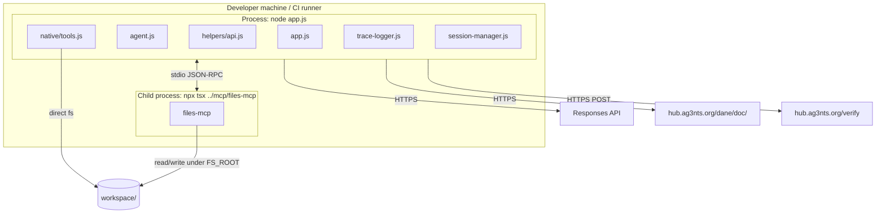

| Integration | Protocol | Config |
|-------------|----------|--------|
| LLM chat + vision | HTTPS + JSON | Root `config.js` — `AI_API_KEY`, `RESPONSES_API_ENDPOINT` |
| MCP filesystem | stdio (MCP SDK) | `mcp.json` — spawns `npx tsx ../mcp/files-mcp/...`, `FS_ROOT: "."` |
| Remote docs | HTTPS GET | `src/config.js` — `docs.indexUrl`, `docs.baseUrl` |
| Verification | HTTPS POST JSON | `src/config.js` — `verify.endpoint`, env `AG3NTS_API_KEY` |

---

## 3. Logical component diagram

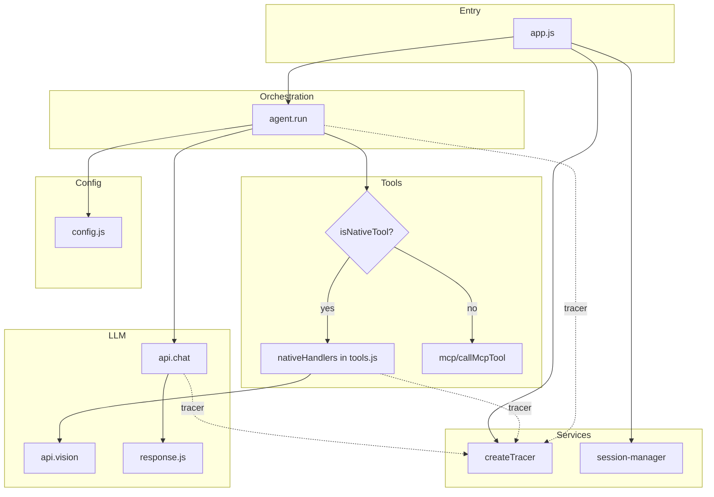

---

## 4. Module map (source tree)

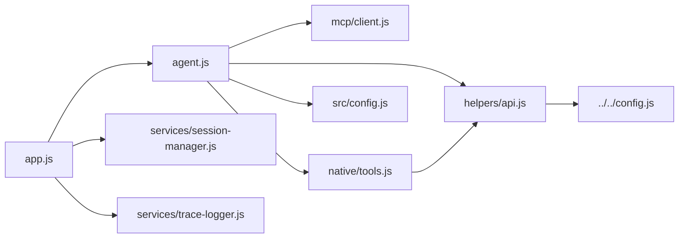

| Path | Role |
|------|------|
| `app.js` | Session + tracer lifecycle, MCP connect, `run()`, insight extraction, trace save |
| `src/agent.js` | Tool-augmented loop (max 60 steps), parallel tool execution |
| `src/config.js` | Model, system **instructions** (pipeline), `task`, `docs`, `verify` |
| `src/helpers/api.js` | `chat`, `vision`, `extractToolCalls`, `extractText` |
| `src/native/tools.js` | Six native tools + `validateDeclaration` |
| `src/mcp/client.js` | Spawn MCP, `listTools`, `callMcpTool`, schema → OpenAI tool format |
| `src/services/trace-logger.js` | In-memory events → `workspace/traces/*.json` |
| `src/services/session-manager.js` | `workspace/sessions/*.json` |

---

## 5. Agent control loop (sequence)

The loop is **stateless in code** beyond the `messages[]` array: the model decides the next action from system instructions + history.

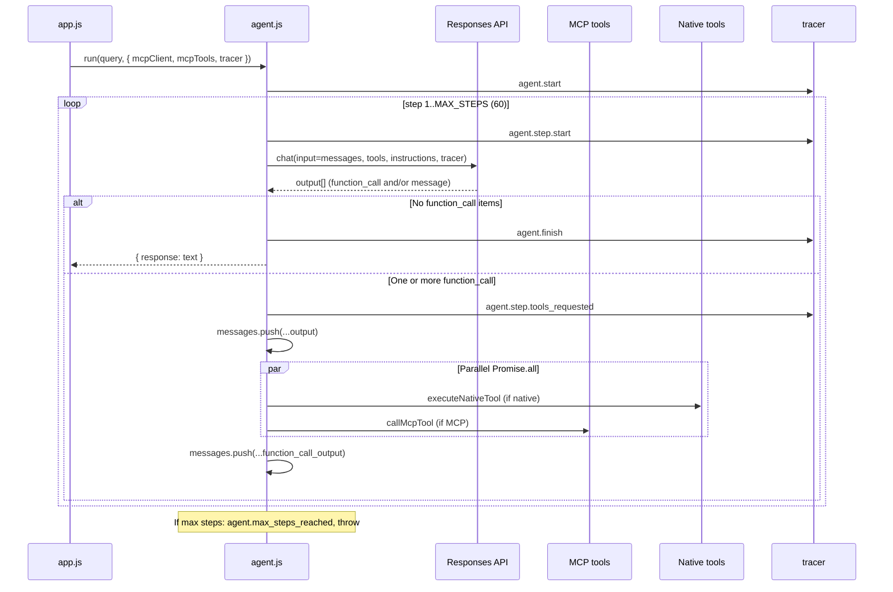

---

## 6. Tool routing and hybrid architecture

All tools are exposed to the model as a single flat `tools` array: MCP tools (from `listTools`) plus `nativeTools` definitions from `tools.js`.

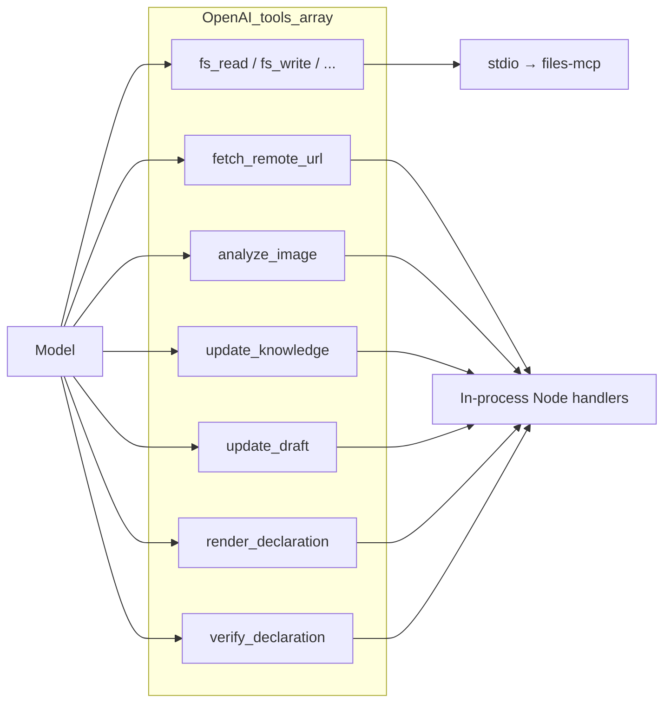

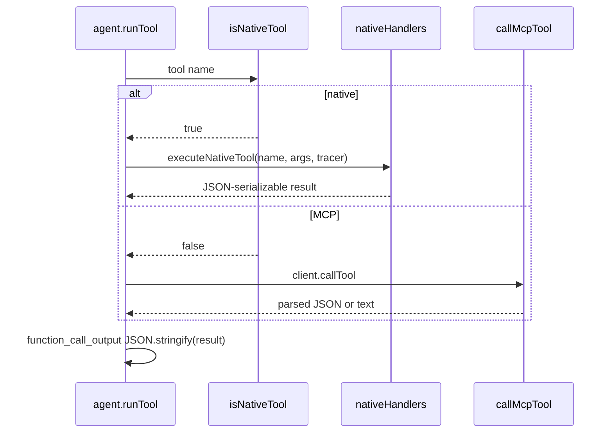

---

## 7. Data flow: documentation → verified declaration

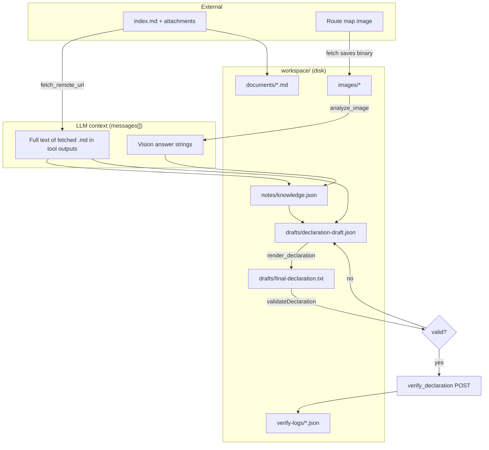

---

## 8. Declaration pipeline: render vs verify (validation gate)

Local validation runs in **`validateDeclaration`** inside `tools.js` before any network verify call. `render_declaration` always validates and still writes `final-declaration.txt`; `verify_declaration` **blocks** the HTTP POST if validation fails.

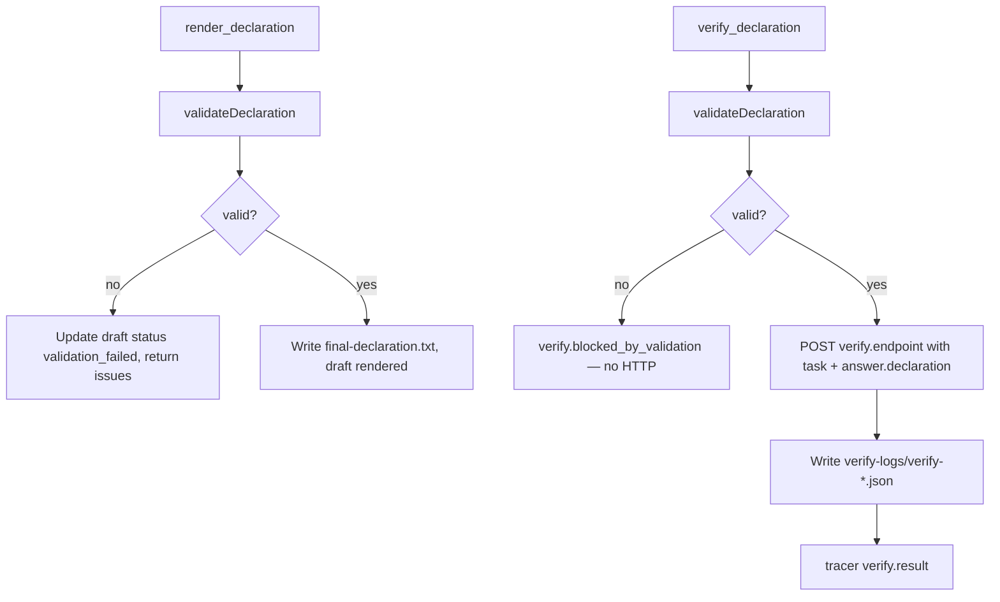

**Deterministic checks** (summary):

- Header marker: `SYSTEM PRZESYŁEK KONDUKTORSKICH - DEKLARACJA ZAWARTOŚCI`
- Footer line: closing `======================================================`
- Oath line present
- Ten labeled fields match regexes (including `KATEGORIA PRZESYŁKI: [A-E]`, `KWOTA DO ZAPŁATY`)
- `KWOTA DO ZAPŁATY` value must be exactly `0 PP` (trimmed)
- At least eight separator lines matching `^-{40,}$` per line

---

## 9. Verification API interaction (sequence)

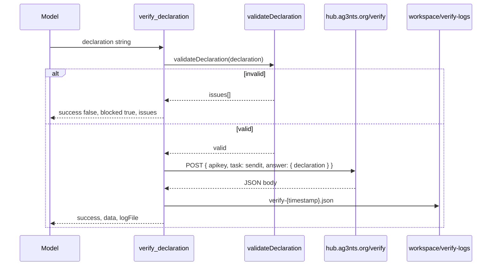

**Success heuristic** (implementation): `data.code === 0` **or** `message` contains `flag` / `FLG` (case-sensitive substring checks).

---

## 10. Observability: tracer injection

The tracer is created once per run and passed into `chat`, `vision`, and native tool handlers. `app.js` post-processes events into session fields.

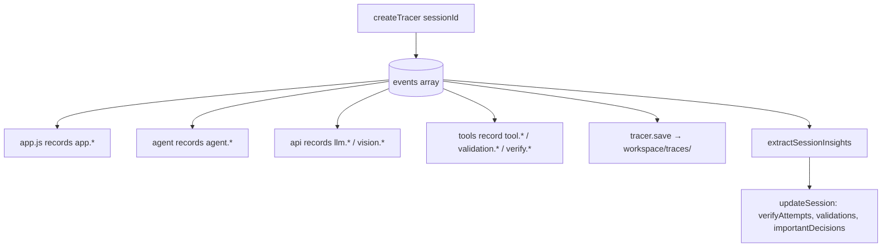

Representative **event families**:

| Prefix | Examples |
|--------|----------|
| `app.*` | `app.start`, `app.mcp_connected`, `app.finish`, `app.error` |
| `agent.*` | `agent.start`, `agent.step.start`, `agent.tool.dispatch`, `agent.finish` |
| `llm.*` / `vision.*` | Request/response/error metadata |
| `tool.<name>.*` | Per-tool start/result |
| `validation.result` | Local gate outcome |
| `verify.*` | Remote outcome or blocked-by-validation |

Optional **tool name catalog**: after MCP connects, `tracer.setToolNames([...])` can compact tool references in saved JSON.

---

## 11. Session file lifecycle

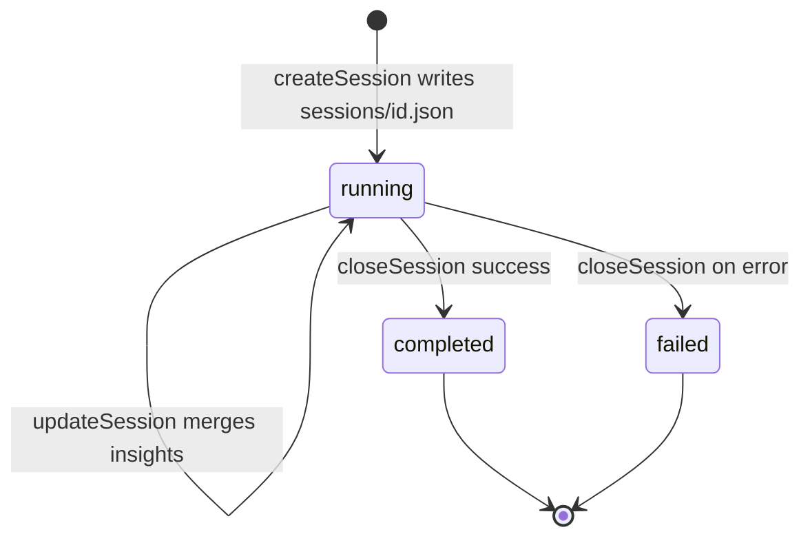

---

## 12. Configuration and secrets

| Variable / file | Used by |
|-----------------|---------|
| Root `.env` + `AI_API_KEY` | `helpers/api.js` → LLM |
| `AG3NTS_API_KEY` | `verify_declaration` payload |
| `AI_PROVIDER` / root `config.js` | Resolves `api.model` via `resolveModelForProvider` |
| `VERBOSE` | `logger.js` verbosity |
| `mcp.json` | MCP command, args, `FS_ROOT` |

---

## 13. Failure modes

| Failure | Behavior |
|---------|----------|
| LLM HTTP error | `llm.error` trace, exception propagates; `app.error`, session closed failed, trace saved |
| MCP spawn failure | Exception before agent loop |
| Tool throws | `function_call_output` contains `{ error: message }`, `agent.tool.error` |
| Max 60 steps | `agent.max_steps_reached`, process error |
| Missing `AG3NTS_API_KEY` | Verify POST still attempted with empty key; server likely rejects (warning at startup) |

---

## 14. Related documents

- [BUSINESS_OVERVIEW.md](./BUSINESS_OVERVIEW.md) — domain, shipment, business process, glossary  
- [README.md](./README.md) — how to run and workspace layout  
- [specs/ARCHITECTURE.md](./specs/ARCHITECTURE.md) — extended narrative + example timelines  
