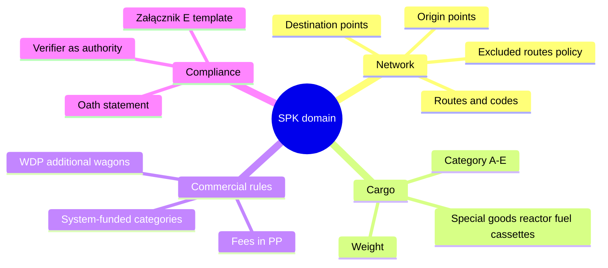
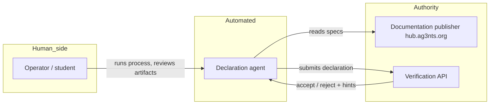
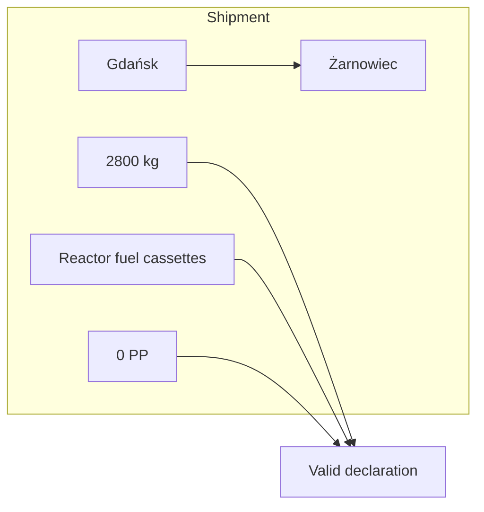
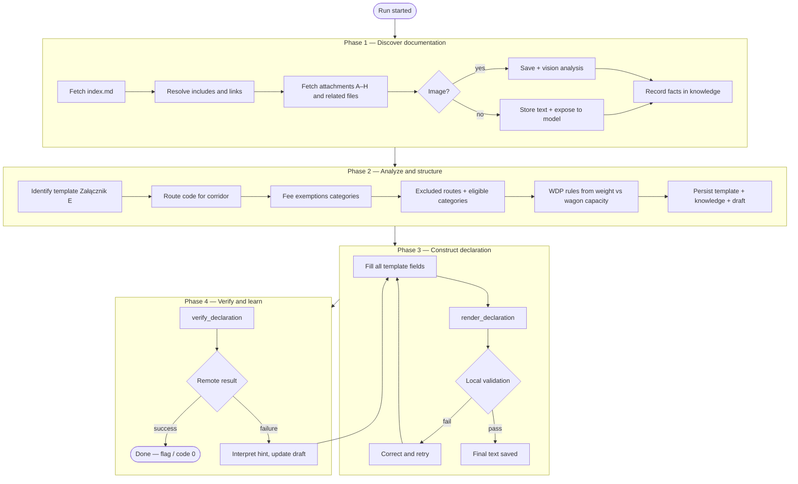
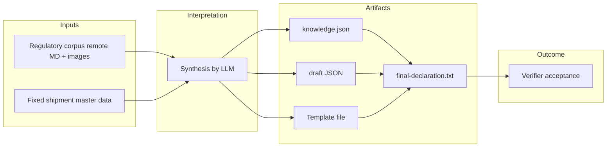
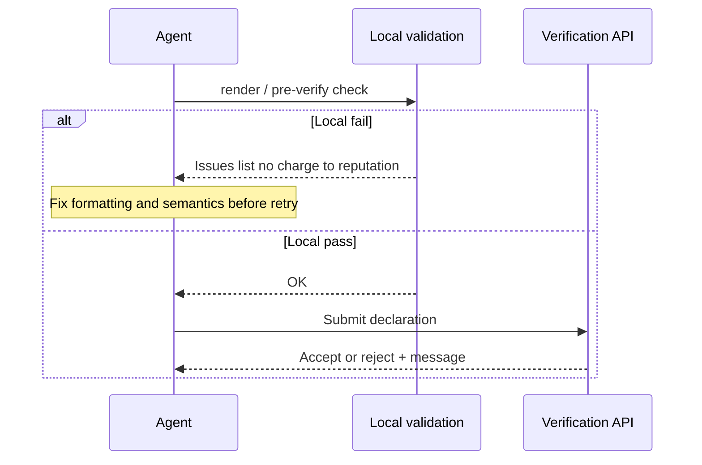
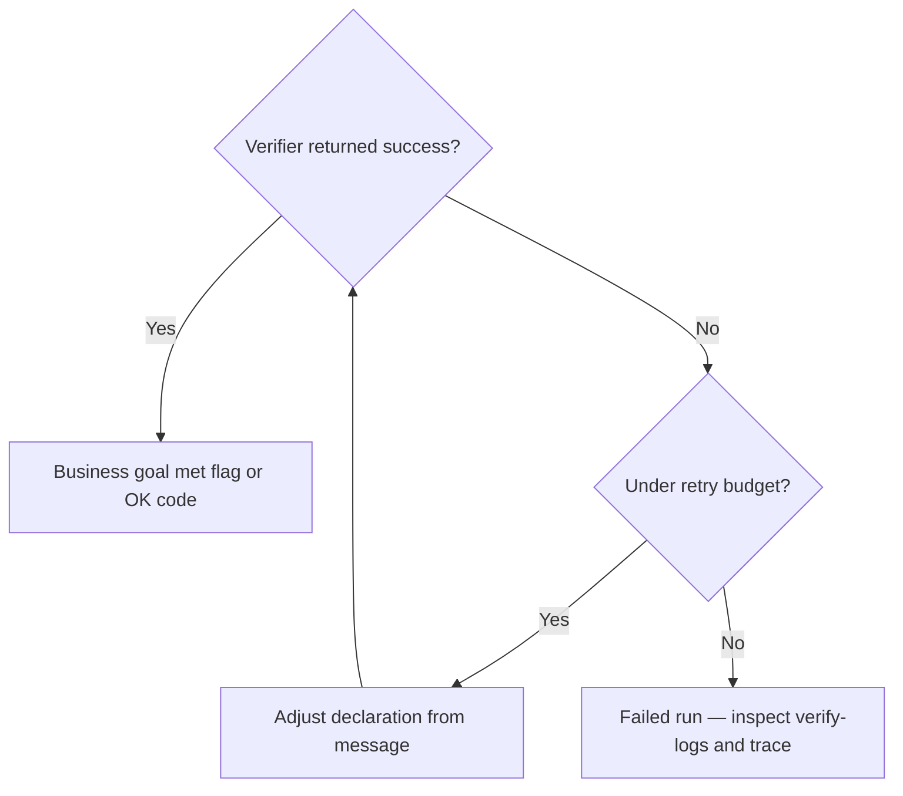

# Sendit Declaration Agent — Business Overview

This document explains the **business and domain** aspects of the `01_04_zadanie` solution: what problem it solves, who the actors are, what rules govern a valid shipment declaration, and how success is measured. For containers, APIs, and code structure, see [ARCHITECTURE.md](./ARCHITECTURE.md).

---

## 1. Executive summary

The **Sendit** exercise is a learning scenario set in a fictional **post-apocalyptic rail parcel network** called **SPK** (*System Przesyłek Konduktorskich* — Conductor Parcel System). The **business outcome** is to produce a **formally correct shipping declaration** for a specific cargo and have it **accepted** by a central verification service, which returns a **success token (flag)**.

Rather than a human filling the form, this solution uses an **autonomous LLM-driven agent** that:

1. Discovers and reads official SPK documentation hosted remotely  
2. Derives template structure, route codes, fee and category rules  
3. Fills a declaration that satisfies **zero-budget (0 PP)** and **template fidelity** constraints  
4. Submits to verification and **self-corrects** using feedback  

From a business perspective, the agent is a **digital worker** that automates **compliance research + data entry + submission** for a single, well-defined shipment.

---

## 2. Domain model (conceptual)

---

## 3. Actors and responsibilities

| Actor | Role |
|-------|------|
| **Operator** | Starts the run, supplies API keys, inspects `workspace/` and traces for learning |
| **Agent (LLM + tools)** | Interprets regulations, builds declaration, iterates on validation and verify feedback |
| **Documentation host** | Source of truth for templates, routes, categories, pricing tables, maps (including images) |
| **Verification service** | Authoritative gate: only its response counts as **business acceptance** |

---

## 4. The business “order” — fixed shipment

The task is **not** an open-ended chat; it is a **single shipment** with fixed master data (also embedded in `src/config.js` and the runtime user query in `app.js`).

| Attribute | Value |
|-----------|-------|
| Task name | `sendit` |
| Sender ID (NADAWCA) | `450202122` |
| Origin (PUNKT NADAWCZY) | Gdańsk |
| Destination (PUNKT DOCELOWY) | Żarnowiec |
| Weight | 2800 kg |
| Cargo description | Kasety z paliwem do reaktora |
| **Budget constraint** | **0 PP** — must be free or system-funded |

---

## 5. Business process (four phases)

The **system instructions** given to the model encode a **linear pipeline** with feedback loops. This is the business process the agent is expected to follow.

---

## 6. Value chain (business data lineage)

**Business meaning of artifacts:**

| Artifact | Purpose |
|----------|---------|
| `knowledge.json` | Structured **memory** of interpreted rules (route, categories, notes) |
| `declaration-draft.json` | **Work in progress** for field values and status |
| `final-declaration.txt` | **Customer-facing document** equivalent — what would be filed |
| `verify-logs/*.json` | **Audit trail** of each submission attempt |

---

## 7. Business rules vs technical enforcement

Some rules are **policy** (the model must obey via instructions); others are **machine-checked** before or during submission.

| Rule | Business intent | How enforced |
|------|-----------------|--------------|
| Match **Załącznik E** layout | Interoperability with SPK back office | Instructions + **regex validation** (markers, fields, separators, oath) |
| **KWOTA DO ZAPŁATY: 0 PP** | Shipment must be system-funded | Instructions + **exact string check** on cost line |
| **KATEGORIA PRZESYŁKI** | Correct exemption class | Instructions + pattern `[A-E]` in validator |
| Route / exclusions | Safety and network policy | Instructions + evidence from docs and **vision** on map image |
| Verifier hints | Final interpretation of “correct” | **Human-readable feedback loop** in conversation |

---

## 8. Collaboration scenario: local vs remote quality gates

From a **risk management** perspective, the pipeline uses **two lines of defense**.

**Business benefit:** avoid **unnecessary rejections** and **noisy attempts** for purely syntactic mistakes (e.g. `0` instead of `0 PP`), while still treating the **remote verifier** as the only final authority.

---

## 9. Success criteria and KPIs (learning / exercise context)

| Metric | Meaning |
|--------|---------|
| **Verifier success** | HTTP response interpreted as success (`code === 0` or flag-like message) |
| **Iteration count** | How many render/verify cycles were needed — proxy for **process efficiency** |
| **Local validation failures** | How often the agent needed **correction before submit** |
| **Trace completeness** | Whether the run is **auditable** for coursework |

---

## 10. Constraints and assumptions

- **Single-run autonomy:** the model is instructed not to ask the user questions mid-flight.  
- **Documentation is authoritative:** field values must be **evidence-based** from docs, not guessed.  
- **Restricted attachments:** some documents may return “higher clearance” messages — business response is to **skip** and continue.  
- **Learning priority:** rich tracing and persistent workspace trump production hardening (see [README.md](./README.md)).

---

## 11. Glossary

| Term | Meaning |
|------|---------|
| **SPK** | Fictional conductor parcel system in the exercise |
| **PP** | Currency unit for fees in the scenario |
| **WDP** | Additional wagons beyond a standard consist (business field on the form) |
| **Załącznik E** | Attachment containing the **declaration template** |
| **Verifier** | Remote service that validates the submission for task `sendit` |
| **Flag** | Token proving successful completion in the exercise |

---

## 12. Related documents

- [ARCHITECTURE.md](./ARCHITECTURE.md) — technical architecture, sequences, data flow  
- [README.md](./README.md) — runbook and event types  
- [specs/ARCHITECTURE.md](./specs/ARCHITECTURE.md) — combined deep dive with example timeline  
