# Sendit Declaration Agent — Architecture & Business Process

## 1. Business Context

The **Sendit** exercise simulates a post-apocalyptic transport system called **SPK** (System Przesyłek Konduktorskich — Conductor Parcel System). Your goal: build a valid shipping declaration for a specific cargo, submit it to a remote verification endpoint, and receive a flag.

The catch: *you* don't build the declaration. An **autonomous LLM agent** does — by exploring remote documentation, extracting rules, filling a template, and iterating on verification feedback.

### 1.1 The Shipment

| Field | Value |
|---|---|
| Sender ID | `450202122` |
| Origin | Gdańsk |
| Destination | Żarnowiec |
| Weight | 2800 kg |
| Cargo | Kasety z paliwem do reaktora |
| Budget | 0 PP (must be free/system-funded) |

### 1.2 The Challenge

The agent must autonomously:
1. Discover and read all relevant SPK documentation (markdown, images)
2. Extract the declaration template, route codes, fee rules, category exemptions
3. Construct a valid declaration matching the exact template format
4. Pass local validation checks
5. Submit to the verification API and handle success/failure

---

## 2. High-Level Architecture

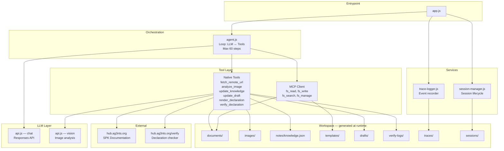

---

## 3. Component Responsibilities

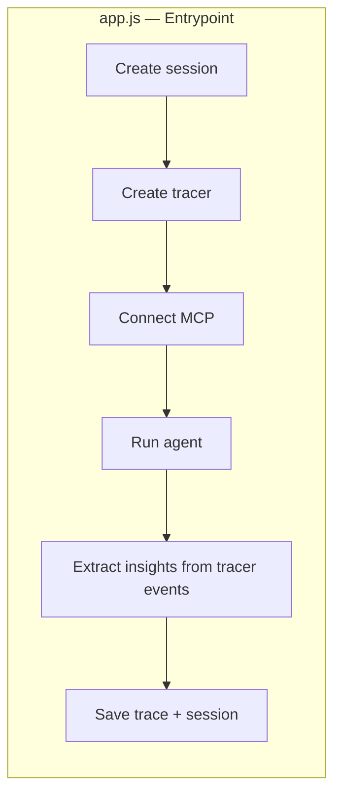

| Component | File | Responsibility |
|---|---|---|
| **Entrypoint** | `app.js` | Creates session, tracer, MCP connection; runs agent; post-processes tracer events into session insights; saves everything |
| **Agent** | `src/agent.js` | Orchestration loop: sends messages+tools to LLM, dispatches tool calls, feeds results back. Stops when LLM returns text (no tool calls) or hits 60 steps |
| **LLM API** | `src/helpers/api.js` | `chat()` — Responses API calls; `vision()` — image analysis. Both accept optional `tracer` for recording request/response events |
| **Native Tools** | `src/native/tools.js` | Domain-specific tools: HTTP fetching, image analysis, knowledge/draft persistence, declaration rendering (with validation), verification submission |
| **MCP Client** | `src/mcp/client.js` | Connects to `files-mcp` server via stdio; provides `fs_read`, `fs_write`, `fs_search`, `fs_manage` |
| **Tracer** | `src/services/trace-logger.js` | In-memory event array; passed as dependency to every layer; dumps single JSON file at end |
| **Session** | `src/services/session-manager.js` | Creates/updates/closes session metadata JSON |
| **Config** | `src/config.js` | Model selection, system instructions (the "brain" of the agent), task parameters, endpoint URLs |
| **Logger** | `src/helpers/logger.js` | Colored console output with optional verbose/explain mode (`VERBOSE=true`) |

---

## 4. The Agent Loop — How Decisions Are Made

### 4.1 Overview — The Full Loop

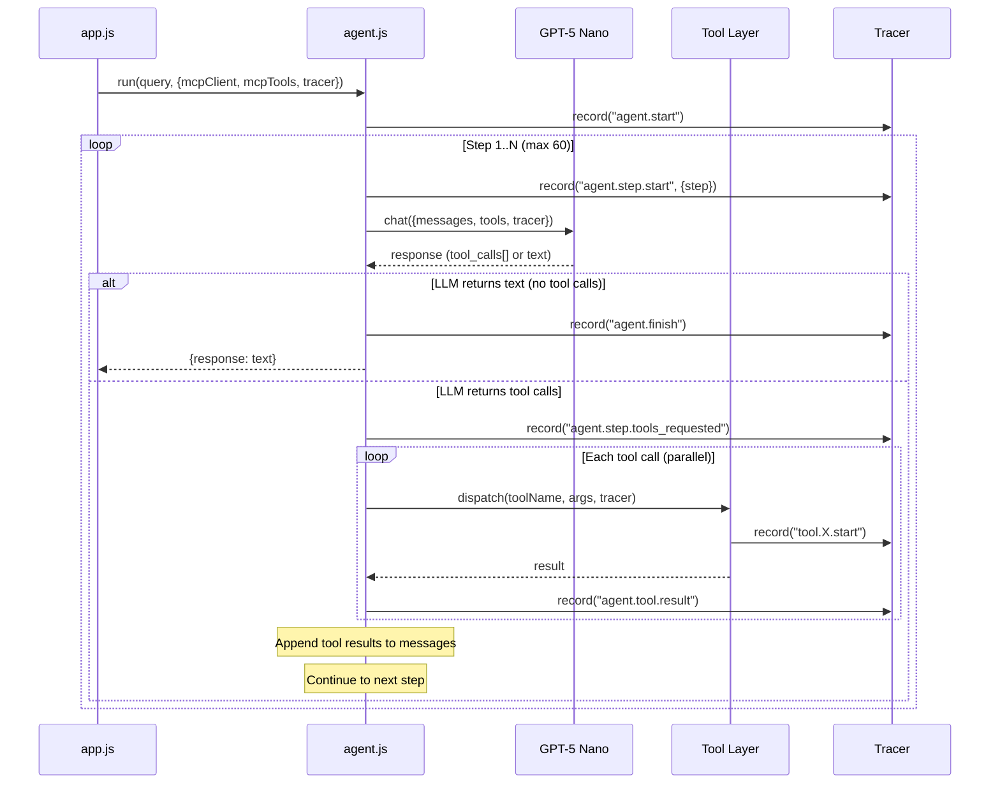

### 4.2 Path A — Tool Calls (steps 1–10 in a typical run)

When the LLM still has work to do, it returns one or more `function_call` items instead of text. The agent dispatches them all in parallel, collects results, and feeds them back as the next conversation turn.

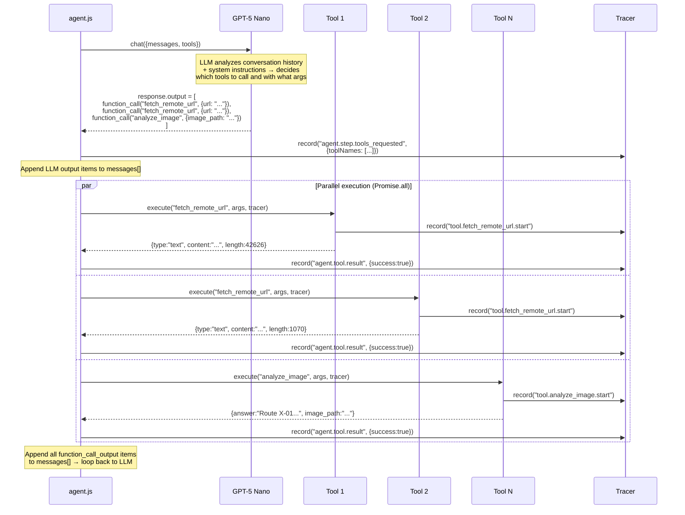

**What happens in the messages array:**

```
messages = [
  {role: "user",                content: "Your objective: Build a valid SPK..."},   // initial query
  {type: "function_call",       name: "fetch_remote_url", arguments: "..."},        // LLM's choice
  {type: "function_call_output", call_id: "...", output: "{content: '...'}"},       // tool result
  {type: "function_call",       name: "update_knowledge", arguments: "..."},        // LLM's next choice
  {type: "function_call_output", call_id: "...", output: "{status: 'updated'}"},    // tool result
  ...                                                                                // grows each step
]
```

The conversation history **is** the agent's memory. Each step the LLM sees everything that happened before and decides the next action.

### 4.3 Path B — Text Response (final step)

When the LLM determines all work is done (verification succeeded, or it has nothing more to do), it returns a text message instead of tool calls. This terminates the loop.

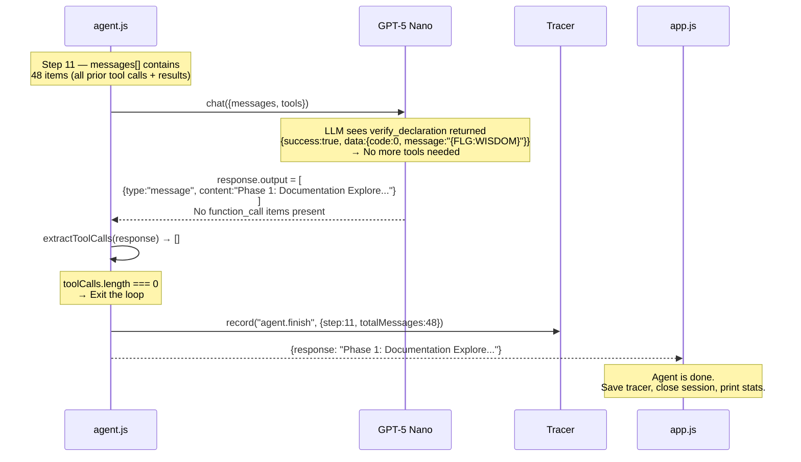

**Why does the LLM stop?** Two reasons:
1. The system instructions say: *"If verify succeeds: report success and stop"*
2. The LLM observes `{success: true, code: 0, message: "{FLG:WISDOM}"}` in the last tool output and recognizes the task is complete

There is no code-level check for "flag found". The LLM itself decides to stop calling tools and emit a text summary instead. The agent loop simply checks: *"are there tool calls? no → return the text."*

**Key insight**: The agent has **no hardcoded control flow**. The LLM decides what to do next based on:
1. The **system instructions** (the pipeline defined in `config.js`)
2. The **conversation history** (all prior tool calls and results)
3. The **available tools** (10 tools: 4 MCP + 6 native)

The LLM acts as the "brain" — it reads documentation, decides which files to fetch, interprets content, builds the declaration, and iterates on errors. The code simply provides the loop and the tools.

---

## 5. Business Process — The 4 Phases

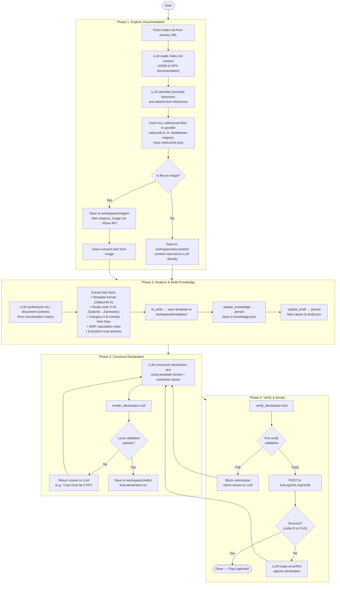

---

## 6. How the Agent Discovers and Selects Files

**This is the most interesting part architecturally.**

The agent **fetches ALL files** — it does not selectively pick only relevant ones. Here's exactly what happens, reconstructed from the trace:

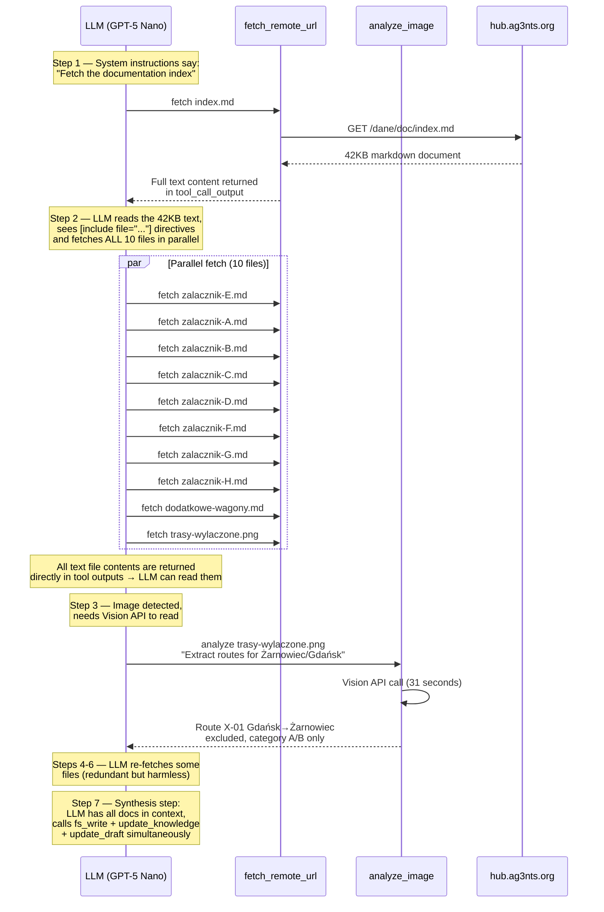

### Why "fetch ALL"?

The system instructions explicitly tell the agent:

> *"Fetch ALL attachments (zalacznik-A through H, dodatkowe-wagony, trasy-wylaczone, etc.). Do NOT skip any."*

This is a deliberate design choice:

1. **The LLM cannot predict** which attachment contains critical info until it reads it
2. **The index.md uses `[include file="..."]`** syntax — the LLM parses these references from the text and constructs URLs by prepending the base URL
3. **Some attachments return "access denied"** (e.g., A, B are restricted) — the agent handles this gracefully, noting the restriction and moving on
4. **The image (trasy-wylaczone.png)** requires a separate Vision API call — the `fetch_remote_url` tool saves it as binary and tells the LLM to use `analyze_image`

### The Discovery Chain

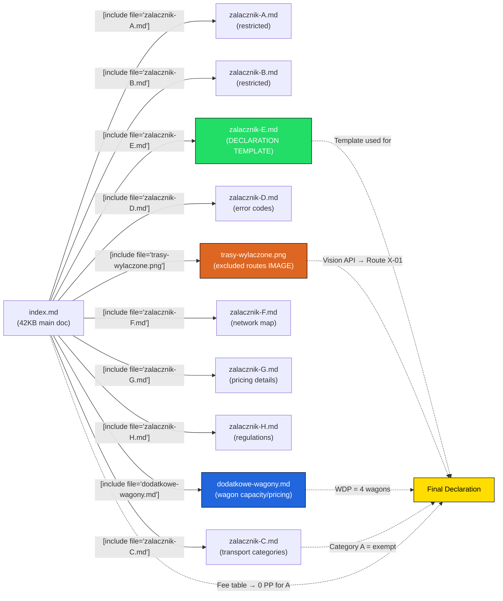

---

## 7. Data Flow — From Raw Docs to Verified Declaration

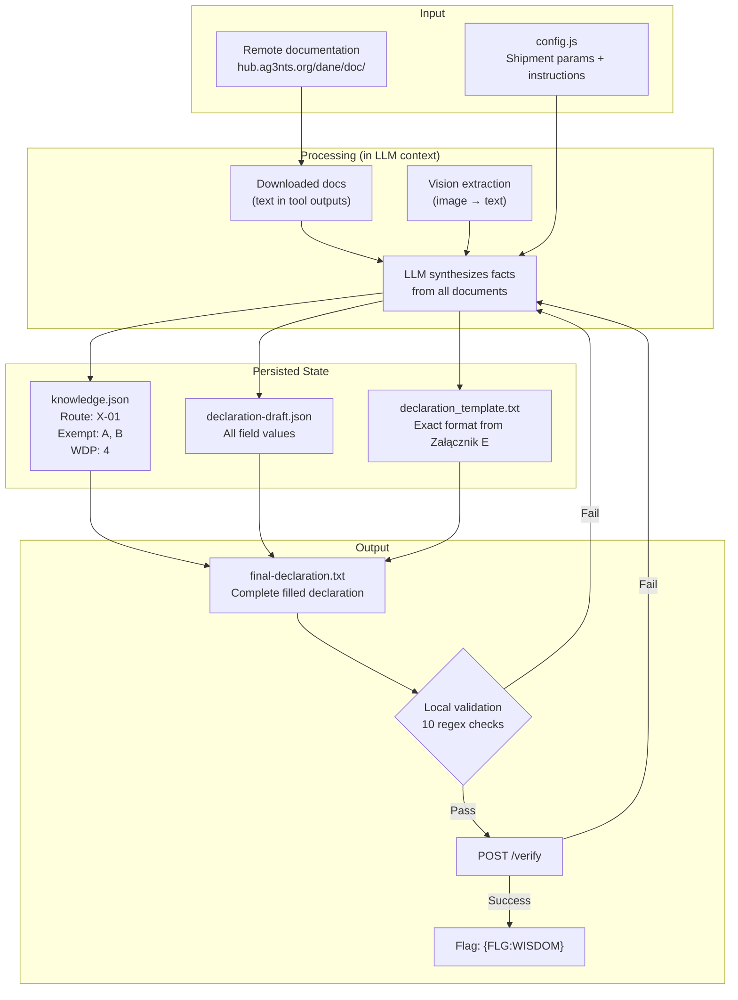

---

## 8. Tracing & Observability

The tracer is a **dependency-injected event recorder** created at startup and passed to every layer.

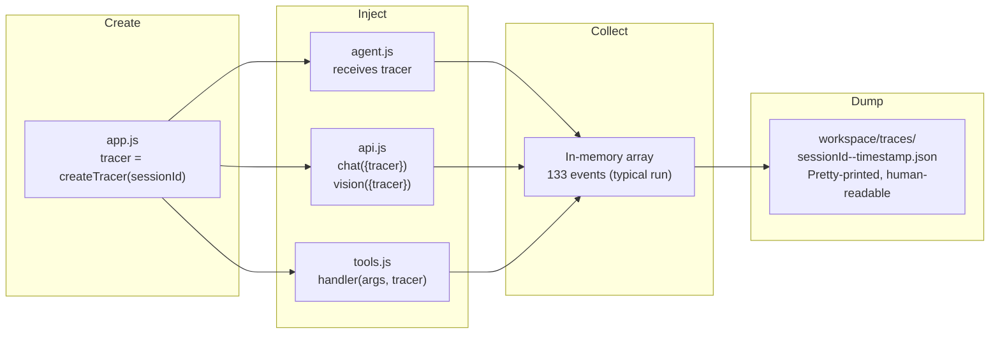

### Event Timeline (from actual run)

```mermaid
gantt
    title Agent Run Timeline - 11 steps, ~4 minutes
    dateFormat s
    axisFormat %S s

    section Phase 1 - Explore
    Fetch index.md                          :fetch1, 0, 10s
    Fetch 10 attachments in parallel        :fetch2, after fetch1, 10s
    Vision analysis of trasy-wylaczone.png  :vision, after fetch2, 32s
    Re-fetch index and dodatkowe-wagony     :refetch1, after vision, 15s
    Re-fetch zalacznik-E                    :refetch2, after refetch1, 1s

    section Phase 2 - Analyze
    Synthesis - fs_write, knowledge, draft  :synth, after refetch2, 67s

    section Phase 3 - Construct
    render_declaration FAIL - 0 not 0 PP   :crit, render1, after synth, 26s
    render_declaration PASS                 :render2, after render1, 22s

    section Phase 4 - Verify
    verify_declaration SUCCESS              :done, verify, after render2, 4s
    Final summary text generation           :summary, after verify, 43s
```

---

## 9. Tool Interaction Patterns

### 9.1 Hybrid Tool Architecture

The agent has two categories of tools:

```mermaid
graph TB
    subgraph "MCP Tools (via stdio server)"
        FS_READ["fs_read<br/>Read file from workspace"]
        FS_WRITE["fs_write<br/>Write file to workspace"]
        FS_SEARCH["fs_search<br/>Search file contents"]
        FS_MANAGE["fs_manage<br/>Create/delete/move files"]
    end

    subgraph "Native Tools (in-process JS)"
        FETCH["fetch_remote_url<br/>HTTP GET → save locally"]
        ANALYZE["analyze_image<br/>Vision API on local image"]
        KNOWLEDGE["update_knowledge<br/>Merge facts into JSON"]
        DRAFT_TOOL["update_draft<br/>Merge fields into JSON"]
        RENDER["render_declaration<br/>Save + validate declaration"]
        VERIFY["verify_declaration<br/>Validate + POST to API"]
    end

    AGENT["agent.js"] --> FS_READ
    AGENT --> FS_WRITE
    AGENT --> FS_SEARCH
    AGENT --> FS_MANAGE
    AGENT --> FETCH
    AGENT --> ANALYZE
    AGENT --> KNOWLEDGE
    AGENT --> DRAFT_TOOL
    AGENT --> RENDER
    AGENT --> VERIFY
```

**Why hybrid?** MCP provides a standardized filesystem interface, but domain-specific operations (HTTP fetching, verification API, structured JSON merging) need custom logic. The agent doesn't know the difference — both appear as function tools in the OpenAI Responses API format.

### 9.2 Validation Gate (Step 13)

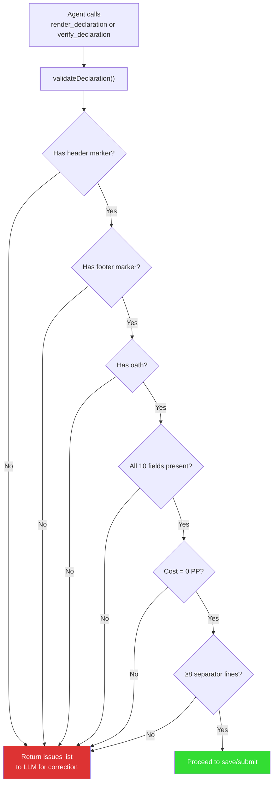

In the actual run, the first `render_declaration` call failed validation because the agent wrote `KWOTA DO ZAPŁATY: 0` instead of `KWOTA DO ZAPŁATY: 0 PP`. The validation caught this, returned the issue, and the agent corrected it on the next attempt.

---

## 10. Session & Post-Run Analysis

After the agent finishes, `app.js` scans the tracer event array to extract structured insights:

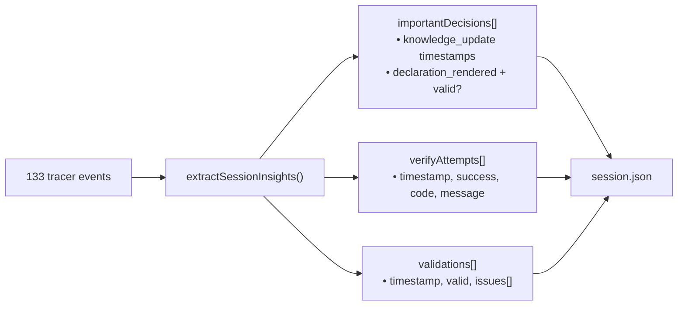

This means you can look at just the session file for a high-level summary, or dive into the full trace for step-by-step debugging.

---

## 11. File Map

```
01_04_zadanie/
├── app.js                              # Entrypoint
├── package.json                        # Dependencies
├── mcp.json                            # MCP server config (files-mcp)
├── specs/
│   ├── prompt-start.md                 # Original exercise prompt
│   ├── SPEC_SENDIT_STEP_BY_STEP.md     # 16-step implementation guide
│   └── ARCHITECTURE.md                 # ← This file
├── src/
│   ├── agent.js                        # Orchestration loop
│   ├── config.js                       # Model, instructions, task params
│   ├── helpers/
│   │   ├── api.js                      # LLM chat + vision (with tracer)
│   │   ├── logger.js                   # Console output + verbose mode
│   │   ├── response.js                 # Extract text from API response
│   │   ├── shutdown.js                 # SIGINT/SIGTERM handler
│   │   └── stats.js                    # Token usage counter
│   ├── mcp/
│   │   └── client.js                   # MCP stdio client
│   ├── native/
│   │   └── tools.js                    # 6 native tools + validation
│   └── services/
│       ├── trace-logger.js             # Dependency-injected event recorder
│       └── session-manager.js          # Session lifecycle management
└── workspace/                          # Generated at runtime (deletable)
    ├── documents/                      # Downloaded .md files
    ├── images/                         # Downloaded .png files
    ├── notes/knowledge.json            # Extracted facts
    ├── templates/                      # Declaration template
    ├── drafts/                         # Draft JSON + final .txt
    ├── verify-logs/                    # Each verify attempt
    ├── sessions/                       # Session metadata
    └── traces/                         # Full event traces
```

---

## 12. Key Learning Points

1. **The LLM is the orchestrator** — there is no `if/else` control flow deciding what to fetch or how to fill fields. The system instructions define the pipeline; the LLM follows it, making decisions based on document content.

2. **Tool outputs are the LLM's "eyes"** — when `fetch_remote_url` returns a document's full text, that text goes into the conversation history. The LLM literally reads the documentation. This is why the agent fetches everything: it needs the content in its context window.

3. **`[include file="..."]` is not parsed by code** — the LLM reads this syntax in the index.md text and decides to construct URLs for each file. This is emergent behaviour guided by the system instructions.

4. **Local validation catches formatting errors before wasting API calls** — the `0` vs `0 PP` issue was caught deterministically, saving a round-trip to the verify endpoint.

5. **The tracer-as-dependency pattern** makes every layer observable without coupling layers to each other. The tracer is just a `{ record, save }` object.

6. **Workspace is ephemeral** — delete it entirely and re-run. Everything regenerates. This makes debugging easy: just look at the workspace after a run.
