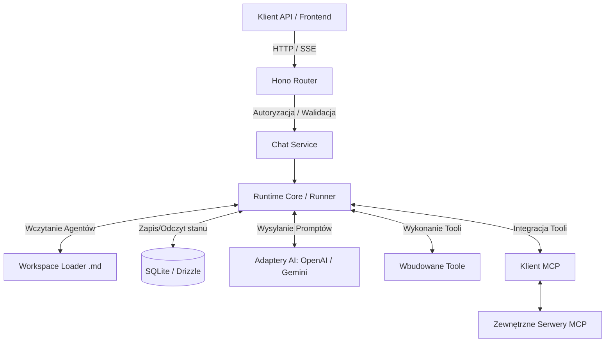
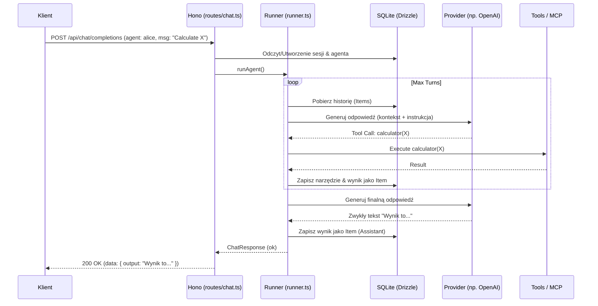

# Architektura Projektu: Agent API

Dokumentacja techniczna opisująca realne działanie, architekturę oraz sposób użytkowania wielomodelowego serwera AI z obsługą agentów (Agent API). Dokument przygotowany dla programistów do szybkiego zapoznania się z projektem.

---

## 1. Podsumowanie projektu

**Co robi aplikacja:**
Aplikacja to serwer backendowy (Node.js/TypeScript) realizujący asynchroniczną, stanową platformę dla agentów AI. Wystawia API HTTP (REST/SSE) do prowadzenia konwersacji, w trakcie których modele językowe (LLM) mogą korzystać z wbudowanych narzędzi (np. kalkulator) oraz zewnętrznych narzędzi dzięki standardowi MCP (Model Context Protocol).

**Jaki problem rozwiązuje:**
Upraszcza budowanie zaawansowanych, "myślących" agentów AI, którzy potrafią wykonywać wieloetapowe zadania (multi-turn logic), wywoływać inne pod-agenty (delegacja) oraz bezpiecznie korzystać z zewnętrznych narzędzi i kontekstów bez konieczności ponownego pisania logiki orkiestracji za każdym razem.

**Główny scenariusz użycia:**
Użytkownik (klient API) wysyła zapytanie do konkretnego, wcześniej zdefiniowanego Agenta (np. `alice`). Aplikacja wznawia lub tworzy nową sesję, przekazuje historię rozmowy do LLM, wykonuje pętlę narzędzi (np. odpytuje web search, czyta pliki przez MCP) i ostatecznie przesyła przetworzoną odpowiedź tekstową z powrotem do użytkownika (lub za pomocą strumieniowania SSE).

**Najważniejsze elementy techniczne:**
- **TypeScript & Node.js** (uruchamiany przez `tsx`).
- **Hono** – minimalistyczny framework HTTP.
- **SQLite + Drizzle ORM** – do trzymania stanu sesji, konfiguracji agentów i historii wiadomości (`items`).
- **Natywna obsługa LLM** – wsparcie dla OpenAI, OpenRouter oraz Gemini za pomocą wzorca adapterów.
- **MCP (Model Context Protocol)** – dynamiczne łączenie się z zewnętrznymi procesami/serwerami udostępniającymi narzędzia.

---

## 2. Architektura wysokopoziomowa

Aplikacja zbudowana jest jako warstwowy, stanowy backend z naciskiem na wydzielenie logiki AI od transportu HTTP.

1. **Warstwa Transportu (HTTP/API)** – obsługuje zapytania przychodzące, waliduje je (Zod) i autoryzuje.
2. **Warstwa Usług / Orkiestracji (Service)** – przygotowuje sesję i przygotowuje kontekst dla agenta.
3. **Warstwa Runtime (Core)** – serce systemu (pętla `runner.ts`); zarządza cyklem życia agenta, komunikuje się z adapterami providerów AI i wywołuje narzędzia.
4. **Warstwa Narzędzi (Tools & MCP)** – udostępnia agentom funkcje (np. web_search) oraz integruje systemy zewnętrzne (serwery MCP).
5. **Warstwa Danych (Repositories)** – utrwala historię interakcji (Items) i stan agenta w bazie SQLite, używając Drizzle ORM.



---

## 3. Struktura repozytorium

Struktura wymusza podział na część frameworkową (`src`), dane uruchomieniowe (baza danych) oraz elastyczne definicje agentów (`workspace`).

- **`src/index.ts`** – **Entry point**. Inicjalizuje bazę, providerów, narzędzia, podpina serwer Hono i zarządza pełnym cyklem startu/stopu.
- **`src/runtime/`** – **Główna logika**. Tutaj działa pętla agenta (`runner.ts`), która zarządza turami rozmowy, obsługuje narzędzia (zarówno wbudowane jak i czekające na odpowiedź – asynchroniczne).
- **`src/routes/`** – Routing i handlery żądań (`chat.ts`, `chat.service.ts`). Punkt styku świata zewnętrznego z aplikacją.
- **`src/repositories/`** – Warstwa dostępu do bazy SQLite (`schema.ts` definiuje encje Drizzle, np. `users`, `sessions`, `agents`, `items`).
- **`src/providers/`** – Adaptery API dla LLM. Abstrahują interfejsy (OpenAI vs Gemini) do wspólnego modelu (`ProviderInputItem`, `ProviderOutputItem`).
- **`src/tools/`** – Wbudowane w system narzędzia (kalkulator, native web search, mechanizm delegacji sub-agentów).
- **`src/mcp/`** – Klient Model Context Protocol (ładowanie configów `.mcp.json`, autoryzacja OAuth, wywoływanie zewnętrznych narzędzi).
- **`src/workspace/`** – Ładowarka (loader) odczytująca pliki Markdown (`.agent.md`) z definicjami agentów.
- **`workspace/agents/`** – Folder, w którym znajdują się pliki tekstowe (z frontmatterem) precyzujące zachowanie, model i dozwolone narzędzia dla danego agenta (np. `alice.agent.md`).

---

## 4. Główny przepływ działania aplikacji

### Uruchomienie (Bootstrapping)
1. `src/index.ts` -> wywołuje `initRuntime()` z `src/lib/runtime.ts`.
2. Rejestrowani są providerzy AI (na podstawie zmiennych środowiskowych z `.env`).
3. Utworzone zostaje połączenie z bazą (SQLite).
4. Ładowane są narzędzia oraz startuje wbudowany menedżer MCP (który łączy się z zewnętrznymi serwerami na podstawie `.mcp.json`).
5. Uruchamiany jest serwer HTTP na porcie (domyślnie `3000`).

### Wykonanie zapytania (Main Flow)
1. **Request:** Klient wysyła `POST /api/chat/completions` prosząc o interakcję z konkretnym agentem (np. "alice").
2. **Przygotowanie:** `chat.service.ts` waliduje żądanie, wczytuje/tworzy sesję oraz ładuje definicję agenta "alice" z pliku `workspace/agents/alice.agent.md`.
3. **Pętla Agentowa:** Żądanie wchodzi do `src/runtime/runner.ts` (`runAgent`). 
   - Aplikacja formatuje dotychczasową historię bazy z nową wiadomością użytkownika.
   - Jeśli historia jest za długa, algorytm wykonuje *pruning* (streszcza starsze wiadomości za pomocą LLM).
   - Żądanie leci do wybranego providera LLM (np. OpenAI).
4. **Odpowiedź / Narzędzia:**
   - Jeśli odpowiedź to zwykły tekst, pętla jest zamykana, a wynik przesyłany do klienta.
   - Jeśli LLM poprosi o wykonanie funkcji (Function Call), `runner.ts` rozpoznaje czy to tool synchroniczny (np. lokalny kalkulator) czy z serwera MCP. 
   - Wykonuje tool'a, dopisuje wynik jako "function_call_output" do bazy i pętla robi kolejny obrót zwracając wynik do LLM, dopóki ten nie zadecyduje że zadanie jest ukończone.
   - *Uwaga:* Jeżeli LLM zleci zadanie asynchronicznemu zewnętrznemu narzędziu, stan agenta zmienia się na `waiting`, klient dostaje status HTTP 202, i czeka na rozwiązanie (przez `POST /agents/:agentId/deliver`).



---

## 5. Przepływ danych

**Dane Wejściowe:**
- Klient przesyła JSONa z `agent` (nazwa agenta), `input` (treść), opcjonalnie `sessionId` (wznowienie), oraz flagę `stream`.

**Przetwarzanie (Runtime):**
1. **Session & Items:** Zapytanie jest konwertowane na obiekt `Item` (role: 'user') i dopinane do rekordu konkretnego Agenta w `agents` i `sessions`.
2. **ProviderInputItem:** Repozytorium formatuje serię `Item`-ów do interfejsu pośredniego, zrozumiałego dla Adaptera LLM (odrzucając m.in. obiekty czysto systemowe).
3. **Kontekst:** Jeśli rozmowa przekracza określony limit okna kontekstowego (Context Window), wkracza moduł `pruning.ts`, który za pomocą wywołania bocznego streszcza starą część rozmowy i wkłada do `session.summary`.

**Dane Wyjściowe:**
- Czysta odpowiedź do API (`ChatResponse` w formacie JSON) zawierająca `status` (`completed` lub `waiting`) oraz listę fragmentów wyjściowych (zwykły tekst, prośby o wywołania narzędzi).
- W przypadku streamingu (flaga `stream: true`), wysyłany jest ciąg eventów typu `Server-Sent Events` (SSE).

```mermaid
flowchart LR
    Request(Input JSON: wiadomości, parametry) --> Validation(Zod Schema)
    Validation --> DB_Insert[Zapis nowej wiadomości do bazy (Item)]
    DB_Insert --> History[Wczytanie historii (Items) dla Agenta]
    History --> Pruning{Czy za duże okno?}
    Pruning -->|Tak| Summarize[Streszczenie starego kontekstu]
    Pruning -->|Nie| Translate[Konwersja na ProviderInputItem]
    Summarize --> Translate
    Translate --> LLM_Call[Zapytanie do Providera API]
    LLM_Call --> ResponseParse[Odebranie ProviderOutputItem]
    ResponseParse --> ToolCheck{Function Call?}
    ToolCheck -->|Tak| ToolExec[Wywołanie lokalne / MCP]
    ToolExec --> DB_Tool_Save[Zapis wyniku (Item)]
    DB_Tool_Save --> History
    ToolCheck -->|Nie| TextFormat[Złożenie odpowiedzi]
    TextFormat --> DB_Resp_Save[Zapis jako wiadomości asystenta]
    DB_Resp_Save --> Output(Output JSON / SSE)
```

---

## 6. Kluczowe moduły i komponenty

### `src/runtime/runner.ts`
- **Rola**: Engine systemu, procesowanie cyklu życia konwersacji (tzw. Agentic Loop).
- **Odpowiedzialność**: Koordynacja wywołań LLM, wyłapywanie funkcji do wykonania (Function Calling), aktualizacja statusów agenta (`pending`, `running`, `waiting`, `completed`).
- **Zależności**: `RuntimeContext` (baza, toole, mcp), `Provider` (adapter modeli).

### `src/workspace/loader.ts`
- **Rola**: Tłumacz deklaratywnego zachowania z `.md` na obiekt zrozumiały dla serwera.
- **Wejście**: Nazwa agenta (np. "bob").
- **Wyjście**: Obiekt `LoadedAgent` z modelem (np. openai:gpt-4), promptem systemowym z treści pliku markdown oraz tablicą narzędzi. Odczytywane on-the-fly, nie wymaga restartu aplikacji przy zmianie pliku `*.agent.md`.

### `src/tools/definitions/delegate.ts`
- **Rola**: Sub-Agenting (Delegacja). Narzędzie udostępnione samym agentom LLM.
- **Odpowiedzialność**: Gdy agent "rodzic" stwierdzi, że zadanie można podzielić (np. "niech agent tester sprawdzi ten kod"), LLM używa narzędzia `delegate`. Serwer tworzy wtedy zagnieżdżonego "child agent", który posiada własny cykl działania.

### `src/mcp/client.ts`
- **Rola**: Pomost między serwerem a ekosystemem Model Context Protocol.
- **Odpowiedzialność**: Parsuje `.mcp.json`, nawiązuje fizyczne połączenia (procesy `stdio` lub protokół `HTTP/SSE`), pobiera listę narzędzi dostępną na zewnętrznym serwerze i tłumaczy to na strukturę Function Calling wymaganą przez model. Zapewnia też mechanikę OAuth.

---

## 7. Runtime i sposób uruchamiania

Aplikacja jest procesem trwającym w tle (long-running process).

- **Inicjalizacja (`initRuntime`)**: Rozpoczyna się od startu `sqlite` (ew. tworzy plik/folder). Podnoszone są serwery podrzędne (MCP - przez tworzenie procesów dziecka `child_process`). Ładowane są narzędzia (Registry). Rejestruje eventy w `EventEmitter`.
- **Cykl życia (Lifecycle)**: Żądania HTTP są bezstanowe na warstwie HTTP, jednak sesja agenta żyje w bazie danych SQLite. Możliwe jest wznowienie pracy wstrzymanego agenta (np. po zakończeniu asynchronicznego skryptu zewnętrznego), wtedy system re-hydruje stan z bazy na podstawie UUID agenta.
- **Asynchroniczność**: Część narzędzi może być obsługiwana odroczonym wykonaniem. Agent wchodzi w tryb zawieszenia. Gdy zewnętrzny podmiot dostarczy wynik za pomocą `POST /api/chat/agents/:agentId/deliver`, runner wznawia obroty pętli. Pętla wznawiana jest jako async job w tle.
- **Eventy / Telemetria**: Wewnętrzny emiter zdarzeń wysyła sygnały (np. `turn.started`, `tool.called`) z których logiki korzysta logger `pino` oraz trace'er Langfuse.

---

## 8. Konfiguracja i środowisko

Konfiguracja zarządzana jest za pomocą typowanych struktur w `src/lib/config.ts` (na silniku `zod`). 
Zmienne środowiskowe pobierane są poprzez `process.loadEnvFile` – najpierw z `.env` lokalnego (wewnątrz folderu projektu), następnie z korzenia workspace.

**Ważne zmienne środowiskowe (`.env`)**:
- `OPENAI_API_KEY` / `GEMINI_API_KEY` / `OPENROUTER_API_KEY` – klucze dostępowe (wymagany min. jeden).
- `AI_PROVIDER` – wymusza konkretnego providera (np. `openrouter`), jeśli masz podanych kilku.
- `DEFAULT_MODEL` – globalny model startowy (wzór `provider:model`, domyślnie: `openai:gpt-4.1`).
- `DATABASE_URL` – ścieżka do bazy. Domyślnie `file:.data/agent.db`. Do uruchomienia in-memory wystarczy `file::memory:`.
- `AUTH_TOKEN` – Bearer token do autoryzacji zapytań uderzających w API. Skrypt `db:seed` zakłada wstępne konto. (Konfiguracyjnie zapisane jest to zazwyczaj w skryptach systemowych lub przekazywane z zewnątrz).

**Pliki konfiguracyjne projektu**:
- `drizzle.config.ts` – plik potrzebny wyłącznie procesom dev do tworzenia migracji bazy SQLite.
- `.mcp.json` – definicja zewnętrznych serwerów dających dodatkowe narzędzia dla LLM (poza kodem).

---

## 9. Jak uruchomić projekt

Projekt stworzono jako standardowy pakiet na Node.js i rozszerzenie ESM.

**Wymagania:**
- Node.js (v20+)
- Menadżer pakietów: `npm`

**Instalacja krok po kroku:**
1. Instalacja paczek
   ```bash
   npm install
   ```
2. Inicjalizacja konfiguracji (Stwórz i wypełnij `.env`)
   ```bash
   cp .env.example .env
   # Edytuj .env i wpisz np. OPENAI_API_KEY=sk-...
   ```
3. Setup lokalnej Bazy Danych
   ```bash
   # Generuje i nakłada strukturę schematu na bazę .data/agent.db
   npm run db:push 
   # Ważne! Tworzy domyślnego użytkownika potrzebnego do autoryzacji zapytań w API
   npm run db:seed  
   ```
4. Uruchomienie deweloperskie
   ```bash
   npm run dev
   # Serwer wystartuje na http://127.0.0.1:3000
   ```

*Jak sprawdzić, że działa?*
Wykonaj zwykłego GET-a na domyślny port:
```bash
curl -s http://127.0.0.1:3000/health
```
Zwrócony JSON z wartością `"status": "ok"` oznacza sukces i pomyślny start procesów wewnętrznych.

---

## 10. Jak używać rozwiązania

Architektura zakłada użycie serwera via API. Agent sam w sobie nie posiada na tym repozytorium interfejsu graficznego (UI).

**Podstawowy scenariusz (One-Shot):**
Wysyłamy zapytanie, narzucając użycie wcześniej napisanego w folderze `workspace/agents/` szablonu np. `alice`.

```bash
curl -s http://127.0.0.1:3000/api/chat/completions \
  -H "Authorization: Bearer <TWÓJ_TOKEN_Z_SEED>" \
  -H "Content-Type: application/json" \
  -d '{"agent": "alice", "input": "Cześć! Opowiedz mi suchara."}'
```
Agent wczyta plik `alice.agent.md`, załaduje stamtąd np. dozwolone modele, prompt z wgraną osobowością "Alice" i zrealizuje logikę przez LLM. Oczekuj odpowiedzi typu `ChatResponse` (zawierającej m.in `sessionId` oraz `output`).

**Konwersacja wieloetapowa (Multi-turn z pamięcią):**
Jeżeli chcesz podtrzymać kontekst, musisz podać w następnym żądaniu `sessionId` otrzymane w pierwszym kroku, np.:
`{"agent": "alice", "sessionId": "id_sesji", "input": "A czy znasz jeszcze jakiś inny w podobnym stylu?"}`

System w `runner.ts` odszuka w SQLite dotychczasowe `items` połączone z sesją i agenty "przypomną sobie" całą konwersację.

**Zarządzanie Zdolnościami Agentów:**
Developer szybko tworzy nową "postać" lub zestaw kompetencji przez wklejenie do dysku projektu pliku np. `workspace/agents/coder.agent.md`. Dodając na górze pliku w sekcji YAML `tools: [files__fs_read, files__fs_write]` i pisząc instrukcje "Jesteś programistą", sprawia że API od razu będzie potrafiło odpalać agenty do refaktoryzacji plików na dysku.

---

## 11. Ważne decyzje architektoniczne

- **Database-First State Management**: Trzymanie "stanu" agentów w bazie SQL (SQLite) zamiast w pamięci. Pozwala to na pełne odtwarzanie sesji, wznowienia po awariach lub wywoływaniu długo działających zadań w tle (status `waiting`).
- **Adapter Pattern dla Providerów API**: Aplikacja nie rzeźbi promptów na sztywno pod interfejs OpenAI. Istnieje pośrednia struktura `ProviderInputItem`. Pozwala to łatwo zmieniać silnik AI z GPT-4 na Gemini Flash bez dotykania logiki biznesowej czatu (Runnera).
- **Deklaratywni Agenci na Dysku (.md)**: Zrezygnowanie z kodowania agentów w bazie czy wewnątrz struktur `.ts` na rzecz zwykłych plików Markdown na systemie plików. Mocno ułatwia to modyfikację (skracanie pętli feedbacku – nie ma potrzeby restartu serwera po zmienieniu zachowania agenta w .md).
- **Dynamiczna sieć narzędzi za pomocą MCP**: Zamiast uczyć serwera komunikacji z 100 różnych narzędzi, aplikacja rozumie jeden protokół ustandaryzowany MCP. Narzędzia dostarczane są jako serwisy (procesy obok).

---

## 12. Ryzyka, luki i trudniejsze miejsca

- **Kompresja kontekstu (Pruning)**: Pamięć o starych konwersacjach nie jest realizowana przez wektory (RAG/Embeddings), ale przez system kompresji LLM, który "streszcza" dotychczasowe wiadomości jeśli zbiór historii w bazie przekracza określoną długość okna. Przy bardzo zaawansowanych, detalicznych długich ciągach czatu, LLM może gubić precyzyjne fakty przez zjawisko stratnej kompresji przy tworzeniu podsumowania.
- **Asynchroniczny Workflow `waiting` / `deliver`**: Aby w pełni korzystać z narzędzi bez implementacji `sync` (trwających długo po stronie klienta), klient zmuszony jest rozpoznać status HTTP 202, wstrzymać się, a potem wymusić zwrot danych oddzielnym punktem RESTowym (deliver). Pomyłki w sieci lub zawieszenia klientów mogą skutkować martwymi procesami Agentów "wisiałymi" na zawsze w bazie SQLite (status waiting). Brak wyraźnego "dead-letter queue" lub auto-cleanup timerów w kodzie dla martwych agentów.
- **Pętle delegacyjne (Sub-Agents)**: Delegacja to poteżne narzędzie, ale Agent-matka może wywołać pod-agenta, który np. źle zrozumie problem. Koszty użycia tokenów API mogą znacząco wzrosnąć w wypadku nieskończonych prób "poprawiania" pod-procesów. Nałożono miękki "depth guard" ucinający głębokość do max. 5, jednak ilość iteracji `maxTurns` na danym poziomie wciąż wymaga bacznej kontroli.

---

## 13. Szybki przewodnik po kodzie

- **Gdzie startuje aplikacja?**
  Zajrzyj do `src/index.ts` oraz inicjalizacji rdzenia w `src/lib/runtime.ts`.
- **Gdzie wejść, by zrozumieć w jaki sposób Agent "myśli" i wymienia komunikaty z LLM?**
  Zajrzyj do pętli zdarzeń w `src/runtime/runner.ts` (szczególnie funkcja `runAgent` oraz `executeTurn`).
- **Gdzie zmieniać definicje struktury danych, np. jak dodać nowe pole do logów konwersacji?**
  Zajrzyj do pliku modelu ORM: `src/repositories/sqlite/schema.ts`.
- **Gdzie jest kod, który odpowiada za "czytanie" plików *.agent.md i decydowanie jakie zachowania ma Agent?**
  Zajrzyj do `src/workspace/loader.ts`.
- **Gdzie odnajdę mechanizm ucinający za długie wiadomości wysyłane do modelu AI?**
  Przeanalizuj mechanikę w `src/utils/pruning.ts` i `summarization.ts`.

---

## 14. Najważniejsze pliki do przeczytania (Top 5)

| Plik / Moduł | Dlaczego warto przeczytać? |
|-------------|----------------------------|
| `src/runtime/runner.ts` | Absolutne "mięso" całego projektu. Tutaj zakodowana jest logika przejść międzystanowych Agenta (Function Call, Wait, Fail, Success, Pruning). |
| `src/routes/chat.service.ts` | Wyjaśnia spięcie między bezstanowym punktem wejścia HTTP REST (i eventów SSE) a stanowymi mechanizmami serca aplikacji LLM. |
| `src/repositories/sqlite/schema.ts` | Mapowanie bazy danych SQLite. Zerknięcie w tabelę `agents` i polimorficzną tabelę wiadomości `items` od razu rozjaśni jak serwer przechowuje dane po stronie dysku. |
| `src/workspace/loader.ts` | Pokazuje koncepcję ładowania osobowości i wbudowanych "zdolności/tooli" agenta z plików Markdown, co jest charakterystyczną siłą tej architektury. |
| `src/tools/definitions/delegate.ts` | Obrazuje jak wyewoluował ten projekt, pozwalając "jednemu LLM" odpalać jako narzędzie "innego LLM" (System Pod-Agentów) wraz z przejmowaniem odpowiedzialności za cel. |
