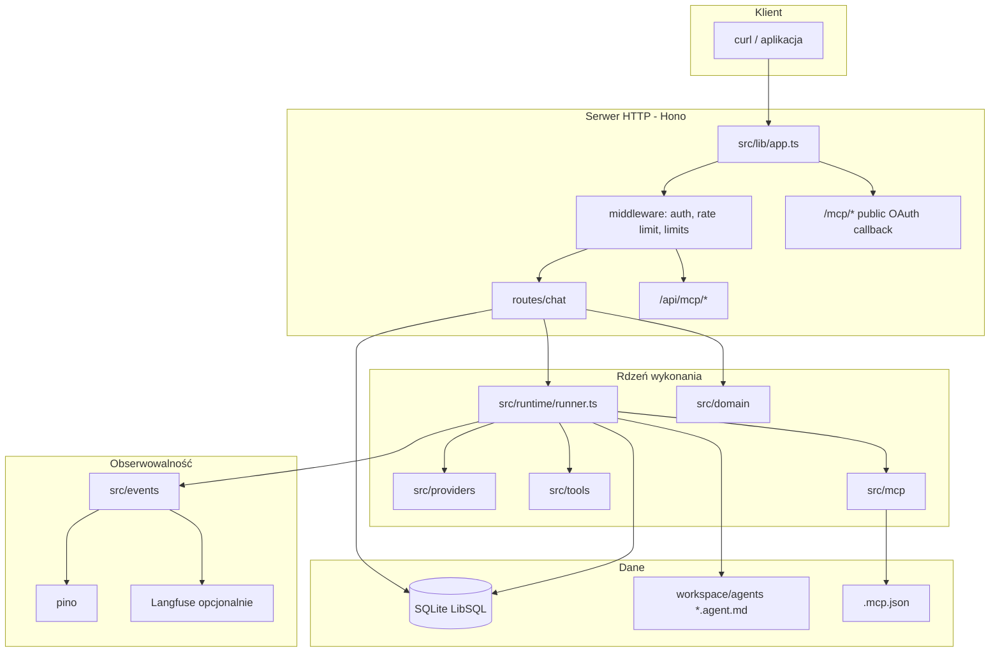
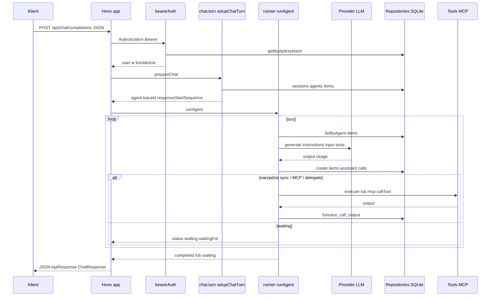
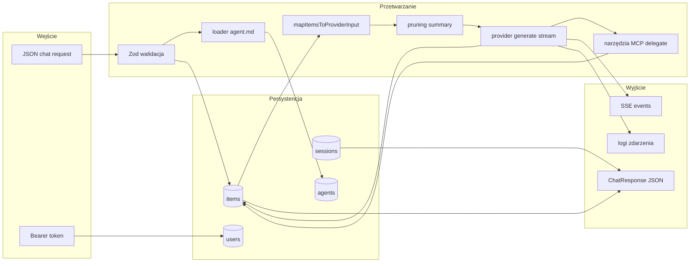

# Architektura projektu `01_05_agent`

Dokument opisuje **rzeczywiste** zachowanie kodu w repozytorium (backend TypeScript, serwer HTTP). Służy onboardingu developera: jak działa system, jak go uruchomić i gdzie szukać logiki.

---

## 1. Podsumowanie projektu

### Co robi aplikacja

Aplikacja to **serwer HTTP** (framework **Hono** na **Node.js**), który udostępnia API do **wieloturowej** rozmowy z modelem LLM w stylu agenta: model może wywoływać **narzędzia** (wbudowane, np. kalkulator i delegacja do innego agenta), narzędzia z **MCP** (Model Context Protocol) oraz — przy nierozpoznanym narzędziu — przejść w stan **oczekiwania** na wynik dostarczony później przez osobny endpoint.

Stan jest **persystowany** w **SQLite** (LibSQL): użytkownicy (klucze API), sesje, agenci, elementy konwersacji (`items`).

Szablony zachowań agentów (instrukcje systemowe, lista narzędzi, domyślny model) wczytywane są z plików **Markdown z front matter** w katalogu workspace (`*.agent.md`).

### Jaki problem rozwiązuje

Scentralizuje uruchamianie „agentowych” scenariuszy: jeden proces serwera, wielu dostawców LLM (OpenAI, OpenRouter przez ten sam adapter HTTP co OpenAI, opcjonalnie Gemini), narzędzia, MCP, śledzenie zdarzeń (logi, opcjonalnie Langfuse/OpenTelemetry), zamiast rozproszonych skryptów bez wspólnego modelu danych i API.

### Główny scenariusz użycia

Klient (np. `curl`, aplikacja zewnętrzna) wysyła **authenticated** żądanie `POST /api/chat/completions` z treścią użytkownika i opcjonalnie nazwą agenta z workspace (`agent: "alice"`) oraz `sessionId` dla kontynuacji. Serwer dopisuje wiadomość do historii, uruchamia pętlę tur modelu, wykonuje narzędzia synchronicznie (w tym MCP i delegację pod-agenta), zwraca odpowiedź tekstową i/lub informację o oczekiwaniu (`waiting`) z `callId` do uzupełnienia przez `POST /api/chat/agents/:agentId/deliver`.

### Najważniejsze elementy techniczne

| Element | Technologia / miejsce w kodzie |
|--------|--------------------------------|
| HTTP | Hono (`src/lib/app.ts`, `src/routes/`) |
| Uruchomienie | `src/index.ts`, `@hono/node-server` |
| „Runtime” (DI kontekstu żądania) | `initRuntime()` w `src/lib/runtime.ts`, `RuntimeContext` w `src/runtime/context.ts` |
| Pętla agenta | `src/runtime/runner.ts` (`runAgent`, `deliverResult`, `runAgentStream`) |
| Baza | Drizzle + `@libsql/client`, schemat `src/repositories/sqlite/schema.ts` |
| LLM | `src/providers/` + rejestr `src/providers/registry.ts` |
| Narzędzia + MCP | `src/tools/`, `src/mcp/client.ts`, `.mcp.json` |
| Szablony agentów | `src/workspace/loader.ts`, `workspace/agents/*.agent.md` |

---

## 2. Architektura wysokopoziomowa

### Części systemu

1. **Warstwa HTTP (Hono)** — routing, middleware (logowanie żądań, CORS, limit rozmiaru body, timeout), autoryzacja Bearer, rate limiting, obsługa błędów.
2. **Runtime aplikacji** — singleton inicjalizowany przy starcie: repozytoria, rejestr narzędzi, menedżer MCP, emitter zdarzeń, zarejestrowani providerzy LLM. Wstrzykiwany do kontekstu żądań jako `runtime`.
3. **Use case chat** — `src/routes/chat.*`: walidacja JSON (Zod), przygotowanie sesji i root agenta, wywołanie runnera, mapowanie wyniku na odpowiedź API (w tym SSE).
4. **Silnik wykonania agenta (`runner`)** — tury: budowa inputu dla modelu (z historii + opcjonalnie pruning/summary), wywołanie providera, zapis outputu do `items`, wykonanie narzędzi / MCP / delegacji lub przejście w `waiting`.
5. **Persystencja** — repozytoria abstrahujące tabele (users, sessions, agents, items).
6. **Integracje zewnętrzne** — API OpenAI/OpenRouter, opcjonalnie Gemini, serwery MCP (stdio lub HTTP z OAuth), opcjonalnie Langfuse.

### Warstwy i odpowiedzialności

- **Wejście/wyjście HTTP** — tylko w `src/routes/` i `src/lib/app.ts`; nie miesza się tam z logiką czysto domenową.
- **Orkiestracja** — `chat.service.ts` + `chat.turn.ts` łączą HTTP z runnerem i repozytoriami.
- **Domena (stan i przejścia)** — `src/domain/` (np. kiedy agent może być `running` vs `waiting`).
- **Side effects (I/O)** — runner + repozytoria + providerzy + MCP.

### Diagram — architektura wysokopoziomowa



---

## 3. Struktura repozytorium

Repozytorium nie jest „równomiernym katalogiem serwisów” — **oś obrotu to runner + trasy chat**. Poniżej mapa **praktyczna**, nie lista każdego pliku.

| Obszar | Ścieżki | Zawartość |
|--------|---------|-----------|
| **Entry point** | `src/index.ts` | `main()`, `serve()`, sygnały shutdown |
| **Aplikacja HTTP** | `src/lib/app.ts` | Instancja Hono, middleware, mount `/api`, `/mcp`, `/health` |
| **Inicjalizacja runtime** | `src/lib/runtime.ts` | `initRuntime`, `shutdownRuntime`, `getAgent` |
| **Konfiguracja** | `src/lib/config.ts`, `drizzle.config.ts`, `.env`, `.env.example` | Env + Zod, Drizzle |
| **Modele kontekstu LLM** | `src/config/models.ts` | Okna kontekstu, progi pruning |
| **Główna logika agenta** | `src/runtime/runner.ts` | `runAgent`, `deliverResult`, tury, narzędzia, MCP, delegacja |
| **Kontekst zależności** | `src/runtime/context.ts` | `RuntimeContext`, `ExecutionContext` |
| **API chat** | `src/routes/chat.ts`, `chat.service.ts`, `chat.turn.ts`, `chat.schema.ts`, `chat.response.ts` | HTTP, walidacja, orchestracja |
| **API MCP (lista, OAuth URL)** | `src/routes/mcp.ts` + mount w `app.ts` i `routes/index.ts` | Ten sam router: część pod `/api/mcp` (z auth), część pod `/mcp` (callback bez Bearer) |
| **Typy domeny** | `src/domain/` | Agent, sesja, itemy, przejścia stanów |
| **Repozytoria** | `src/repositories/sqlite/`, `src/repositories/types.ts` | Dostęp do bazy |
| **Providerzy LLM** | `src/providers/openai/`, `src/providers/gemini/`, `registry.ts` | `generate` / `stream` |
| **Narzędzia** | `src/tools/` | Rejestr, `calculator`, `delegate` |
| **MCP** | `src/mcp/` | Klient SDK, OAuth dla HTTP |
| **Workspace** | `src/workspace/`, `workspace/agents/` | Ładowanie `.agent.md` |
| **Utils** | `src/utils/` | Pruning, summarization, szacowanie tokenów |
| **Middleware** | `src/middleware/` | `bearerAuth`, `hashApiKey`, rate limit |
| **Zdarzenia** | `src/events/` | Emitter + subskrybenci (log, Langfuse) |
| **Błędy** | `src/errors/` | Wspólny format błędów HTTP |
| **DB pomocnicze** | `src/db/seed.ts`, `src/db/setup.ts` | Seed użytkownika, setup |
| **Demo w konsoli** | `src/examples.ts` | Przykłady `curl` po starcie |
| **Specyfikacje** | `spec/` | Materiały referencyjne (nie są częścią runtime) |

**Uwaga terminologiczna:** w kodzie nie ma osobnego katalogu „services” ani „components” (to nie jest frontend React). Rolę **serwisu aplikacyjnego** pełnią `chat.service.ts` i logika w `runner.ts`.

---

## 4. Główny przepływ działania aplikacji

### Od uruchomienia procesu

1. **`src/index.ts`** wywołuje `initRuntime()` zanim wystartuje serwer.
2. **`initRuntime()`** (`src/lib/runtime.ts`): inicjalizacja tracingu (Langfuse — no-op bez kluczy), rejestracja providerów według kluczy env, utworzenie katalogu dla pliku SQLite jeśli `DATABASE_URL` wskazuje na `file:...`, **`createSQLiteRepositories`**, rejestr narzędzi (m.in. calculator, delegate), **`createMcpManager`** z `.mcp.json` w `process.cwd()`, lista agentów z workspace, emitter zdarzeń z subskrypcjami, **`createContext`** → singleton `RuntimeContext`.
3. **`serve()`** — nasłuch na `config.host` / `config.port`, log + **`printExamples()`** (przykładowe `curl` z tokenem z `SEED_API_KEY` lub domyślnym z seeda).
4. **SIGINT/SIGTERM** — `server.close` → `shutdownRuntime()` (zamknięcie MCP, shutdown tracingu), z limitem czasu z `SHUTDOWN_TIMEOUT_MS`.

### Główny flow żądania chat (bez streamingu)

1. Żądanie trafia na **`POST /api/chat/completions`** (`src/routes/chat.ts`).
2. Middleware z `app.ts`: `injectRuntime`, **`bearerAuth`** (hash SHA-256 tokenu → `users`), **rate limit**.
3. Walidacja body przez **`chatRequestSchema`** (`chat.schema.ts`).
4. **`prepareChat` → `setupChatTurn`** (`chat.turn.ts`):
   - rozwiązanie konfiguracji: szablon agenta z dysku (`getAgent`) lub pola z JSON (`model`, `instructions`, `tools`);
   - **merge** definicji narzędzi: narzędzia z żądania + wszystkie z rejestru;
   - sesja: istniejąca `sessionId` lub nowa;
   - **jeden root agent na sesję** — aktualizacja jego `task`/`config` lub utworzenie nowego i ustawienie `session.rootAgentId`;
   - **`prepareAgentForNextTurn`** (domena) — odrzuca równoległe tury w niedozwolonym stanie;
   - zapis wiadomości użytkownika jako **`items`**.
5. **`executePreparedChat`** (`chat.service.ts`) wywołuje **`runAgent(agent.id, ctx, { maxTurns: 10, execution: ... })`**.
6. **`runAgent`** (`runner.ts`): pętla tur — **`prepareTurnInput`** (odczyt `items`, pruning, opcjonalnie summary do sesji), **`provider.generate`**, **`handleTurnResponse`** (zapis odpowiedzi, wykonanie narzędzi / MCP / delegacji lub `waiting`).
7. Wynik mapowany przez **`toChatResponse`** (`chat.response.ts`) z filtrem **`filterResponseItems`** od `responseStartSequence` (tylko elementy **nowe w tej turze**).
8. HTTP: **200** gdy `completed`, **202** gdy `waiting` (w kodzie status odpowiedzi zależy od `result.response.status`).

### Diagram — sequence (uproszczony chat completion)



---

## 5. Przepływ danych

### Wejścia

- **HTTP JSON** (`chatRequestSchema`): m.in. `agent?`, `model?`, `instructions?`, `input` (string lub tablica wiadomości / `function_result`), `tools?`, `stream`, `sessionId?`, `temperature?`, `maxTokens?`.
- **Nagłówek** `Authorization: Bearer <raw_api_key>` — w bazie trzymany jest **hash**, nie plaintext.
- **Pliki konfiguracyjne / env:** `.env`, `.mcp.json`, pliki `workspace/agents/<nazwa>.agent.md`.

### Przetwarzanie

- JSON → walidacja Zod → encje domenowe **Agent**, **Session**, **Item** zapisywane przez repozytoria.
- Historia konwersacji → mapowanie do **`ProviderInputItem[]`** w runnerze; przy dużym kontekście — **pruning** (`utils/pruning.ts`) i opcjonalnie **summarization** (`utils/summarization.ts`) aktualizująca pole sesji.
- Output modelu → zapis jako `items` (wiadomość asystenta, `function_call`, `reasoning`), potem wykonanie narzędzi i kolejne tury lub stan `waiting`.

### Wyjścia

- **JSON** w konwencji `ApiResponse`: `{ data, error }`; w `data` m.in. `sessionId`, `status`, `model`, `output[]` (tekst / `function_call`), `waitingFor?`, `usage?`.
- **SSE** (gdy `stream: true`): zdarzenia serializowane w `chat.ts` przez `streamSSE`.
- **Nagłówki** `X-Session-Id`, `X-Agent-Id` (expose w CORS).
- **Logi strukturalne** (pino) i opcjonalnie **Langfuse** przez subskrybenta zdarzeń.

### Diagram — data flow



---

## 6. Kluczowe moduły i komponenty

### `src/lib/app.ts`

| | |
|--|--|
| **Rola** | Składanie aplikacji Hono: globalne middleware, mount tras, `/health`. |
| **Wejście** | Żądania HTTP. |
| **Wyjście** | Odpowiedzi HTTP; `app.fetch` przekazywane do `serve()`. |
| **Odpowiedzialność** | Bezpieczeństwo nagłówków, CORS, limity, timeout, wstrzyknięcie `runtime`, **podwójne** zamontowanie routera MCP: `/api/*` z auth oraz `/mcp/*` bez Bearer (callback OAuth w przeglądarce). |
| **Zależności** | `config`, `runtime`, `routes`, `middleware`, `errors`. |
| **Ważne** | `injectRuntime`, kolejność: `/api/*` → auth → rate limit; `/mcp/*` tylko runtime. |

### `src/lib/runtime.ts`

| | |
|--|--|
| **Rola** | Jednorazowa inicjalizacja zależności „świata aplikacji”. |
| **Wejście** | `config`, env, `.mcp.json`, workspace path. |
| **Wyjście** | `RuntimeContext` (przez `getRuntime()`). |
| **Odpowiedzialność** | Rejestracja providerów, SQLite repo, tools, MCP, events, `resolveAgent` / `getAgent`. |
| **Zależności** | providers, repositories, tools, mcp, workspace, tracing, langfuse subscriber. |
| **Ważne** | `initRuntime`, `shutdownRuntime`, `getAgent(name)`. |

### `src/runtime/runner.ts`

| | |
|--|--|
| **Rola** | **Największa** i centralna logika wykonania agenta. |
| **Wejście** | `agentId`, `RuntimeContext`, opcje (`maxTurns`, `signal`, `ExecutionContext`). |
| **Wyjście** | `RunResult` albo strumień `ProviderStreamEvent`. |
| **Odpowiedzialność** | Pętla tur, wywołanie LLM, zapis `items`, obsługa narzędzi sync, **MCP** (`server__tool`), **delegate** (child agent, limit głębokości), stan **waiting**, **`deliverResult`** + auto-propagation wyniku child do parent. |
| **Zależności** | domain, repositories, providers, tools, mcp, utils pruning/summarization, `getAgent`. |
| **Ważne** | `runAgent`, `runAgentStream`, `deliverResult`, `handleTurnResponse`, `handleDelegation`. |

### `src/routes/chat.turn.ts` + `chat.service.ts`

| | |
|--|--|
| **Rola** | Most HTTP ↔ runner: sesja, root agent, pierwsza wiadomość tury. |
| **Wejście** | `ChatRequest`, `RuntimeContext`, `userId`. |
| **Wyjście** | `PreparedChat` lub błąd; potem `ChatResponse`. |
| **Odpowiedzialność** | `setupChatTurn` — nie tworzy nowego root agenta na każdą wiadomość w tej samej sesji (kontynuacja historii); merge narzędzi z rejestru. |
| **Zależności** | domain, repositories, `getAgent`, config. |
| **Ważne** | `setupChatTurn`, `executePreparedChat`, `deliverResult` (warstwa HTTP dla `deliverResult` runnera). |

### `src/providers/*` + `registry.ts`

| | |
|--|--|
| **Rola** | Jednolity interfejs wywołania modelu (`generate`, `stream`). |
| **Wejście** | `model` w formacie `provider:nazwa_modelu`, messages/tools z runnera. |
| **Wyjście** | `ProviderResponse` / strumień zdarzeń. |
| **Odpowiedzialność** | OpenAI SDK; drugi wpis **openrouter** (inne `baseUrl` i transformacja modelu); Gemini osobno. |
| **Zależności** | Klucze API z `config`. |
| **Ważne** | `registerProvider`, `resolveProvider`, `parseModelString`. |

### `src/repositories/sqlite/*`

| | |
|--|--|
| **Rola** | Trwałość encji. |
| **Wejście/Wyjście** | CRUD dla users, sessions, agents, items; `ping()` dla health. |
| **Odpowiedzialność** | Mapowanie na tabele Drizzle. |
| **Ważne** | `schema.ts`, fabryka w `sqlite/index.ts`. |

### `src/mcp/client.ts`

| | |
|--|--|
| **Rola** | Połączenia MCP (stdio / HTTP), lista narzędzi z prefiksem `server__toolName`, `callTool`. |
| **Wejście** | `.mcp.json`, `baseUrl` serwera aplikacji (dla callback OAuth HTTP). |
| **Wyjście** | `McpManager` w `RuntimeContext`. |
| **Ważne** | `createMcpManager`, `loadMcpConfig`. |

### `src/workspace/loader.ts`

| | |
|--|--|
| **Rola** | Wczytanie szablonu agenta z dysku (przy każdym `resolveAgent` — **świeży odczyt**). |
| **Wejście** | Nazwa agenta, `WORKSPACE_PATH`. |
| **Wyjście** | `LoadedAgent` z `systemPrompt`, `model`, `ToolDefinition[]`. |
| **Ważne** | `resolveToolDefinitions` — rozpoznaje `web_search`, `server__tool`, narzędzia z rejestru. |

### `src/domain/*`

| | |
|--|--|
| **Rola** | Czyste typy i funkcje przejść stanów agenta (bez I/O). |
| **Ważne** | `startAgent`, `prepareAgentForNextTurn`, `waitForMany`, `deliverOne`, `completeAgent`, … |

### `src/events/*`

| | |
|--|--|
| **Rola** | Emisja zdarzeń z runnera i okolic; subskrybenci zapisują logi / wysyłają trace do Langfuse. |
| **Ważne** | `subscribeEventLogger`, `subscribeLangfuse`. |

---

## 7. Runtime i sposób uruchamiania

### Start

- Jeden proces Node; entry **`src/index.ts`**.
- **`initRuntime()`** jest **async** i **await** przed `serve()` — baza i MCP muszą być gotowe przed pierwszym żądaniem.
- **Singleton** `runtime` w module `lib/runtime.ts` (zmienna modułowa); `hasRuntime()` używane w `/health`.

### Kolejność inicjalizacji (uproszczona)

1. `config` (wczytanie `.env` w imporcie `config.ts`).
2. Tracing Langfuse.
3. Providerzy (0–3 zależnie od kluczy).
4. Katalog pliku DB (jeśli `file:`).
5. Repozytoria SQLite.
6. Tool registry + domyślne narzędzia.
7. MCP manager (procesy stdio lub HTTP).
8. Event emitter + subskrypcje.
9. `createContext`.

### Lifecycle żądania

- Każde żądanie `/api/*` dostaje ten sam obiekt **`RuntimeContext`** z `getRuntime()` (współdzielony stan narzędzi/MCP/DB — **uwaga przy skalowaniu horyzontalnym**: obecna architektura zakłada jedną instancję).

### Asynchroniczność i wykonanie

- Cały handler chat jest async; **SSE** przez `streamSSE`.
- **MCP stdio** — osobne procesy potomne; wywołania `callTool` w runnerze to **await** w ramach tury.
- **Delegacja** — rekurencyjne `runAgent` dla child w tej samej pętli żądania (może wydłużyć czas odpowiedzi).

### Eventy

- **`src/events/emitter.ts`** — typowane zdarzenia (`agent.started`, `turn.completed`, `tool.called`, …); nie są kolejką jobów, tylko synchroniczną emisją w obrębie procesu.

---

## 8. Konfiguracja i środowisko

### Pliki

| Plik | Rola |
|------|------|
| `src/lib/config.ts` | Parsowanie `process.env` przez **Zod**, eksport obiektu `config` |
| `drizzle.config.ts` | Drizzle Kit: ścieżka do `schema.ts`, `DATABASE_URL` |
| `.mcp.json` | Lista serwerów MCP (transport, command, args, env, url, …) |
| `.env` / `.env.example` | Zmienne środowiskowe (w repo przykład w `.env.example`) |

### Ładowanie `.env` w aplikacji

W `src/lib/config.ts` kolejność to:

1. `01_05_agent/.env` (względem pliku: `../../.env` od `src/lib`),
2. potem `.env` z katalogu **nadrzędnego** monorepo (`../../../.env`).

`process.loadEnvFile` **nie nadpisuje** już ustawionych zmiennych — lokalny plik ma pierwszeństwo dla niepustych wartości ustawionych wcześniej.

### Ważne zmienne (wybór z `envSchema` w kodzie)

- **`PORT`**, **`HOST`** — bind serwera.
- **`OPENAI_API_KEY`**, **`OPENROUTER_API_KEY`**, **`GEMINI_API_KEY`** — co najmniej jeden sensowny dla działania LLM (w logu ostrzeżenie, jeśli brak).
- **`AI_PROVIDER`**, **`DEFAULT_MODEL`** — format `provider:model`.
- **`DATABASE_URL`** — domyślnie `file:.data/agent.db`.
- **`WORKSPACE_PATH`** — domyślnie `./workspace`.
- **`CORS_ORIGIN`**, **`BODY_LIMIT`**, **`TIMEOUT_MS`**, **`RATE_LIMIT_RPM`**, **`SHUTDOWN_TIMEOUT_MS`**.
- **`LOG_LEVEL`**, **`NODE_ENV`** — w production **`CORS_ORIGIN=*` jest odrzucane** (rzuca błąd przy starcie).
- **Langfuse:** `LANGFUSE_PUBLIC_KEY`, `LANGFUSE_SECRET_KEY`, `LANGFUSE_BASE_URL`.

### Zależności środowiskowe

- **Node.js** z obsługą `process.loadEnvFile` (API Node do ładowania `.env` — w projekcie używane warunkowo `typeof process.loadEnvFile === 'function'`).
- Dostęp do internetu dla API LLM i ewentualnie MCP HTTP.
- Dla MCP stdio: poprawna ścieżka w `.mcp.json` (np. `npx`, `tsx`, skrypt serwera MCP).

---

## 9. Jak uruchomić projekt

### Wymagania

- **Node.js** (wersja zgodna z ekosystemem projektu; w `devDependencies` `@types/node` ^20).
- **npm** (w repo jest `package-lock.json`).

### Instalacja

```bash
cd 01_05_agent
npm install
```

### Konfiguracja

1. Skopiować `.env.example` do `.env` i uzupełnić klucze (min. jeden provider LLM).
2. Utworzyć schemat bazy:

```bash
npm run db:push
```

3. Załadować przykładowego użytkownika z kluczem API:

```bash
npm run db:seed
```

(`seed.ts` używa `SEED_API_KEY` z env lub stałego domyślnego klucza zgodnego z README — do środowisk innych niż lokalne demo należy ustawić własny klucz.)

### Uruchomienie

```bash
npm run dev
```

Alternatywa bez watch:

```bash
npm start
```

### Build

```bash
npm run build
```

Kompilacja TypeScript do katalogu **`dist/`** (`tsconfig.json` → `outDir`). Uruchomienie produkcyjne z `node dist/index.js` **nie jest** zdefiniowane w `package.json` (domyślny skrypt `start` używa `tsx` na `src/index.ts`).

### Testy

W **`package.json` nie ma skryptu `test`** — uruchamianie testów automatycznych nie jest częścią tego repozytorium w obecnym stanie.

### Drizzle (opcjonalnie)

- `npm run db:generate` / `db:migrate` / `db:studio` — zgodnie z `drizzle.config.ts`.

### Sprawdzenie, że działa

```bash
curl -s http://127.0.0.1:3000/health
```

Oczekiwany JSON z polami `status` i `checks` (runtime, db). Następnie wywołanie chat z nagłówkiem Bearer (klucz z seeda), jak w README lub w logu po starcie (`examples.ts`).

---

## 10. Jak używać rozwiązania

### Główny scenariusz

1. Uruchomić serwer (`npm run dev`).
2. Wywołać **`POST /api/chat/completions`** z:
   - `Authorization: Bearer <api_key>` (plaintext klucz; w DB jest hash),
   - `Content-Type: application/json`,
   - ciałem JSON (minimalnie `input`).

### Przykład z agentem z workspace

```bash
curl -s http://127.0.0.1:3000/api/chat/completions \
  -H "Authorization: Bearer <twój_klucz_z_seed>" \
  -H "Content-Type: application/json" \
  -d '{"agent":"alice","input":"What is 42 * 17?"}'
```

### Inputy (skrót)

- **`agent`** — nazwa pliku `workspace/agents/<agent>.agent.md` bez rozszerzenia.
- **`input`** — string lub tablica elementów (wiadomości / `function_result`).
- **`sessionId`** — kontynuacja tej samej sesji i tego samego root agenta.
- **`stream: true`** — odpowiedź SSE zamiast jednego JSON.
- **`model`**, **`instructions`**, **`tools`** — nadpisują / uzupełniają szablon.

### Outputy

- Ciało w formacie **`{ data, error }`** (`ApiResponse`).
- W `data` m.in. **`sessionId`**, **`status`**: `completed` | `waiting` | `failed`, **`output`** (fragmenty tekstu i/lub `function_call`).
- Przy **`waiting`**: HTTP **202** oraz **`waitingFor`** z `callId` — wtedy:

```bash
POST /api/chat/agents/:agentId/deliver
```

z JSON `{ "callId", "output", "isError"? }`.

- Nagłówki **`X-Session-Id`**, **`X-Agent-Id`** — do powiązania odpowiedzi z sesją i agentem.

### MCP

- Lista serwerów (z autoryzacją): **`GET /api/mcp/servers`**.
- OAuth (callback w przeglądarce): ścieżki pod **`/mcp/...`** (bez Bearer na callback); szczegóły w `src/routes/mcp.ts` i `src/mcp/client.ts`.

---

## 11. Ważne decyzje architektoniczne

### Podział odpowiedzialności

- **HTTP** ograniczone do `routes/` i `app.ts`.
- **Stan i reguły** agenta w `domain/`; **efekty uboczne** w `runner` + repozytoriach.
- **Providerzy** wstrzykiwani przez rejestr nazwany (`openai`, `openrouter`, `gemini`), model jako string `provider:model`.

### Wzorce

- **Runtime context** jak kontener zależności na żądanie (read-only współdzielony singleton).
- **Repository** nad SQLite.
- **Event-driven observability** — emitter + cienkie subskrybenty (log, Langfuse).
- **Szablony agentów** jako dane (Markdown), nie kod — szybka iteracja bez przebudowy binarki.

### Mocne strony

- Jedno miejsce (`runner.ts`) gdzie widać całą semantykę narzędzi, MCP i delegacji.
- Spójny model `items` jako historia dla modelu i dla audytu.
- Jawny stan `waiting` + `deliver` — integracja z systemami zewnętrznymi bez blokowania HTTP w nieskończoność.

### Kompromisy

- **Duży plik `runner.ts`** — łatwość śledzenia pełnego flow kosztem trudności w review i testach jednostkowych.
- **Jedna instancja procesu** — współdzielony MCP i pamięć; skalowanie w poziomie wymagałoby redesignu (sesje MCP, stan, rate limit).
- **Ten sam router MCP** zamontowany pod `/api/mcp` i `/mcp` — elastyczność OAuth vs API, kosztem konieczności rozróżniania ścieżek w dokumentacji.

---

## 12. Ryzyka, luki i trudniejsze miejsca

- **`runner.ts`** — wysoka złożoność cyklomatyczna; debugowanie regresji w narzędziach/MCP/delegacji wymaga cierpliwości i logów (`pino`).
- **Zmienna `AGENT_MAX_TURNS`** jest w `config` (`envSchema`), ale **`runAgent` w `chat.service.ts` przekazuje `maxTurns: 10` na sztywno** — limit z env nie steruje tym flow w obecnym kodzie (niespójność konfiguracja ↔ zachowanie).
- **README** w części env wspomina **`AUTH_TOKEN`**; **kod autoryzacji używa wyłącznie Bearer + tabela `users`** — dokumentacja zewnętrzna może wprowadzać w błąd.
- **Brak skryptu testów** w `package.json` — regresje wykrywane ręcznie lub z zewnątrz.
- **Delegacja child agenta** używa **stałego `maxTurns: 10`** w `handleDelegation` — niezależnie od głównego agenta.
- **Concurrent requests** na tę samą sesję — `prepareAgentForNextTurn` zwraca błąd, jeśli agent już `running`; równoległe żądania od jednego klienta mogą kończyć się konfliktem (zamierzone ograniczenie, ale warte świadomości przy integracji).

---

## 13. Szybki przewodnik po kodzie

| Cel | Gdzie zacząć |
|-----|----------------|
| Zrozumieć **start** i shutdown | `src/index.ts`, potem `src/lib/runtime.ts` |
| Zobaczyć **routing i middleware** | `src/lib/app.ts` |
| Zmienić **główną logikę agenta** (tury, narzędzia, MCP, delegacja) | `src/runtime/runner.ts` |
| Zmienić **zachowanie API chat** (kody, streaming, walidacja) | `src/routes/chat.ts`, `chat.service.ts`, `chat.schema.ts` |
| Zmienić **sesję / root agenta / merge narzędzi** | `src/routes/chat.turn.ts` |
| Debugować **401 / user** | `src/middleware/auth.ts`, `src/db/seed.ts`, repozytorium users |
| Debugować **LLM / model** | `src/providers/`, `src/providers/registry.ts`, `src/config/models.ts` |
| Debugować **MCP** | `src/mcp/client.ts`, `.mcp.json`, logi z `name: 'mcp'` |
| Zmienić **szablon agenta** | `workspace/agents/*.agent.md`, `src/workspace/loader.ts` |
| Zmienić **konfigurację env** | `src/lib/config.ts`, `.env.example` |
| Zmienić **schemat DB** | `src/repositories/sqlite/schema.ts`, migracje Drizzle |

---

## 14. Najważniejsze pliki do przeczytania (top 10)

1. **`src/index.ts`** — wejście procesu, `initRuntime`, graceful shutdown.  
2. **`src/lib/app.ts`** — jak złożone są middleware i trasy, w tym `/health` i podwójne MCP.  
3. **`src/lib/runtime.ts`** — co dokładnie jest w „runtime” przy starcie.  
4. **`src/runtime/runner.ts`** — pełna semantyka wykonania agenta (najważniejszy plik logiczny).  
5. **`src/routes/chat.turn.ts`** — jak działa sesja i jeden root agent na konwersację.  
6. **`src/routes/chat.service.ts`** — połączenie HTTP z `runAgent` / `deliverResult`.  
7. **`src/lib/config.ts`** — jedyna „prawda” o zmiennych środowiskowych i walidacji.  
8. **`src/repositories/sqlite/schema.ts`** — model danych (users, sessions, agents, items).  
9. **`src/mcp/client.ts`** — jak MCP jest podłączany do aplikacji.  
10. **`src/workspace/loader.ts`** — jak `.agent.md` staje się promptem i listą narzędzi.

---

*Dokument sporządzony na podstawie kodu w repozytorium `01_05_agent`. Fragmenty oznaczone jako kompromisy lub rozjazdy README↔kod wynikają z bezpośredniego porównania plików źródłowych z dokumentacją w README.*
