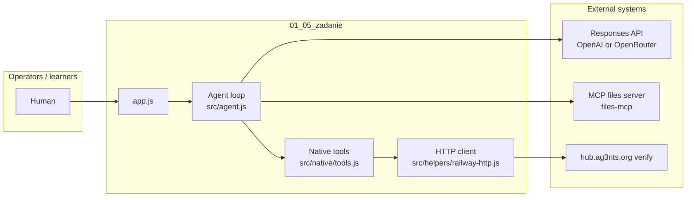
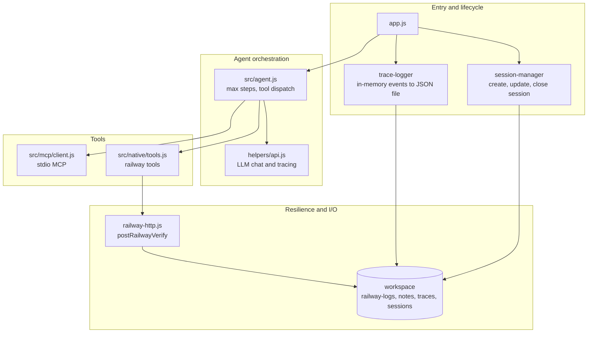
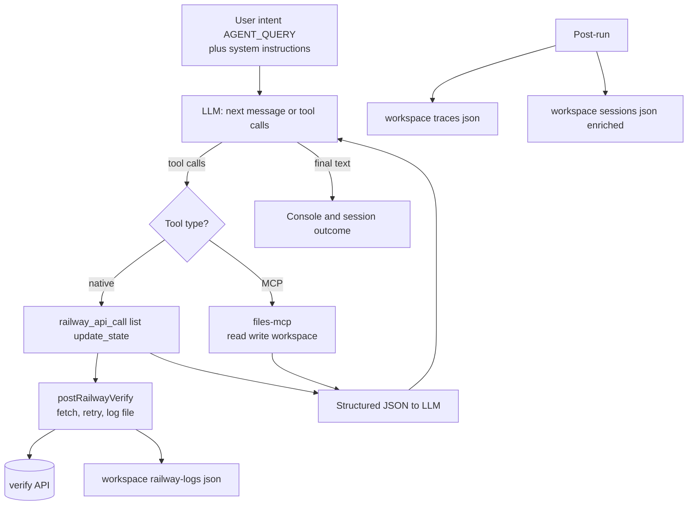
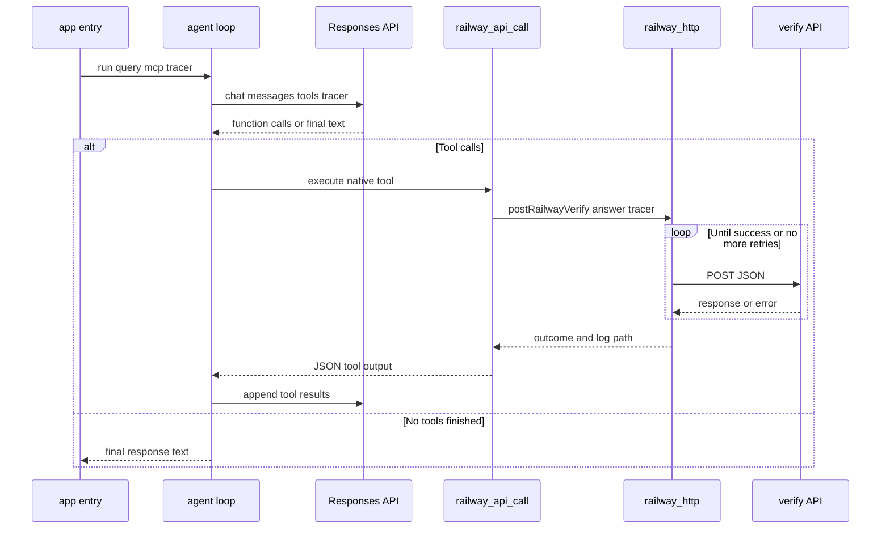
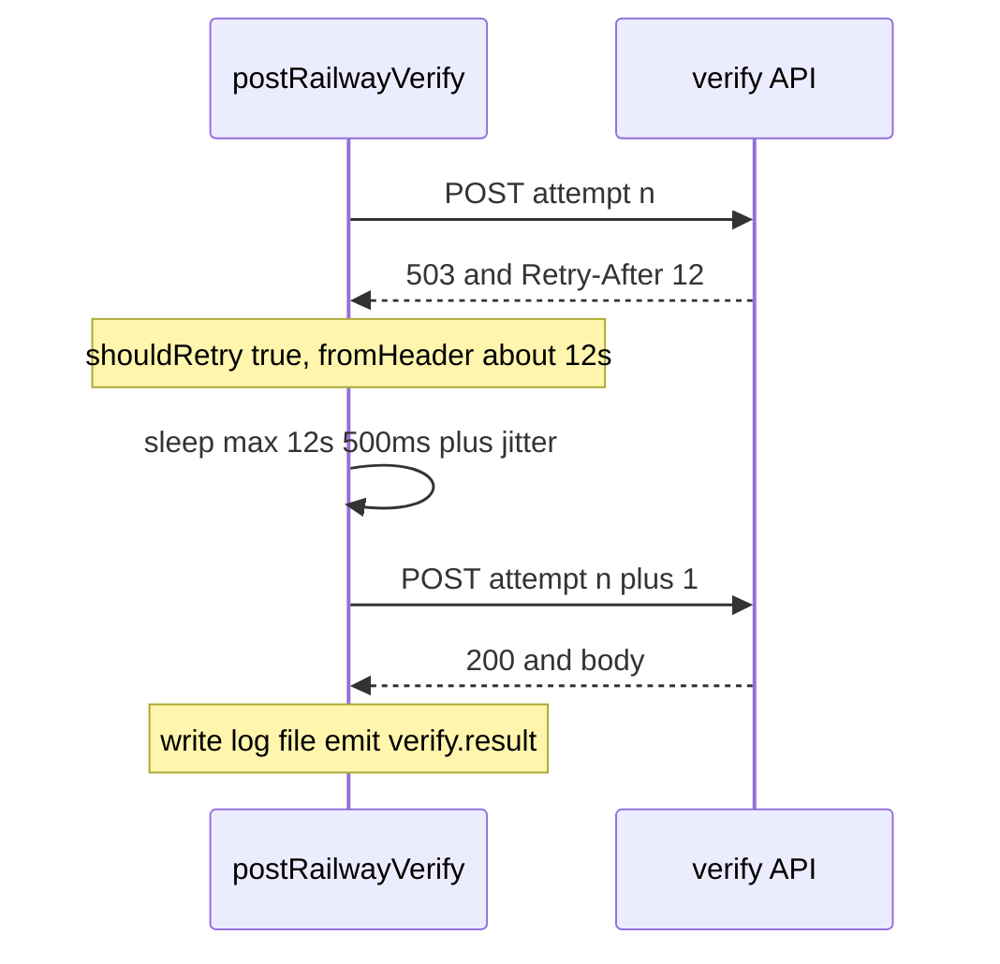

# Railway agent — architecture & business document

This document describes the **01_05_zadanie** application: what problem it solves, how it is built, how data flows, and how **HTTP errors and rate-limit / availability headers** are handled. It is written for both **business** stakeholders and **technical** readers.

---

## 1. Business context

### 1.1 Problem

The AG3NTS platform exposes a **verify** API (`POST https://hub.ag3nts.org/verify`) for task **`railway`**. The goal is to:

- **Discover** how the API works (it self-documents via a **help** response).
- **Execute** the correct sequence of actions until railway route **X-01** is active.
- **Obtain** a final flag in the form `{FLG:...}`.

Constraints from operations:

- The API is **underspecified** until `help` is called.
- Responses may be **HTTP errors** (e.g. **503**), often with **rate limiting**.
- **Call ordering** and **payload shape** matter; brute force wastes quota.
- **Observability** is required: traces, per-call logs, session summaries.

### 1.2 Solution approach

A **native-tool agent**:

- The **LLM** reasons about the next step from help/API responses and tool outputs.
- **Code** enforces safe HTTP behavior: retries, backoff, honoring certain headers, timeouts, and duplicate-payload protection.
- **Artifacts** (logs, traces, session JSON) record what happened for audit and debugging.

---

## 2. System context

---

## 3. Logical architecture

---

## 4. Data flow (end-to-end)

---

## 5. Sequence: one agent step (simplified)

---

## 6. Sequence: HTTP retry, headers, and waiting

This is the **core** behavior for “when will the service be available again?”.

### 6.1 What triggers a wait + retry?

Inside `postRailwayVerify` (**`src/helpers/railway-http.js`**):

| Condition | Retries? | Wait strategy |
|-----------|----------|----------------|
| **Network error** or **timeout** (`AbortError` after `timeoutMs`) | Yes, up to `maxAttempts` (default **10**) | Exponential backoff: \( \min(60s,\ 1000 \cdot 2^{attempt-1} + jitter) \) |
| **HTTP 503** | Yes (if attempts remain) | Prefer **Retry-After** or **RateLimit-Reset / X-RateLimit-Reset**; else same exponential backoff as above |
| **HTTP 429** | Yes | Same as 503 |
| **HTTP 502** | Yes | Same as 503 |
| **HTTP 408** | Yes | Same as 503 |
| **HTTP 2xx** with body | No retry in HTTP layer | Parsed and returned (application-level errors stay in body) |
| **Other 4xx/5xx** (e.g. **400**, **401**) | **No** | Returned to tool/LLM immediately (not treated as transient) |

So: **yes**, the app **waits** before trying again when the status is one of the **retryable** codes above, or when the transport fails.

### 6.2 Which headers influence “wait until”?

The implementation **explicitly** derives a wait duration from:

1. **`Retry-After`**
   - If numeric: interpreted as **seconds** → wait `seconds * 1000` ms.
   - If HTTP-date string: parsed; wait until `max(0, date - now)`.

2. **`X-RateLimit-Reset`** or **`RateLimit-Reset`**
   - If numeric:
     - If value looks like **Unix ms** (`> 1e12`): wait `max(0, value - now)`.
     - Else treated as **Unix seconds**: wait `max(0, sec*1000 - now)`.
   - If parseable as date string: wait until that instant.

**Selection rule**: for a retryable error response, the code uses:

`fromHeader = retryAfterToMs(response) ?? rateLimitResetToMs(response)`

- If `fromHeader` is missing → **exponential backoff + jitter** (capped at **60s** per wait).
- If `fromHeader` is present → `waitMs = max(fromHeader, 500) + jitter` (so there is always a small random spread).

**Persisted for audit**: response headers matching `retry-after`, names containing `ratelimit` / `rate-limit`, and `x-request-id` are copied into `outcome.headers` in the saved `workspace/railway-logs/*.json` file (not every header is stored).

### 6.3 Sequence: transient error with Retry-After

### 6.4 Tracer events for observability

During HTTP handling the tracer may emit:

- `railway.http.attempt` — attempt number, answer keys
- `railway.http.error` — network/timeout message
- `railway.http.response_error` — status, `shouldRetry`, `headerWaitMs` (derived delay hint), body preview
- `railway.http.backoff` — actual `waitMs` and reason (`status_503`, `network_or_timeout`, …)
- `railway.http.success` — successful HTTP round
- `verify.result` — normalized summary after the final outcome for that tool call

The session file can include a slice of HTTP-related events (`httpRetries` in `app.js`).

---

## 7. Other controls (beyond per-request HTTP retries)

| Mechanism | Purpose |
|-----------|---------|
| **Per-call timeout** | Default **55s** per `fetch` attempt (`AbortController`) |
| **Max attempts** | Default **10** HTTP tries per single `railway_api_call` |
| **Duplicate payload guard** | If the **same `answer` JSON** is submitted **5 times in a row** without receiving a flag, further identical calls are blocked (stops useless loops) |
| **Agent max steps** | **60** LLM steps in `src/agent.js` (separate from HTTP retries) |

There is **no global token bucket** between successive `railway_api_call` invocations: pacing across tool calls is left to the **LLM + instructions**, while each call still **internally** waits on 503/429/etc.

---

## 8. Requirements coverage (checklist)

| Requirement | Covered by | Notes |
|-------------|------------|--------|
| Spec-driven: start with **help** | `AGENT_QUERY` + `api.instructions` + tool description | First call must use `answer` with `"action": "help"`. |
| LLM decides **what** next | Agent loop + tools | Execution still bounded by tool contracts. |
| Tools perform **real** API actions | `railway_api_call` | |
| **503** handling | `railway-http.js` | Retries with backoff and/or `Retry-After`. |
| **Rate limits** | `railway-http.js` | **429** retried; reset headers used when present. |
| Honor **Retry-After** | `retryAfterToMs` | Seconds or HTTP-date. |
| Honor **reset** style headers | `rateLimitResetToMs` | `X-RateLimit-Reset` / `RateLimit-Reset` (seconds, ms, or date). |
| Wait before retry | `sleep(waitMs)` | Logged as `railway.http.backoff`. |
| Detailed request/response logging | `workspace/railway-logs/*.json` | Full last outcome for that invocation chain. |
| Tracing | `trace-logger.js` + events above | |
| Session persistence | `session-manager.js` + post-run insights | |
| Avoid useless loops | Duplicate guard in `tools.js` | Complements HTTP retries. |
| **200 + application error** in body | Tool returns body to LLM | HTTP layer **does not** auto-retry purely based on JSON `code` unless final `verify.result` classification treats it as success — transient recovery is **HTTP-status-driven**. |
| **Non-retryable** HTTP errors | Returned once | e.g. **400** validation: no built-in wait/retry. |

---

## 9. Gaps and design notes (explicit)

1. **Header ecosystem variance**: Real APIs may send `Retry-After` only on some errors, or use vendor-specific names. This code handles **Retry-After** and **Reset** headers named above; other shapes appear only inside `outcome.headers` if they match the `collectInterestingHeaders` filter — but may **not** drive wait time unless extended in `railway-http.js`.

2. **Success vs. rate limit in JSON**: If the verify API returns **HTTP 200** with a JSON message like “rate limited”, the client treats HTTP as success and **will not** apply the retry loop unless you add application-level detection.

3. **Cross-call throttling**: There is no mandatory minimum delay between two separate `railway_api_call` tool invocations; the LLM should follow instructions to minimize calls. Add a queue or global scheduler only if you need harder guarantees.

4. **Clock skew**: Date-based `Retry-After` / reset parsing depends on the runtime clock.

---

## 10. Workspace artifacts (business + support)

| Artifact | Audience | Content |
|----------|----------|---------|
| `workspace/railway-logs/*.json` | Support / audit | Request `answer`, full `outcome` (status, parsed JSON, raw text, selected headers, attempts) |
| `workspace/traces/*.json` | Engineering | Full timeline: LLM, tools, HTTP backoff |
| `workspace/sessions/*.json` | Business + engineering | Objective, verify summaries, recent HTTP events |
| `workspace/notes/railway-state.json` | Agent + human | Consolidated facts from help (via `railway_update_state`) |

---

## 11. Summary answer (your specific concern)

**Does the app catch errors where headers indicate when the service is available again, and does it wait?**

- **Yes for typical transient HTTP behavior**: on **503 / 429 / 502 / 408**, the client **waits** (using **`Retry-After`** or **reset** headers when present, otherwise **exponential backoff with jitter**) then **retries**, up to **10** attempts per tool call, with each attempt capped by a **timeout**.
- **Headers are persisted** (subset) in logs and traces so you can confirm what the API returned.
- **Not automatically** for “looks fine over HTTP but application says slow down” unless that maps to a **retryable status** or you extend detection for **200 + rate-limit body**.

If you want stricter alignment with a specific header scheme from production traffic, extend **`src/helpers/railway-http.js`** in one place rather than scattering logic across tools.
