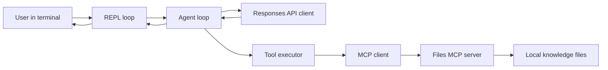
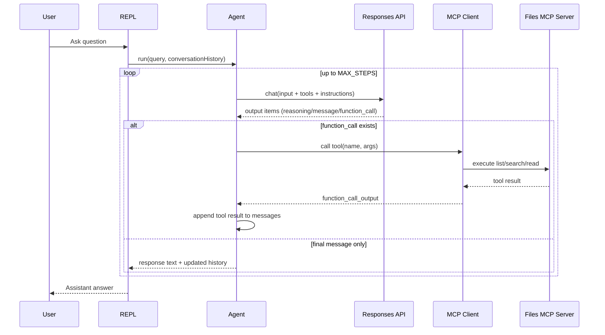
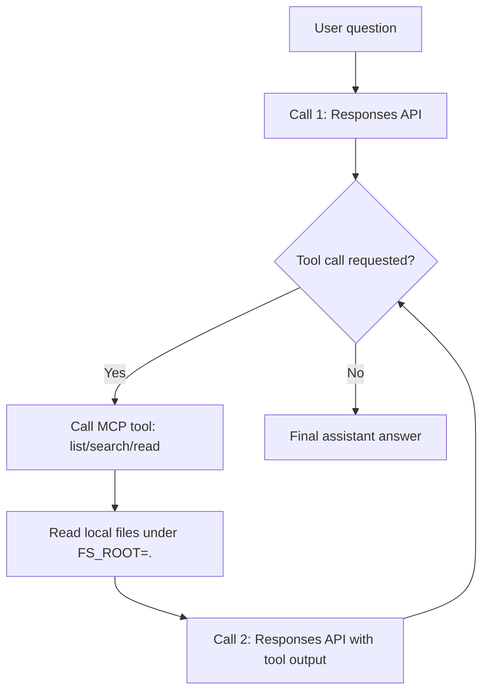
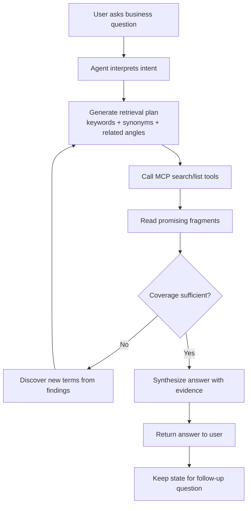

# Agentic RAG Example - Architecture and Business Process Evaluation

## Scope

This evaluation describes how the example in `02_01_agentic_rag` works in practice:
- runtime architecture (components and responsibilities),
- business process (user intent to grounded answer),
- strengths, risks, and practical improvements.

The analysis is based on:
- `app.js`
- `src/agent.js`
- `src/repl.js`
- `src/mcp/client.js`
- `src/helpers/api.js`
- `src/config.js`
- `src/helpers/stats.js`
- `mcp.json`
- `demo/example.md`

## Executive View

This is a CLI-based, tool-using Agentic RAG system.  
The model receives a user question, decides when to call MCP file tools (`list`, `search`, `read`), iterates through multiple retrieval steps, and returns an answer grounded in local knowledge files.

The architecture follows a clean loop:
1. initialize MCP tool access,
2. run multi-step LLM/tool interaction,
3. maintain conversation state for follow-up questions,
4. track token usage and expose operational transparency.

## Architecture

### High-Level Component Diagram

### Component Responsibilities

- `app.js`
  - Entry point.
  - Asks user confirmation (cost-awareness guardrail).
  - Connects to MCP, lists available tools, starts REPL.
  - Handles graceful shutdown and stats printing.

- `src/repl.js`
  - Interactive command loop (`You:` prompt).
  - Supports `exit` and `clear`.
  - Persists conversation history across turns.

- `src/agent.js`
  - Core agentic loop (`MAX_STEPS = 50`).
  - Sends full message state to model.
  - Detects function/tool calls, executes them, feeds outputs back, repeats until final text answer.

- `src/helpers/api.js`
  - Wraps Responses API HTTP call.
  - Injects model config, instructions, tools, reasoning, token limits.
  - Extracts tool calls, reasoning summaries, and assistant text.

- `src/config.js`
  - Defines behavior policy: multi-phase search, iterative deepening, evidence orientation, and efficiency rules.
  - Important: instruction text is tailored to AI_devs course documents in Polish but output in English.

- `src/mcp/client.js`
  - Loads `mcp.json`.
  - Spawns and connects MCP server process over stdio.
  - Converts MCP tool schemas into OpenAI-compatible function specs.
  - Executes tool calls and normalizes returned text/JSON.

- `mcp.json`
  - Declares MCP server (`files`) and environment (`FS_ROOT=.`), anchoring retrieval scope to local project files.

- `src/helpers/stats.js`
  - Aggregates request and token usage (input, output, reasoning, cache).
  - Enables cost/efficiency observability.

## Runtime Sequence (Detailed)

## Exactly What Gets Called Per Question

When you ask one question in this agentic RAG example, calls happen in this order:

1. `REPL` sends your text to `run(...)` in `src/agent.js`.
2. Agent calls the LLM endpoint (`RESPONSES_API_ENDPOINT`) via `chat(...)` in `src/helpers/api.js`.
3. The LLM may return `function_call` items (tool decisions), for example:
   - `list` to inspect available files/folders,
   - `search` to find matching fragments,
   - `read` to fetch selected content.
4. Agent executes each tool through `callMcpTool(...)` in `src/mcp/client.js`.
5. MCP client forwards call to the `files` MCP server configured in `mcp.json`.
6. Files server reads from local scope (`FS_ROOT=.`) and returns tool output.
7. Agent sends tool outputs back to the LLM in the next `chat(...)` call.
8. Steps 2-7 repeat until the model returns plain text answer (no more tool calls).
9. Final answer is printed, and full conversation is kept for follow-up turns.

### Quick Trace Diagram

### Important Clarification

- The agent does not directly browse the web in this example.
- Knowledge comes from local files exposed by the MCP files server.
- The LLM API is used for reasoning and orchestration, while MCP tools provide grounded data.

## Business Process Perspective

### Process Goal

Transform a user knowledge question into a reliable, evidence-seeking answer by:
- searching relevant sources,
- reading only selected fragments,
- iterating with new terms,
- synthesizing grounded response.

### Business Workflow Diagram

### Business Value

- Reduces manual document browsing effort.
- Supports exploratory Q&A where one search pass is insufficient.
- Preserves conversational continuity for iterative analysis.
- Offers transparent operating cost signals (token stats).

## What Works Well

- Agentic retrieval loop is explicit and robust: tool calls are first-class response elements, not hidden side effects.
- Separation of concerns is clean (REPL, agent logic, MCP client, API wrapper, stats).
- Conversation history persistence makes the system suitable for multi-turn analysis, not only single-shot Q&A.
- Instruction policy in `src/config.js` strongly nudges iterative discovery, which is core to agentic RAG.
- Startup warning improves user awareness of potential token consumption.

## Key Risks and Limitations

- `MAX_STEPS = 50` prevents infinite loops, but can still allow expensive runs before stopping.
- Tool call arguments are parsed with `JSON.parse`; malformed model output may fail (currently surfaced as error output, which is acceptable but noisy).
- `Promise.all` executes multiple tool calls in parallel; if many heavy calls are emitted in one step, response latency and load can spike.
- Prompt policy says "respond in English", but demo is Polish; this can create expectation mismatch for users.
- Knowledge scope is fixed to local file root (`FS_ROOT=.`), so quality depends entirely on local document organization and coverage.

## Suggested Improvements (Priority Order)

1. Add hard token/request budget guardrails per user query (not only global stats).
2. Add adaptive step control (early stop when incremental evidence gain becomes low).
3. Add structured citations in final answers (file + section/line fragment references).
4. Add retry/backoff logic for transient API/tool failures.
5. Add lightweight telemetry per step (tool latency, success rate, search hit quality).

## Operational Interpretation of Demo

The recorded session in `demo/example.md` confirms expected behavior:
- user asks a topic question,
- assistant performs iterative retrieval and synthesis,
- answer includes a conceptual explanation plus source-oriented grounding cues,
- workflow aligns with the architecture and process shown above.

## Final Assessment

This implementation is a solid educational and practical baseline for Agentic RAG:
- clear architecture,
- practical tool orchestration loop,
- process alignment with exploratory knowledge work.

It is already suitable for local document intelligence tasks and can be production-hardened by adding stricter budgeting, citation discipline, and reliability controls.
