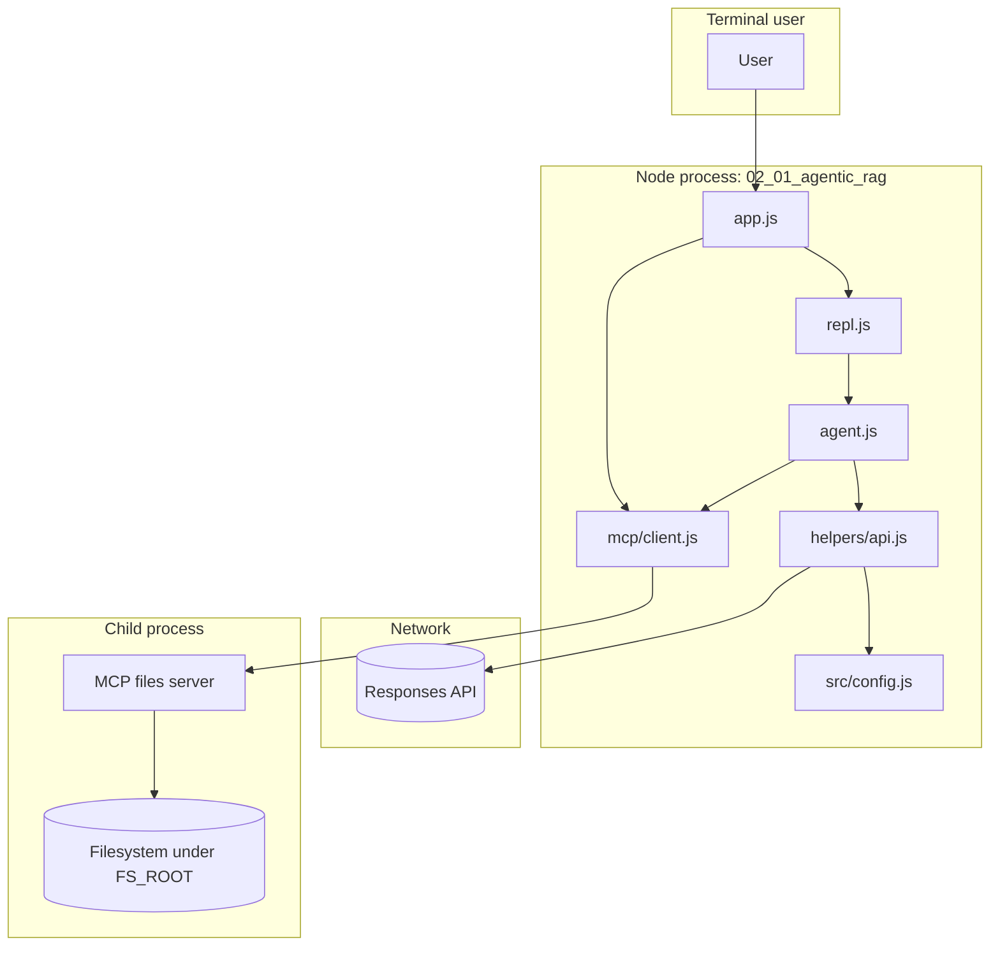
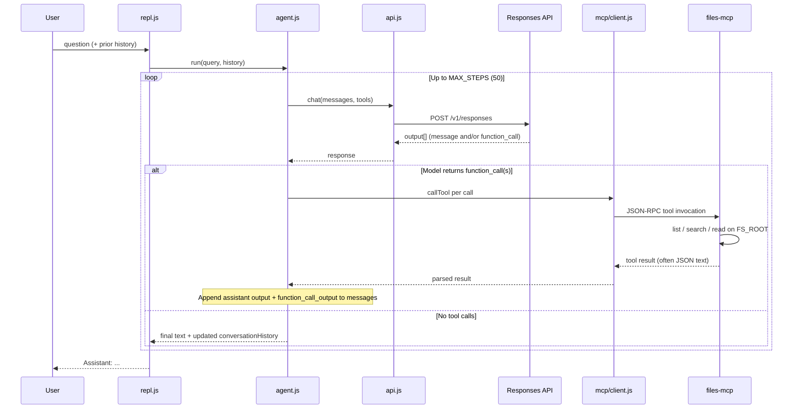
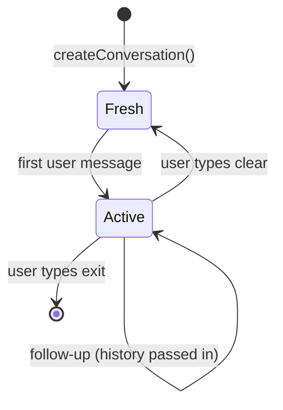

# Architecture: `02_01_agentic_rag`

This lesson implements **agentic RAG**: a language model **orchestrates retrieval** by calling tools in a loop until it produces a final answer grounded in files. Retrieval is not a fixed pipeline; the model decides *when* to list directories, *what* to search, and *which* line ranges to read.

---

## Components

| Piece | Role |
|--------|------|
| `app.js` | Entry point: token-cost confirmation, MCP connect, REPL start, shutdown hooks |
| `src/repl.js` | Read–eval–print loop: `You:` input, `clear` / `exit`, passes conversation history into the agent |
| `src/agent.js` | **Agent loop** (max 50 steps): call Responses API → execute tool calls via MCP → append outputs → repeat until no tools |
| `src/helpers/api.js` | `POST` to Responses API; extracts tool calls, assistant text, reasoning summaries |
| `src/config.js` | Model id, reasoning options, **system instructions** (search strategy, Polish keywords, English answers) |
| `src/mcp/client.js` | Load `mcp.json`, spawn stdio MCP server, `listTools` / `callTool`, map tools to API tool schema |
| `mcp.json` | Declares the `files` server: `npx tsx ../mcp/files-mcp/src/index.ts`, `FS_ROOT: "."` |
| `../mcp/files-mcp` | MCP server exposing **list**, **search**, **read** (and related) tools over the filesystem |
| `src/helpers/stats.js` | Aggregates token usage per API response; printed on shutdown |
| `src/helpers/shutdown.js` | SIGINT/SIGTERM → run cleanup (stats, close readline, close MCP) |
| `../../config.js` (repo root) | API key, provider, `RESPONSES_API_ENDPOINT`, headers |

The **knowledge base** in practice is whatever files exist under the MCP server’s `FS_ROOT` (here: the `02_01_agentic_rag` directory). Instructions mention course `S01*.md` materials as the intended corpus if you place or symlink them there.

---

## Logical architecture

---

## Data flow (one user turn)

Each line you type at `You:` may trigger **many** API round-trips until the model returns a message **without** further function calls.

**Message shape (conceptual):** `messages` grows each step with:

1. Prior turns (user + prior assistant `output` items).
2. New user message.
3. For each loop iteration: model `output` (e.g. `function_call` items), then `function_call_output` items with tool results, until the model emits a final `message`.

---

## Conversation state

`conversation.history` is the full **Responses-style** transcript slice the lesson keeps between turns so follow-up questions retain context.

---

## How and where to use this type of application

### What this pattern is good for

- **Exploratory Q&A over messy corpora** — folder trees, inconsistent naming, long notes: the agent can *discover* where answers live instead of you hard-coding retrieval.
- **Evidence-first answers** — internal runbooks, legal/compliance drafts, engineering wikis exported as files: you want **citations** and **targeted reads**, not a single vector hit.
- **Queries that need refinement** — synonyms, Polish vs English headings, typos: multi-step search matches how humans “dig” through docs.
- **Prototyping agent + tools** — MCP keeps the **tool surface** (filesystem) separate from the **orchestrator** (Node + Responses API), which mirrors how many production agents swap MCP servers for DB, ticket, or CRM tools.

### When to prefer something simpler

- **High traffic, low latency, predictable queries** — a classic **embed → top-k → single LLM call** pipeline is cheaper and easier to cache and test.
- **Strict determinism** — agent loops are non-deterministic; compliance-heavy flows may need fixed retrieval rules.
- **Very large files always read end-to-end** — if every question needs a full document, batch preprocessing or chunk indexing beats repeated agent steps.

### Production-oriented notes (beyond the lesson)

- **Scope `FS_ROOT`** tightly; treat path tools as **privileged** (this demo uses `.` under the lesson folder).
- **Budgets**: max steps, max tools per step, timeouts, and **token alerts** (this repo warns on startup and tracks usage in `stats.js`).
- **Observability**: log tool names/args/results (the lesson’s logger is a starting point).
- **Same architecture, different tools**: replace or add MCP servers (e.g. SQL, HTTP, internal APIs) while keeping the same **agent loop** in `agent.js`.

---

## Related files

| Path | Purpose |
|------|---------|
| `README.md` | Run commands and setup |
| `demo/example.md` | Example transcript without spending tokens |
| `mcp.json` | MCP server launch config |

For implementation details, start with `src/agent.js` (loop), `src/helpers/api.js` (wire format), and `src/mcp/client.js` (stdio bridge).
