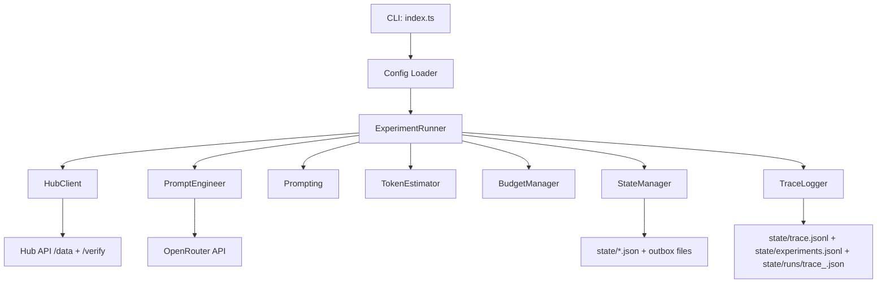
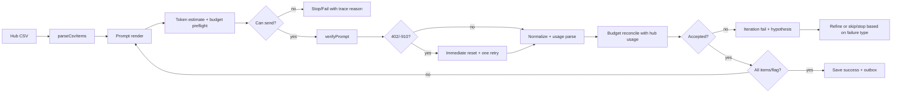
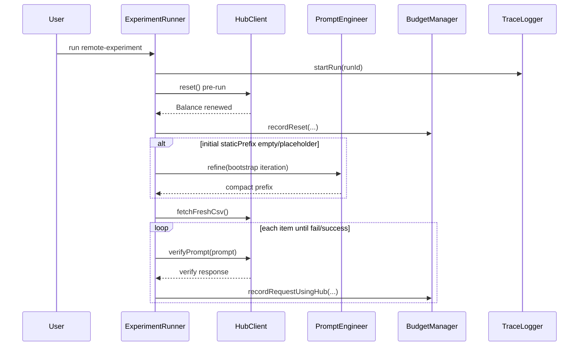
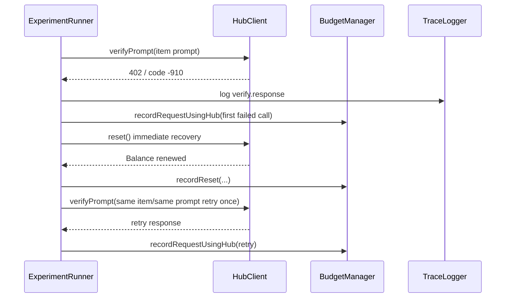

# 02_01_zadanie — Architecture Analysis (Codex 5.3 Med)

## 1. Overview

This project is an agentic TypeScript CLI that solves the AI Devs `categorize` challenge by iteratively improving a classification prompt and verifying it against a remote hub.

The classifier must return only:
- `DNG` (dangerous goods)
- `NEU` (neutral/safe goods)

Business purpose:
- Find a prompt that classifies all 10 CSV items correctly and obtains `{FLG:...}`.
- Control cost under a strict per-run budget (`1.5 PP`) and prompt token limit (`<=100`).
- Persist run state, trace, and winning artifacts for debugging and reuse.

Critical domain rule:
- Any item mentioning `reactor`, `fuel rod`, or `fuel cassette` must be treated as `NEU`.

---

## 2. Business Process

### Workflow represented by the code

1. Load configuration from env + CLI mode.
2. Start run trace and initialize budget state (fresh by default; optional resume).
3. Send pre-run hub reset to normalize remote balance/state.
4. Select initial prompt candidate:
   - if placeholder/empty prefix, bootstrap via PromptEngineer immediately.
5. For each iteration:
   - fetch fresh CSV from hub,
   - pre-check whether remaining local budget can fund at least one verify request,
   - run item-by-item classification (stop on first failure),
   - reset hub on failure,
   - refine prompt when failure is actionable.
6. On success:
   - save flag, best prompt, session, budget, outbox artifacts.
7. On non-actionable repeated hub failures or exhausted budget:
   - stop early with explicit trace reason.

### Step-by-step interaction (runtime)

1. User runs `npm run remote-experiment`.
2. `ExperimentRunner.run()`:
   - creates run/session objects,
   - logs run metadata to `state/runs/trace_<runId>.json`,
   - sends pre-run `reset`,
   - optionally bootstraps prompt refinement.
3. Iteration loop:
   - `HubClient.fetchFreshCsv()` + `parseCsvItems()`,
   - `renderPrompt()` + `TokenEstimator.estimate()`,
   - `BudgetManager.hasBudgetForEstimated(...)` pre-flight,
   - `HubClient.verifyPrompt(...)` for each item.
4. Budget reconciliation:
   - use hub-reported `input_cost/output_cost/tokens` when available,
   - fallback to local estimate if hub usage fields are absent.
5. Failure handling:
   - if verify returns 402/-910, do one immediate recovery (`reset` + single retry same prompt/item),
   - if still failing, classify failure type and decide refine/skip/stop.

### Assumptions

- Hub `/verify` is the source of truth for acceptance and final flag.
- CSV schema includes recognizable id/description aliases.
- Single-run process semantics (no file lock strategy for concurrent runners).

---

## 3. Architecture

### High-level architecture

- **Entry layer**
  - `src/index.ts` (main CLI runner)
  - `src/reset.ts` (manual hub/local budget reset helper)

- **Orchestration layer**
  - `src/experimentRunner.ts`
  - controls run lifecycle, iteration loop, stop conditions, and refinement decisions

- **Service/domain layer**
  - `src/hubClient.ts` (CSV/verify/reset API, retry logic, response parsing)
  - `src/promptEngineer.ts` (LLM refinement, compactness/safety post-processing)
  - `src/prompting.ts` (initial candidates + prompt rendering)
  - `src/tokenEstimator.ts` (token guard)
  - `src/budgetManager.ts` (budget pre-check + reconciled accounting)
  - `src/csv.ts` (CSV parser + header mapping)

- **Persistence/observability layer**
  - `src/stateManager.ts` (session/budget/best prompt/flag/outbox)
  - `src/traceLogger.ts` (JSONL + single-file run trace)

### Entry points

- `npm run remote-experiment` -> `src/index.ts --mode REMOTE_EXPERIMENT`
- `npm run reset` -> `src/reset.ts`
- `npm run start` -> `src/index.ts`

### External dependencies

- `dotenv` (env loading)
- `zod` (env schema validation)
- `js-tiktoken` (token counting)
- OpenRouter chat completions API (optional refinement engine)
- Hub API (`/data/<apikey>/categorize.csv`, `/verify`)

### Architecture diagram

---

## 4. Data Flow

### Input -> processing -> output

1. **Input**
   - env config (keys, limits, flags),
   - fresh CSV from hub per iteration.

2. **Prompt build**
   - static prefix + dynamic item suffix (`Item {id}: {description}`),
   - token estimate and budget feasibility check.

3. **Verification**
   - POST prompt to hub,
   - normalize output to `DNG|NEU|INVALID`,
   - parse usage/cost fields from `debug` or top-level payload.

4. **Accounting**
   - budget is updated using hub costs when available,
   - fallback to estimated formula otherwise.

5. **Decision**
   - accept item, fail iteration, retry-after-reset, refine prompt, or stop run.

6. **Persistence**
   - append JSONL logs,
   - update run trace JSON,
   - update session/budget/best prompt/flag.

### Key transformations

- Response normalization from free-form hub payloads to strict internal `VerifyResult`.
- Hypothesis derivation that distinguishes:
  - actionable budget compression cases (mid-iteration exhaustion),
  - non-actionable hub-state failures (0 accepted items).
- PromptEngineer post-processing:
  - normalize whitespace/quotes,
  - enforce mandatory exception terms,
  - apply compact or ultra-compact deterministic fallback.

### Data flow diagram

---

## 5. Sequence Diagrams

### Sequence 1: Current main path (with bootstrap + pre-run reset)

### Sequence 2: 402 recovery path

---

## 6. Code Structure Breakdown

### Folder structure

- `src/` — application source
- `state/` — runtime artifacts (`session.json`, `budget_state.json`, traces, CSV snapshots, engineer chat)
- `state/runs/` — one pretty JSON trace per run
- `workspace/sessions/outbox/` — shared winning artifacts (`flag.json`, `winning_prompt.md`)
- `specs/` — task requirements

### Key files and current responsibilities

- `src/index.ts` — bootstraps env/config and starts runner.
- `src/config.ts` — validated env flags, including:
  - `RESUME_BUDGET_STATE`
  - `FORCE_PROMPT_ENGINEER`
- `src/experimentRunner.ts` — orchestration, recovery, fail-fast, hypothesis logic.
- `src/hubClient.ts` — API client + usage extraction (`debug` and top-level fallback).
- `src/promptEngineer.ts` — LLM refinement + strict compact/safety guards.
- `src/budgetManager.ts` — estimated and hub-reconciled accounting methods.
- `src/traceLogger.ts` — event JSONL + full per-run JSON.
- `src/stateManager.ts` — persistence and outbox export.

### Important functions/classes (current)

- `ExperimentRunner.run()`:
  - pre-run reset,
  - bootstrap refinement,
  - iteration control + stop conditions.
- `ExperimentRunner.runIteration()`:
  - item loop,
  - verify error recovery,
  - budget updates and failure outcomes.
- `HubClient.verifyPrompt()`:
  - normalize output,
  - parse cost/token usage,
  - return consistent `VerifyResult`.
- `PromptEngineer.refine()`:
  - build dynamic user message,
  - call OpenRouter,
  - sanitize/enforce compact fallback.
- `BudgetManager.recordRequestUsingHub()`:
  - consume hub usage/cost if present,
  - estimator fallback when missing.

---

## 7. Key Logic / Algorithms

### A. Iteration stop strategy

The run can stop early under multiple conditions:
- repeated non-actionable hub budget/state failures,
- insufficient remaining budget for even one probe verify,
- budget exceeded before next refinement,
- max iterations reached.

This avoids spending iterations when outcome is already determined.

### B. Hybrid budget model

Budget logic now blends two sources:
- **Primary:** hub-reported `input_cost/output_cost/tokens/cached_tokens`
- **Fallback:** local estimate formula when hub usage fields are missing

This greatly reduces drift between local guard behavior and hub billing reality.

### C. 402/-910 resilience

On hub “insufficient funds” during verify:
- record the failed call cost,
- perform immediate reset,
- retry once for same item/prompt.

This handles inconsistent hub state right after resets.

### D. Prompt compression under budget pressure

PromptEngineer is guided and constrained to produce compact prefixes:
- target compact token budget,
- deterministic compact fallback,
- ultra-compact fallback for budget-failure hypotheses,
- mandatory reactor/fuel exception enforcement.

### E. Failure-aware refinement gating

Refinement is executed only when failure is actionable.  
Non-actionable hub-state failure patterns are traced and can terminate run quickly.

---

## 8. Observations & Gaps

### Current strengths

- Robust traceability (`trace.jsonl` + per-run JSON trace with step granularity).
- Better runtime stability with reset+retry recovery and fail-fast stops.
- Budget accounting now reflects hub costs when provided.
- Prompt pipeline has explicit safety rails (exception enforcement + compact fallbacks).

### Remaining risks

1. **Hub consistency risk**
   - Hub may still return `-910` unpredictably despite reset, forcing conservative retries/stops.

2. **Prompt oscillation risk**
   - Under tight budget, repeated ultra-compact fallback may converge to similar text with limited semantic gain.

3. **No test harness yet**
   - Critical behaviors (402 recovery, hub-usage reconciliation, fail-fast branches) rely on runtime validation rather than automated tests.

4. **Concurrent runs**
   - Shared state files are still not lock-protected; parallel execution may interleave writes.

### Practical next improvements

- Add focused unit/integration tests for:
  - `recordRequestUsingHub` reconciliation correctness,
  - 402 recovery branch,
  - fail-fast stop conditions,
  - PromptEngineer compact fallback logic.
- Add optional config for repeated-hub-issue threshold.
- Add runtime metrics summary (accepted items per PP, average token cost per request) in run trace summary.

