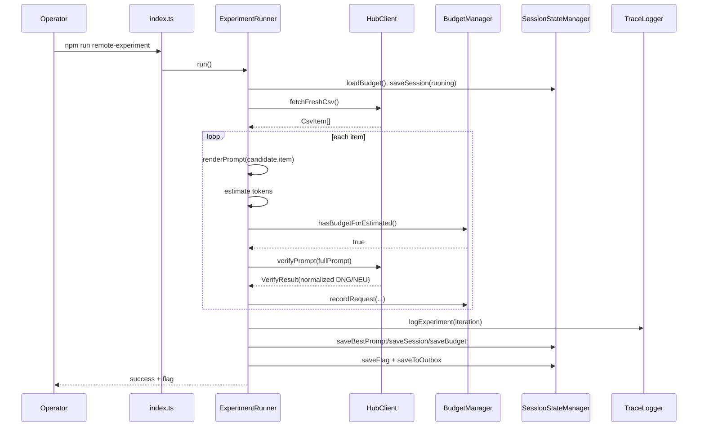
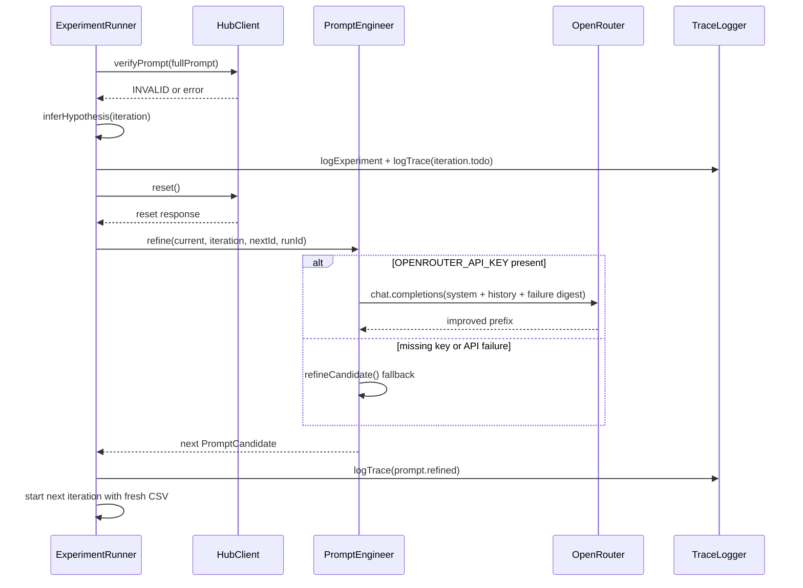

# 02_01_zadanie — Architecture Analysis (Codex 5.3 Med)

## 1. Overview

This application is an agentic TypeScript CLI harness for the AI Devs `categorize` task. It repeatedly tests and improves an LLM prompt that classifies cargo items into:
- `DNG` (dangerous)
- `NEU` (neutral/safe)

Business purpose:
- Automate finding a prompt that correctly classifies all rows from hub-provided CSV data.
- Stay within strict operational constraints: prompt length (`<=100` tokens) and monetary budget (`1.5 PP`).
- Stop when the hub returns the success flag `{FLG:...}`.

Key problem solved:
- Prompt optimization under budget and context-window pressure, with feedback-driven iteration and persistent local state.

Primary domain rule implemented:
- Reactor/fuel-related items are always `NEU` (hard exception), even if they contain hazard-like vocabulary.

---

## 2. Business Process

### Workflow represented by the code

The system models an iterative "prompt engineering + verification" business cycle:

1. Load runtime configuration and secrets from environment.
2. Start a new run session and load persisted budget state.
3. Fetch fresh CSV input from the remote hub.
4. Build per-item prompts from a static instruction prefix + dynamic item suffix.
5. Validate each prompt against token and budget constraints.
6. Send each prompt to the hub verification endpoint.
7. Stop iteration immediately on first failure (format, hub rejection, token guard, budget guard).
8. If failed:
   - reset hub state,
   - derive failure hypothesis,
   - refine prompt candidate (LLM-based or fallback rule-based),
   - retry from fresh CSV.
9. If successful:
   - persist session + budget + best prompt + flag,
   - publish artifacts to outbox for other agents.

### Step-by-step interaction (system perspective)

1. Operator runs `npm run remote-experiment` (`src/index.ts`).
2. `ExperimentRunner.run()` initializes state, trace, and budget (`src/experimentRunner.ts`).
3. For each iteration (`1..MAX_ITERATIONS`):
   - `HubClient.fetchFreshCsv()` downloads current dataset (`src/hubClient.ts`).
   - `parseCsvItems()` maps CSV rows to internal `CsvItem[]` (`src/csv.ts`).
   - For each item:
     - `renderPrompt()` assembles full prompt (`src/prompting.ts`).
     - `TokenEstimator.estimate()` checks token limit (`src/tokenEstimator.ts`).
     - `BudgetManager.hasBudgetForEstimated()` pre-validates spend (`src/budgetManager.ts`).
     - `HubClient.verifyPrompt()` calls hub `/verify`.
   - Results are logged to `experiments.jsonl` and `trace.jsonl` (`src/traceLogger.ts`).
4. Failure path:
   - Hub reset via `HubClient.reset()`.
   - Prompt improved through `PromptEngineer.refine()` or `refineCandidate()`.
5. Success path:
   - Flag extracted and saved with context (`src/stateManager.ts`).
   - Artifacts copied to `workspace/sessions/outbox/`.

### Assumptions (explicit)

- Assumption A1: Hub `/verify` is the source of truth for correctness; local label calculation in `expectedLocalLabel()` is used mainly for diagnostics.
- Assumption A2: Hub CSV contains recognizable id/description headers (or accepted aliases).
- Assumption A3: Each run is intended as a single-process workflow (no concurrency control around state files).

---

## 3. Architecture

### High-level architecture

The solution is a CLI-centered orchestration architecture with clear module responsibilities:

- **Entry layer**
  - CLI bootstrap and env loading (`src/index.ts`)
  - Optional maintenance script (`src/reset.ts`)

- **Application orchestration layer**
  - Iteration control, stop conditions, prompt lifecycle, run status (`src/experimentRunner.ts`)

- **Domain/service layer**
  - Remote hub communication + retry (`src/hubClient.ts`)
  - Prompt templates and rendering (`src/prompting.ts`)
  - LLM-driven prompt refinement (`src/promptEngineer.ts`)
  - Token counting (`src/tokenEstimator.ts`)
  - Cost accounting and guards (`src/budgetManager.ts`)
  - CSV parsing/mapping (`src/csv.ts`)

- **Persistence/observability layer**
  - Session/budget/flag/outbox files (`src/stateManager.ts`)
  - JSONL tracing of events and iterations (`src/traceLogger.ts`)

### Entry points

- `src/index.ts` (main runtime entrypoint)
- `src/reset.ts` (manual reset utility)
- `package.json` scripts:
  - `remote-experiment`
  - `start`
  - `reset`

### Core modules/services

- `ExperimentRunner`: end-to-end coordinator and state machine.
- `HubClient`: API adapter for CSV fetch, verification, reset, and retries.
- `PromptEngineer`: adaptive prompt optimizer with multi-turn memory persisted per run.
- `BudgetManager`: deterministic cost estimator + spending ledger.
- `SessionStateManager`: stable artifact persistence for cross-run continuity.

### External dependencies

- `dotenv`: layered `.env` loading.
- `zod`: runtime env schema validation.
- `js-tiktoken`: token estimation (`cl100k_base` fallback).
- OpenRouter API (optional) for refinement model.
- Remote hub API (`https://hub.ag3nts.org` by default) for task data and verification.

### Component interaction summary

- `index` creates `ExperimentRunner` with `SessionStateManager` + `TraceLogger`.
- `ExperimentRunner` depends on `HubClient`, `PromptEngineer`, `BudgetManager`, `TokenEstimator`.
- `PromptEngineer` can call OpenRouter or fallback to local `refineCandidate()`.
- `TraceLogger` and `SessionStateManager` persist operational and business artifacts.

### Architecture diagram

```mermaid
graph TD
    A[CLI: src/index.ts] --> B[Config Loader: src/config.ts]
    B --> C[ExperimentRunner]
    C --> D[HubClient]
    C --> E[Prompting]
    C --> F[PromptEngineer]
    C --> G[TokenEstimator]
    C --> H[BudgetManager]
    C --> I[StateManager]
    C --> J[TraceLogger]
    D --> K[Hub API /data and /verify]
    F --> L[OpenRouter API (optional)]
    I --> M[state/*.json + workspace/sessions/outbox/*]
    J --> N[state/trace.jsonl + state/experiments.jsonl]
```

---

## 4. Data Flow

### Input -> processing -> output

1. **Input acquisition**
   - CSV text from hub (`HubClient.fetchFreshCsv()`).
   - Runtime settings from env (`loadConfig()`).

2. **Input normalization**
   - CSV parsed into `CsvItem[]` using flexible header matching (`parseCsvItems()`).

3. **Prompt construction**
   - Static prefix from active `PromptCandidate`.
   - Dynamic suffix (`Item {id}: {description}`).
   - Combined prompt is measured for tokens before network send.

4. **Guard phase**
   - Token guard (`withinLimit`).
   - Budget pre-flight guard (`hasBudgetForEstimated`).

5. **Remote verification**
   - POST to `/verify` with `{ task: "categorize", answer: { prompt } }`.
   - Response normalized to `DNG | NEU | INVALID`.
   - Optional flag extracted from raw response.

6. **Decision and persistence**
   - Per-item results appended to iteration object.
   - On failure: hypothesis inference + prompt refinement + hub reset.
   - On success: save flag, best prompt, and outbox artifacts.

### Key transformations and logic points

- CSV schema flexibility: header alias matching for id/description columns.
- Output normalization: robust trimming/cleanup before strict `DNG`/`NEU` validation.
- Classification feedback shaping: only rejection-relevant items are fed to prompt engineer.
- Progressive memory: engineer conversation persisted in `state/engineer_chat_<runId>.json`.

### Data flow diagram

```mermaid
flowchart LR
    A[Hub CSV] --> B[parseCsvItems]
    B --> C[CsvItem[]]
    C --> D[renderPrompt]
    D --> E[TokenEstimator]
    E --> F{within 100?}
    F -- no --> X[iteration fail + hypothesis]
    F -- yes --> G[BudgetManager pre-check]
    G --> H{budget available?}
    H -- no --> X
    H -- yes --> I[Hub verifyPrompt]
    I --> J[normalizeOutput + extractFlag]
    J --> K{error/invalid?}
    K -- yes --> X
    K -- no --> L[item accepted]
    L --> M{all items/flag?}
    M -- no --> D
    M -- yes --> N[save flag/session/budget/outbox]
    X --> O[PromptEngineer.refine]
    O --> P[Hub reset]
    P --> C
```

---

## 5. Sequence Diagrams

### Sequence 1: Main successful execution path



### Sequence 2: Failure, reset, and prompt refinement loop



---

## 6. Code Structure Breakdown

### Folder structure

- `src/` — all TypeScript source modules.
- `state/` — runtime state and observability artifacts (`session.json`, `budget_state.json`, JSONL traces, CSV snapshots, flag).
- `workspace/sessions/outbox/` — shared success artifacts (`flag.json`, `winning_prompt.md`).
- `specs/` — original task/prompt requirements.
- Root config: `package.json`, `tsconfig.json`, `.gitignore`, docs (`README.md`, `ARCHITECTURE.md`).

### Key files and purpose

- `src/index.ts`: application bootstrap, mode parsing, dependency assembly.
- `src/config.ts`: env schema validation and computed endpoint URLs.
- `src/experimentRunner.ts`: core finite-loop orchestrator; defines success/failure semantics.
- `src/hubClient.ts`: network client with retry/backoff and response normalization support.
- `src/promptEngineer.ts`: iterative prompt-improvement engine with persistent chat history.
- `src/prompting.ts`: initial candidate registry, prompt rendering, fallback refinement.
- `src/csv.ts`: minimal CSV parser supporting quotes and escaped quotes.
- `src/budgetManager.ts`: PP pricing model and budget controls.
- `src/tokenEstimator.ts`: tokenizer integration and token-limit check.
- `src/stateManager.ts`: read/write state JSON and outbox artifacts.
- `src/traceLogger.ts`: append-only JSONL telemetry for trace and experiments.
- `src/reset.ts`: convenience script to reset hub and local budget ledger.

### Important functions/classes

- `ExperimentRunner.run()`: overall loop, scoring, best-prompt tracking, finalization.
- `ExperimentRunner.runIteration()`: per-item execution with early-stop on first failure.
- `HubClient.verifyPrompt()`: normalizes hub response into internal `VerifyResult`.
- `PromptEngineer.refine()`: LLM call + fallback strategy + chat persistence.
- `buildUserMessage()`: failure digest generator (signal-focused context packaging).
- `BudgetManager.hasBudgetForEstimated()` + `recordRequest()`: pre-check and accounting.
- `renderPrompt()`: cache-friendly prompt composition.
- `parseCsvItems()`: robust mapping to `CsvItem` domain shape.

---

## 7. Key Logic / Algorithms

### A. Iterative optimization loop with hard stop conditions

`runIteration()` processes items sequentially and stops immediately when any of these occurs:
- prompt too long (`> tokenLimit`),
- budget pre-check fails,
- hub response is unparseable (`INVALID`),
- hub explicitly rejects classification.

This minimizes spend by avoiding useless requests after a known failing condition.

### B. Prompt-cache-aware prompt construction

`renderPrompt()` keeps instructions static and item data dynamic-at-end:
- same prefix reused across all items in an iteration,
- maximizes potential cache hits for repeated prefix tokens,
- directly supports reduced cached-token pricing model in `BudgetManager`.

### C. Cost model with cached vs non-cached token pricing

`BudgetManager` uses three rates:
- input: `0.02 PP / 10 tokens`,
- cached input: `0.01 PP / 10 tokens`,
- output: `0.02 PP / 10 tokens`.

`hasBudgetForEstimated()` mirrors `recordRequest()` math, enabling deterministic preflight budget gating.

### D. Error-to-hypothesis mapping for prompt refinement

`inferHypothesis()` classifies failure causes into actionable categories:
- format error,
- token overflow,
- reactor-specific mismatch,
- generic hub mismatch/error.

This feeds `PromptEngineer` and fallback refinement logic.

### E. Signal-focused feedback synthesis for the LLM engineer

`buildUserMessage()` intentionally sends distilled feedback:
- only rejected/invalid items,
- compact reason strings,
- worst-case token breakdown.

This avoids overwhelming the model with noisy raw hub payloads and promotes generalizable improvements.

### F. Hybrid refinement strategy (LLM-first, deterministic fallback)

`PromptEngineer.refine()`:
- uses OpenRouter when key is present and call succeeds,
- otherwise falls back to local `refineCandidate()` heuristics,
- preserves continuity by persisting conversation history.

---

## 8. Observations & Gaps

### Risks / unclear areas

1. **Potential path inconsistency for state directory**
   - Some modules resolve paths relative to `config.stateDir`; others are initialized with absolute `stateDir` from `index.ts`. It works with defaults, but mixed absolute/relative assumptions could cause drift if `STATE_DIR` changes unexpectedly.

2. **Local expected-label heuristic may diverge from hub oracle**
   - `expectedLocalLabel()` contains broad weapon/hazard regexes not guaranteed to match hub's internal ground truth; useful diagnostically, but can mislead iteration analysis.

3. **Fallback prompt refinement can accumulate repetitive text**
   - `refineCandidate()` appends reactor/format clauses heuristically; repeated failures could inflate prefix or duplicate rules.

4. **No explicit schema validation for hub JSON payloads**
   - Parsing is defensive but permissive (`VerifyResponseShape`); malformed but syntactically valid responses might pass through with weak error semantics.

5. **Single-run file writes without locking**
   - Concurrent runs in same `STATE_DIR` may interleave JSONL and overwrite JSON files (`session.json`, `best_prompt.json`).

### Improvement opportunities

- Normalize path handling by always storing/using absolute `stateDir` in `AppConfig`.
- Add deduplication/compression for fallback-generated prefixes.
- Introduce stricter runtime validation (e.g., zod schema) for hub `/verify` responses.
- Add run-scoped filenames for session artifacts to support concurrent executions safely.
- Add automated tests for:
  - CSV parser edge cases,
  - budget calculation correctness,
  - iteration stop conditions and reset behavior,
  - prompt-refinement fallback behavior.

### Readability/scalability notes

- Separation of concerns is strong for a small CLI project.
- JSONL tracing provides good auditability and replay potential.
- The architecture can evolve into queue-based or service-based execution with relatively low refactor cost because orchestration and adapters are already modular.

