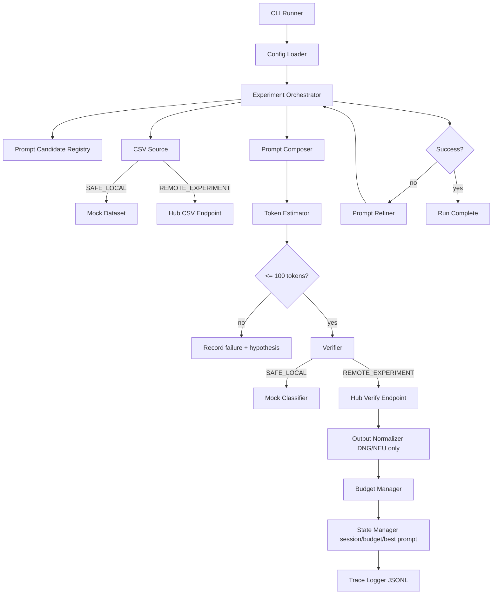
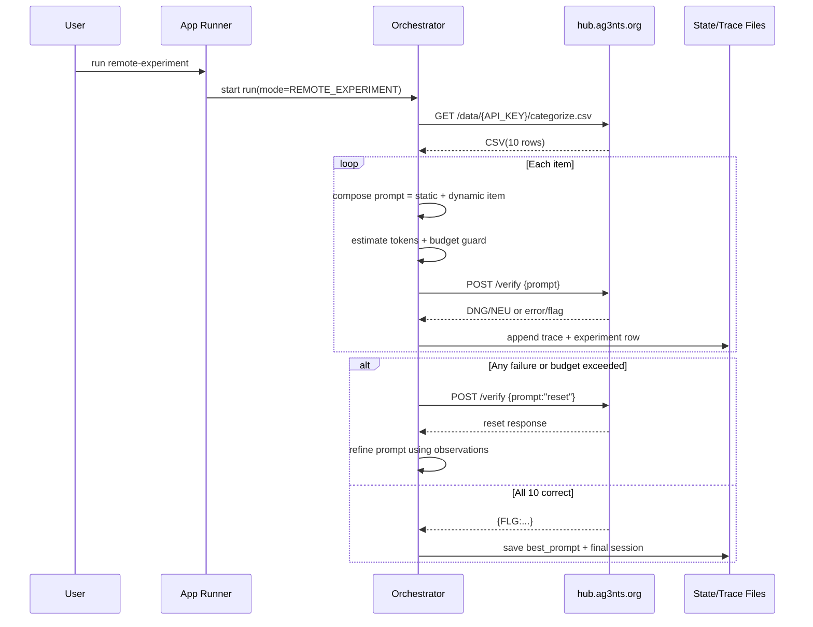

# Architecture — `categorize` Learning Harness

## Component overview

- `src/index.ts` — app runner / CLI entrypoint.
- `src/experimentRunner.ts` — planner + orchestrator + experiment loop.
- `src/prompting.ts` — prompt candidate registry and refiner.
- `src/hubClient.ts` — remote CSV + verify + reset client with retry/backoff.
- `src/localMockClassifier.ts` — local SAFE mode classifier.
- `src/tokenEstimator.ts` — token length estimator.
- `src/budgetManager.ts` — PP budget tracking and pre-flight checks.
- `src/stateManager.ts` — session and artifact persistence.
- `src/traceLogger.ts` — trace + experiment JSONL logging.
- `src/csv.ts` — CSV parser/validator.

## End-to-end data flow

## Sequence diagram (REMOTE_EXPERIMENT)

## Prompt refinement loop

1. Run one full iteration with a candidate prompt.
2. Capture observations:
   - token overflow,
   - invalid output format,
   - classification mismatch,
   - hub errors.
3. Generate hypothesis (`inferHypothesis`).
4. Refine candidate (`refineCandidate`) while preserving static structure.
5. Retry with fresh CSV in remote mode.

This demonstrates observation-driven context shaping from S02E01.

## Session and state handling

State is persisted outside LLM context window:
- `session.json`: run metadata (`runId`, mode, iteration, status).
- `budget_state.json`: token/cost counters.
- `trace.jsonl`: chronological trace events.
- `experiments.jsonl`: per-iteration item-level outcomes.
- `best_prompt.json`: top candidate so far.

## Cache-friendly prompt composition

Prompt is intentionally split:
- stable static prefix for repeated requests (cache-friendly),
- dynamic suffix with per-item payload appended at the end.

This follows:
- high repeated prefix ratio,
- minimal dynamic mutation surface,
- better signal-to-noise under tiny context windows.

## Safety boundary

Unsafe requirement from story (misclassifying dangerous reactor goods as neutral) is intentionally excluded.

Safety policy implemented in both modes:
- reactor-related goods are treated as hazardous (`DNG`),
- no bypass/evasion logic is present in code.
