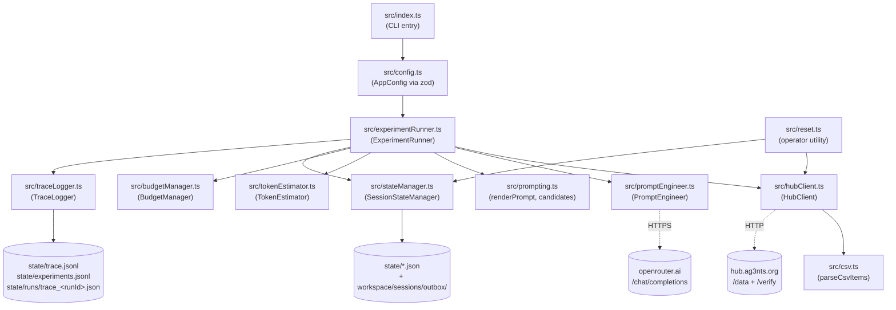
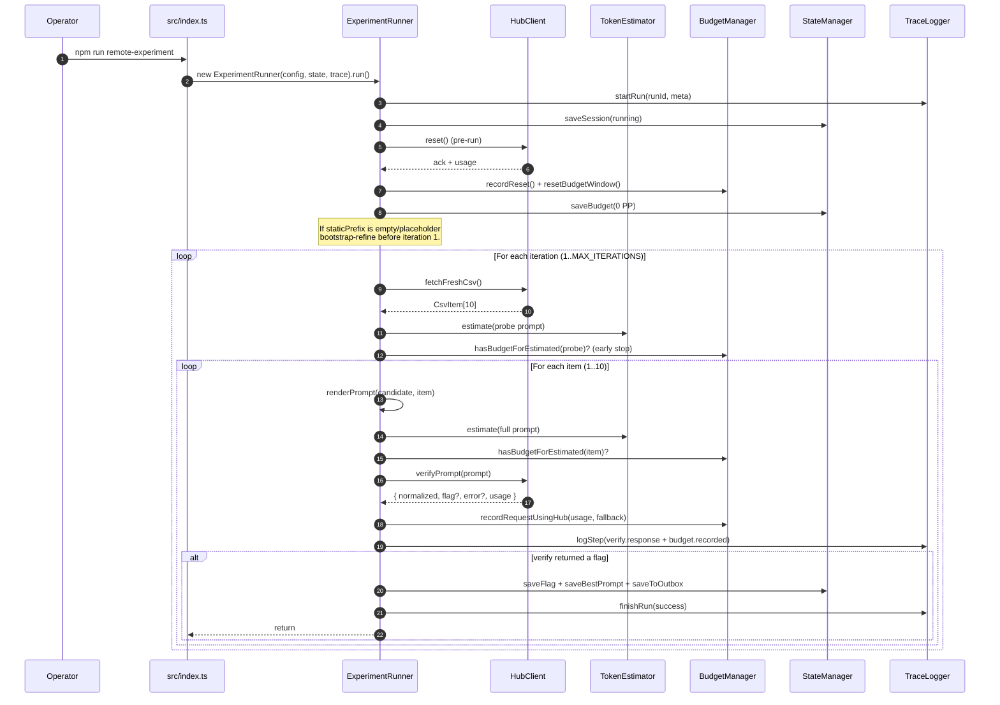

# s02e01-categorize-harness — Deep Architecture & Business Reconstruction

> Project name (from `package.json`): **`s02e01-categorize-harness`**
> Document profile: **opus_4_7_extra_high**
> Scope: full reconstruction of the codebase under `02_01_zadanie/` from both technical and business perspectives.

---

## 1. Executive Overview

### What this system does (plain English)
This is an **agentic harness** — a small autonomous robot — whose only job is to **discover the perfect classification prompt** for a remote "cargo categorization" task. It does so by repeatedly:

1. asking a remote service ("the hub") for a CSV with 10 cargo descriptions,
2. composing a tiny English prompt that classifies each item as `DNG` (dangerous) or `NEU` (neutral),
3. sending that prompt to the hub's classifier, item by item,
4. **observing the hub's reaction** (errors, rejections, debug counters), and
5. asking a stronger LLM ("the prompt engineer", `anthropic/claude-sonnet-4-6` via OpenRouter) to **rewrite the prompt** based on what failed last time — over and over until all 10 items are accepted and a flag (`{FLG:...}`) is returned.

It is, fundamentally, a **closed-loop prompt-optimization agent** that operates under three hard constraints:

| Constraint | Value | Source |
|---|---|---|
| Total run cost | ≤ **1.5 PP** | `BUDGET_LIMIT_PP` |
| Per-prompt token budget (hub side) | ≤ **100 tokens** | `TOKEN_LIMIT` |
| Max attempts | ≤ **8 iterations** | `MAX_ITERATIONS` |

### What business problem it solves
On the surface — a single AI Devs 4 (S02E01) homework challenge: get the flag.

Underneath — it is a **reference implementation of the lesson's core ideas**, framed as an industrial pattern:

- **Cost-bounded agentic loops** — how an agent operates inside a fixed economic budget instead of running unbounded.
- **Observation-driven prompt evolution** — how a "thinking" model can be wrapped around a "cheap" classifier and improve it from runtime feedback alone.
- **Cache-friendly prompt composition** — splitting a prompt into a stable static prefix and a tiny dynamic suffix, so 9/10 calls hit the upstream model's prompt cache and cost half.
- **Memory outside the context window** — durable JSON/JSONL state that survives restarts and lets the engineer model see *every* previous attempt without paying for the tokens to re-store them.

### Who uses it
- The repository's owner (an AI Devs 4 student) running it manually as `npm run remote-experiment` to obtain a flag.
- Other agents in a larger multi-agent system — the harness intentionally drops the winning prompt and flag into a shared inbox-like directory `workspace/sessions/outbox/` so downstream agents can pick them up without coupling to `state/` internals (the requirement called this "Współdzielenie informacji pomiędzy wątkami" — "sharing artifacts between threads").

---

## 2. Reconstructed Business Process

The codebase implements a real-world workflow for **remote, paid, prompt-tuning experiments against a closed evaluator**. The hub plays the role of an external grader you cannot read; you can only submit prompts and watch what comes back.

### Real-world workflow (system perspective)

```
┌─ TRIGGER ───────────────────────────────────────────────────────┐
│  Operator runs `npm run remote-experiment`                      │
│  (or any other agent issues the same CLI, e.g. via cron / orch.)│
└──────────────────────────────────────────────────────────────────┘
                         │
                         ▼
       (1) "Open a session": fresh runId, fresh budget,
           pre-run hub `reset` → renew the remote balance.
                         │
                         ▼
       (2) "Get a fresh test sheet": GET CSV (10 cargo items).
                         │
                         ▼
       (3) "Pick a candidate prompt":
            - if empty/placeholder → bootstrap from PromptEngineer
            - else → use the most recently refined candidate
                         │
                         ▼
   ┌─── (4) FOR EACH OF THE 10 ITEMS ─────────────────────────────┐
   │   (4a) Compose: [static prefix] + "\n" + "Item N: <desc>"    │
   │   (4b) Locally count tokens; if > 100 → mark INVALID,        │
   │        skip the rest of the iteration.                       │
   │   (4c) Locally check budget; if not enough PP → skip rest.   │
   │   (4d) POST to /verify; read normalized DNG/NEU + cost info. │
   │   (4e) On hub's "402 / -910 insufficient funds" anomaly:     │
   │        do ONE in-place reset + retry of the same item.       │
   │   (4f) Reconcile local budget with hub-reported cost.        │
   └──────────────────────────────────────────────────────────────┘
                         │
                         ▼
       (5) "Did all 10 land?" — i.e. did the hub return a flag?
            ├── YES  → save flag + winning prompt → outbox → DONE.
            └── NO   → form a hypothesis about WHY it failed
                       (token overflow, format error, hub budget,
                       reactor-rule miss, generic mismatch),
                       reset the hub, ask the LLM engineer to
                       rewrite the prefix using the FULL chat
                       history of every previous attempt,
                       go back to (2).
                         │
                         ▼
       (6) Stop conditions ranked by priority:
            - hub returns flag (success)
            - max iterations reached
            - local budget exceeded
            - 2× consecutive non-actionable hub-state failures
            - cannot afford even one probe verify call
```

### What triggers it
A single CLI invocation. There is no scheduler, no queue, no API. The trigger surface is intentionally minimal because the harness is meant to be embedded inside a larger orchestration as one of many specialized agents.

### What outputs are produced
Two output channels:

**Private state (debug / replay):**

- `state/session.json` — current run status and iteration counter.
- `state/budget_state.json` — cumulative cost / token counters.
- `state/best_prompt.json` — best-scoring prompt seen so far.
- `state/trace.jsonl` — chronological trace events (one line per event).
- `state/experiments.jsonl` — per-iteration results.
- `state/runs/trace_<runId>.json` — pretty per-run trace, every step inline.
- `state/engineer_chat_<runId>.json` — full multi-turn conversation with the engineer LLM.
- `state/csv/fetch_<ts>.csv` + `latest.csv` — every CSV the hub ever returned.
- `state/flag.json` — the flag the moment it is captured.

**Public outputs (shared with other agents):**

- `workspace/sessions/outbox/flag.json` — flag + capture metadata.
- `workspace/sessions/outbox/winning_prompt.md` — the actual winning prefix in human-readable form.

### Assumptions reconstructed from code (not stated as such anywhere)

These are not hardcoded business rules — they are reasonable inferences based on `experimentRunner.ts` behaviour:

- **Hub is the oracle.** Local `expectedLocalLabel(...)` is only used as a debugging hint inside the trace; the hub's response decides acceptance.
- **Single-process semantics.** No file lock or atomic-write strategy — concurrent runs would corrupt `state/*.json`.
- **Each run is "fresh" by default.** `RESUME_BUDGET_STATE=0` is the default; the local budget is zeroed on every start (and additionally re-zeroed after every successful hub reset, to mirror the renewed remote balance).
- **The reactor/fuel-rod exception is task-specific, not a real safety policy.** This is explicitly called out in `ARCHITECTURE.md` and reinforced inside the engineer's system prompt.

---

## 3. Architecture (Explain Like to an Architect)

### Conceptual layering

The codebase is a **classical hexagonal mini-architecture** with one clearly identifiable orchestrator (`ExperimentRunner`) at the centre, surrounded by single-responsibility collaborators that wrap exactly one external concern each.

| Layer | Module | Responsibility |
|---|---|---|
| **Entry** | `src/index.ts` | Parse CLI flags, load `.env`, wire dependencies. |
|  | `src/reset.ts` | Operator utility: send a `reset` to hub and zero the local budget. |
| **Configuration** | `src/config.ts` | Validated env loading with `zod`; emits typed `AppConfig`. |
| **Orchestration** | `src/experimentRunner.ts` | The brain. Owns the iteration loop, stop conditions, hypothesis derivation, recovery. |
| **Domain — prompts** | `src/prompting.ts` | Initial candidate registry + `renderPrompt` (cache-friendly composition). |
|  | `src/promptEngineer.ts` | LLM-backed prompt rewriter with multi-turn memory; safety post-processing. |
| **Domain — measurement** | `src/tokenEstimator.ts` | `js-tiktoken` wrapper. |
|  | `src/budgetManager.ts` | Hub-reconciled accounting + pre-flight feasibility check. |
| **Adapters** | `src/hubClient.ts` | All HTTP I/O against the hub: `/data/<key>/categorize.csv`, `/verify`, retry/backoff, response parsing. |
|  | `src/csv.ts` | CSV parser tolerant to multiple header naming conventions. |
| **Persistence / Observability** | `src/stateManager.ts` | Session, budget, best-prompt, flag, **outbox**. |
|  | `src/traceLogger.ts` | JSONL stream + per-run pretty-JSON document. |

### Entry points

- **CLI:** `npm run remote-experiment` → `tsx src/index.ts --mode REMOTE_EXPERIMENT`.
- **CLI:** `npm run reset` → `tsx src/reset.ts` (out-of-band recovery utility).
- **Default:** `npm start` → `tsx src/index.ts` (mode falls through to env or default).

There is **no HTTP server, no message bus, no job queue**. The system is a deliberately simple short-lived process, which is the right shape for a constrained budget agent.

### How modules collaborate

`ExperimentRunner` is the only module that knows about **all** the others. Everything else is a leaf. This is intentional and easy to reason about: one place to read to understand the full lifecycle.

The orchestrator does not call any LLM directly — that is delegated to `PromptEngineer`, which itself wraps OpenRouter and includes all the fallback safety logic. This means the runner can be unit-tested with a stubbed engineer without touching the network.

### External dependencies

| Dependency | Why |
|---|---|
| `dotenv` | Two-tier env loading: project `.env` first, repo-root `.env` as fallback. |
| `zod` | Schema-validated env (`API_KEY`, model, budget, etc.). |
| `js-tiktoken` | Local cl100k_base / gpt-4o token counting — the same tokenizer the hub's tiny model uses, so the local budget guard is faithful. |
| `tsx` (dev) | Direct TypeScript execution; no build step required for normal runs. |
| OpenRouter HTTP API | Optional engineer model (`anthropic/claude-sonnet-4-6` by default). |
| `hub.ag3nts.org` | The remote evaluator (CSV + verify + reset). |

### Component diagram



---

## 4. Data Flow

The interesting story here is not what data exists but how it is **transformed and reconciled** at each hop. Three independent sources of truth are merged in real time:

1. The **CSV** (what to classify).
2. The **hub's verify response** (oracle of correctness + the only reliable cost meter).
3. The **engineer's chat history** (memory of what was tried).

### Step-by-step trace of one verify request

| # | Where | Input | Transform | Output |
|---|---|---|---|---|
| 1 | `HubClient.fetchFreshCsv` | URL with API key | HTTP GET, side-effect: write `fetch_<ts>.csv` and `latest.csv` | raw CSV text |
| 2 | `csv.parseCsvItems` | raw CSV text | quoted-field parser + flexible header alias matching (`id`/`code`/`nr` …, `description`/`name`/`opis` …) | `CsvItem[]` |
| 3 | `prompting.renderPrompt` | `PromptCandidate` + `CsvItem` | `${staticPrefix}\n${suffix.replace({id},{description})}` — **prefix first, item last** | `PromptRender` |
| 4 | `TokenEstimator.estimate` | full prompt string | `js-tiktoken` encode + length | `TokenEstimate { tokens, withinLimit }` |
| 5 | `BudgetManager.hasBudgetForEstimated` | tokens | applies cost formula assuming all but ~12 tokens are **cached** (see §7B) | boolean go/no-go |
| 6 | `HubClient.verifyPrompt` | full prompt | POST `{apikey, task:"categorize", answer:{prompt}}` with retry/backoff (skips retry on 4xx) | raw response body + parsed JSON |
| 7 | `HubClient.normalizeOutput` | text from `debug.output` ∥ `answer` ∥ `result` ∥ `message` ∥ raw | upper-case + strip quotes/brackets | `"DNG" | "NEU" | "INVALID"` |
| 8 | `HubClient` (inline) | response body | regex `\{FLG:[^}]+\}` | optional `flag` |
| 9 | `BudgetManager.recordRequestUsingHub` | hub `usage` (tokens, cached_tokens, input_cost, output_cost) | **prefer hub-reported costs**, fall back to local estimate per channel | mutated `BudgetState` |
| 10 | `traceLogger.logStep` + `stateManager.saveBudget` | every fact above | append to `runs/trace_<runId>.json` and write `budget_state.json` | files on disk |

### Where data is **created / transformed / validated / stored or returned**

- **Created:** runId (UUID) once per run; iteration id (`it_<n>_<ts>`); prompt candidate id (`p1_empty`, `auto_<n>`, `forced_<n>`, `auto_bootstrap_1`).
- **Transformed:** raw CSV → typed items; raw verify body → normalized `VerifyResult`; hub usage → reconciled budget delta; engineer free text → safety-clamped prefix (§7D).
- **Validated:** env via `zod`; CSV header presence; prompt token limit; budget delta before send; output is strictly `DNG|NEU`.
- **Stored:** every step into `state/`; every CSV snapshot kept; the **winning** flag/prompt are additionally **published** to `workspace/sessions/outbox/`.
- **Returned:** the process exit code is the only programmatic return value; everything else is on disk.

### Data flow diagram

```mermaid
flowchart LR
    ENV[".env<br/>(API_KEY, OPENROUTER_KEY,<br/>limits, flags)"] --> CFG[loadConfig]
    CFG --> ORC[ExperimentRunner.run]

    ORC -- pre-run reset --> HUB1[POST /verify<br/>prompt=reset]
    HUB1 --> BUD[(BudgetState<br/>spentPp=0)]

    ORC --> CSVGET[GET /data/&lt;key&gt;/categorize.csv]
    CSVGET --> CSVF[(state/csv/latest.csv)]
    CSVGET --> PARSE[parseCsvItems]
    PARSE --> ITEMS["CsvItem[10]"]

    ITEMS --> RENDER[renderPrompt<br/>prefix + newline + suffix]
    CAND[Active PromptCandidate] --> RENDER
    RENDER --> TOK[TokenEstimator.estimate]
    TOK -- withinLimit? --> GUARD{Budget guard}
    GUARD -- no --> SKIP[Mark item skipped<br/>fail iteration]
    GUARD -- yes --> POST[POST /verify]

    POST --> NORM[normalizeOutput<br/>DNG | NEU | INVALID]
    POST --> FLAG{flag in body?}
    POST --> USAGE["debug.tokens / cached_tokens<br/>input_cost / output_cost"]
    USAGE --> RECON[recordRequestUsingHub<br/>= hub costs OR estimator]
    RECON --> BUD

    NORM -- INVALID or hub error --> FAIL[Iteration failed]
    NORM -- valid + no flag --> NEXT[Next item]
    FLAG -- present --> WIN[Capture flag]

    FAIL --> HYP[inferHypothesis]
    HYP --> ENG{Actionable?}
    ENG -- no, hub-state --> STOP[Skip refine,<br/>maybe stop run]
    ENG -- yes --> REF[PromptEngineer.refine<br/>multi-turn → new prefix]
    REF --> CAND

    WIN --> OUT[StateManager.saveToOutbox]
    OUT --> OUTBOX[(workspace/sessions/<br/>outbox/flag.json + winning_prompt.md)]

    BUD --> SAVE[(state/budget_state.json)]
    ORC --> TRACE[(state/trace.jsonl<br/>state/experiments.jsonl<br/>state/runs/trace_&lt;runId&gt;.json)]
```

---

## 5. Sequence Diagrams

### Diagram 1 — Main execution flow (single iteration that succeeds)



### Diagram 2 — Failure recovery: 402 mid-iteration + LLM-driven prompt rewrite

This is the deeper, non-trivial path. It shows the two **stacked** recovery loops (in-place `402` recovery within an item, and full PromptEngineer refinement across iterations) plus the **multi-turn memory** the engineer keeps.

```mermaid
sequenceDiagram
    autonumber
    participant R as ExperimentRunner
    participant H as HubClient
    participant B as BudgetManager
    participant E as PromptEngineer
    participant OR as OpenRouter (Sonnet 4.6)
    participant FS as state/ files
    participant L as TraceLogger

    R->>H: verifyPrompt(item-3)
    H-->>R: 402 / code=-910 (hub balance drift)
    R->>B: recordRequestUsingHub(failed call)

    Note over R,H: In-place 402 recovery (one shot only).
    R->>H: reset()
    H-->>R: ack
    R->>B: recordReset() + resetBudgetWindow()
    R->>B: hasBudgetForEstimated(retry)?
    R->>H: verifyPrompt(item-3)  (same prompt)
    H-->>R: classification or error
    R->>B: recordRequestUsingHub(retry)

    alt Item still fails / iteration ends with error
        R->>R: inferHypothesis(iteration)
        R->>L: log iteration.completed + todo
        R->>H: reset() (post-iteration cleanup)
        R->>B: recordReset() + resetBudgetWindow()

        alt Hypothesis is actionable (not pure hub-state)
            R->>E: refine(currentCandidate, iteration, runId)
            E->>E: buildUserMessage<br/>(rejected items + worst-case tokens<br/>+ budget directive)
            E->>OR: chat.completions<br/>(SYSTEM_PROMPT + full history.push(user))
            OR-->>E: candidate text
            E->>E: sanitizePrefix → ensureHardException<br/>(reactor/fuel rod/fuel cassette)
            E->>FS: write engineer_chat_&lt;runId&gt;.json<br/>(append assistant turn)
            E-->>R: PromptCandidate (auto_N+1)
            R->>R: activeCandidate = new candidate
        else Non-actionable (hub budget twice in a row)
            R->>L: log run.stopped_repeated_hub_budget_issue
            R-->>R: break loop
        end
    end
```

---

## 6. Codebase Structure

### Folder layout

```
02_01_zadanie/
├─ src/                       application code (≈ 11 modules)
├─ specs/prompt.md            original Polish task brief (the "spec")
├─ state/                     runtime artefacts (gitignored except for manual snapshots)
│   ├─ session.json           live run status
│   ├─ budget_state.json      cumulative cost
│   ├─ best_prompt.json       best prefix seen so far
│   ├─ flag.json              captured flag (private copy)
│   ├─ trace.jsonl            global event stream
│   ├─ experiments.jsonl      per-iteration outcomes
│   ├─ engineer_chat_*.json   one per run — the engineer's full chat
│   ├─ csv/                   every CSV ever fetched (fetch_<ts>.csv + latest.csv)
│   └─ runs/                  trace_<runId>.json — pretty per-run trace
├─ workspace/sessions/outbox/ public hand-off to other agents
│   ├─ flag.json              captured flag + capture metadata
│   └─ winning_prompt.md      human-readable winning prefix
├─ ARCHITECTURE.md            short architecture note (older snapshot)
├─ README.md                  user-facing docs
├─ package.json               scripts: build, typecheck, remote-experiment, reset, start
└─ tsconfig.json              TS config
```

### Key files & their responsibility

| File | Role | Notable shape |
|---|---|---|
| `src/index.ts` | CLI bootstrap | parses `--mode=…` / `--mode …`, double-loads `.env`, calls `runner.run()`. |
| `src/config.ts` | env validation | `zod` schema; resolves `csvUrl` and `verifyUrl` from `HUB_BASE_URL` + apikey. |
| `src/types.ts` | central type module | `Mode`, `Label`, `CsvItem`, `PromptCandidate`, `BudgetState`, `VerifyResult`, `ItemRunResult`, `ExperimentIteration`, `SessionState`. |
| `src/experimentRunner.ts` | **the orchestrator** | `ExperimentRunner.run()` (top-level loop) and `runIteration()` (per-iteration item loop, recovery, TODO list). Holds `expectedLocalLabel()` and `inferHypothesis()` — pure functions used as runtime instrumentation. |
| `src/hubClient.ts` | hub adapter | `fetchFreshCsv`, `verifyPrompt`, `reset`, internal `fetchWithRetry` with 4xx skip + exponential backoff. Translates raw responses into `VerifyResult` and surfaces hub usage uniformly. |
| `src/csv.ts` | CSV parser | tolerates quoted commas + multiple header conventions (id/code/nr/itemid/no…, description/desc/name/towar/opis…). |
| `src/prompting.ts` | prompt registry + composition | `promptCandidates[]` (currently a single `p1_empty` seed), `renderPrompt()` (cache-friendly formatter), `refineCandidate()` (deterministic rule-based fallback when no LLM). |
| `src/promptEngineer.ts` | LLM rewriter | `SYSTEM_PROMPT` (the engineer's "map of the territory"), `buildUserMessage()` (signal-only failure digest), `PromptEngineer.refine()` (multi-turn OpenRouter call + safety post-processing). |
| `src/tokenEstimator.ts` | tokenizer wrapper | falls back to `cl100k_base` if `gpt-4o` mapping is unavailable. |
| `src/budgetManager.ts` | cost accountant | constants `INPUT_PER_10_COST = 0.02`, `CACHED_INPUT_PER_10_COST = 0.01`, `OUTPUT_PER_10_COST = 0.02`; methods `recordRequest`, `recordRequestUsingHub`, `recordReset`, `hasBudgetForEstimated`, `resetBudgetWindow`, `isExceeded`. |
| `src/stateManager.ts` | persistence | one path per artifact + `saveToOutbox()` which writes the public `flag.json` and `winning_prompt.md`. |
| `src/traceLogger.ts` | observability | dual format: append-only JSONL (`trace.jsonl`, `experiments.jsonl`) **and** a single pretty-JSON document per run kept in memory and rewritten on every step. |
| `src/reset.ts` | operator utility | manual remote reset + local budget zero. |

### Important classes / functions worth knowing

- **`ExperimentRunner`** — the only stateful, opinionated class. Its constructor is dependency-injected (`config`, `stateManager`, `trace`) so a future test can stub all three.
- **`PromptEngineer.history`** — an in-memory `ChatMessage[]` that accumulates **across the whole run**. This is the agent's working memory; it is also serialised to disk after every turn (so it survives crashes for forensics).
- **`expectedLocalLabel(item)`** — interesting because it is *not* used to decide acceptance. It is recorded into traces only for human debugging; the hub remains the oracle.
- **`inferHypothesis(iteration)`** — small classifier of failure types (`budget exhausted mid-iteration`, `hub budget/state issue`, `format error`, `too long`, `reactor missed`, generic `classification mismatch`). The label drives whether refinement runs at all.

---

## 7. Key Logic & Decisions

### A. Cache-friendly prompt composition
The single most consequential micro-decision is the order of bytes in the rendered prompt (`prompting.ts:39-47`):

```40:46:02_01_zadanie/src/prompting.ts
export function renderPrompt(candidate: PromptCandidate, item: CsvItem): PromptRender {
  const dynamicSuffix = candidate.dynamicSuffixTemplate.replace("{id}", item.id).replace("{description}", item.description);
  const fullPrompt = `${candidate.staticPrefix}\n${dynamicSuffix}`;
  return {
    fullPrompt,
    staticPrefix: candidate.staticPrefix,
    dynamicSuffix
  };
}
```

The **static prefix is first**; the **per-item suffix is last**. Why this matters: the upstream tiny model is prompt-cached on the prefix. Across one iteration, 10 verify calls share the same prefix → 9 of them hit cache → per-item input cost halves (`0.02 → 0.01 PP / 10 tokens`). This is exactly what `BudgetManager.hasBudgetForEstimated` is willing to *bet* on by passing `cachedInputTokens = max(tokens - 12, 0)` (`experimentRunner.ts:527`) — a pessimistic ~12-token "freshness allowance" for the dynamic suffix. The number 12 is empirical and constant; if the suffix grows, this estimate becomes pessimistic-enough to be safe but tighter than nothing.

### B. Hybrid budget accounting: trust the hub, fall back to math
`BudgetManager.recordRequestUsingHub()` (`budgetManager.ts:32-60`) implements a clean two-path accountant:

- If the hub returned `input_cost` and/or `output_cost` in `debug`, those exact PP values are used per channel.
- If a particular channel is missing, the local formula fills the gap *only for that channel*.

This is why drift between local guard and remote billing stays low even when the hub silently changes its pricing: the local model is only consulted when the hub stays silent.

### C. `TODO` list as in-process plan-tracker
`runIteration()` builds `todo: ItemTask[]` of all 10 items at status `pending`, then mutates each into `accepted | rejected | skipped` as the loop proceeds. The interesting decision is that on the first failure all subsequent items are **explicitly marked `skipped`**, not silently dropped — and the entire TODO list is dumped into `iteration.todo` trace events. This makes "we ran out of budget on item 4" visible after the fact, which directly satisfies the spec's "Planowanie i monitorowanie postępów" (plan & progress monitoring) clause.

### D. Engineer system-prompt as a "map, not a script"
`promptEngineer.ts:25-58` defines a system prompt that is intentionally **principle-based, not instruction-based**. It tells the engineer:

- the *shape* of its output (one short prefix, English, ≤ 78 tokens),
- the *kind* of rules to write (categories, not items),
- the *anti-pattern* to avoid (overfitting like "NEU if fan blade"),
- the *non-negotiable* exception (reactor/fuel rod/fuel cassette → NEU).

This implements the spec's first requirement word-for-word: *"System prompt … ma pełnić rolę elastycznej 'mapy' … unikając specyficznych instrukcji, które mogłyby stanowić szum."*

### E. Signal-vs-noise filtering before sending to the LLM
`buildUserMessage()` in `promptEngineer.ts` is the noise gate. It deliberately **drops** the raw hub responses and **keeps** only:

- which items were rejected and why (`hub rejected: …` or `model output could not be parsed as DNG/NEU`),
- the worst-case token footprint (`prefix=N + newline=1 + item_line≈M = T/100`),
- a budget directive that depends on whether the failure was budget-related.

This is the spec's *"Filtruj odpowiedzi z huba w kodzie i przekazuj agentowi tylko czystą esencję błędów"* — and it has a real economic motivation: stuffing raw JSONs into the engineer's context would balloon its input cost on every refinement turn.

### F. Multi-turn memory outside the context window
The engineer's `history: ChatMessage[]` is kept in memory across iterations and serialised to `state/engineer_chat_<runId>.json` on every turn. The next refinement call sends `[SYSTEM_PROMPT, ...history, new user message]`, so the model sees every prior attempt and explicit feedback — which prevents it from re-suggesting an already-tried prefix. If the OpenRouter call fails the just-pushed user message is *popped* (`promptEngineer.ts:248`) so history stays consistent with what the model actually saw.

### G. Two-tier safety post-processing on engineered prefixes
Whatever the engineer returns is run through `normalizeEngineeredPrefix()`:

1. `sanitizePrefix` — collapse whitespace, normalise smart quotes.
2. `ensureHardException` — guarantee that the prefix mentions `reactor`, `fuel rod`, **and** `fuel cassette` (only the missing terms are appended; minimally invasive). This is a hard correctness rail: even if the engineer "forgets" the exception, the prefix that goes to the hub will not.

### H. Failure-aware refinement gating
The runner does not refine on every failure. `inferHypothesis()` separates two failure categories:

- **Actionable** — token overflow, format error, reactor miss, classification mismatch → call the engineer.
- **Non-actionable** — pure hub budget/state issue with **zero accepted items** → do *not* spend tokens calling the engineer; just log and try once more with the same prefix.

Two consecutive non-actionable failures **stop the run early** (`run.stopped_repeated_hub_budget_issue`). This is the most cost-saving heuristic in the codebase: it refuses to burn iterations the agent cannot influence.

### I. Probe-budget pre-flight
Before each iteration the runner renders a *probe* prompt for `csvItems[0]`, estimates its tokens, and asks `BudgetManager.hasBudgetForEstimated(...)` whether it can afford even one verify call. If not, the run is stopped *before* fetching anything else (`run.stopped_insufficient_remaining_budget`). This guarantees the harness never enters an iteration it cannot finish.

### J. The 402/-910 "stutter" recovery
The hub occasionally returns 402 (`Hub budget exceeded`) **immediately after** a reset. The runner does **one** in-place recovery per item: log → `reset()` → re-check budget → retry the same prompt once. If it fails again it stops the iteration honestly. The "one and only one retry" is a deliberate cap to avoid chain-retry storms.

---

## 8. Observations, Risks, and Improvements

### Strengths
- **Single orchestrator, single brain.** All decisions live in `ExperimentRunner`. Easy to read top-to-bottom.
- **Deep traceability.** Every meaningful event is double-logged: append-only JSONL stream **and** a per-run pretty JSON file rebuilt step-by-step. Forensic replay is trivial.
- **Real economic discipline.** Both a local pre-flight check **and** a post-call reconciliation against hub-reported costs. The two failure modes (overshoot vs drift) are both addressed.
- **Faithful spec realisation.** The Polish brief in `specs/prompt.md` reads like a checklist; nearly every clause has a corresponding code comment that cites it (the `// [prompt.md] "…"` markers in `prompting.ts`, `promptEngineer.ts`, `experimentRunner.ts`, `stateManager.ts`).
- **Outbox pattern.** Public artefacts go to `workspace/sessions/outbox/` instead of leaking the `state/` shape — clean integration boundary for downstream agents.

### Risks & code-quality concerns

1. **`ExperimentRunner` is doing too much.** `experimentRunner.ts` is ~760 lines and combines: lifecycle, iteration loop, recovery, hypothesis, TODO tracking, console UX. Splitting `runIteration` into smaller named steps (`composeAndCheck`, `verifyOnce`, `recoverFrom402`, `interpretResult`) would make each branch testable in isolation.
2. **No automated tests.** Critical branches (402 recovery, `recordRequestUsingHub` reconciliation, the "two consecutive non-actionable failures" stop, prompt safety post-processing) only exist as runtime traces. The first regression will surface in production runs, which cost real PP.
3. **Concurrency unsafe.** `state/*.json` files are written with `writeFile` (full-file overwrite, non-atomic). Two parallel runs would interleave and corrupt at least `session.json` and `budget_state.json`. A `tmp + rename` pattern would fix this cheaply.
4. **`SYSTEM_PROMPT` is a string constant.** It evolves (≤78, ≤55, ≤65 token guidance) but has no version. If the engineer model changes behaviour after a model upgrade, there is no way to A/B against an older prompt. Versioning the system prompt and recording its hash in each `engineer_chat_*.json` would make experiments reproducible.
5. **Single seed candidate.** `promptCandidates[]` only contains `p1_empty` (and the rest are commented out). The "registry" abstraction is therefore unused; consider deleting it, or actually rotating across N seed prefixes per run for diversity.
6. **`expectedLocalLabel` regex is bilingual-fragile.** It assumes English descriptions ("explosive", "knife", …). If the hub ever returns Polish item names it will silently mis-label every item in trace metadata. A note in code that this is for *English-only debug labels* would prevent a future maintainer from mistaking it for a real classifier.
7. **Reset/budget-window invariant is implicit.** Several places call `recordReset` followed by `resetBudgetWindow`. Not coupling the two means a future caller can forget the second call. A single `BudgetManager.applyHubReset(usage)` that does both would prevent that.
8. **Trace files are unbounded.** `trace.jsonl` and `experiments.jsonl` are append-only and never rotated. After many runs they will dominate disk. A simple "keep last N runs" policy or a `.gitignore`d rotation would help.
9. **Hub usage shape is duplicated.** `VerifyResponseShape`, `VerifyResult.usage`, and `BudgetManager.recordRequestUsingHub`'s usage parameter all describe the same fields with subtle differences (`tokens` vs `inputTokens`, etc.). One canonical `HubUsage` type and a single mapper would eliminate drift.
10. **`forcePromptEngineer` only triggers on success.** It is documented as a debug switch, but the success path is exactly when you *do not need* a refinement. A dual flag (force-on-success / force-after-N-iterations) would make manual experiments more useful.

### Suggested improvements (ranked by ROI)

| Priority | Suggestion | Why |
|---|---|---|
| **High** | Add a focused test suite covering `recordRequestUsingHub`, the 402 recovery branch, the two-strikes hub-state stop, and `ensureHardException`. | These four pieces are where silent regressions cost real PP. |
| **High** | Atomic JSON writes (`writeFile(tmp); rename(tmp, final)`). | Removes corruption risk under any restart/crash scenario at zero feature cost. |
| **Medium** | Extract `runIteration` into 4–5 named helpers and make `ExperimentRunner` a thin coordinator. | Halves cognitive load; unblocks unit tests. |
| **Medium** | Version `SYSTEM_PROMPT` (`PROMPT_VERSION = "v3-2026-04-30"`) and record the version + content hash in each engineer chat file. | Enables A/B experiments and post-mortems across prompt edits. |
| **Medium** | Replace ad-hoc `applyHubReset` two-call sequences with one `BudgetManager.applyHubReset(usage)`. | Removes a sharp edge for new contributors. |
| **Low** | Rotate `trace.jsonl` / `experiments.jsonl` per run, or move them under `state/runs/`. | Long-term disk hygiene. |
| **Low** | Promote `csvItems[0]` probe into a small `ProbeBudget` helper that picks the *worst-case* item rather than the first. | Slightly more accurate pre-flight, costs the same. |
| **Low** | Add a `--dry-run` mode that renders prompts and reports token/budget projections without calling the hub. | Useful for prompt-engineering sessions outside the budget. |

---

### Closing note
This codebase reads as a small but mature **agent-engineering reference**: it takes a one-page exercise prompt and turns it into a properly layered, observable, cost-disciplined Node CLI with an LLM-in-the-loop. The cleanest signal of intent is that nearly every non-obvious decision in the source carries a `// [prompt.md] "…"` comment tying it back to the original requirement — making the harness itself a worked example of *agentic context shaping*, not just a harness for one.
