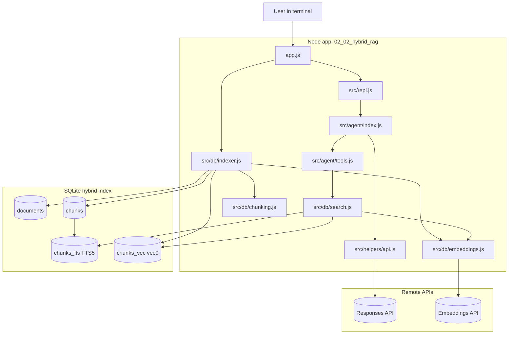
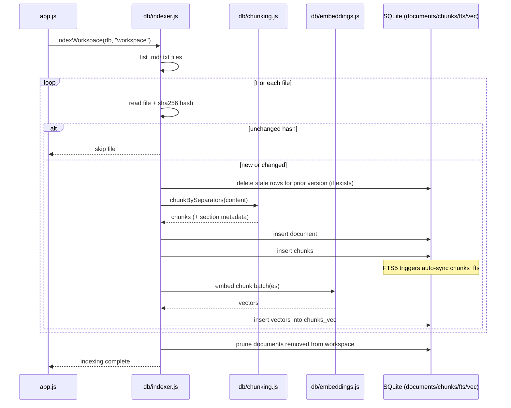
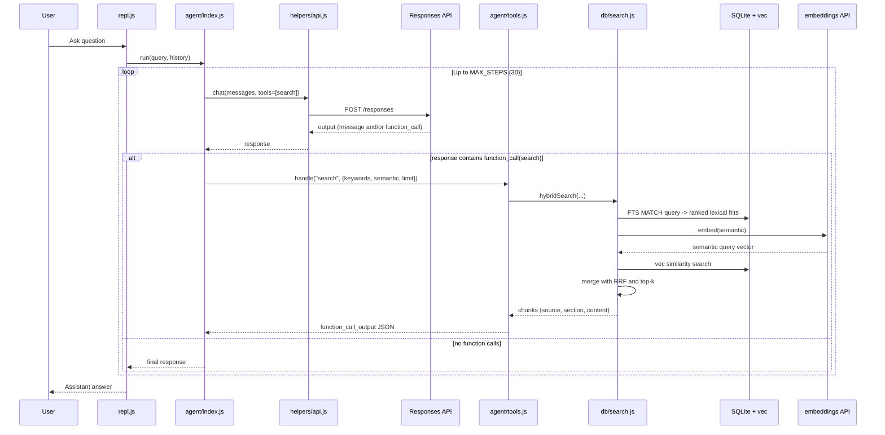
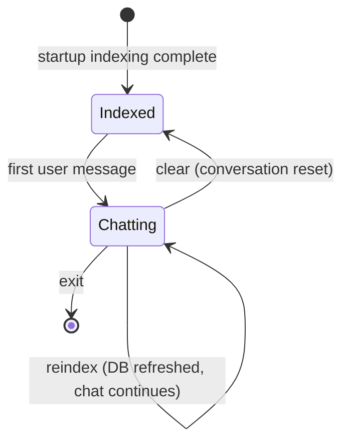

# Architecture: `02_02_hybrid_rag`

This lesson implements a **hybrid RAG agent** over local files, and it is also a **minimal agentic RAG** setup.

In this project, **agentic RAG** means:

- the model decides **whether** to call retrieval tools for a question
- the model can call `search` **multiple times** (iterative retrieval), changing `keywords` and `semantic` queries between calls
- the model decides **when to stop retrieving** and produce the final grounded answer

So this is not a single fixed `retrieve once -> answer once` pipeline; retrieval is model-orchestrated.

Core capabilities:

- **Lexical retrieval** with SQLite **FTS5** + BM25-style ranking
- **Semantic retrieval** with **sqlite-vec** cosine distance over embeddings
- **Fusion** with Reciprocal Rank Fusion (**RRF**) so both signals contribute
- **Agent loop** that can call a `search` tool repeatedly before finalizing an answer

It is designed to stay useful when exact keyword matches are incomplete, while still rewarding precise terms and file-specific language.

---

## Concepts implemented

- **RAG (Retrieval-Augmented Generation)**: responses are grounded in retrieved chunks, not only model memory
- **Agentic loop**: the model can call tools iteratively (`search`) and refine retrieval before answering
- **Hybrid retrieval**: combines lexical and semantic retrieval paths in one query workflow
- **Lexical retrieval (FTS5/BM25-like ranking)**: fast exact-term matching for names, IDs, and literal phrases
- **Semantic retrieval (embeddings + vector similarity)**: concept-level matching when wording differs
- **Reciprocal Rank Fusion (RRF)**: rank-level ensembling of FTS and vector results into one top-k list
- **Chunking with overlap**: recursive separator-based chunking improves recall while preserving context continuity
- **Section-aware metadata**: chunks carry section/source metadata used for grounded answers and citations
- **Incremental indexing**: SHA-256 hash checks skip unchanged files and re-index only changed content
- **Stale index pruning**: removes records for files deleted from `workspace/`
- **Graceful degradation**: if embeddings fail at retrieval time, lexical search still returns results
- **Stateful conversation memory**: prior tool outputs and responses are kept for follow-up questions

---

## What runs in this app

- `app.js` boots everything, indexes `workspace/`, and starts the REPL
- `src/db/index.js` initializes SQLite schema (documents/chunks + FTS + vec)
- `src/db/indexer.js` performs file scan, chunking, embedding, and writes indexes
- `src/db/search.js` runs FTS and vector search, then merges with RRF
- `src/agent/tools.js` exposes one tool: `search({ keywords, semantic, limit })`
- `src/agent/index.js` runs the LLM tool loop (up to 30 steps)
- `src/repl.js` manages `You:` input plus `clear`, `reindex`, and `exit`

---

## Big-picture architecture

---

## Data flow A: indexing phase (startup or `reindex`)

At startup, the app builds/refreshes indexes from `workspace/*.md|*.txt`.

---

## Data flow B: query-time retrieval and answering

For each user question, the model can call `search` multiple times, refining queries as needed.

---

## Retrieval logic (why hybrid helps)

`hybridSearch()` combines two independent rankings:

1. **FTS5 query** from `keywords` (sanitized terms joined with OR)
2. **Vector query** from embedding of `semantic`

Then it computes a fused score per chunk:

- `rrf += 1 / (k + rank)` for each ranking list (with `k = 60`)
- sort by total RRF score
- return top `limit` chunks

This avoids over-relying on either exact words or semantic similarity alone.

---

## Conversation state

---

## Where to use this architecture

Use this when you need **both precision and semantic recall**:

- Internal docs where exact names matter, but users phrase questions differently
- Knowledge bases with mixed styles (`.md` notes, runbooks, specs, meeting docs)
- Cases where one retrieval method misses evidence and you need robust fallback
- Interactive assistants that should iteratively refine search before answering

---

## When not to use it

Prefer simpler pipelines when:

- Queries are predictable and keyword search alone is already enough
- You need very low latency and minimal external API calls
- Determinism is mandatory (agent loops can vary between runs)
- Corpus is tiny and a direct file-read approach is cheaper/easier

---

## Operational notes

- `reindex` refreshes document/chunk/vector index data from `workspace/`
- Changed files are detected by SHA-256 hash, unchanged files are skipped
- If embedding API fails during retrieval, the app degrades to lexical-first behavior
- `clear` resets conversation memory and usage stats; DB remains indexed

---

## Grounding scope and fallback behavior

- The indexed corpus is local: `workspace/` files (`.md` and `.txt`) only
- Retrieval is local only: the `search` tool queries SQLite FTS5 + sqlite-vec over that index
- There is no separate external "LLM knowledge base" retrieval call in this implementation
- If retrieval is weak/empty, the model may still generate from parametric knowledge unless stricter guardrails are added
- For strict grounding, add a policy to return "not found in workspace" when evidence is missing

---

## Model options and cost tuning

Current default in this lesson is `gpt-5.2` (configured in `src/config.js`), but cheaper options are available.

Lower-cost model alternatives:

- `gpt-4.1-mini` - best cost saver, usually sufficient for this RAG + tool-calling pattern
- `gpt-4.1` - balanced quality/cost option
- `gpt-5.1` - often cheaper than `gpt-5.2` while keeping strong reasoning

Additional cost levers (often high impact):

- Reduce `maxOutputTokens` (for example from `16384` to `2000-4000`)
- Lower reasoning effort from `medium` to `low`
- Keep retrieval focused (smaller `limit` in tool calls when possible)

Provider mapping note:

- With OpenAI provider, use plain model ids (for example `gpt-4.1-mini`)
- With OpenRouter provider, plain ids are prefixed to `openai/...` by `resolveModelForProvider()`
- To use a non-OpenAI OpenRouter model, pass a full provider/model id containing `/`

---

## Note: using this with an Obsidian 2nd brain

This architecture is a good fit for Obsidian vaults because it indexes Markdown content and supports both keyword and semantic retrieval.

How to use it effectively:

- Put your vault notes (or an exported subset) into `workspace/` as `.md` files
- Run indexing on startup, then use `reindex` whenever notes change
- Use both query channels in search:
  - `keywords` for exact terms (note titles, tags like `#topic`, project names)
  - `semantic` for intent (for example "where I described weekly review workflow")
- Ask for grounded answers that cite source file and section

Important limitations in the current implementation:

- Frontmatter fields are treated as plain text (not parsed into structured filters)
- Wiki links (`[[Note]]`) are not used as a graph signal for ranking
- Tags/aliases/folders are not first-class filter parameters in the tool yet

Practical query tips for Obsidian notes:

- Combine exact anchors + intent (for example: `keywords="PARA #planning"` with a broader semantic question)
- Try 2-3 reformulations when first retrieval is weak
- Use `reindex` after major vault changes so results stay fresh

---

## Quick mental model

Think of this lesson as **two engines**:

1. **Offline-ish indexing engine** (chunk + embed + store)
2. **Online answer engine** (LLM loop + hybrid search tool + synthesis)

That split is why it scales better than “read whole files on every question”, while still being more robust than pure keyword or pure vector retrieval.
