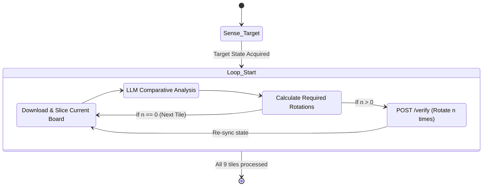
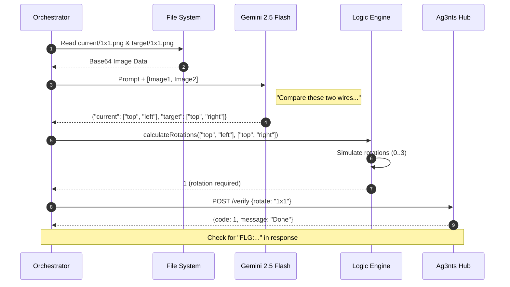

# System Architecture: AI-Driven Electricity Solver

This document outlines the architecture, design philosophy, and technical implementation details of the `electricity` task solver. The system is an AI agent designed to interact with an external API, analyze visual data using a Multimodal Large Language Model (LLM), and execute state-mutating actions to achieve a target visual configuration.

## 1. Design Philosophy

The architecture is built upon three core principles:

1.  **Modular Separation of Concerns**: The system strictly separates API communication, image manipulation, AI inference, and mathematical logic. This allows individual components (e.g., swapping the vision model) to be changed without affecting the orchestration layer.
2.  **Deterministic Logic over Probabilistic Output**: While the LLM is used for visual perception (probabilistic), the actual decision of *how many times to rotate* is handled by a deterministic mathematical engine. The LLM does not decide the actions; it merely provides the state data.
3.  **Idempotent Execution (Surgical Precision)**: To prevent cascading errors from compounded incorrect rotations, the system constantly re-synchronizes its state with the source of truth (the API) after every mutation.

---

## 2. The Agentic Loop (Sense-Plan-Act)

The core orchestration (`src/index.ts`) implements a robust AI Agentic Loop.

### Phase Details:
-   **Sense (Perception)**: Downloading the physical board state as a PNG and slicing it using `sharp` into 1x1 sub-grids. This localization reduces the LLM's cognitive load and spatial reasoning errors.
-   **Plan (Cognition)**: The LLM acts as a transducer, converting pixels to JSON (`['top', 'right']`). The Logic Engine (`engine.ts`) takes the current JSON and target JSON and applies modulo arithmetic to find the shortest rotation path.
-   **Act (Execution)**: Sending sequential POST requests to the Hub API.

---

## 3. Component Architecture

### 3.1. Hub Interface (`src/lib/hub.ts`)
Acts as the Data Access Layer (DAL). It handles HTTP requests, authentication (via `.env`), and binary data streaming for images.
-   **State Management**: It handles the `?reset=1` flag to initialize the board to a known starting point, ensuring reproducibility.

### 3.2. Image Processor (`src/lib/image.ts`)
A crucial pre-processing step. LLMs struggle with large, complex spatial grids. By using `sharp` to physically crop the 3x3 board into nine 1x1 tiles, we force the LLM to focus only on the local features of a single wire.
-   **Edge Case Handling**: Calculates `width` and `height` dynamically for the last row/column to prevent `bad extract area` exceptions caused by fractional pixel rounding.

### 3.3. Vision Transcriber (`src/lib/vision.ts`)
The integration point for **Gemini 2.5 Flash**. 
-   **Comparative Prompting Strategy**: Instead of asking "What does tile A look like?", the prompt provides both the Current and Target tile simultaneously. The prompt enforces a physical constraint: *"This is the SAME physical wire, just rotated. It MUST have the SAME number of connections in both images."* This significantly reduces hallucinated connections.
-   **JSON Coercion**: Implements aggressive regex-based extraction (`text.substring({, })`) because conversational models often wrap JSON in markdown or conversational filler, even when instructed not to.
-   **Resilience**: Implements an exponential backoff retry loop to handle `503 Service Unavailable` or transient parsing errors.

### 3.4. Logic Engine (`src/lib/engine.ts`)
A pure, deterministic function suite.
-   **Data Structure**: Represents directions as a cyclical array: `['top', 'right', 'bottom', 'left']`.
-   **Mathematical Rotation**: Simulates a 90° clockwise rotation by shifting array indices: `new_index = (old_index + clicks) % 4`.
-   **Validation**: Sorts and compares string arrays to verify if a sequence of rotations actually results in the target state. If a target is unreachable (due to vision LLM error), it throws a hard error rather than executing random rotations.

---

## 4. Sequence & Data Flow

This diagram illustrates the data transformations as a single tile is processed.

---

## 5. Known Limitations & Edge Cases

-   **Visual Ambiguity of 'PWR' Tiles**: The tiles in the 3rd column often contain labels like "PWR6132PL". The vision model occasionally interprets the edges of these text boxes as physical wires, or fails to notice a very short wire segment connecting the power plant to the tile edge.
-   **Resolution**: The "Surgical Precision" mode mitigates this by allowing the system to fail on a single tile but continue the loop, requiring manual intervention only for the 1-2 tiles the model fundamentally misunderstands. A potential future improvement would be to fine-tune a smaller vision model specifically on the asset types used in this specific game.
