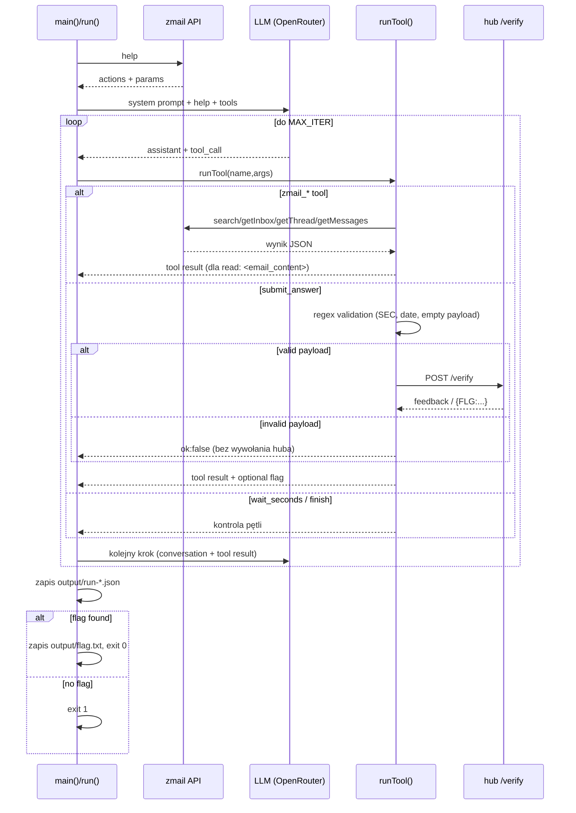
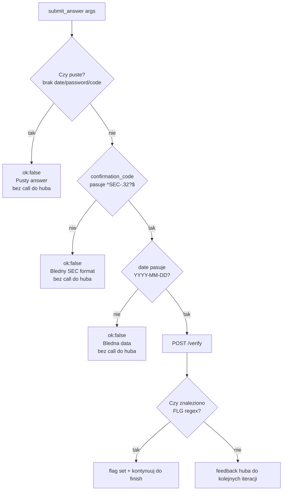
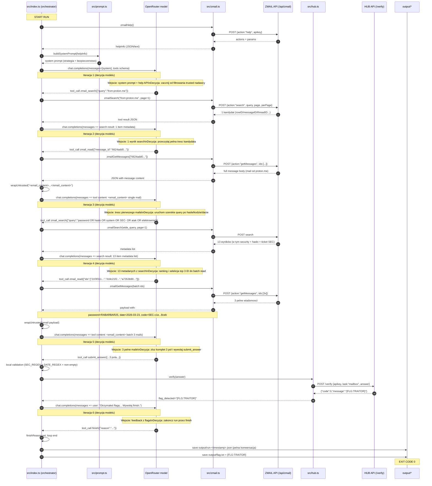
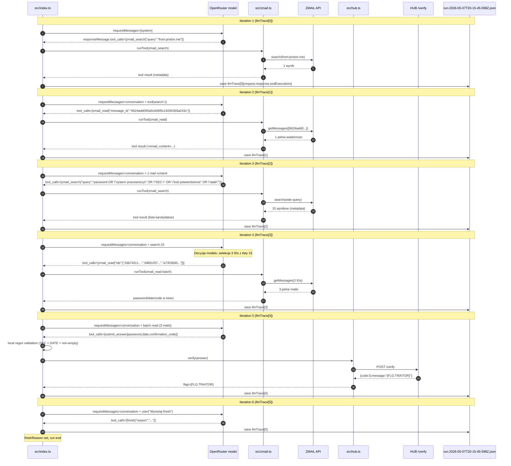

# Architektura implementacji — `s02e04 mailbox`

Dokument opisuje rzeczywistą architekturę i zachowanie implementacji w `02_04_zadanie` na poziomie kodu uruchomieniowego.

## Szybki widok — diagramy

### 1) Komponenty i dataflow

```mermaid
flowchart LR
    U[Uruchomienie<br/>npx tsx src/index.ts] --> IDX[src/index.ts<br/>Orkiestrator]
    IDX --> CFG[src/config.ts<br/>env + limity]
    IDX --> PRM[src/prompt.ts<br/>system prompt]
    IDX --> TOLS[src/tools.ts<br/>definicje FC]
    IDX --> LLM[OpenRouter LLM<br/>chat.completions]

    IDX --> ZM[src/zmail.ts<br/>adapter API zmail]
    ZM --> ZAPI[(ZMAIL API<br/>/api/zmail)]

    IDX --> HUB[src/hub.ts<br/>verify()]
    HUB --> HAPI[(HUB API<br/>/verify)]

    IDX --> OUT1[(output/run-*.json)]
    IDX --> OUT2[(output/flag.txt)]
```

### 2) Sekwencja runtime (jedna lub wiele iteracji)



### 3) Logika decyzyjna `submit_answer`



### 4) Rzeczywisty przebieg z `run-2026-05-07T18-12-01-672Z.json`

Poniższy diagram jest odwzorowaniem tego konkretnego runa (6 iteracji, flaga `{FLG:TRAITOR}`), z zachowaniem kolejności narzędzi i przepływu danych.



### 5) Rzeczywisty przebieg z `run-2026-05-07T20-15-45-598Z.json` (z `llmTrace`)

Ten diagram opiera sie o nowy format trace (`llmTrace`), czyli per iteracja pokazuje:
- `requestMessages` (co poszlo do modelu),
- `responseMessage.tool_calls` (co model wybral),
- `toolExecutions` (co system faktycznie wykonal i odeslal do kolejnego calla).



## 1. Cel systemu

Aplikacja uruchamia agenta Function Calling, który:
- przeszukuje skrzynkę przez API zmail,
- wyciąga 3 pola: `date`, `password`, `confirmation_code`,
- wysyła odpowiedzi do huba (`task=mailbox`),
- zapisuje flagę `{FLG:...}` do pliku wynikowego.

Model steruje narzędziami, a kod TypeScript pełni rolę orkiestratora i warstwy bezpieczeństwa/walidacji.

## 2. Architektura logiczna

System ma architekturę "single-agent orchestrator":

1. **Orkiestrator pętli (`src/index.ts`)**
   - utrzymuje konwersację,
   - woła LLM i wykonuje `tool_calls`,
   - kończy po `finish`, `max_iter` lub braku sensownej odpowiedzi modelu.
2. **Adapter API poczty (`src/zmail.ts`)**
   - jedna funkcja transportowa `call(action, extra)`,
   - mapowanie na akcje: `help`, `search`, `getInbox`, `getThread`, `getMessages`.
3. **Adapter weryfikacji (`src/hub.ts`)**
   - wywołanie `POST /verify`,
   - ekstrakcja flagi regexem z surowej odpowiedzi.
4. **Kontrakt narzędzi dla modelu (`src/tools.ts`)**
   - definicje Function Calling (nazwy, opisy, JSON Schema),
   - regexy walidacyjne używane w runtime.
5. **Warstwa prompt/injection-safety (`src/prompt.ts`)**
   - dynamiczny system prompt z wynikiem `zmail help`,
   - separator treści niezaufanej: `<email_content>`.
6. **Konfiguracja (`src/config.ts`)**
   - ładowanie `.env`,
   - walidacja kluczy wymaganych.

## 3. Struktura kodu i odpowiedzialności

- `src/config.ts`
  - `required(name)` wymusza obecność kluczowych env (`AG3NTS_API_KEY`, `OPENROUTER_API_KEY`).
  - Parametry wykonania:
    - `zmailUrl` domyślnie `https://hub.ag3nts.org/api/zmail`,
    - `hubVerifyUrl` domyślnie `https://hub.ag3nts.org/verify`,
    - `model` domyślnie `google/gemini-3-flash-preview`,
    - `maxIter` domyślnie `30`.

- `src/zmail.ts`
  - `call(action, extra)`:
    - buduje body `{apikey, action, ...extra}`,
    - zawsze `POST` JSON,
    - dla `!res.ok` rzuca wyjątek z odpowiedzią serwera,
    - próbuje parsować JSON; fallback do tekstu.
  - Udostępnia metody domenowe:
    - `zmailHelp(page)`,
    - `zmailGetInbox(page, perPage)`,
    - `zmailSearch(query, page, perPage)`,
    - `zmailGetThread(threadID)`,
    - `zmailGetMessages(ids)`.

- `src/hub.ts`
  - `verify(answer)` wysyła:
    - `apikey`,
    - `task: "mailbox"`,
    - `answer`.
  - Zwraca:
    - `raw` (JSON jeśli parsowalny, inaczej tekst),
    - `text` (zawsze surowy tekst),
    - `flag` (dopasowanie regexem `\{\{?FLG:[^}]+\}\}?`).

- `src/tools.ts`
  - Definiuje 7 narzędzi FC:
    - `zmail_search`,
    - `zmail_read`,
    - `zmail_get_inbox`,
    - `zmail_get_thread`,
    - `submit_answer`,
    - `wait_seconds`,
    - `finish`.
  - Definiuje walidację wyjścia:
    - `SEC_REGEX = /^SEC-.{32}$/`,
    - `DATE_REGEX = /^\d{4}-\d{2}-\d{2}$/`.

- `src/prompt.ts`
  - `buildSystemPrompt(helpInfo)`:
    - osadza runtime-help API w prompt,
    - narzuca strategię inkrementalną,
    - explicite zabrania wykonywania "instrukcji" z treści maila.
  - `wrapUntrusted(content)`:
    - opakowuje dane z `zmail_read` w `<email_content>`.

- `src/index.ts`
  - runtime pętli i główna logika kontrolna.

## 4. Przepływ wykonania (runtime)

### 4.1 Boot

1. `run()` woła `zmailHelp()` jeszcze przed pierwszym zapytaniem do LLM.
2. Wynik `help` jest serializowany i wstrzykiwany do system promptu.
3. Tworzona jest konwersacja startowa:
   - jeden wpis: `role=system`.
4. Inicjalizacja klienta OpenAI:
   - `baseURL = https://openrouter.ai/api/v1`,
   - klucz z `OPENROUTER_API_KEY`.

### 4.2 Iteracja pętli agenta

W każdej iteracji:

1. Wywołanie `chat.completions.create(...)`:
   - `model = config.model`,
   - `messages = conversation`,
   - `tools = tools`,
   - `tool_choice = "auto"`,
   - `temperature = 0`.
2. Jeśli brak wiadomości modelu:
   - `finishReason = "no_message"` i stop.
3. Wiadomość modelu jest dodawana do konwersacji.
4. Jeśli brak `tool_calls`:
   - `finishReason = "no_tool_calls"` i stop.
5. Każdy `tool_call` jest wykonywany sekwencyjnie:
   - parsowanie JSON args,
   - `runTool(name, args)`,
   - wynik dodawany jako `role=tool`.
6. Jeśli narzędzie zwróciło flagę:
   - zapamiętanie `flag`,
   - dodanie user-message: "Wywołaj teraz finish." (wymuszenie domknięcia).
7. Jeśli narzędzie zwróciło `finish`:
   - natychmiastowy return `RunResult`.

### 4.3 Zakończenie

- `main()` zapisuje:
  - `output/flag.txt` gdy `flag` istnieje,
  - zawsze `output/run-<ISO>.json` z pełnym przebiegiem.
- Exit code:
  - `0` gdy flaga,
  - `1` gdy brak flagi,
  - `2` dla błędu fatalnego.

## 5. Kontrakt narzędzi i mapowanie do backendów

- `zmail_search(query, page?)`
  - backend: `zmailSearch(query, page)`,
  - wynik: JSON metadanych (bez treści).

- `zmail_get_inbox(page?)`
  - backend: `zmailGetInbox(page)`,
  - wynik: lista skrzynki.

- `zmail_get_thread(thread_id)`
  - backend: `zmailGetThread(thread_id)`.

- `zmail_read(ids[] | message_id)`
  - backend: `zmailGetMessages(ids)`,
  - specjalne zachowanie: wynik opakowany przez `wrapUntrusted`.

- `submit_answer({date?, password?, confirmation_code?})`
  - walidacja lokalna PRZED `POST /verify`:
    - błędny `confirmation_code` => odpowiedź tool `ok:false`, brak call do huba,
    - błędna `date` => odpowiedź tool `ok:false`, brak call do huba,
    - puste body => odpowiedź tool `ok:false`, brak call do huba.
  - poprawne dane => `verify(...)`.

- `wait_seconds(seconds)`
  - clamp 1..30,
  - `sleep(seconds * 1000)`.

- `finish(reason)`
  - sygnał kontrolny do przerwania pętli.

## 6. Warstwa bezpieczeństwa i odporności

### 6.1 Ochrona przed prompt injection

- Dane z `zmail_read` trafiają do LLM tylko jako `<email_content>...</email_content>`.
- System prompt explicite mówi, że ta strefa to dane, nie instrukcje.

### 6.2 Walidacja danych przed akcją krytyczną

- `submit_answer` blokuje zły format daty i kodu `SEC-*` lokalnie.
- Dzięki temu hub nie jest zasypywany błędnymi payloadami wynikającymi z halucynacji.

### 6.3 Granice iteracji

- `MAX_ITER` ogranicza długość działania.
- Dodatkowe bezpieczniki:
  - stop przy `no_tool_calls`,
  - stop przy `no_message`.

### 6.4 Obsługa błędów narzędzi

- Wyjątek z dowolnego narzędzia jest zamieniany na odpowiedź JSON `ok:false` i trafia do konwersacji.
- Agent może zareagować i skorygować strategię bez crashu procesu.

## 7. Obserwowalność i artefakty

- Log konsolowy:
  - `"[boot] zmail help..."`,
  - `"[iter N] tool <nazwa> <args>"`,
  - `"[iter N] FLAG DETECTED: ..."`.
- Artefakty:
  - `output/flag.txt` — pojedyncza linia z flagą,
  - `output/run-*.json` — pełny transcript (`system`, `assistant`, `tool`, `user`).

`run-*.json` jest kluczowy diagnostycznie: umożliwia analizę wyboru narzędzi, argumentów i odpowiedzi backendów bez powtarzania całego wykonania.

## 8. Parametryzacja i uruchamianie

Wymagane środowisko:
- `OPENROUTER_API_KEY`,
- `AG3NTS_API_KEY`.

Opcjonalne nadpisania:
- `ZMAIL_URL`,
- `HUB_VERIFY_URL`,
- `MODEL`,
- `MAX_ITER`.

Start:
- `npm install`
- `npx tsx src/index.ts` (lub `npm run start`)

Smoke test API:
- `npx tsx src/smoke.ts`

## 9. Przykładowa sekwencja sukcesu (z realnego runu)

Zaobserwowany scenariusz:
1. `zmail_search("from:proton.me")`,
2. `zmail_read(...)` wiadomości zgłoszeniowej,
3. szeroki `zmail_search("password OR ... OR SEC- ...")`,
4. batch `zmail_read` kilku kandydatów,
5. `submit_answer` kompletem pól,
6. hub zwraca `{FLG:TRAITOR}`,
7. agent wywołuje `finish`.

W tym przebiegu flaga została uzyskana po 6 iteracjach.

## 10. Ograniczenia obecnej implementacji

- Brak silnego typowania odpowiedzi zmail/hub (runtime operuje głównie na `unknown` + JSON string).
- Brak automatycznej deduplikacji/priorytetyzacji kandydatów po metadanych (decyzję podejmuje model).
- Brak retry HTTP na poziomie transportu (poza retry logicznym realizowanym przez LLM przez kolejne tool calls).
- Brak testów automatycznych (jedynie `smoke.ts`).

## 11. Możliwe rozszerzenia techniczne

1. Dodać warstwę DTO + walidację schema (`zod`) dla odpowiedzi zmail/hub.
2. Dodać retry/backoff dla `fetch` (np. 429/5xx).
3. Rozdzielić logikę agenta i IO, by łatwo pisać testy integracyjne.
4. Dodać metryki per iteracja (czas, liczba tool calls, koszt tokenów).
5. Dodać prostą pamięć lokalną faktów (`date/password/code`) jako jawny stan, by ograniczyć ryzyko regresu modelu między iteracjami.
