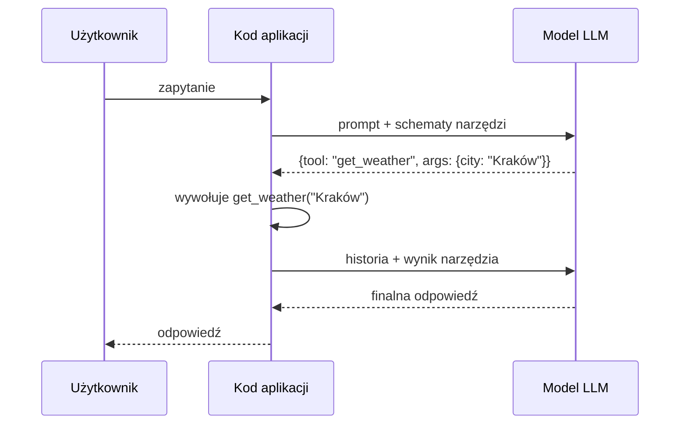

# Function Calling / Tool Use

Mechanizm pozwalający modelowi "przejąć kontrolę" nad logiką aplikacji przez generowanie żądań wywołania funkcji zamiast natychmiastowej odpowiedzi tekstowej. Źródło: [[s01e02]] · rozdziały [[raw/AI-Devs-4_s01e02/AI-Devs-4_s01e02_01!Zasady_laczenia_modelu_jezykowego_z_narzedziami|_01]], [[raw/AI-Devs-4_s01e02/AI-Devs-4_s01e02_02!Function_Calling_oraz_natywne_oraz_wlasne_narzedzia|_02]].

**Kluczowa zasada:** model językowy fizycznie nie może wchodzić w interakcję z otoczeniem — może tylko generować tekst. Function Calling to konwencja, w której ten tekst ma postać JSON z nazwą funkcji i argumentami, a kod aplikacji wykonuje faktyczną akcję.

## Jak działa — pętla Function Calling

**Ważne właściwości pętli:**
- Definicje **wszystkich** narzędzi trafiają do **każdego** zapytania — nawet jeśli nie zostaną użyte. Obciąża to kontekst i może obniżać skuteczność modelu
- Interakcja składa się z **co najmniej dwóch zapytań** do LLM (decyzja o narzędziu + finalna odpowiedź); pętla trwa, aż model zwróci odpowiedź bez wywołania narzędzia lub wyczerpie limit kroków
- Zarówno wywołanie narzędzia, jak i zwrócony wynik trafiają do **historii konwersacji** — zwiększają zużycie kontekstu i koszty
- Narzędzia = nazwa + opis + schemat + callback. Model "widzi" je tak samo jak [[structured-outputs|schemat JSON Schema]] — jako blok tokenów dołączony do kontekstu (patrz [[api-providerzy|Tiktokenizer]])

## Natywne vs własne narzędzia

| Typ | Przykłady | Zalety | Wady |
|-----|-----------|--------|------|
| **Natywne** (providera) | web_search, deep research, file search, code execution | Jedno ustawienie w obiekcie żądania, gotowe od razu | Ograniczona konfiguracja, logika po stronie serwera providera |
| **Własne** (Function Calling) | file_write, get_weather, send_email | Pełna kontrola nad logiką, możliwość dostosowania pod LLM | Wymaga implementacji callbacków i obsługi błędów |

Można używać natywnych i własnych narzędzi **równocześnie** — np. model najpierw wywołuje natywne `web_search`, potem własne `file_write`.

## Powiązania z s01e01

- Schemat narzędzi jest przekazywany do modelu **dokładnie tak samo jak JSON Schema w Structured Outputs** — jako dodatkowy blok w kontekście zapytania. [[structured-outputs]] opisuje ten mechanizm od strony strukturyzowania odpowiedzi; Function Calling odwraca kierunek: model zamiast *zwracać* JSON, *żąda* wykonania akcji.
- Natywne `web_search` zostało już użyte w s01e01 w przykładzie `01_01_grounding` — to była zapowiedź Function Calling.

## Przykładowy zestaw narzędzi

Przykład z kursu (`01_02_tools`): agent wyposażony w `get_weather`, `search_web`, `send_email`. Na pytanie o pogodę w Krakowie model wywołuje `get_weather`, otrzymuje dane, odpowiada użytkownikowi.

Przykład pełniejszy (`01_02_tool_use`): agent z narzędziami filesystem — przeglądanie katalogów, wyświetlanie plików, zapisywanie, usuwanie, tworzenie katalogów. Dostęp ograniczony programistycznie do wskazanego katalogu. Repo: https://github.com/i-am-alice/4th-devs/tree/main/01_02_tool_use

## Pytania sprawdzające

1. Dlaczego model sam nie może "wywołać" funkcji — i co w takim razie fizycznie robi?
2. Ile zapytań do LLM minimum składa się na jedną interakcję z Function Calling i dlaczego?
3. Co trafia do historii konwersacji podczas korzystania z narzędzi i jak to wpływa na koszty?
4. Kiedy warto korzystać z natywnych narzędzi providera zamiast własnych?
5. Jaki jest związek między JSON Schema w Structured Outputs a schematem narzędzi w Function Calling?

## Powiązane strony

- [[projektowanie-narzedzi]] — jak projektować schematy i opisy narzędzi
- [[structured-outputs]] — Structured Outputs jako "brat" Function Calling
- [[api-providerzy]] — natywne narzędzia providerów
- [[workflow-i-agenci]] — jak narzędzia wpisują się w pętle agentów
- [[s01e02]] — pełna lekcja
