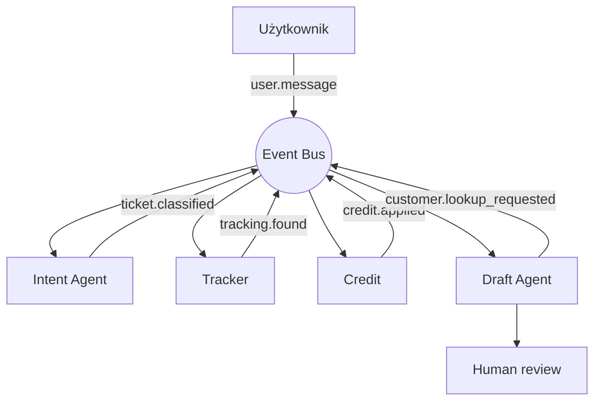

# Multi-agent architectures

Typologia architektur systemów wieloagentowych oraz mechanika komunikacji między agentami. Architektury są z nami od lat (przed LLM); modele językowe dodają im **elastyczności**, ale fundamenty pozostają te same.

> [!moja-notatka]
> Kluczowe rozróżnienie: **architektura** mówi o tym, kto z kim się komunikuje i jak płynie sterowanie; **mechanika** to konkretne narzędzia (delegate/message) i kanały (events), które realizują tę komunikację. Architektury często łączą się ze sobą — w jednym systemie może być orchestrator na górze, blackboard wewnątrz, pipeline w jednym z poddrzew.

## Sześć podstawowych architektur

Lekcja wymienia sześć układów. W praktyce produkcyjnej skupiamy się na pierwszych czterech, często łącząc je w jednym systemie.

### 1. Pipeline

Sekwencja, w której **kolejni agenci przekazują rezultaty swojej pracy**, bez możliwości powrotu do wcześniejszych etapów.

- jednokierunkowy przepływ
- każdy agent ma jasno określony input/output
- brak feedbacku „w górę"
- prosty do debugowania, ale sztywny

**Kiedy:** liniowe procesy z jasno zdefiniowanymi etapami (np. ETL z LLM-em na każdym kroku, transcript → summary → tags).

### 2. Blackboard

Wspólny stan dostępny dla **niezależnych agentów**. Agenci nie znają się nawzajem — komunikują się przez wspólną tablicę.

- agenci `Researcher` z S02E03 (gromadzą dane z różnych źródeł)
- każdy agent czyta i pisze do współdzielonego workspace
- brak bezpośredniej komunikacji peer-to-peer

**Kiedy:** problem da się rozłożyć na niezależne strumienie pracy, których wyniki łączy się dopiero na końcu (Deep Research, multi-source aggregation).

→ Powiązane: [[agentic-rag#Implementacja — przykład 02_01_agentic_rag]], [[deep-research]].

### 3. Orchestrator

Główny **agent-koordynator** zleca zadania, kontroluje przepływ informacji i kontaktuje się z człowiekiem.

- wszyscy specjaliści podlegają orchestratorowi
- orchestrator widzi cały kontekst zadania
- jedna „głowa" decyzyjna
- przykład: **Claude Code** — to architektura, której obecnie używa to narzędzie

**Kiedy:** zadania, w których potrzebna jest centralna koordynacja, plan działania i kontakt z użytkownikiem (asystenci, agentic IDE, Daily Ops z S02E04).

→ Szczegóły roli orchestratora: [[agent-manager]].

### 4. Tree

Rozbudowana wersja koordynatora, która uwzględnia także **role managerów**. Hierarchia trzech (lub więcej) poziomów: koordynator → managerowie obszarów → wykonawcy.

- pozwala na znacznie bardziej złożone zadania
- każdy manager zna swój zakres, nie cały system
- zwiększa złożoność systemu (i koszty kontekstu)
- delegowanie kaskadowe

**Kiedy:** organizacje agentowe obsługujące wiele niezależnych obszarów, gdzie pojedynczy orchestrator byłby przeciążony kontekstem.

### 5. Mesh

Komunikacja **adresowana**: agent zwykle wie, do kogo pisze (np. do "File Managera" od uploadu).

- peer-to-peer, ale z imiennym targetowaniem
- brak centralnej koordynacji
- trudniej kontrolować i debugować
- rzadziej spotykane w produkcyjnych systemach LLM

**Kiedy:** zaawansowane systemy z dobrze zdefiniowanymi rolami, gdzie centralizacja byłaby wąskim gardłem.

### 6. Swarm

Komunikacja **rozproszona**. Wiele agentów może podjąć działanie związane ze zleconym zadaniem; wynik powstaje przez **selekcję bądź agregację**.

- brak adresowania — broadcast
- redundancja jako cecha (kilku agentów próbuje, wybieramy najlepszy wynik)
- najtrudniejszy do kontroli i debugowania

**Kiedy:** eksploracja przestrzeni rozwiązań, ensemble-like decyzje, scenariusze gdzie nie wiadomo z góry, kto powinien zareagować.

> [!moja-notatka]
> Mesh i Swarm są w lekcji wzmiankowane jako „rzadziej spotykane w produkcyjnych systemach". W praktyce architektur LLM dominują dziś orchestrator i tree, blackboard tam, gdzie agenci pracują niezależnie. Mesh/swarm to obszar eksperymentalny.

## Mechanika komunikacji — narzędzia agentów

Architektura to schemat. Żeby zaczęła żyć, agenci muszą mieć **narzędzia komunikacyjne** wstrzyknięte przez Function Calling.

### `delegate` — zlecanie zadań

Zleca zadanie wybranemu agentowi.

- uruchomienie `delegate` **otwiera nowy wątek** przypisany do innego agenta
- pozwala na **zmianę instrukcji systemowej** oraz **zestawu dostępnych narzędzi**
- agent po zakończeniu pracy odpowiada — to staje się **wynikiem działania narzędzia `delegate`** dla nadrzędnego agenta

Z perspektywy nadrzędnego agenta `delegate` zachowuje się jak każde inne narzędzie: wywołanie → wynik. Złożoność (cały wątek subagenta) jest ukryta.

→ Pasuje do: [[function-calling]], [[workflow-i-agenci#Agent Harness]].

### `message` — komunikacja dwukierunkowa

Umożliwia **obustronną komunikację** między agentami.

- używane gdy agent realizujący zadanie potrzebuje doprecyzowania
- wywołanie wstrzymuje pętlę agenta-wywołującego do czasu dostarczenia danych (lekcja sugeruje: dobry scenariusz dla [JS generatorów](https://developer.mozilla.org/en-US/docs/Web/JavaScript/Reference/Statements/function*))
- pozwala na rozwiązanie scenariuszy „nie mogę dokończyć bez X"

**Przykład z lekcji:** agent dodający kupon rabatowy nie zna czasu trwania promocji. Wysyła `message` do nadrzędnego agenta. Ten nie ma danych — pyta użytkownika. Po otrzymaniu odpowiedzi wraca do subagenta przez `message`, co wznawia jego pętlę.

> [!moja-notatka]
> `delegate` to fire-and-wait z jednym round-tripem. `message` to interaktywna pauza w pętli. To dwa różne kontrakty komunikacyjne — pierwsze nadaje się do wykonawców, drugie do współpracy.

## Komunikacja oparta o zdarzenia (event-driven)

Gdy zadania mogą być **zależne od siebie** i **jedno zdarzenie powinno być słyszane przez wielu agentów** — pojawia się architektura event-driven.

### Mechanika

- agenci nie wołają się bezpośrednio; **publikują zdarzenia** do wspólnej szyny
- każdy agent **subskrybuje** zdarzenia, które go dotyczą
- jedno zdarzenie może obudzić kilku agentów równolegle
- wynik = **kompozycja reakcji** wielu agentów na strumień zdarzeń

### Przykład z lekcji: status zamówienia

1. **Użytkownik** → `user.message` (wiadomość trafia do systemu zdarzeń)
2. **Intent Agent** odbiera `user.message`, klasyfikuje typ zgłoszenia → emituje `ticket.classified`
3. **Tracker** i **Credit** (deterministyczne serwisy, niekoniecznie LLM) reagują na `ticket.classified` → emitują `tracking.found` i `credit.applied`
4. **Draft Agent** nasłuchuje na zdarzenia zgłoszenia. Zauważa, że brakuje danych klienta (czy stały). Emituje `customer.lookup_requested` i czeka.
5. Po skompletowaniu danych Draft Agent pisze szkic odpowiedzi → trafia do **człowieka do weryfikacji** (human-in-the-loop).

### Wartość event-driven

- **Loose coupling**: dodajesz nowego agenta przez subskrypcję, bez modyfikacji istniejących
- **Naturalna równoległość**: kilka agentów reaguje jednocześnie
- **Audytowalność**: log zdarzeń = pełna historia procesu
- **Mieszane LLM/deterministic**: na tej samej szynie siedzą agenci LLM i klasyczne serwisy (Tracker/Credit)

→ Powiązane: [[produkcyjne-ai#Event-driven agent loop]] (S01E05 — wprowadzenie event-driven dla pojedynczego agenta), [[rendering-i-streaming]].

## Wizualizacja architektur

Lekcja sugeruje, że **agenci do kodowania (np. Cursor) są wyjątkowo przydatni** w wizualizowaniu architektur wieloagentowych — szczególnie w składni **Mermaid** lub w plikach HTML. Wizualizacja pomaga wyłapać:

- niejawne pętle
- brakujące ścieżki feedbacku
- nieprzemyślane delegowanie

Ostrzeżenie z lekcji: **modele często komplikują lub pomijają istotne wątki**, więc kontrola decyzji projektowych pozostaje po stronie człowieka.

---

## 🏗️ Architecture Thinking

- **Rola w systemie**: orchestration / decision — architektury wieloagentowe to warstwa **koordynacji i podziału pracy** ponad pojedynczymi agentami i workflow.
- **Core vs supporting**: core dla każdego systemu, w którym jeden agent nie wystarczy (osobne instrukcje systemowe, osobne zestawy narzędzi, równoległość).
- **Dependencies**:
  - mechanizm Function Calling dla `delegate` / `message`
  - opcjonalna szyna zdarzeń (Redis Streams, Kafka, NATS, in-memory bus) dla event-driven
  - storage globalnego kontekstu (zob. [[globalny-kontekst-konflikty]])
  - obserwowalność (logi zdarzeń, trace całych delegacji)
- **Trade-offs**:
  - więcej agentów = więcej **degradacji komunikacji** (zob. [[globalny-kontekst-konflikty]] — punkt o degradacji)
  - złożoność rośnie szybciej niż wartość — najpierw orchestrator, dopiero gdy boli, tree/mesh
  - event-driven daje loose coupling, ale komplikuje debug (kto kogo obudził, w jakiej kolejności)

---

## 🏢 Use Case Mapping (GENERIC)

**Typ problemu:**
- agent (główny)
- orchestration / coordination

**Gdzie pasuje w systemie:** orchestration layer; każda warstwa, w której pojedynczy agent przestaje sobie radzić z różnorodnością zadań, długością kontekstu lub wymaganą równoległością.

**Kiedy używać:**
- różne podzadania wymagają **różnych instrukcji systemowych** lub **różnych zestawów narzędzi** (silny argument za multi-agent)
- równoległe wykonanie skraca latency
- są niezależne strumienie pracy (blackboard / event-driven)
- proces wymaga koordynacji, planu, weryfikacji (orchestrator/tree)

**Kiedy NIE:**
- pojedynczy agent + Function Calling wystarczają (zaczynaj zawsze od jednego)
- zadanie jest deterministyczne — workflow lub kod się nadaje lepiej (zob. [[workflow-i-agenci]] — kryteria decyzji)
- nie masz observability ani sposobu na debug komunikacji między agentami
- koszt kontekstu by skoczył przez powielanie tego samego briefu między agentami

---

## ❌ Anti-patterns / risks

- **Multi-agent jako default**: tworzenie 5 agentów dla zadania, które obsłuży jeden. Każde delegowanie to dodatkowa degradacja komunikacji i koszt tokenów.
- **Brak izolacji uprawnień**: subagent dziedziczy uprawnienia parenta. Bez świadomego zawężania `delegate` rozszerza powierzchnię ryzyka (prompt injection w subagencie → szkoda na poziomie roota).
- **Orchestrator jako worek narzędzi**: dosypywanie narzędzi managerowi „bo on i tak wszystko widzi" — przeciąża jego rolę i degraduje decyzyjność. Manager powinien mieć **minimum** narzędzi (zob. [[agent-manager]]).
- **Event-driven bez audytu**: szyna zdarzeń bez logu/trace — debug staje się niemożliwy. „Kto obudził kogo?" musi być odpowiadalne.
- **Mesh/Swarm bez potrzeby**: prestiż architektury > praktyczna wartość. Modele dziś nie radzą sobie wystarczająco dobrze z rozproszoną koordynacją bez centralnej kontroli.
- **Pomijanie sub-agent system promptu**: skoro `delegate` otwiera nowy wątek, ale wciąż dostaje tylko skrót zadania od parenta — agent może zinterpretować to inaczej niż parent zakładał. Brief musi być **wyraźny i pełny**.
- **Cykle w komunikacji**: agent A → message → agent B → message → agent A. Bez timeoutu / detekcji to zawiesza pętle.

---

## 🧪 Experiment / What to test

**Cel:** zbudować minimum viable orchestrator (parent + 2 subagenty) i sprawdzić, gdzie pojawia się pierwsza degradacja komunikacji.

**Setup:**
- parent agent: instrukcja „Daily Ops" (z S02E04, sekcja [[agent-manager#Daily Ops — case study]])
- subagent A: czyta `calendar.json` (mock danych)
- subagent B: czyta `tasks.json` (mock danych)
- narzędzia: `delegate(agent, brief)`, `message(target, payload)` na poziomie parenta
- log każdej delegacji: brief in, response out, ile tokenów, ile rund

**Co zmierzyć:**
- ile parent „domyślnie" zakłada wiedzy w briefie subagenta (i ile musi powtórzyć)
- ile rund `message` potrzeba przy zadaniu wieloetapowym
- co się dzieje, gdy parent dostanie sprzeczne odpowiedzi od A i B

**Czego się spodziewać:**
- parent będzie pisał briefe za skrótowo → subagent zwróci coś nie tego
- przy 2-3 round-tripach `message` zaczyna pojawiać się dryf intencji
- najbardziej pracowite będzie sklejanie wyników A i B w spójną całość — to zwykle kandydat na trzeciego agenta-syntezatora

---

## 🔗 Powiązania

- [[agent-manager]] — rola orchestratora i managera
- [[globalny-kontekst-konflikty]] — co się dzieje, gdy agenci dzielą stan
- [[workflow-i-agenci]] — kiedy agent vs workflow vs kod
- [[function-calling]] — `delegate` / `message` jako tools
- [[agentic-rag]] — blackboard z Researcher'ami (S02E03)
- [[deep-research]] — orchestrator + parallel sub-research jako wzorzec
- [[produkcyjne-ai]] — event-driven loop dla pojedynczego agenta (S01E05)
- [[s02e04]]
