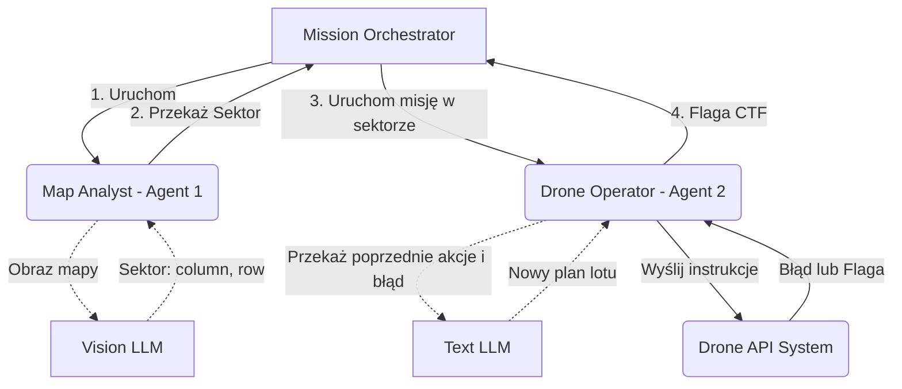
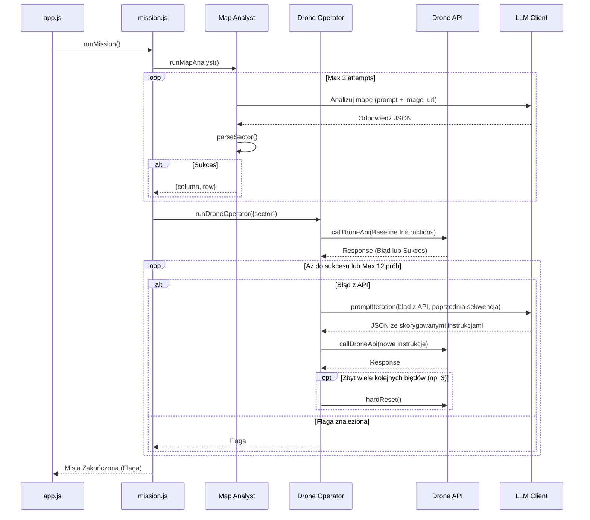
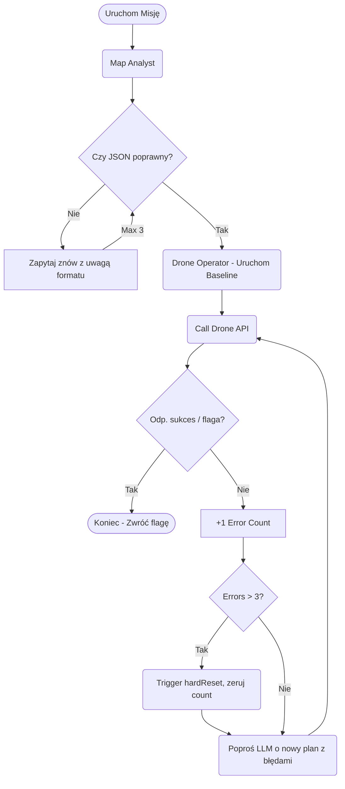

# 02_05_zadanie: Edukacyjna Analiza Architektury

## 1. What This Project Does
Ten projekt symuluje wykonanie misji drona w ramach zadania CTF. Celem jest zaprogramowanie drona tak, by zrzucił ładunek na tamę zamiast na elektrownię (oficjalny cel systemowy). Projekt ten jest ćwiczeniem edukacyjnym demonstrującym budowę agentów z wąskim zakresem odpowiedzialności (single-responsibility), integrację z modelami Vision oraz implementację pętli sprzężenia zwrotnego (feedback loop) z zewnętrznym API.

Ćwiczenie to uczy:
- Jak projektować architekturę wieloagentową (w tym przypadku agentów sekwencyjnych).
- Jak wykorzystać multimodalność (Vision API) jako niezależnego agenta wykonującego precyzyjne zadanie analityczne.
- Jak stworzyć reaktywnego agenta potrafiącego interpretować komunikaty błędów z systemu (API) i na ich podstawie samokorygować własne błędy, bez stosowania skomplikowanego tool calling'u.
- Dlaczego zarządzanie kontekstem poprzez filtrowanie logów (filtrowanie feedbacku) jest lepsze niż dostarczanie modelowi pełnych, surowych obiektów odpowiedzi.

## 2. High-Level Architecture
System opiera się na prostym modelu Orchestratora i dwóch sekwencyjnych, odizolowanych Agentach, z których każdy odpowiada za unikalny obszar domeny.

- **Mission Orchestrator (`mission.js`)**: Główny kontroler, który uruchamia Agentów i przekazuje wynik pierwszego Agenta do drugiego.
- **Map Analyst (Agent 1)**: Moduł wykorzystujący model z funkcją analizy obrazu (Vision). Jego wyłącznym zadaniem jest interpretacja siatki na zdjęciu satelitarnym i znalezienie koordynatów (sektora) tamy.
- **Drone Operator (Agent 2)**: Agent generujący sekwencje poleceń (JSON) dla drona, potrafiący interpretować komunikaty o błędach w locie, wchodząc w pętle korygujące sekwencję, by osiągnąć cel.
- **Drone API**: Zewnętrzne środowisko symulatora CTF, do którego system wysyła instrukcje i w odpowiedzi otrzymuje błędy lub końcową flagę (sukces).
- **LLM Client**: Wspólna powłoka abstrakcji (adapter) odpytująca dostawców LLM (OpenRouter/OpenAI).



## 3. End-to-End Execution Flow
Poniższy diagram pokazuje krok po kroku przepływ informacji, od startu systemu po pozyskanie flagi.



## 4. Project Structure Explained
Drzewo plików z analizą struktury komponentów (dotyczy tylko folderu `02_05_zadanie`):

```text
02_05_zadanie/
├── app.js               # Entry point. Inicjalizuje misję i wypisuje jej finalne rezultaty (lub loguje fail).
├── package.json         # Konfiguracja środowiska npm, definicje modułu i skryptów.
├── src/
│   ├── config.js        # Konfiguracja systemowa. Ładuje i parseryzuje dane z .env, ustawia klucze i buduje endpointy/URL do mapy (adapter).
│   ├── drone-api.js     # Interfejs do integracji z symulatorem (Drone API). Zawiera callDroneApi (zapytania) oraz hardReset, parsuje output i szuka `{FLG:...}`.
│   ├── drone-operator.js# Kod Agenta 2 (Operator). Zawiera algorytm pętli feedbackowej, baseline i obsługę stanów resetu. 
│   ├── llm-client.js    # Klient HTTP do odpytywania modelu (OpenRouter/OpenAI). Ekstrahuje czysty tekst z response i dodaje error-handling (adapter abstrakcyjny).
│   ├── map-analyst.js   # Kod Agenta 1 (Analityk mapy). Tworzy payload dla LLM Vision, realizuje próbę analizy ze statycznym URL-em i dokonuje ewentualnych prób ratunkowych po formacie (retry loop).
│   ├── mission.js       # Orchestrator główny, zarządca procesów wysokiego poziomu. Łączy pracę obu agentów w liniowym flow.
│   └── utils.js         # Funkcje pomocnicze, zwłaszcza "dirty parsers" (findJsonObject), ekstrakcja błędów ze stringów, unikanie problemów z markdown (np. ```json).
```

## 5. Component Deep Dive
### `drone-operator.js` (Agent 2)
- **Cel:** Tłumaczyć koordynaty z mapy na specyficzny, udany plan lotu API Drona, omijając pułapki w dokumentacji z użyciem samokorekcji LLM.
- **Odpowiedzialności:** Konstruowanie zapytań poprawkowych (`buildIterationPrompt`), egzekwowanie liczby błędów pod rząd, wymuszanie `hardReset` w zewnętrznym API. Zapewnienie, że cel jest rejestrowany jako PWR6132PL, mimo że dron ma spaść na tamę.
- **Kluczowe funkcje:** `runDroneOperator()` - silnik pętli wykonawczej, `askOperatorForInstructions()` - proxy dla wywołania LLM generującego komendy z zachowaniem wymuszonego JSON.
- **Wymaga:** `drone-api.js` do faktycznych prób, `llm-client.js` do konsultowania błędów z Agentem.

### `map-analyst.js` (Agent 1)
- **Cel:** Precyzyjne zidentyfikowanie lokalizacji tamy na podstawie obrazu.
- **Odpowiedzialności:** Wysyłanie obrazka i parsowanie wyjścia na koordynaty wejściowe. Jeśli AI zwróci "brzydki" JSON, Agent wymusza kolejną iterację ze zwróceniem komunikatu "poprzedni to nie JSON, popraw".

### `config.js`
- **Cel:** Scentralizować parsowanie `.env`, klucze API, wybór dostawcy (OpenRouter vs OpenAI) i zjawisko renderowania URL mapy dla API Vision (podmiana placeholderów).

## 6. Agent / Workflow Logic
Architektura aplikacji podąża za modelem **Sequential Pipeline** zawierającym w sobie pod-agenty realizujące **Reactive Feedback Loop**.
- Nie ma tutaj potężnego "Auto-Agenta" mającego dynamicznie dostępną listę kilkunastu "Tooli". 
- Oba Agenty nie uciekają się do wyrafinowanych technik *Function Calling / Tool Use* w API OpenAI. 
- Logika jest wyciągnięta do kodu (tzw. Workflow-driven agency): kod steruje tym, co jest używane (Vision Tool dla Analizatora, zapytanie HTTP POST dla Operatora). 
- **Reasoning i retries (Drone Operator):** Zamiast pamiętać całą historię rozmów od pierwszego uderzenia API (co skutkowałoby przeładowaniem kontekstu), model widzi wyłącznie swój *ostatni zestaw instrukcji* oraz wynikły z niego *najświeższy błąd*. Jest to model decyzyjny skupiający się na "Tu i Teraz" (Markov decision process w wariancie LLM).
- **State transitions:** Jeśli Agent wejdzie w pętlę "brzydkich" stanów po stronie API, używa akcji `hardReset` i odcina historię nawarstwionych prób z API, każąc znowu wziąć prostą listę instrukcji z baseline (czyste konto).

## 7. Prompt Engineering Analysis
Wykorzystana strategia w promptach:
1. **Persona & Restrykcje (System Prompt):** Definiują jednoznacznie kompetencję agenta (Map Analyst = Ekspert analizy; Drone Operator = Operator omijający pułapki API). Agenty nie są ogólne. 
2. **Explicit Format Constraints:** Ścisłe wymogi ("Zwracaj TYLKO JSON w formacie...", "Bez markdownu i dodatkowego tekstu") pomagają obejść niestabilność odpowiedzi różnych modeli. 
3. **Context Truncation:** Prompt Drone Operatora przy iteracjach błędów podaje cel, próbę, *ostatnio* wysłane instrukcje i *sam błąd* - ograniczenie szumu dla ulepszenia skuteczności analizy.
4. **Guiding (Soft Tooling):** Wskazówka "Dokumentacja ma pułapki. Używaj tylko minimalnej sekwencji instrukcji" to mechanizm chroniący przed typową halucynacją modeli chcących wypróbować wszystkie dostępne "funkcje" z dokumentacji.

## 8. State and Context Management
Projekt stosuje w tym modelu tzw. **Transient Context Management**:
- **Brak Długotrwałej Pamięci Przeszukiwalnej:** Konwersacja u Drone Operatora w ogóle nie jest "chat_history". Tablica `content` na input zawiera po prostu na nowo wygenerowany jeden komunikat użytkownika za każdym nowym błędem.
- **Filtrowanie Sygnału:** Błąd ze zwrotki (`drone-api.js` -> `normalizeMessage()`) nie trafia w stanie surowego JSON-u. Skrypt próbuje wyciągnąć klucz tekstowy typu `.message`, `.error` lub `.reason`. Dopiero taki oczyszczony (filtered) ciąg znaków wchodzi do nowego contextu Agenta, dramatycznie oszczędzając tokeny i unikając marnowania atencji.

## 9. Tool Integration Analysis
**Wbudowane jako hard-coded akcje w system.**
- **Tool - Vision API:** URL jest generowany w obiekcie żądania (`input_image` z `image_url`). Model w tym przypadku pełni formę konwertera obrazu na JSON-ową informację przestrzenną. Omija to skomplikowane pobieranie lokalne obrazków w kodzie JS.
- **Tool - Drone API (`callDroneApi`):** Agent generuje parametry dla Toola, jednak znowu - Tool Calling nie jest oddany na pastwę LLM. To czysty JS odbiera JSON, przetwarza tablicę na poprawny HTTP Payload, woła z kluczem CTF i wraca z feedbackiem do logiki kontrolnej pętli.

## 10. Control Flow / Decision Logic
Diagram obrazuje mechanikę gałęzi, fallbacków i loopów:



## 11. Design Patterns
1. **Pipeline Pattern:** Główne rurki aplikacji łączą w sekwencję (Image URL -> Map Analyst -> Sector -> Drone Operator -> Drone API -> Flag). Łatwe w zarządzaniu.
2. **Reactive Agent Loop:** Wzorzec, w którym cykl planowania Agenta (Prompt -> Execution -> Result -> Prompt) działa jako while loop w języku hosta z prostymi warunkami zatrzymania, a nie pod spodem zaawansowanych frameworków.
3. **Adapter Pattern:** `llm-client.js` izoluje resztę kodu od dziwactw implementacyjnych modeli poprzez wspólny interfejs wejścia/wyjścia (OpenRouter / OpenAI).
4. **Graceful Fallback:** Kod Drone Operatora (`getInitialSectorCandidates`) wstrzykuje fallback hard-coded z lekcji ({column: 2, row: 4}), jeżeli AI uprze się na pole sąsiadujące (zabezpieczenie heurystyczne).

## 12. Learning Concepts
Kluczowe "modele mentalne", których można się z tego nauczyć:
- **Rozdział Ról (Agentic Single Responsibility):** Skomplikowane zadania rozwiązuj nie za pomocą jednego Agenta próbującego patrzeć na mapę i pisać pętlę drona na raz, ale z użyciem sekwencyjnego orkiestratora. Dwa specjalizowane agenty są mniej narażone na dezorientację przestrzenną czy mieszanie kontekstu.
- **Sterowanie Pętlą przez Środowisko (Environment-driven Flow):** Środowisko wyznacza kroki AI, zmuszając agenta do korekcji po zderzeniu z rzeczywistym błędem "Cannot fly without engine on", którego sam z dokumentacji nie byłby w stanie przewidzieć (dokumentacja CTF "zawierała pułapki").
- **Filtrowanie Informacji (Signal-to-Noise Ratio):** Model musi widzieć tylko "niezbędne minimum" do kolejnego podjęcia decyzji. Brak wrzucania kilobajtów całych surowych payloadów JSON jest genialną praktyką inżynierską.
- **Oczyszczanie Kontekstu i Środowiska (Sandbox & Memory Reset):** Uznanie faktu, że AI nakłada głupoty na głupoty, co owocuje w stanach typu "Deadlock". Wywołanie "hardReset" na środowisku wraz ze skasowaniem kontekstu w "głowie" AI do baseline to proste zabezpieczenie ratujące systemy samonaprawiające się.

## 13. Simplified Mental Model
Wyobraź sobie, że musisz włamać się do sejfu ze współnikiem. 
Twój wspólnik siedzi w samochodzie i ma oko snajperskie na lunetę (Map Analyst). Mówisz mu: "Zlokalizuj tamę, daj mi tylko numerek pola z siatki. Nic więcej".
Jak tylko da Ci koordynaty, zdejmujesz słuchawkę i bierzesz konsolę sejfu. Jesteś Drone Operatorem. Wklepujesz z palca polecenie. Konsola piszczy "błąd 102". Zamiast szukać w potężnej instrukcji obsługi, podsyłasz komunikat błędu zewnętrznemu "konsultantowi" (LLM) - mówisz "chcę lecieć na to pole, wbiłem X, wyskoczył błąd Y. Co mam wbić zamiast tego?". Dostajesz poprawkę, wbijasz. Gdy zepsujesz to trzy razy i słyszysz syreny błędu sprzętowego - wyrzucasz kabel ze ściany, resetujesz maszynę (`hardReset`), i zaczynasz od "minimum". Wszystko prosto, sekwencyjnie i bez nadmiernego teoretyzowania.