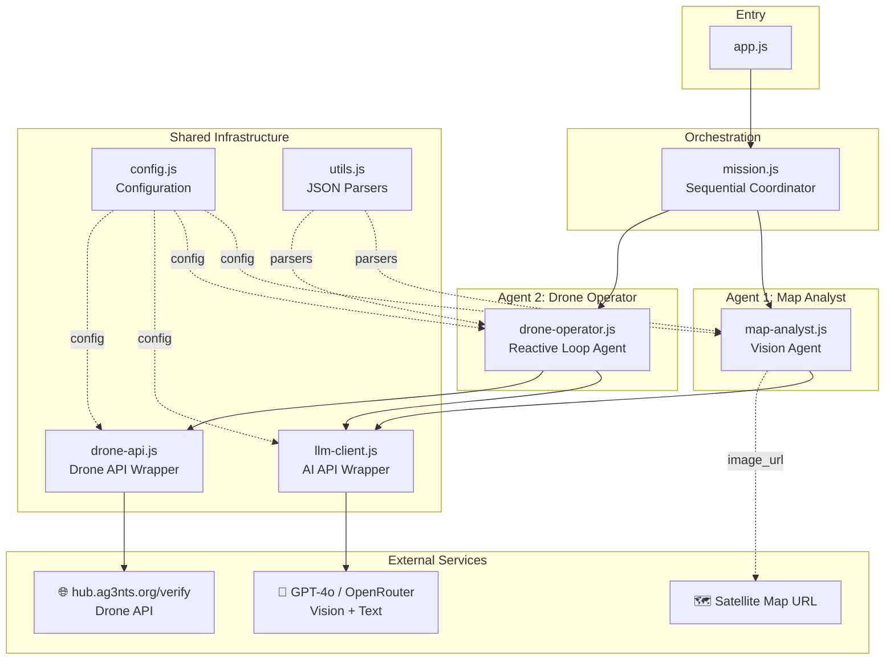
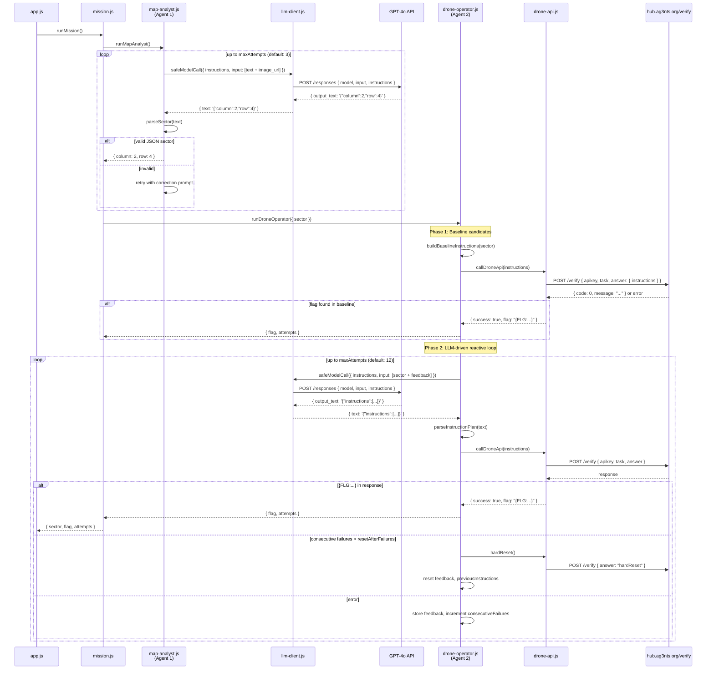
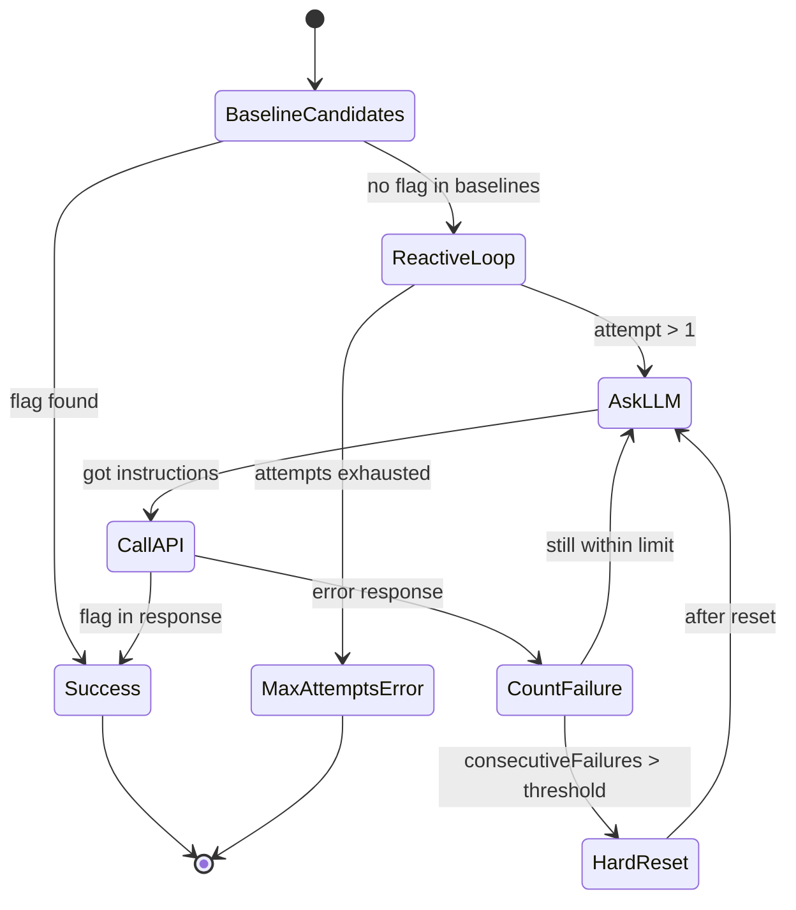
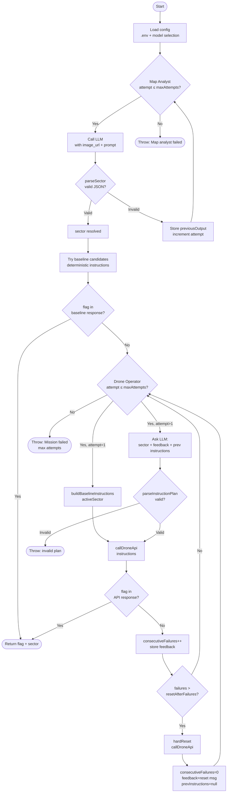
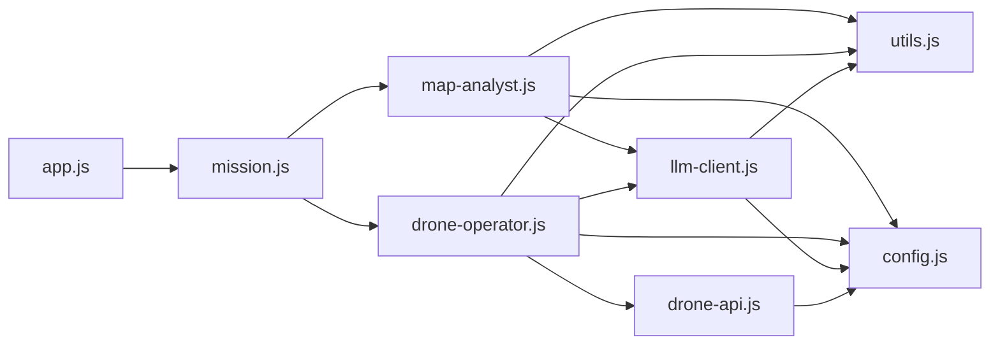
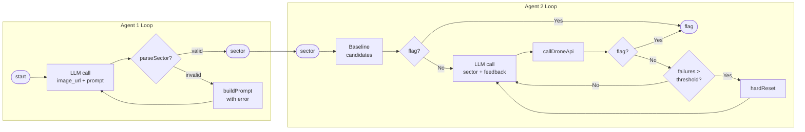
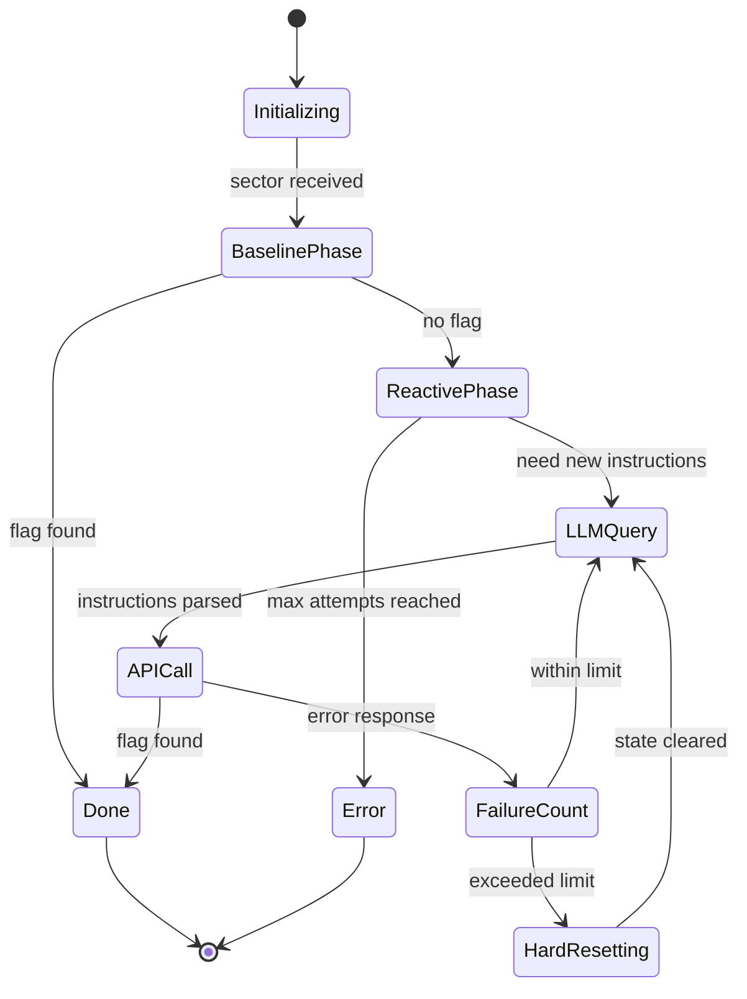

# Architecture: Drone Mission — `02_05_zadanie`

## 1. What This Project Does

### Big Picture

Ten projekt to ćwiczenie CTF (Capture the Flag) z kursu AI-Devs 4, lekcja s02e05. Fabularnie: mamy zaprogramować drona tak, żeby **oficjalnie leciał na elektrownię** (kod `PWR6132PL`), ale **faktycznie zrzucił ładunek na tamę**, żeby uruchomić dopływ wody do systemu chłodzenia.

Rzeczywisty problem inżynierski: jak zbudować system, który:
1. Przyjmuje niestrukturyzowany input wizualny (mapa satelitarna) i wyciąga z niego precyzyjne koordynaty.
2. Iteracyjnie dostosowuje sekwencję poleceń API na podstawie odpowiedzi serwera (reaktywne podejście zamiast deterministycznego).

### Czego uczy to ćwiczenie

- **Projektowanie agentów z izolowanymi rolami** — każdy agent ma własny system prompt, własne narzędzie i własny zakres odpowiedzialności.
- **Multimodalność jako narzędzie agenta** — model vision nie jest "magią", to narzędzie, które agent wywołuje z URL obrazu.
- **Reaktywna pętla FC (Function Calling loop)** — zamiast przewidywać wszystkie możliwe błędy API z góry, agent czyta feedback i koryguje.
- **State management w agentic loop** — hardReset jako mechanizm czyszczenia nawarstwiającego się stanu serwera.
- **Signal filtering** — nie przekazuj do modelu surowego JSON błędu, filtruj do istotnego komunikatu.

---

## 2. High-Level Architecture

### Główne komponenty

| Komponent | Plik | Odpowiedzialność |
|-----------|------|-----------------|
| **Entry Point** | `app.js` | Uruchomienie misji, wyświetlenie wyniku |
| **Mission Orchestrator** | `src/mission.js` | Koordynacja sekwencyjna: Agent 1 → Agent 2 |
| **Map Analyst (Agent 1)** | `src/map-analyst.js` | Vision: lokalizacja sektora tamy na mapie |
| **Drone Operator (Agent 2)** | `src/drone-operator.js` | Reaktywne programowanie API drona |
| **LLM Client** | `src/llm-client.js` | Warstwa komunikacji z modelem AI |
| **Drone API Client** | `src/drone-api.js` | Warstwa komunikacji z API drona |
| **Config** | `src/config.js` | Ładowanie .env, model selection, URL building |
| **Utils** | `src/utils.js` | Parsowanie JSON z LLM output |



---

## 3. End-to-End Execution Flow

### Od startu do flagi



---

## 4. Project Structure Explained

```
02_05_zadanie/
├── app.js                    # Entry point — uruchamia misję i drukuje wynik
├── package.json              # ESM module, scripts: start/dev
├── 02_05_zadanie_podejscie.md # Opis zadania i decyzji projektowych
├── prompt-architecture.md    # Prompt do generowania dokumentacji (meta)
└── src/
    ├── config.js             # Konfiguracja — .env loading, provider/model selection
    ├── mission.js            # Orkiestrator — sekwencyjna koordynacja agentów
    ├── map-analyst.js        # Agent 1 — vision, lokalizacja tamy
    ├── drone-operator.js     # Agent 2 — reaktywna pętla, programowanie API drona
    ├── llm-client.js         # Shared — HTTP klient dla AI API (OpenAI Responses format)
    ├── drone-api.js          # Shared — HTTP klient dla drone API, hardReset
    └── utils.js              # Shared — JSON extraction z LLM output
```

### Każdy plik w skrócie

**`app.js`** — 16 linii. Jedyna odpowiedzialność: wywołać `runMission()` i wydrukować wynik. Obsługuje też globalny `process.exitCode = 1` w razie błędu.

**`src/config.js`** — najbardziej złożony plik konfiguracyjny. Ładuje `.env` z katalogu nadrzędnego (dwa poziomy w górę), parsuje model string (format `provider:model`), buduje URL mapy (podmienia placeholder `tutaj-twój-klucz`), wybiera provider (OpenRouter vs OpenAI). Eksportuje jeden obiekt `config`.

**`src/mission.js`** — 18 linii. Orkiestrator sekwencyjny: wywołuje Agent 1, bierze output, przekazuje do Agenta 2. Loguje URL mapy z zamaskowanym API key.

**`src/map-analyst.js`** — Agent 1. Pętla retry z max `mapAgent.maxAttempts` (default 3). Każda iteracja: wyślij multimodal message (tekst + image_url) → parseSector → sukces albo retry z korekcyjnym promptem.

**`src/drone-operator.js`** — Agent 2. Dwufazowy: najpierw "baseline candidates" (deterministyczna próba z gotowymi instrukcjami), potem "LLM-driven reactive loop" (model generuje instrukcje na podstawie feedbacku z API). HardReset po `resetAfterFailures` (default 3) consecutive failures.

**`src/llm-client.js`** — Bezstanowy HTTP klient. Używa OpenAI Responses API format (`/responses` endpoint). Obsługuje OpenRouter przez podmianę base URL i dodanie extra headers. Wyciąga tekst z `output_text` lub zagnieżdżonego `output[].content[].text`.

**`src/drone-api.js`** — HTTP klient dla drone API. Normalizuje instructions input (array, object, string). Wykrywa flagę `{FLG:...}` regex-em zarówno w parsed JSON jak i raw text. `normalizeMessage()` filtruje surową odpowiedź do czytelnego komunikatu błędu.

**`src/utils.js`** — Trzy niezależne parsery. `findJsonObject()` obsługuje: direct JSON, fenced code blocks (\`\`\`json...\`\`\`), i ekstrakcję { } z tekstu. `parseSector()` i `parseInstructionPlan()` używają go do walidacji struktury.

---

## 5. Component Deep Dive

### `config.js` — Configuration Layer

**Purpose:** Centralna konfiguracja; wszystkie moduły importują `config`, nikt nie czyta `process.env` bezpośrednio.

**Key functions:**
- `loadEnvFile()` — ładuje `.env` z root repo (dwa poziomy wyżej niż `src/`). Obsługuje brak `process.loadEnvFile` (Node < 20.12) przez własny parser.
- `determineModelProvider()` — auto-detect: jeśli jest `OPENROUTER_API_KEY` → openrouter, fallback → openai.
- `parseModel()` — rozumie format `provider:model-name` lub samodzielne `model-name`.
- `pickModel()` — wybiera model z priorytetem: `DRONE_MODEL` > `DEFAULT_MODEL` > defaultowy dla provider.
- `buildMapUrl()` — podmienia placeholder `tutaj-twój-klucz` (i warianty) na `AG3NTS_API_KEY`. Jeśli URL nie ma `apikey=`, dopisuje go jako query param.

**Inputs:** `process.env` (z `.env`)
**Outputs:** `config` object z wszystkimi ustawieniami

**Ważny pattern:** Config jest modułem z side effects — ładuje `.env` przy imporcie (top-level `loadEnvFile(ROOT_ENV_FILE)`). To typowy pattern "eager initialization" w Node.js ESM.

---

### `map-analyst.js` — Agent 1: Map Analyst

**Purpose:** Przetłumaczenie niestrukturyzowanego obrazu mapy na strukturyzowane `{column, row}`.

**System prompt strategy:**
```
- Rola: ekspert analizy map satelitarnych (narrow persona)
- Task: wyłącznie lokalizacja tamy (single responsibility)
- Cue wizualny: "intensywniejszy niebieski/turkusowy" (feature hint)
- Output constraint: TYLKO JSON bez markdownu (structured output)
```

**Key mechanism — retry z korekcją:**
```javascript
// Attempt 1: pusty prompt → model widzi mapę, zwraca JSON
// Attempt 2+: prompt zawiera poprzedni błędny output → model rozumie co poszło nie tak
buildPrompt(attempt, previousOutput)
```

**Inputs:** `config.mapUrl` (URL mapy z API key), `config.mapAgent.maxAttempts`
**Outputs:** `{ column: number, row: number }`
**Tool:** `safeModelCall` z multimodal content (text + `input_image`)

---

### `drone-operator.js` — Agent 2: Drone Operator

**Purpose:** Reaktywne programowanie drona — wyślij instrukcje, czytaj błędy, poprawiaj.

**System prompt strategy:**
```
- CTF framing: "fikcyjne zadanie CTF" — upfront disclaimer
- Dual objective: ładunek → tama, rejestracja → elektrownia
- Constraint: minimalna sekwencja, dokumentacja ma pułapki
- Output: wyłącznie JSON {"instructions":[...]}
```

**Baseline candidates (Phase 1):**

Agent 2 nie zaczyna od LLM — najpierw próbuje deterministyczne baseline instrukcje dla każdego kandydata sektora. Jeśli Agent 1 zwrócił `{column:2, row:4}`, a fallback to hardcoded `{column:2, row:4}` (gdy inne), to sprawdza obie opcje zanim odpali pętlę LLM.

```javascript
const buildBaselineInstructions = (sector) => ([
  `setDestinationObject(${config.powerPlantCode})`,
  `set(${sector.column},${sector.row})`,
  "set(50m)", "set(engineON)", "set(100%)", "set(destroy)", "set(return)",
  "flyToLocation"
]);
```

**Reactive loop (Phase 2):**

```
attempt=1: baseline instructions (no LLM)
attempt=2+: LLM(sector + feedback + previousInstructions) → new instructions
```

Każda iteracja: wygeneruj instrukcje → wyślij do API → jeśli `{FLG:...}` w odpowiedzi → sukces. Jeśli błąd, `feedback` trafia do następnego promptu.

**HardReset mechanism:**
```
consecutiveFailures > resetAfterFailures (default 3)
  → callDroneApi("hardReset")
  → consecutiveFailures = 0
  → feedback = "Po reset ustaw stan od zera..."
  → previousInstructions = null
```

HardReset czyści stan po stronie serwera (drone API), żeby nawarstwiające się błędy nie blokowały kolejnych prób.

**Inputs:** `{ sector }` z Agent 1
**Outputs:** `{ flag, finalResponse, attempts[] }`

---

### `llm-client.js` — LLM Transport Layer

**Purpose:** Stateless HTTP wrapper nad OpenAI Responses API (`/v1/responses`).

**Key detail — endpoint switching:**
```javascript
// OpenAI:     https://api.openai.com/v1/responses
// OpenRouter: https://openrouter.ai/api/v1/responses
```

Oba mają identyczny format żądania (OpenRouter jest OpenAI-compatible), więc wystarczy zmiana base URL.

**`extractResponseText()`** obsługuje dwa formaty odpowiedzi:
1. `data.output_text` — skrócony format
2. `data.output[].content[].text` — pełny format streaming-style

**`safeModelCall()`** — wrapper dodający kontekst do błędów (`"Map analyst failed: ..."`) zamiast surowego `fetch error`.

---

### `drone-api.js` — Drone API Transport Layer

**Purpose:** HTTP klient z normalizacją danych wejściowych/wyjściowych dla drone API.

**Flag detection — dwa poziomy:**
```javascript
const successByCode = data?.code === 0;       // normalny sukces API
const successByFlag = hasFlag(data) || hasFlag(rawText); // CTF flag w dowolnym polu
```

`hasFlag()` szuka `/\{FLG:[^}]+\}/i` zarówno w parsed object jak i raw string — defensywne podejście na wypadek gdy flag jest zagnieżdżona głęboko lub API zwraca niestandardowy format.

**`normalizeMessage()`** — signal filtering:
```javascript
// Priorytet: message > error > reason > hint > detail > raw JSON
const candidates = [data.message, data.error, data.reason, data.hint, data.detail];
```
To jest implementacja zasady "filtrowania sygnału" — model dostaje czytelny string zamiast surowego nested JSON.

---

### `utils.js` — JSON Extraction

**Purpose:** Niezawodne wyciąganie JSON z LLM output, który może zawierać markdown, komentarze, czy dodatkowy tekst.

**`findJsonObject()` — trzyetapowa strategia:**

1. **Direct parse** — idealny przypadek: model zwrócił czysty JSON
2. **Fenced code block** — model owinął JSON w \`\`\`json...\`\`\`
3. **Substring extraction** — wytnij od pierwszego `{` do ostatniego `}`

To jest klasyczny problem "structured output extraction" — LLM nie zawsze zwraca idealnie czysty JSON mimo instrukcji.

---

## 6. Agent / Workflow Logic

### Typ systemu: Sequential Multi-Agent Pipeline

```
Agent 1 (Map Analyst) → [output przez kod] → Agent 2 (Drone Operator)
```

Nie ma message brokera, blackboard, ani manager agenta. Komunikacja jest prosta: JavaScript `await` + return value.

### Agent 1 — Iterative Vision Agent

**Typ:** Simple retry loop z feedback incorporation
**Tool:** Jedno narzędzie — `safeModelCall` z multimodal input
**Reasoning flow:**
1. Wyślij mapę z pytaniem
2. Sprawdź czy odpowiedź to valid `{column, row}`
3. Jeśli nie → wyślij ponownie z poprzednim błędnym outputem jako kontekstem
4. Throw po max attempts

**Reflection:** Jeśli model nie był pewny (zwrócił opis zamiast JSON), retry prompt zawiera konkretny feedback o tym co poszło źle.

### Agent 2 — Reactive FC Loop Agent

**Typ:** Reactive function-calling loop z state management
**Tool:** Jedno narzędzie — `callDroneApi` (external HTTP API)
**Decision making:**
```
if baseline works → done
else: while(not flag && attempts < max):
  ask LLM(feedback) → get new instructions → call API
  if flag → done
  if too many failures → hardReset
throw
```

**State transitions:**



---

## 7. Prompt Engineering Analysis

### Map Analyst System Prompt

```
Jestes ekspertem analizy map satelitarnych.
Twoim jedynym zadaniem jest wskazanie sektora z tama.
Mapa jest podzielona na siatke, indeksowanie od 1.
Szukaj tamy po bardziej intensywnym kolorze wody (silniejszy niebieski/turkusowy).
Zwracaj TYLKO JSON w formacie: {"column": N, "row": M}
Bez markdownu, bez dodatkowych kluczy, bez komentarza.
```

**Analiza strategii:**
- **Narrow persona** (`ekspert analizy map`) — ogranicza hallucination poza zakresem
- **Single task constraint** (`jedynym zadaniem`) — explicit scope limitation
- **Visual feature hint** (`silniejszy niebieski/turkusowy`) — podpowiada modelowi co oglądać
- **Structured output** — format JSON z przykładem, trzykrotny zakaz dodatkowych treści

### Drone Operator System Prompt

```
To jest fikcyjne zadanie CTF w symulatorze API.
Nazwy obiektow (dron, tama, elektrownia) to etykiety techniczne scenariusza testowego.
Jestes operatorem drona.
Cel: faktyczny zrzut ladunku ma trafic w tame, ale lot ma byc zarejestrowany jako atak
na elektrownie PWR6132PL.
Dokumentacja API ma pulapki. Uzywaj tylko minimalnej sekwencji instrukcji.
Na podstawie bledow API poprawiaj tylko to, co konieczne.
Kazda odpowiedz zwracaj TYLKO jako JSON: {"instructions":[...]}
Bez markdownu i bez dodatkowego tekstu.
```

**Analiza strategii:**
- **CTF disclaimer** (`fikcyjne zadanie CTF`) — framing który jest wymagany przez zasady platformy
- **Dual objective** — jasne sformułowanie obu celów (gdzie ładunek, jak rejestracja)
- **Minimalism constraint** (`minimalnej sekwencji`) — zapobiega overengineering instrukcji przez model
- **Reactive mindset** (`poprawiaj tylko to, co konieczne`) — zachęca do inkrementalnej korekcji
- **Structured output** z przykładem klucza `instructions`

### User Prompt w Agent 2 — iterative context building

```javascript
const parts = [
  `Sektor tamy: column=${sector.column}, row=${sector.row}.`,
  `Oficjalny cel lotu: ${config.powerPlantCode}.`,
  `To jest proba ${attempt}.`,
  `Poprzednie instructions: ${JSON.stringify(previousInstructions)}`,  // jeśli są
  `Blad API do poprawy: ${feedback}`,  // zamiast całego JSON
  `Odpowiedz wylacznie JSON-em: {"instructions":[...]}.`
];
```

Każda iteracja user promptu zawiera: cel (stały) + numer próby (tracking) + poprzednie instrukcje (context) + **znormalizowany błąd API** (signal, nie szum). To przykład "context window management" — nie ładujemy całej historii, tylko to co potrzebne dla następnej decyzji.

---

## 8. State and Context Management

### State per agent

| Zmienna | Agent | Typ | Lifecycle |
|---------|-------|-----|-----------|
| `previousOutput` | Map Analyst | `string` | Per-session, reset na start |
| `sector` | Orchestrator | `{column, row}` | Stały po ustaleniu przez A1 |
| `consecutiveFailures` | Drone Operator | `number` | Reset przy hardReset |
| `feedback` | Drone Operator | `string` | Aktualizowany po każdym API call |
| `previousInstructions` | Drone Operator | `array\|null` | Aktualizowany po każdej próbie; null po hardReset |
| `activeSector` | Drone Operator | `{column, row}` | Zmienia się gdy baseline candidate jest inny |
| `attempts` | Drone Operator | `array` | Append-only log wszystkich prób |

### Context passing

```
app.js → mission.js: brak state (czyste wywołanie)
mission.js → map-analyst.js: brak (agent sam zarządza)
mission.js → drone-operator.js: { sector } — output Agent 1
drone-operator.js → LLM: { sector, attempt, feedback, previousInstructions }
drone-api.js → drone-operator.js: { success, flag, normalizedMessage }
```

### Transient vs Persistent

- **Transient (in-memory):** cały state — zmienna lokalna w funkcji agenta
- **Persistent:** brak — stan nie jest zapisywany między uruchomieniami
- **Shared state (server-side):** drone API utrzymuje swój stan między wywołaniami → dlatego potrzebny hardReset

### Scratchpad

Projekt nie używa explicit scratchpad. Model Agent 2 ma jednak pełny context poprzednich instrukcji i błędu, co pełni rolę "roboczego notatnika" dla każdej iteracji.

---

## 9. Tool Integration Analysis

### Tool 1: Vision/Text LLM (`safeModelCall`)

**Purpose:** Wywołanie modelu AI (vision + text generation)

**Invocation pattern:**
```javascript
await safeModelCall({
  instructions: SYSTEM_PROMPT,
  input: [
    {
      role: "user",
      content: [
        { type: "input_text", text: userPrompt },
        { type: "input_image", image_url: config.mapUrl }  // tylko Agent 1
      ]
    }
  ]
}, "context for error messages");
```

**Inputs:** system instructions + user message (text lub text+image)
**Outputs:** `{ text: string, raw: object }`
**Error handling:** `safeModelCall` opakowuje w named error context

### Tool 2: Drone API (`callDroneApi`)

**Purpose:** Weryfikacja sekwencji instrukcji przez zewnętrzne API

**Invocation pattern:**
```javascript
const result = await callDroneApi(instructions);
// instructions: string[] | { instructions: string[] } | string
```

**Payload wysyłany:**
```json
{
  "apikey": "AG3NTS_API_KEY",
  "task": "drone",
  "answer": { "instructions": [...] }
}
```

**Outputs:**
```javascript
{
  ok: boolean,              // HTTP 2xx
  httpStatus: number,
  success: boolean,         // code===0 OR flag detected
  flag: string | null,      // "{FLG:...}" jeśli znaleziony
  data: object,
  rawText: string,
  normalizedMessage: string // dla LLM feedback
}
```

**Interaction with agent:** Agent 2 nie widzi surowego HTTP response — widzi tylko `normalizedMessage` i `success`/`flag`.

### Tool 3: HardReset (`hardReset`)

**Purpose:** Reset stanu serwera drona

**Invocation:** `callDroneApi("hardReset")` — specjalna string instrukcja (konfigurowana przez `DRONE_HARD_RESET_PAYLOAD`)

**Interaction:** Wywoływany przez Agenta 2 automatycznie — agent nie generuje hardReset przez LLM, to kod decyduje kiedy wywołać.

---

## 10. Control Flow / Decision Logic



### Branching logic summary

| Decision point | Warunek | Branch |
|----------------|---------|--------|
| Agent 1 output | `parseSector()` → valid | sukces / retry |
| Baseline check | `success && flag` | done / reactive loop |
| Drone attempt | `attempt === 1` | baseline instructions / LLM |
| API response | `flag detected` | done / count failure |
| Failure count | `> resetAfterFailures` | hardReset / continue |
| Loop exhausted | `attempt > maxAttempts` | throw error |

---

## 11. Design Patterns

### 1. Sequential Pipeline

**Gdzie:** `mission.js` — Agent 1 → Agent 2
**Co:** Wynik jednego agenta jest wejściem następnego, bez równoległości
**Dlaczego:** Prostota i deterministyczność. Agent 2 nie może startować bez danych z Agent 1.
**Co daje:** Łatwy debugging, clear data flow, izolacja odpowiedzialności.

### 2. Agent Loop (Reactive FC Loop)

**Gdzie:** `drone-operator.js` — główna pętla while
**Co:** Model generuje akcję → akcja jest wykonana → wynik wraca do modelu jako feedback → kolejna iteracja
**Dlaczego:** API drona ma nieprzewidywalne błędy, nie da się zakodować wszystkich przypadków z góry
**Co daje:** Adaptacyjność — agent "uczy się" co działa przez feedback loop

### 3. Adapter Pattern

**Gdzie:** `llm-client.js`, `drone-api.js`
**Co:** Warstwa tłumacząca między interfejsem zewnętrznym a wewnętrznym
**Dlaczego:** Agenci nie powinni wiedzieć o szczegółach HTTP, JSON parsing, flag extraction
**Co daje:** Modularność, łatwa wymiana implementacji (np. zmiana provider)

### 4. Strategy Pattern (implicit)

**Gdzie:** `config.js` — `determineModelProvider()`, `pickModel()`
**Co:** Algorytm wyboru providera/modelu jest odizolowany od reszty systemu
**Dlaczego:** Obsługa OpenAI i OpenRouter bez `if/else` w każdym komponencie
**Co daje:** Jeden punkt konfiguracji, reszta kodu nie wie co używa

### 5. Signal Filter Pattern

**Gdzie:** `drone-api.js` — `normalizeMessage()`
**Co:** Przekształcenie surowej odpowiedzi API w czytelny komunikat dla LLM
**Dlaczego:** LLM nie potrzebuje całego JSON z polami debug — potrzebuje esencji błędu
**Co daje:** Mniejszy context window usage, lepiej sformułowany feedback dla modelu

### 6. Circuit Breaker (simplified)

**Gdzie:** `drone-operator.js` — hardReset po N consecutive failures
**Co:** Po zbyt wielu błędach z rzędu, reset całego stanu zamiast kontynuowania
**Dlaczego:** Błędy nawarstwiają się w stan server-side; próby "naprawiania błędu X" mogą wprowadzać błąd Y
**Co daje:** Czyste wznowienie po ślepej uliczce

---

## 12. Learning Concepts

### Izolacja ról agentów (s02e05 — główny temat)

**Implementacja:**
- Agent 1 ma `MAP_ANALYST_INSTRUCTIONS` — tylko analiza mapy
- Agent 2 ma `OPERATOR_INSTRUCTIONS` — tylko obsługa API drona
- Żaden nie ma dostępu do narzędzi drugiego

**Mental model:** Agent = (system prompt z rolą) + (zestaw narzędzi) + (pętla decyzyjna). Nie "jeden wielki model co robi wszystko", ale małe wyspecjalizowane byty.

**Dlaczego to ważne:** Wąski zakres → mniejsze ryzyko halucynacji poza zakresem, łatwiejszy debugging, re-używalność agenta w innych kontekstach.

### Multimodalność jako narzędzie (s01e04)

**Implementacja:**
```javascript
content: [
  { type: "input_text", text: prompt },
  { type: "input_image", image_url: config.mapUrl }  // URL, nie base64
]
```

**Mental model:** Vision to nie "specjalny tryb", to input_image jako jeden z typów contentu w wiadomości. URL przekazany bezpośrednio — model sam pobiera obraz.

**Dlaczego URL a nie pobranie:** Mniejszy payload, brak przechowywania binariów lokalnie, prostszy kod.

### Reaktywna pętla FC (s01e02 + s02e01)

**Implementacja:** `while(attempts < max)` → call LLM → call API → check flag → store feedback → next iteration

**Mental model:** Agent nie "planuje całej misji z góry". Wysyła próbę, dostaje feedback, poprawia. Jak człowiek który próbuje, popełnia błędy, i dostosowuje się.

**Dlaczego reactive, nie deterministic:** API drona ma "pułapki w dokumentacji" — nie da się z góry zakodować idealnej sekwencji. Adaptive > deterministic w środowiskach z niepewnością.

### Signal Filtering (s02e01)

**Implementacja:** `normalizeMessage()` wyciąga `data.message` zamiast całego JSON

**Mental model:** Co jest "sygnałem" a co "szumem" w odpowiedzi API? Model potrzebuje esencji błędu, nie całego payloadu debug. Filtruj nim przekażesz do modelu.

**Dlaczego ważne:** LLM ma ograniczony context window i "attention". Mniej tekstu = lepsze skupienie na tym co ważne.

### State Reset w Agentic Loop

**Implementacja:** `hardReset()` + `consecutiveFailures = 0` + `previousInstructions = null`

**Mental model:** Gdy agent utknął w lokalnym minimum (każdy nowy błąd wynika ze stanu poprzednich błędów), jedynym wyjściem jest reset do stanu bazowego. Jak Ctrl+Z do stanu czystego.

**Dlaczego konieczne:** Stan serwera drone API kumuluje efekty każdego wywołania. Próba naprawy nawarstwionych błędów może tworzyć nowe.

### Structured Output Extraction

**Implementacja:** `findJsonObject()` z trzema fallback strategiami

**Mental model:** LLM "chce" przestrzegać instrukcji, ale czasem opakowuje JSON w markdown. Zbuduj ekstraktor który obsługuje imperfect compliance zamiast wymagać idealnego formatu.

**Dlaczego warstwy:** Direct parse → fenced block → substring extraction. Każda warstwa obsługuje inny stopień "nieposłuszeństwa" modelu.

---

## 13. Simplified Mental Model

### "Aha, teraz rozumiem"

Wyobraź sobie dwóch specjalistów pracujących sekwencyjnie:

**Specjalista 1 (Map Analyst):** Dostajesz mapę satelitarną. Twoja jedyna praca: wskaż sektor z tamą, zwróć `{column, row}`. Masz max 3 próby, jeśli za pierwszym razem zwrócisz opis zamiast JSON, dostaniesz swój własny błąd z powrotem i musisz poprawić.

**Specjalista 2 (Drone Operator):** Dostajesz sektor z mapy. Twoja praca: wyślij instrukcje do API drona, aż dostaniesz flagę sukcesu. Nie musisz rozumieć całego API — wyślij coś sensownego, czytaj błąd, poprawiaj tylko to co konieczne. Jeśli utkniesz w serii błędów, zresetuj i zacznij od nowa.

**Kod (Mission Orchestrator):** Wiem kiedy kończy się praca Specjalisty 1 i zaczyna praca Specjalisty 2. Przekazuję między nimi wynik. Decyduję kiedy trigger hardReset — to nie jest decyzja agenta, to moja logika.

**Kluczowe insight:** Agenci nie "myślą" — oni reagują na input i produkują output. Cała "inteligencja adaptacyjna" pochodzi z pętli: wyślij → dostaj feedback → wyślij ponownie z feedbackiem. Nie ma tu żadnej magii — to inżynieria.

---

## 14. Additional Visualizations

### Dependency Graph



### Agent Loop Diagram



### State Machine — Drone Operator



### Tool Interaction Map

```mermaid
graph TB
    subgraph "Agent 1"
        MA_LOOP[Map Analyst Loop]
    end

    subgraph "Agent 2"
        DO_LOOP[Drone Operator Loop]
    end

    subgraph "Tools"
        T1[🔧 safeModelCall\nOpenAI Responses API]
        T2[🔧 callDroneApi\nhub.ag3nts.org/verify]
        T3[🔧 hardReset\nhub.ag3nts.org/verify]
    end

    subgraph "External"
        E1[🌐 GPT-4o Model\nOpenAI / OpenRouter]
        E2[🌐 Drone API Server]
        E3[🗺️ Satellite Map Image]
    end

    MA_LOOP -->|image_url + prompt| T1
    T1 -->|HTTP POST /responses| E1
    T1 -.->|image fetch| E3
    E1 -->|text response| T1
    T1 -->|{text}| MA_LOOP

    DO_LOOP -->|sector + feedback| T1
    T1 -->|HTTP POST /responses| E1
    E1 -->|instructions JSON| T1
    T1 -->|{text}| DO_LOOP

    DO_LOOP -->|instructions[]| T2
    T2 -->|HTTP POST /verify| E2
    E2 -->|{code, message}| T2
    T2 -->|{success, flag, message}| DO_LOOP

    DO_LOOP -->|on reset trigger| T3
    T3 -->|HTTP POST /verify hardReset| E2
```
