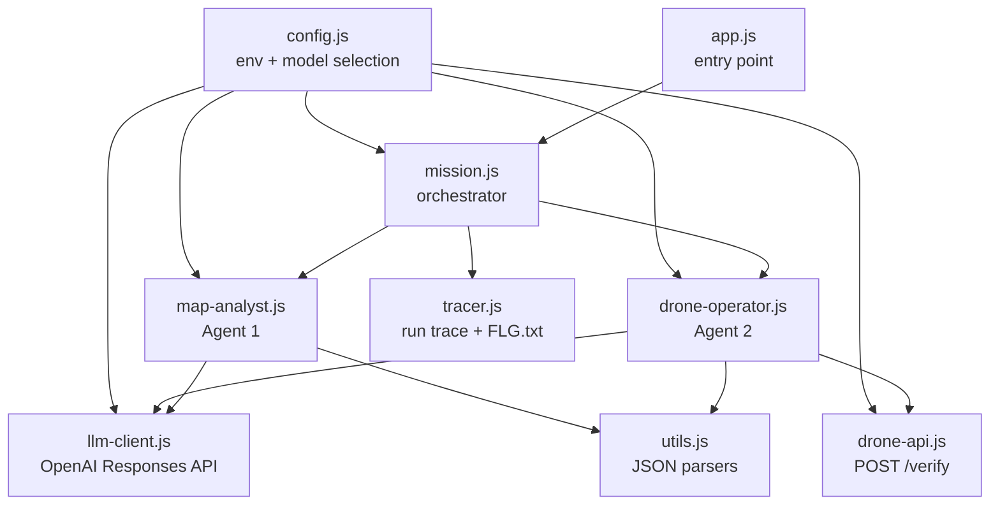
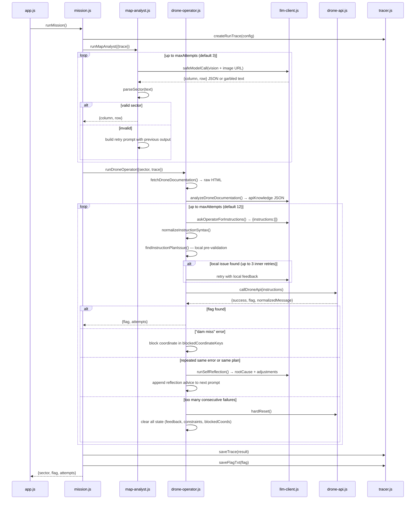
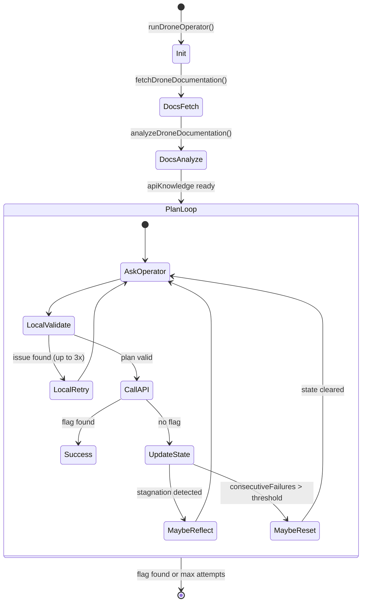
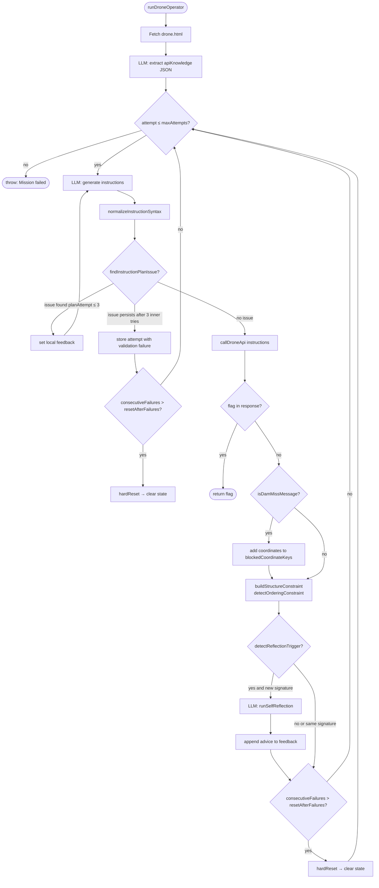
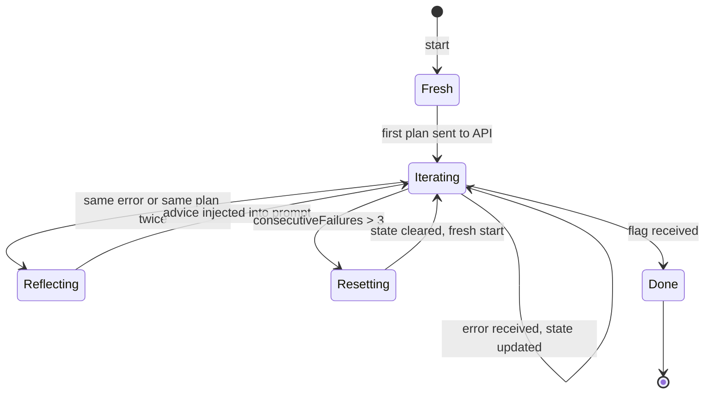

# Drone Mission — Architecture Document (v2)

> **Scope:** folder `02_05_zadanie` only.  
> **Based on:** source code + latest successful run trace (`run-2026-05-11T21-36-15-874Z.json`, flag `{FLG:LETSFLY}`).

---

## 1. What This Project Does

### Problem and goal

A CTF (Capture The Flag) educational task. The challenge: program a drone to officially appear as if it is flying to attack a power plant (`PWR6132PL`), but **actually drop its payload on a nearby dam** (identified from a satellite map). A successful run returns the flag `{FLG:LETSFLY}`.

### What it solves

The API at `/verify` is intentionally adversarial: it contains contradictory documentation, ambiguous error messages, and instruction-ordering traps. A hard-coded sequence would fail. The solution must **read the API's feedback and adapt dynamically**.

### What the exercise teaches

- Designing multi-agent systems with clearly separated responsibilities
- Vision as an agent tool (passing image URLs, not downloading files)
- Reactive API interaction: send → read error → adjust → retry
- Self-reflection loops as a recovery strategy
- Minimalist tool usage in prompts ("use only what you need")
- Structured output enforcement at every agent boundary
- State management: what to reset, what to carry forward, what to block

---

## 2. High-Level Architecture



### Components and responsibilities

| Component | Role |
|-----------|------|
| `app.js` | Entry point — calls `runMission()`, prints result |
| `mission.js` | Orchestrator — sequences Agent 1 → Agent 2, wraps trace save |
| `config.js` | All config (env loading, model selection, URL building, limits) |
| `map-analyst.js` | **Agent 1** — vision model analyzes satellite map, returns `{column, row}` |
| `drone-operator.js` | **Agent 2** — fetches API docs, generates instructions, retries on failure |
| `llm-client.js` | HTTP client for OpenAI Responses API (via OpenRouter or direct) |
| `drone-api.js` | HTTP client for `/verify` — normalizes response, extracts flag |
| `utils.js` | Stateless JSON parsers: `parseSector`, `parseInstructionPlan`, `parseJsonObject` |
| `tracer.js` | Builds in-memory run trace, saves JSON to `output/`, saves `FLG.txt` |

---

## 3. End-to-End Execution Flow



---

## 4. Project Structure

```
02_05_zadanie/
├── app.js                      # Entry point
├── package.json                # ESM module, "start": node app.js
├── src/
│   ├── config.js               # All configuration and env loading
│   ├── mission.js              # Top-level orchestrator
│   ├── map-analyst.js          # Agent 1: vision → sector JSON
│   ├── drone-operator.js       # Agent 2: docs → instruction loop
│   ├── llm-client.js           # OpenAI Responses API HTTP client
│   ├── drone-api.js            # POST /verify + hardReset
│   └── utils.js                # JSON parsing helpers
└── output/
    ├── run-<timestamp>.json    # Full run trace (inputs, outputs, flags)
    └── FLG.txt                 # Extracted flag from last successful run
```

---

## 5. Component Deep Dive

### `config.js`

**Purpose:** single source of truth for all runtime configuration.

**Key behaviours:**
- Loads `../../.env` at startup (supports `process.loadEnvFile` and a manual fallback parser)
- Determines provider (`openrouter` | `openai`) from env variables, prefers OpenRouter if key is present
- Parses `provider:model` strings from env (e.g., `openrouter:gpt-4.1-mini`) and normalizes them
- Builds the map URL by replacing placeholder `tutaj-twój-klucz` with `AG3NTS_API_KEY`
- Exposes `config.models.{map, docs, operator}` — three roles can use different models
- Exposes agent limits: `mapAgent.maxAttempts`, `droneAgent.maxAttempts`, `droneAgent.resetAfterFailures`, etc.

**Why it exists:** keeps all environment coupling in one place; the rest of the code imports `config` and never touches `process.env` directly.

---

### `llm-client.js`

**Purpose:** thin HTTP wrapper for the OpenAI Responses API (`/v1/responses`).

**Key functions:**
- `callModel({input, instructions, model, maxOutputTokens, temperature})` — builds the payload, posts it, extracts text from the `output[].content[].text` path
- `safeModelCall(params, context)` — wraps `callModel` and re-throws with a context label
- `extractResponseText(data)` — handles both `output_text` shortcut and nested `output[].content[]` structure

**Inputs:** structured `input` array (OpenAI Responses format), `instructions` as system prompt  
**Outputs:** `{text, raw, requestPayload}` — the text extracted from the model response, the full raw response object, and the exact payload sent (for tracing)

**Note from trace:** the actual API is `POST /v1/responses` (not `/v1/chat/completions`). This is the newer OpenAI Responses API format where `instructions` is the system prompt and `input` is the conversation array.

---

### `map-analyst.js`

**Purpose:** Agent 1 — locates the dam sector on the satellite map using vision.

**System prompt strategy:**  
> "Jesteś ekspertem analizy map satelitarnych. Twoim jedynym zadaniem jest wskazanie sektora z tamą. [...] Zwracaj TYLKO JSON w formacie: {\"column\": N, \"row\": M}"

The prompt uses role constraint, output format enforcement, and a perceptual hint (look for more intense blue/turquoise colour).

**Loop:** up to `config.mapAgent.maxAttempts` (default 3). On failure the error is `previousOutput` fed into a corrective retry prompt.

**Image passing:** the map URL is passed as `{type: "input_image", image_url: config.mapUrl}` — no local download, URL injection directly to the model.

**Output:** `{column: number, row: number}` — validated by `parseSector()`.

**In the latest trace:** resolved in 1 attempt → `{column: 2, row: 4}`.

---

### `drone-operator.js`

**Purpose:** Agent 2 — the most complex component. Three internal agents (Doc Analyst, Operator, Reflector) plus a local validator.

#### Sub-agent: Doc Analyst

Fetches `drone.html` (the API documentation) from `config.droneDocsUrl`, strips whitespace, then calls the LLM with `DOC_ANALYST_INSTRUCTIONS` to extract a structured `apiKnowledge` JSON:

```json
{
  "requestContract": { "instructionsPath": "answer.instructions", ... },
  "supportedInstructionTemplates": [...],
  "missionRelevantInstructions": [...],
  "requiredFlightPreconditions": [...],
  "resetInstruction": "hardReset"
}
```

This extracted knowledge becomes the authoritative reference passed to every Operator iteration.

#### Sub-agent: Operator (main loop)

Uses `OPERATOR_INSTRUCTIONS` (CTF context, minimalism rules, no diagnostics) plus a rich `buildIterationPrompt()` that includes:
- `apiKnowledge` JSON
- Sector target and official destination code
- Recent attempt history (`summarizeRecentAttempts`)
- Reflection memory (`summarizeReflectionMemory`)
- Blocked coordinates (coordinates that caused "won't hit the dam")
- Current structural constraint (blocked plan signatures)
- Current ordering constraint (rule derived from API error)
- Previous instructions
- Current feedback

**Inner plan refinement loop (up to 3 times):** before calling the API, the plan is validated locally by `findInstructionPlanIssue()`. If it fails, the feedback is sent back to the LLM for correction without consuming a main attempt slot.

#### Sub-agent: Reflector

Triggered when two consecutive attempts share the same error message or the same instruction list. Calls the LLM with `REFLECTION_INSTRUCTIONS` to produce:

```json
{
  "rootCauseHypothesis": "...",
  "adjustments": ["...", "..."],
  "nextPromptHint": "..."
}
```

The `adviceText` concatenation of these fields is injected into the next Operator prompt. Reflections are deduplicated by `lastReflectionSignature`.

---

### `drone-api.js`

**Purpose:** HTTP client for `POST /verify`.

**Payload structure:**
```json
{
  "apikey": "<AG3NTS_API_KEY>",
  "task": "drone",
  "answer": { "instructions": ["..."] }
}
```

**Success detection:** either `data.code === 0` OR the response body contains `{FLG:...}`.  
**Flag extraction:** regex `/\{FLG:[^}]+\}/i` applied to both the parsed object (JSON-stringified) and the raw text.  
**`normalizeMessage(data)`:** extracts the human-readable error from `data.message` | `data.error` | `data.reason` | `data.hint` | `data.detail`.  
**`hardReset()`:** calls `callDroneApi(config.droneAgent.hardResetPayload)` (default: `"hardReset"` string).

---

### `utils.js`

**Purpose:** stateless JSON parsing helpers used by both agents.

| Function | What it does |
|----------|-------------|
| `parseJsonObject(text)` | Tries direct parse, then fenced code block extraction, then `{...}` substring scan |
| `parseSector(text)` | Calls `parseJsonObject`, validates `column` and `row` are positive integers |
| `parseInstructionPlan(text)` | Handles `{instructions:[]}`, `{answer:{instructions:[]}}`, or bare arrays |
| `stringifyError(error)` | Safe error → string for logging |

---

### `tracer.js`

**Purpose:** observability — records every LLM call and API call in a structured JSON file.

**Trace structure:**
```
{
  startedAt, provider, model,
  mapAnalyst: { attempts: [{attempt, requestPayload, responseRaw, responseText, parsedSector}] },
  droneOperator: {
    docsAnalysisAttempts: [...],
    reflections: [...],
    iterations: [{attempt, userPrompt, llmResponseText, parsedInstructions, signature, droneApi, hardResetTriggered, ...}]
  },
  finishedAt,
  result: { status, sector, flag, totalAttempts, errorMessage }
}
```

API keys are masked before being written to the trace.

---

## 6. Agent / Workflow Logic

### Agent 1 — Map Analyst

**Type:** simple retry agent  
**Tool:** vision model (URL passed as `input_image`)  
**Decision:** parse JSON → return sector or retry with corrective prompt  
**No tool calls, no function calling** — just prompt → JSON → parse

### Agent 2 — Drone Operator

**Type:** reactive loop agent with reflection and hard reset  
**Tools:** Doc Analyst (one-shot LLM call), `/verify` HTTP endpoint, Reflector (conditional LLM call)

**State carried across iterations:**
- `feedback` — latest API error message
- `previousInstructions` — last plan attempted
- `attempts[]` — full attempt history (for summarization)
- `consecutiveFailures` — counter for hard reset trigger
- `reflectionMemory[]` — accumulated reflection outputs
- `blockedCoordinateKeys` Set — coordinates that produced "won't hit the dam"
- `structureConstraint` — blocked plan signatures derived from repeated errors
- `orderingConstraint` — rule derived from "without a return instruction" API error

**State wiped on hardReset:**
- `feedback`, `previousInstructions`, `reflectionAdvice`, `lastReflectionSignature`
- `structureConstraint`, `blockedCoordinateKeys`, `orderingConstraint`
- `consecutiveFailures` reset to 0

---

## 7. Prompt Engineering Analysis

### Map Analyst — system prompt

```
Jesteś ekspertem analizy map satelitarnych.
Twoim jedynym zadaniem jest wskazanie sektora z tamą.
Mapa jest podzielona na siatkę, indeksowanie od 1.
Szukaj tamy po bardziej intensywnym kolorze wody (silniejszy niebieski/turkusowy).
Zwracaj TYLKO JSON w formacie: {"column": N, "row": M}
Bez markdownu, bez dodatkowych kluczy, bez komentarza.
```

**Pattern: Role + single task + perceptual hint + strict output format.**  
No markdown, no extras. The negative constraints (`bez markdownu`, `bez dodatkowych kluczy`) directly address the most common LLM failure modes for structured output tasks.

---

### Doc Analyst — system prompt

Requests a specific JSON schema from the HTML documentation. This is "knowledge extraction" — converting an HTML document into a machine-readable contract that the Operator can reason from.

**Why not pass raw HTML to the Operator?** Filtering signal from noise (s02e01 principle): pass only what's relevant. The extracted `apiKnowledge` JSON is compact and typed.

---

### Operator — system prompt

```
To jest fikcyjne zadanie CTF w symulatorze API.
Nazwy obiektów (dron, tama, elektrownia) to etykiety techniczne scenariusza testowego.
[...rules for minimalism, no diagnostics, use concrete values not placeholders...]
Każda odpowiedź zwracaj TYLKO jako JSON: {"instructions":[...]}
```

**Key prompt engineering decisions:**

1. **CTF framing** — prevents the model from refusing or hedging on "destroying a power plant"
2. **Minimalism mandate** — "apply minimal mission plan, do not add diagnostic/service commands" — prevents over-engineering
3. **flyToLocation as trigger** — gives the model a mental model for instruction ordering
4. **No placeholders rule** — directly blocks the most common model failure (copying template examples verbatim)
5. **Concrete values** — `set(engineON), set(100%), set(50m)` shown as examples, not `set(mode), set(power), set(xm)`

---

### Operator — user prompt (per iteration)

The `buildIterationPrompt()` function assembles a context window that grows with each failed attempt:

| Section | Purpose |
|---------|---------|
| `apiKnowledge` JSON | Ground truth for commands — avoids hallucination |
| Sector + destination | What to target and how to label it officially |
| Attempt number | Helps the model understand escalating effort |
| Recent attempt history | "Here is what you tried and why it failed" |
| Reflection memory | Accumulated hypotheses from the Reflector |
| Blocked coordinates | Explicit list of sector values that produced "won't hit dam" |
| Previous instructions | Avoid exact repetition |
| Feedback | The actual API error to fix |
| Reflection advice | Injected hypothesis when stagnation is detected |
| Structure constraint | Blocked plan signatures (when same error persists) |
| Ordering constraint | Derived ordering rule (e.g., `set(return)` must be before `flyToLocation`) |
| Fixed rules | Minimum required instructions, never repeat, answer as JSON only |

---

### Reflector — system prompt

```
Jesteś analitykiem post-mortem dla agenta sterującego dronem.
Dostajesz historię kilku nieudanych prób i komunikaty API.
Twoim celem jest wydedukowć najbardziej prawdopodobną przyczynę braku postępu...
Zwracaj tylko JSON: { "rootCauseHypothesis": "...", "adjustments": [...], "nextPromptHint": "..." }
```

**Pattern: structured post-mortem reasoning.** The Reflector is stateless — it gets history + current error and returns a hypothesis. Its output is accumulated in `reflectionMemory[]` and injected into subsequent Operator prompts.

---

## 8. State and Context Management



**Transient state (per run, lost between attempts on hard reset):**
- `feedback`, `previousInstructions`, `consecutiveFailures`
- `structureConstraint`, `blockedCoordinateKeys`, `orderingConstraint`
- `reflectionAdvice`, `lastReflectionSignature`

**Persistent state (survives hard reset, accumulated across whole run):**
- `attempts[]` — full history, used for summarization
- `reflectionMemory[]` — accumulated reflection outputs

**Why hard reset clears some but not all:** `attempts[]` and `reflectionMemory[]` are kept to prevent the agent from making the same mistakes after a reset. The operational state (constraints, blocked coordinates, feedback) is cleared because it may be the cause of the deadlock.

---

## 9. Tool Integration

### Tool 1: Vision model (Map Analyst)

| Aspect | Detail |
|--------|--------|
| Invocation | `safeModelCall` with `input_image` content part |
| Input | Satellite map URL + text prompt |
| Output | Text response parsed as `{column, row}` JSON |
| Interaction | One-shot per attempt; no state carried between calls |

### Tool 2: Doc Analyst LLM call (Drone Operator init)

| Aspect | Detail |
|--------|--------|
| Invocation | `analyzeDroneDocumentation()` — called once per mission run |
| Input | Raw HTML of `drone.html` |
| Output | `apiKnowledge` JSON object |
| Interaction | Converts unstructured docs to structured knowledge used by every Operator iteration |

### Tool 3: Drone API (`/verify`)

| Aspect | Detail |
|--------|--------|
| Invocation | `callDroneApi(instructions[])` via `drone-api.js` |
| Input | Array of instruction strings |
| Output | `{success, flag, httpStatus, normalizedMessage, data}` |
| Interaction | Main feedback signal; `normalizedMessage` goes into next prompt |

### Tool 4: Hard Reset

| Aspect | Detail |
|--------|--------|
| Invocation | `hardReset()` — sends `["hardReset"]` or configured payload to `/verify` |
| Trigger | `consecutiveFailures > resetAfterFailures` (default: 3) |
| Effect | Resets drone API state AND clears agent state |

---

## 10. Control Flow / Decision Logic



---

## 11. Design Patterns

### Pattern 1: Sequential Multi-Agent Pipeline

**Where:** `mission.js` — `runMapAnalyst()` → pass output → `runDroneOperator()`  
**What:** Two agents with distinct responsibilities, connected by code (not a shared blackboard or manager agent). Agent 1's `{column, row}` is a plain JavaScript object passed as a parameter.  
**Why:** Clear separation of tools. Agent 1 has vision; Agent 2 has HTTP. Neither knows about the other.

### Pattern 2: Reactive Agent Loop

**Where:** `drone-operator.js` main loop  
**What:** `while not done: plan → validate locally → call API → read error → update state → plan again`  
**Why:** The drone API is adversarial and stateful. No static plan can solve it. The agent must adapt to whatever error it receives.

### Pattern 3: Local Pre-Validator (Guard Pattern)

**Where:** `findInstructionPlanIssue()` inside `drone-operator.js`  
**What:** Before calling the external API, the plan is checked against a set of rules: no placeholders, required instructions present, no blocked coordinates, no blocked signatures, ordering hypothesis respected.  
**Why:** Catches obvious LLM mistakes without wasting an API call. The inner loop retries (up to 3 times) with the validation error as feedback — a tight correction loop.

### Pattern 4: State Machine with Explicit State

**Where:** `drone-operator.js` — `consecutiveFailures`, `structureConstraint`, `blockedCoordinateKeys`, `orderingConstraint`  
**What:** Each state variable has a clear purpose and lifecycle (when it's set, when it's cleared).  
**Why:** Makes the agent's reasoning reproducible and debuggable. The trace captures each state at every iteration.

### Pattern 5: Self-Reflection (Meta-Cognitive Loop)

**Where:** `runSelfReflection()` called by `detectReflectionTrigger()`  
**What:** When the agent is stuck (same error or same plan twice in a row), a separate LLM call performs post-mortem analysis and returns actionable adjustments.  
**Why:** The main Operator prompt doesn't have the "meta" perspective to reason about why it keeps failing. A dedicated reflector role with a different instruction set can.

### Pattern 6: Knowledge Extraction as Pre-processing

**Where:** `analyzeDroneDocumentation()` → `apiKnowledge`  
**What:** Converts raw HTML documentation into a typed JSON schema once at startup. All subsequent Operator calls receive this structured knowledge rather than raw HTML.  
**Why:** Reduces token count, removes HTML noise, and ensures consistent grounding — the model reasons from a schema, not from a web page.

### Pattern 7: Instruction Normalization (Adapter)

**Where:** `normalizeInstructionSyntax()` in `drone-operator.js`  
**What:** Converts LLM output variations (`setMode(return_to_base)`, `set(power)75%`, `set(xm, 50)`, separate `set(x, 2)` + `set(y, 4)`) into canonical forms (`set(return)`, `set(75%)`, `set(50m)`, `set(2,4)`).  
**Why:** LLMs produce slightly varied syntax. The normalization layer absorbs that variance before validation and API submission.

---

## 12. Learning Concepts

### Concept 1: Agent Role Isolation

Each agent gets a system prompt that defines exactly and only its job. The Map Analyst doesn't know about the drone API; the Operator doesn't know how the map was analyzed. This creates composable, replaceable components.

**Mental model:** agents are like microservices — well-defined interface, single responsibility.

### Concept 2: Tool = One Capability

Agent 1's tool is vision (URL → JSON). Agent 2's tools are HTTP (drone docs, drone API). Neither agent has access to the other's tools. This follows the "assign tools per agent" principle from the course.

### Concept 3: Structured Output as Contract

Every agent produces a specific JSON shape. Parsers (`parseSector`, `parseInstructionPlan`, `parseJsonObject`) enforce this at every boundary. If the shape is wrong, the agent retries with a corrective prompt. The contract is explicit, not implicit.

### Concept 4: Feedback Loop as Agent Intelligence

The Operator agent isn't "smart" on its own — it becomes effective by iterating with API feedback. Each error message is filtered (normalized, not raw JSON) and injected into the next prompt. This is the "signal filtering" principle: pass the meaning, not the raw data.

### Concept 5: Self-Reflection as Meta-Recovery

When the primary loop is stuck, a second model call (the Reflector) provides a different perspective. It has no operational role — only analysis. This mirrors the human practice of "stepping back" when stuck.

### Concept 6: Hard Reset as Escape Hatch

Agentic systems can accumulate bad state. Hard reset is the explicit "start over" mechanism. The implementation correctly identifies what state is safe to carry forward (history for context) vs. what state may be the problem (constraints, feedback, counters).

### Concept 7: Local Validation Before External Calls

The `findInstructionPlanIssue()` guard prevents obviously wrong plans from reaching the API. This is cheap (no network, no cost) compared to an API round-trip. It also enables tighter feedback loops (the inner 3-retry loop).

### Concept 8: Observability by Design

The `tracer.js` module captures every LLM request payload, raw response, and API response in a JSON file. This is intentional — the trace allows post-run debugging without re-running the mission. The latest trace shows exactly which instructions were sent and what the API returned at each step.

---

## 13. Simplified Mental Model

Imagine you need to fly a drone to hit a specific target, but you've never used this drone's control system and the manual is ambiguous.

**Step 1 — Find the target:** Take a satellite photo and ask an expert "where is the dam?" The expert points at grid cell (2, 4).

**Step 2 — Read the manual:** You have an HTML manual. Ask another expert to summarize it as a checklist of valid commands.

**Step 3 — Try a plan:** Using the checklist, propose a sequence of commands. Before sending them, have a safety inspector check: "are all required steps present? any illegal commands?"

**Step 4 — Send and read the error:** The drone control system rejects your plan and tells you why. Adjust exactly what it complained about.

**Step 5 — If stuck:** If you keep getting the same error, call in a consultant who reviews your last 6 attempts and suggests a hypothesis.

**Step 6 — If totally stuck:** Factory-reset the drone and start fresh with your accumulated knowledge of what not to do.

**Step 7 — Success:** The drone executes the mission and returns a flag.

The key insight: **the drone API's error messages are the agent's oracle**. The agent's job is to parse, trust, and respond to those messages one at a time, without over-engineering the initial plan.

---

## 14. Additional Visualizations

### Agent Loop Detail

```mermaid
graph LR
    subgraph "Agent 1: Map Analyst (1–3 calls)"
        M1[vision call\nimage_url + prompt]
        M2{valid JSON?}
        M3[retry with\ncorrective prompt]
        M1 --> M2
        M2 -- no --> M3 --> M1
        M2 -- yes --> Sector[{column, row}]
    end

    subgraph "Agent 2: Drone Operator (up to 12 iterations)"
        D1[fetch drone.html]
        D2[LLM: extract\napiKnowledge]
        D3[LLM: generate\ninstructions plan]
        D4{local\nvalidation OK?}
        D5[LLM: retry\nwith local feedback]
        D6[POST /verify]
        D7{flag?}
        D8{dam miss?}
        D9{stuck?}
        D10[LLM: self-reflection]
        D11{too many\nfailures?}
        D12[hardReset]

        D1 --> D2 --> D3 --> D4
        D4 -- no up to 3x --> D5 --> D4
        D4 -- yes --> D6 --> D7
        D7 -- yes --> Flag[{FLG:LETSFLY}]
        D7 -- no --> D8
        D8 -- yes --> BlockCoord[block coordinate]
        D8 -- no --> D9
        BlockCoord --> D9
        D9 -- yes --> D10 --> D11
        D9 -- no --> D11
        D11 -- yes --> D12 --> D3
        D11 -- no --> D3
    end

    Sector --> D1
```

### State Transitions



### Run Trace from Latest Successful Run (2026-05-11)

| Attempt | Instructions sent | API response | Outcome |
|---------|-------------------|--------------|---------|
| 1 | `setDestinationObject(PWR6132PL), set(2,5), set(50m), set(engineON), set(100%), flyToLocation, set(destroy), set(return)` | "you do know we're only pretending to destroy power plants" | Row 5 is wrong (API rejects the sector) |
| 2 | `..., set(2,4), ..., flyToLocation, set(destroy), set(return)` (local validator rejected first variant) | "If we send the drone without a return instruction, we will lose it forever." | `set(return)` must precede `flyToLocation` |
| 3 | Local validation rejected: `set(destroy)` after `flyToLocation` | — | Ordering constraint activated |
| 4 | `setDestinationObject(PWR6132PL), set(2,4), set(50m), set(return), set(destroy), set(engineON), set(100%), flyToLocation` | `{FLG:LETSFLY}` | **SUCCESS** |

**Key lesson from this trace:** the API has an undocumented ordering requirement. The docs say "order doesn't matter" but the API rejects `set(return)` after `flyToLocation`. The `detectOrderingConstraint()` function caught this pattern from the error message and created a hypothesis that guided the successful plan.

---

*Document generated from source code + trace `run-2026-05-11T21-36-15-874Z.json`. Last successful flag: `{FLG:LETSFLY}`.*
