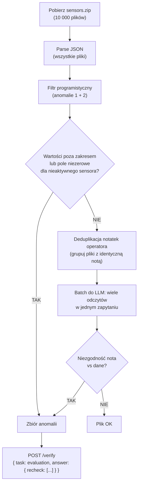

# Zadanie s03e01 — `evaluation`: anomalie w sensorach

Zadanie: przeanalizować 10 000 plików JSON z odczytami sensorów i zidentyfikować te z anomaliami. Endpoint: `/verify`, task name: `evaluation`.

## Kontekst

Dane z czujników elektrowni (temperatura, ciśnienie, napięcie, poziom wody, wilgotność). Każdy plik zawiera odczyt pojedynczego momentu + notatkę operatora. Anomalie to:

1. Dane pomiarowe poza zakresem norm
2. Czujnik zwraca dane których nie powinien (np. czujnik temperatury ma niezerowe napięcie)
3. Operator twierdzi że wszystko OK, ale dane są niepoprawne
4. Operator twierdzi że znalazł błędy, ale dane są OK

**Zakresy poprawnych wartości (aktywnych sensorów):**

| Pole | Zakres | Jednostka |
|------|--------|-----------|
| `temperature_K` | 553–873 | Kelwin |
| `pressure_bar` | 60–160 | bar |
| `water_level_meters` | 5.0–15.0 | m |
| `voltage_supply_v` | 229.0–231.0 | V |
| `humidity_percent` | 40.0–80.0 | % |

Sensor nieaktywny → pole = 0. `sensor_type` to lista aktywnych sensorów rozdzielona `/`.

## Kluczowy insight z zadania

> Wysłanie 10 000 plików do LLM będzie DROGIE. Sprytne podejście minimalizuje co trafia do modelu.

**Hint (base64 z zadania, odkodowany):**
1. LLM-y mają cache, ale możesz też cachować odpowiedzi modelu po swojej stronie. Czy niektóre dane nie są zduplikowane?
2. Czy klasyfikacja wszystkich danych przez model językowy będzie optymalna kosztowo? Część danych da się odrzucić programistycznie.

## Architektura rozwiązania: pipeline hybrydowy



## Etap 1: Filtrowanie programistyczne (anomalie 1 + 2)

Bez LLM — czysta logika:

```python
def parse_sensor_type(sensor_type: str) -> set[str]:
    return set(sensor_type.split("/"))

def check_programmatic_anomaly(data: dict) -> bool:
    active = parse_sensor_type(data["sensor_type"])
    
    FIELD_MAP = {
        "temperature": "temperature_K",
        "pressure":    "pressure_bar",
        "water":       "water_level_meters",
        "voltage":     "voltage_supply_v",
        "humidity":    "humidity_percent",
    }
    VALID_RANGES = {
        "temperature_K":      (553, 873),
        "pressure_bar":       (60, 160),
        "water_level_meters": (5.0, 15.0),
        "voltage_supply_v":   (229.0, 231.0),
        "humidity_percent":   (40.0, 80.0),
    }
    
    for sensor_name, field in FIELD_MAP.items():
        value = data.get(field, 0)
        if sensor_name in active:
            lo, hi = VALID_RANGES[field]
            if not (lo <= value <= hi):
                return True  # anomalia: wartość poza zakresem
        else:
            if value != 0:
                return True  # anomalia: nieaktywny sensor ma niezerową wartość
    
    return False
```

To wyłapuje anomalie **1** i **2** bez żadnych tokenów.

## Etap 2: Analiza notatek przez LLM (anomalie 3 + 4)

Dla plików które przeszły filtr programistyczny — notatki operatora mogą być sprzeczne z danymi.

**Kluczowa optymalizacja: deduplikacja notatek**

Technicy kopiują notatki. Jeśli 500 plików ma identyczną notatkę `"Readings look stable and within expected range."` — analizujemy ją raz i wynik stosujemy do wszystkich 500.

```python
from collections import defaultdict

note_to_files = defaultdict(list)
for file_id, data in clean_files.items():
    note = data["operator_notes"].strip()
    note_to_files[note].append(file_id)

# Unique notes: może być 100x mniej niż plików
```

**Batchowanie zapytań do LLM**

Zamiast 1 plik = 1 zapytanie, wysyłamy wiele odczytów w jednym prompcie. LLM zwraca minimalny output (np. lista ID z flagą OK/ANOMALY).

```
Prompt do LLM (wiele rekordów naraz):
"""
Poniżej odczyty sensorów z notą operatora. Dla każdego pliku oceń 
czy nota operatora zgadza się ze stanem danych. Zwróć TYLKO JSON:
{"results": [{"id": "0123", "anomaly": false}, ...]}

Dane:
[0123] sensor: temperature, temp_K=650, nota: "wszystko OK"
[0456] sensor: pressure, pressure_bar=45, nota: "ciśnienie w normie"  ← anomalia (45 < 60)
...
"""
```

> [!tip] Minimalizuj output LLM
> Płaci się więcej za output niż za input. Prompt powinien instruować model żeby zwracał TYLKO listę ID z flagą, bez żadnych wyjaśnień.

## Wynik i submisja

```json
{
  "apikey": "{{klucz}}",
  "task": "evaluation",
  "answer": {
    "recheck": ["0456", "1023", "5678"]
  }
}
```

Akceptowane formaty: `"0001"`, `1`, `"0001.json"` — można mieszać.

## Lekcja architektury wyciągnięta z zadania

To zadanie jest _celowo_ ilustracją z lekcji: **nie przepalaj tokenów tam, gdzie kod wystarczy**. Reguła:

- Anomalie z jasną definicją numeryczną → programistycznie (szybko, tanio, deterministycznie)
- Anomalie wymagające zrozumienia języka naturalnego (notatki operatora) → LLM (ale batchowane + deduplikowane)

Ta sama zasada działa w każdym systemie agentowym z mieszaną logiką.

## Powiązane strony

- [[ewaluacja-agentow]] — evals jako temat lekcji
- [[s03e01]] — lekcja s03e01 (obserwowanie i ewaluacja)
- [[context-engineering]] — optymalizacja kontekstu i kosztów tokenów
