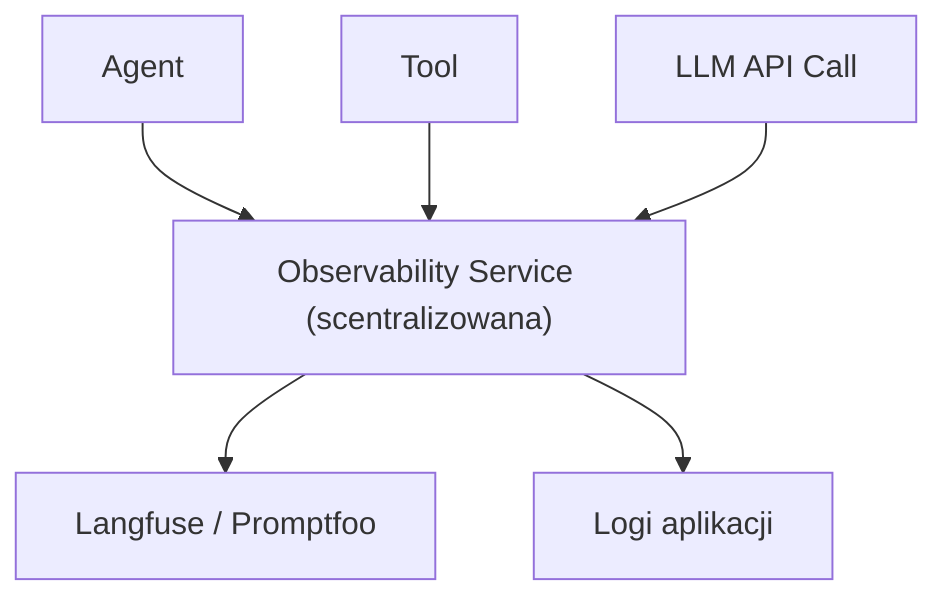

# Observability agentów AI

Monitorowanie zachowań agentów AI wykraczające poza klasyczne logowanie zdarzeń. Obejmuje pełny kontekst każdej interakcji z LLM i narzędziami — niezbędne do debugowania, estymacji kosztów i zasilania [[ewaluacja-agentow|evals]].

## Po co observability w systemach agentowych?

W klasycznym kodzie błąd ma zwykle jasną przyczynę w logach. W agencie:

- Agent może korzystać z poprawnego narzędzia, ale przeszukiwać **niewłaściwy obszar** z powodu pokrywających się opisów — kod wygląda OK, problem jest w runtime
- Dynamicznie ładowany kontekst nie znajduje się bezpośrednio w kodzie — nie zobaczysz go bez trace
- Małe zmiany w instrukcji systemowej mogą mieć efekt uboczny gdzieś w innej gałęzi interakcji
- Koszty tokenów zależą od całego kontekstu sesji — trudne do estymacji bez danych historycznych

## Hierarchia zdarzeń (Langfuse model)

Zdarzenia są zagnieżdżone i grupowane — to podstawowa różnica od klasycznych płaskich logów:

```
Session
  └── Trace (= jedna interakcja użytkownika, np. wiadomość czatu)
        ├── Span (czas trwania akcji, np. gromadzenie kontekstu)
        ├── Generation (wywołanie LLM: pełny prompt + ustawienia + odpowiedź)
        ├── Agent (działanie agenta)
        └── Tool (wywołanie narzędzia: input + output)
        └── Event (zdarzenie aplikacji, np. walidacja, routing)
```

> [!important] Kontekst jest równie ważny co zdarzenie
> Do każdego zdarzenia przekazuj: **user ID**, **session ID**, **agent ID**, wersję aplikacji, środowisko, typ zapytania (np. CRON job vs user request). Trace bez kontekstu jest bezużyteczny przy debugowaniu problemu konkretnego użytkownika.

## Architektura monitoringu

Kluczowa zasada: **podłącz się pod wszystkie interakcje z LLM API i wywołania narzędzi**, najlepiej w jednym scentralizowanym miejscu. To ułatwia architektura "serwisu observability" przez który przepływają zdarzenia.



**Co konfigurować samodzielnie** (platforma nie zrobi tego za Ciebie):
- **Context:** dane specyficzne dla projektu (licencje użytkownika, uprawnienia, preferencje, typ zapytania)
- **Metadata:** wersja aplikacji, interfejs, środowisko, lokalizacja
- **Span:** czas trwania wybranych akcji — opcjonalny, decydujemy sami
- **Event:** zdarzenia aplikacji niezwiązane z LLM — opcjonalne

> [!tip] Minimalna integracja najpierw
> Po podłączeniu minimalnej integracji szybko ujawnią się braki (brakujące konteksty) i nadmiary (za dużo logów). To naturalny punkt startowy.

## Playground — debugowanie interakcji

Niemal każda platforma (Langfuse, Confident AI) oferuje wbudowany Playground:

- Wczytuje zapisaną interakcję: **instrukcja systemowa + historia wiadomości + lista narzędzi**
- Możesz edytować każdy element i uruchomić ponownie
- Możliwość porównania różnych modeli na tym samym zapytaniu
- Ograniczenie: nie odtwarza pełnej funkcjonalności narzędzi (statyczne dane zamiast live)

> [!note] Debugowanie agenta ≠ debugowanie kodu
> Zmiana instrukcji naprawiająca jeden przypadek może zepsuć inny. Wykrycie problemu to nie koniec — sprawdź jak zmiana wpływa na resztę systemu.

## Wersjonowanie instrukcji systemowych

Git daje kontrolę wersji promptów, ale nie daje statystyk i historii uruchomień. Platformy observability dodają:

- Wersjonowanie promptów powiązane z historią aktywności
- Statystyki per wersja: skuteczność, koszty, czas odpowiedzi
- Zależność od środowiska (dev/staging/prod)

**Rekomendowany wzorzec:** jednostronna synchronizacja — szablony promptów w plikach markdown w kodzie, synchronizowane do Langfuse. Tracisz łatwe przełączanie między wersjami z UI, ale zyskujesz kompletne statystyki.

```
szablony (markdown w repo)  →  Langfuse (wersje + statystyki)  →  Playground (eksperymenty)
```

## Monitorowanie kosztów

Koszty tokenów są trudne do estymacji bez danych historycznych, bo zależą od:
- Długości instrukcji + dynamicznie ładowanego kontekstu
- Historii konwersacji (rośnie z każdą iteracją)
- Outlierów — użytkownicy, którzy osiągają limity 10× szybciej niż przeciętny

Dane z platformy observability → precyzyjna estymacja kosztów per user/sesja → **twarde limity** jako zabezpieczenie.

Monitorowanie kosztów to też szybkie wykrywanie anomalii: błąd pętli nieskończonej, atak na zasoby, nagłe zmiany w zachowaniu modelu.

## Prywatność danych

Logi observability zawierają dane użytkowników (pełne konteksty rozmów). Wymagana **anonimizacja**:
- Nazwy własne
- Dane kontaktowe i adresowe
- Dane osobowe wszelkiego rodzaju

Dotyczy zarówno narzędzi cloud jak i self-hosted.

## 🏗️ Architecture Thinking

- **Rola w systemie:** supporting layer — owinięcie wokół każdego wywołania LLM i narzędzia
- **Core vs supporting:** monitoring staje się core gdy system ma użytkowników produkcyjnych; PoC może pominąć
- **Dependencies:** Langfuse SDK (lub Promptfoo), dostęp do kontekstu sesji, storage dla logów
- **Trade-offy:**
  - Pełna observability ↔ prywatność — każde logowanie kontekstu sesji = logowanie danych użytkownika
  - Centralizacja ↔ latency — synchroniczna integracja może spowalniać; asynchroniczna może gubić zdarzenia
  - Open source (self-hosted) ↔ chmura — kontrola danych vs koszt utrzymania infrastruktury

## 🏢 Use Case Mapping (GENERIC)

**Typ problemu:** każdy system z LLM + narzędziami

**Gdzie pasuje:** orchestration layer — każde wywołanie LLM i narzędzia

**Kiedy używać:**
- Agent ma wieloetapowe flow z dynamicznym kontekstem
- Potrzebujesz danych do estymacji kosztów
- System ma użytkowników zewnętrznych
- Chcesz zasilać evals danymi produkcyjnymi

**Kiedy NIE (lub minimalny zakres):**
- Skrypty jednorazowe
- PoC bez użytkowników

## ❌ Anti-patterns / risks

- **Trace bez kontekstu** — user ID / session ID to minimum; bez tego trace jest bezużyteczny przy konkretnym incydencie
- **Logowanie PII w plain text** — nazwy, adresy, dane osobowe muszą być zanonimizowane przed zapisem
- **Brak grupowania zdarzeń** — płaskie logi jak w klasycznych systemach gubią hierarchię i uniemożliwiają analizę flow
- **Monitoring tylko "happy path"** — brak logowania błędów narzędzi i odrzuconych zapytań daje fałszywy obraz

## 🧪 Experiment / What to test

**Cel:** zobaczyć co trafia do Langfuse przy minimalnej integracji

**Setup:** uruchom `03_01_observability` z kluczami w `.env`, wyślij żądanie z kilkoma narzędziami

**Wynik:** w panelu Langfuse → pełna hierarchia Session/Trace/Generation/Tool

**Wniosek:** po pierwszym uruchomieniu widać co brakuje w kontekście — iteruj od tego punktu

## Powiązane strony

- [[ewaluacja-agentow]] — evals zasilane danymi z observability
- [[produkcyjne-ai]] — production deployment, event-driven agent loop
- [[bezpieczenstwo-agentow]] — Guardrails, moderacja, violation detection
- [[s03e01]] — lekcja źródłowa
- [[s01e05]] — wcześniejsza lekcja o obserwabilności (podstawy)
