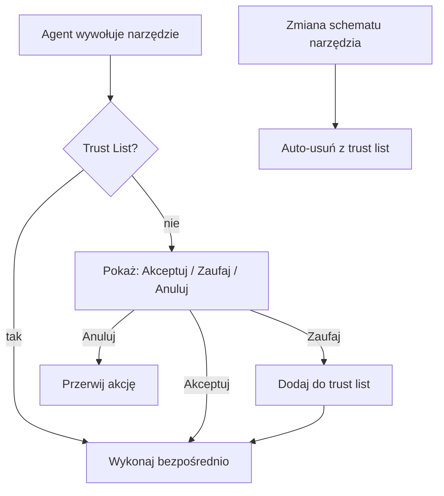
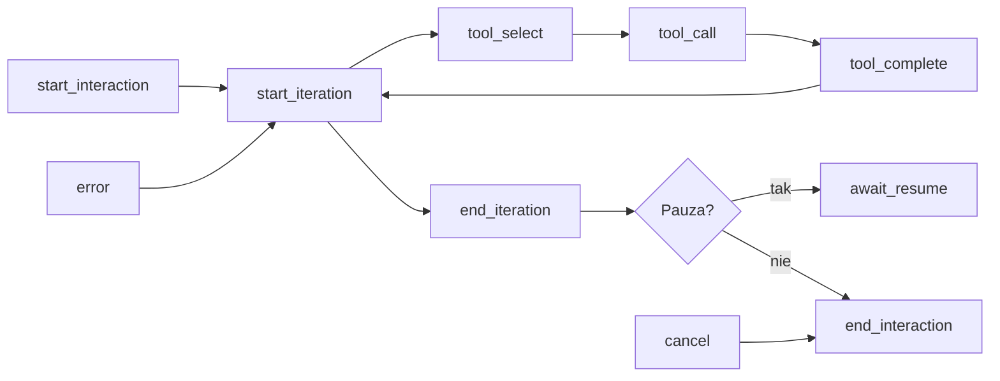

# Produkcyjne aplikacje AI

Wzorce architektury, mechanizmy kontroli i obserwabilności dla agentów AI w środowisku produkcyjnym. Źródło: [[s01e05]].

## Wyzwania produkcyjne — katalog

Aplikacje AI są ~80% klasycznym inżynierstwem. Ten 20% nowych problemów objawia się natychmiast gdy aplikacja wychodzi z PoC:

| Obszar | Wyzwanie | Rozwiązanie architektoniczne |
|--------|----------|------------------------------|
| **Kontekst** | Użytkownicy dołączają wielusetstronicowe PDFy, aktywują setki narzędzi | Programistyczne ograniczenia na rozmiar i liczbę narzędzi |
| **Kontrola** | Model halucynuje, akcje mogą być nieodwracalne | Error recovery + deterministyczne potwierdzenie przez UI |
| **Wydajność** | Modele wolne; użytkownik nie wie kiedy skończy | Heartbeat, wielowątkowość, przetwarzanie w tle, wznawianie |
| **Cena** | Koszty rosną nieliniowo z liczbą kroków | Monitoring tokenów, prompt cache, dobór modelu |
| **Bezpieczeństwo** | Prompt injection, Moderation API, violations | Filtrowanie wejść, Moderation API, własne reguły klasyfikacji |
| **Stabilność** | Dostawcy mają problemy ze stabilnością API | Multi-provider, retry logic, fallback |
| **Prywatność** | Trenowanie modelu na danych użytkowników | Klauzule umów, privacy-by-design |
| **Elastyczność** | Modele i API zmieniają się szybko | Brak AI frameworków, własny kod, wspólny interfejs |

## Mechanizm zaufanych akcji (Trust List)

Ręczne zatwierdzanie każdego kroku agenta jest uciążliwe → mechanizm trust list:

1. Użytkownik wywołuje akcję → system pyta: **Akceptuj / Zaufaj / Anuluj**
2. **Zaufaj** = dodaj narzędzie do trust list → kolejne wywołania nie wymagają zgody
3. Narzędzie identyfikowane przez **unikatowy klucz**: `{server_name}__{action_name}` (np. `resend__send`)
4. **Auto-usunięcie z trust list** gdy zmieni się schemat narzędzia (nazwa, opis, parametry) — krytyczne dla MCP, gdzie serwer może zmienić interfejs bez wiedzy użytkownika
5. **Akceptacja musi być deterministyczna** — przez kod i fizyczne przyciski UI, nie przez decyzję LLM



> **Uwaga:** nawet z trust list — opis wydarzenia może zawierać dane z innych narzędzi. Potwierdzenie musi zawierać **wszystkie detale**, nie tylko identyfikator narzędzia.

## Error Recovery — automatyczna naprawa błędów

Agent może samodzielnie naprawiać błędy **o ile system dostarcza wystarczające informacje**:

- Agent dostaje czytelny komunikat błędu z opisem co poszło nie tak
- System informuje co można z tym zrobić (np. lista dostępnych kontaktów)
- Agent podejmuje następny krok; jeśli wymaga zgody użytkownika — prosi o nią przez deterministyczny UI

Przykład: agent próbuje dodać kontakt spoza whitelist → dostaje komunikat → proponuje dodanie kontaktu → czeka na potwierdzenie przez przycisk UI.

## Pętla agenta oparta o zdarzenia (Event-Driven Agent Loop)

Standardowy wzorzec dla produkcyjnych agentów:



Zdarzenia umożliwiają:
- **Heartbeat** — informowanie użytkownika o postępie (perceived performance)
- **Wielowątkowość** — kolejkowanie wiadomości gdy agent zajęty; otwieranie nowych wątków
- **Wznawianie** — wstrzymanie + późniejsze kontynuowanie po błędzie lub oczekiwaniu
- **Monitoring** — podłączenie Langfuse lub własnego systemu logów przez subskrypcję zdarzeń
- **Moderacja** — blokowanie interakcji w odpowiedzi na zdarzenie

> Stan UI **nie może być powiązany bezpośrednio z akcjami na back-endzie** — to umożliwia wielowątkowość i kolejkowanie.

## Wspólny interfejs dla providerów

Wzorzec: API i agent "mówią tym samym językiem", warstwa tłumaczeń dopasowuje struktury do konkretnego providera:

```
Agent ↔ Wspólny interfejs ↔ [Translator OpenAI | Translator Gemini | ...]
```

- Translator obsługuje: mapowanie struktur, limity kontekstu, wyłączenia funkcji dla danego połączenia
- **OpenRouter** jako alternatywa dla prostszych przypadków — ale nie wspiera wszystkich funkcji; dedykowane połączenia potrzebne dla Anthropic/Gemini-specific features
- W multi-agent systems: każdy agent może korzystać z innego providera → problem tłumaczenia nie dotyczy

## Obserwabilność — dwa poziomy

Poziom 1: **Logi aplikacji** — klasyczne logi z backendu (błędy HTTP, stany endpointów)

Poziom 2: **Agent activity monitoring** — dedykowany dla działań AI:
- Instrukcje systemowe i ich zmiany w trakcie interakcji
- Wywołania narzędzi + wyniki
- Decyzje modelu (reasoning trace)
- Tokeny input/output per interakcja

Narzędzia: [Langfuse](https://langfuse.com/), [Confident AI](https://www.confident-ai.com/)

> Monitoruj od początku — nawet mali beta-testerzy dają informacje o skali zużycia tokenów.

Szczegóły hierarchii zdarzeń (Session/Trace/Span/Generation/Agent/Tool/Event), wersjonowania promptów i Playground → [[observability-agentow]].

## 5 obszarów optymalizacji szybkości agentów (s03e02)

Gdy natychmiastowa inferencja jest niedostępna, można operować na pięciu obszarach:

| Obszar | Wpływ | Jak kontrolować |
|--------|-------|-----------------|
| **Tokeny wejściowe** | Czas reakcji | Skróć system prompt, definicje narzędzi, historię konwersacji |
| **Cache** | Koszt + czas reakcji | Prompt cache (tylko tokeny wejściowe); powtarzalne fragmenty promptu na początku |
| **Tokeny wyjściowe** | Czas generowania | Skróć odpowiedzi modelu; ogranicz liczbę kroków agenta |
| **Liczba zapytań** | Czas całkowity | Równoleglenie; prompt cache; konsolidacja kroków agenta |
| **Mniejsze modele** | Szybkość + koszt | Kosztem możliwości — dobór per typ zadania |

**Strategia code + sandbox** adresuje kilka obszarów jednocześnie: agent robi mniej kroków (mniej zapytań), każdy krok ma krótszy input/output, a obliczenia realizuje kod a nie LLM. → [[code-execution-sandbox]]

## Zarządzanie kosztami

Jednostkowe ceny tokenów spadają, ale całkowity koszt rośnie z powodu:
- LRM (Large Reasoning Models) generują więcej tokenów per zapytanie
- Proporcja zapytań AI do akcji użytkownika może być 1:50+
- Proaktywne agenty działają w tle → ciągłe zużycie

**Pułapka tańszego modelu:** mniejszy model może potrzebować więcej kroków → więcej tokenów → wyższy koszt całkowity. Przykład: GPT-4.1-nano droższy niż GPT-4.1-mini przy zadaniu 1M kroków.

Optymalizacja: prompt cache, dobór modelu per zadanie (Flash dla prostych), fine-tuning/destylacja jako ostateczność.

## Ograniczenia środowiskowe (non-AI)

Część ograniczeń nie pochodzi od modelu:
- Rozproszone bazy wiedzy, różne formaty dokumentów
- Legacy systemy bez API
- Nieustrukturyzowane procesy oparte na pracy manualnej
- Brak dostępu do aktualnych danych (np. stany magazynowe)

→ Wymagana ścisła współpraca z biznesem; często mówimy o **optymalizacji procesu** (kilka-kilkanaście procent), nie o pełnej automatyzacji.

## Deployment — VPS setup (krok po kroku)

1. Konto na DigitalOcean / Mikr.us → droplet Ubuntu (Frankfurt), klucze SSH zamiast hasła
2. Połączenie SSH → instalacja: git, node, nginx → konfiguracja ufw
3. Domena (np. Cloudflare) → rekord DNS A na IP serwera → propagacja ~kilkanaście minut
4. TLS: `certbot --nginx` (bezpłatny Let's Encrypt)
5. GitHub Actions Runner → instalacja przez instrukcję w ustawieniach repo
6. nginx reverse proxy → `127.0.0.1:3000` (lub inny port aplikacji)
7. Secrets w GitHub repo → wartości z pliku `.env`
8. Plik `.github/*.yml` z workflow → uruchamia się po pushu na main

> [!tip] Google AI Studio Live jako asystent deploymentu
> Jeśli kroki VPS są nowe — uruchom **[Google AI Studio Live](https://aistudio.google.com/live)** z udostępnionym ekranem. Asystent przeprowadzi przez każdy krok w czasie rzeczywistym.
> 
> **⚠️ UWAGA — klucze API:** podczas konfiguracji serwera na ekranie mogą pojawić się klucze API. Wyłącz udostępnianie ekranu na czas ich wpisywania, albo zrób deploy dwa razy: raz na nauce (dummy keys), drugi raz na docelowych kluczach.

Źródło: [[raw/AI-Devs-4_s01e05/AI-Devs-4_s01e05_05!Przygotowanie_produkcyjnego_srodowiska]]

## Decyzje architektoniczne (zalecenia kursu)

1. **Wspólny interfejs** dla providerów — AI SDK lub własny; umożliwia swobodne przełączanie
2. **Brak AI frameworków** (LangChain, CrewAI) — dynamiczny rozwój modeli sprawia, że frameworki stają się obciążeniem; brak pozytywnych doświadczeń produkcyjnych
3. **Niezależność** — unikaj vendor lock-in dla storage, ewaluacji, wyszukiwarek wektorowych; eksport danych musi być możliwy
4. **Przemyślana architektura od początku** — koszt późniejszej refaktoryzacji jest wyższy niż w klasycznych aplikacjach

## 🏗️ Architecture Thinking

- **Rola w systemie:** orchestration + observability — warstwa opakowująca agent loop
- **Core vs supporting:** event-driven loop = core; deployment, CI/CD = supporting
- **Dependencies:** DB (SQLite/Postgres), LLM providers (OpenAI, Gemini), monitoring (Langfuse), MCP servers, reverse proxy (nginx), CI/CD (GitHub Actions)
- **Trade-offy:**
  - Event-driven ↔ prostota: więcej kodu, ale heartbeat + resumption bez dodatkowej pracy
  - Własny kod ↔ framework: więcej kodu inicjalnego, ale pełna kontrola i brak ryzyka migracji
  - Per-user rate limiting ↔ UX: agresywne limity chronią koszty, ale irytują użytkowników

## 🏢 Use Case Mapping (GENERIC)

**Typ problemu:** orchestration — wzorzec dla każdego agenta wychodzącego z PoC

**Gdzie pasuje:** każdy system agentowy z użytkownikami zewnętrznymi

**Kiedy używać:**
- Agent ma dostęp do akcji nieodwracalnych (e-mail, zapis danych)
- System musi działać asynchronicznie lub przez wiele sesji
- Potrzebujesz kontroli kosztów i monitorowania

**Kiedy NIE:**
- Skrypty jednorazowe i PoC bez użytkowników
- Proste pipelines bez potrzeby resumption/heartbeat

## ❌ Anti-patterns / risks

- **LangChain / CrewAI na produkcji** — aktualizacja i migracja problematyczna; brak pozytywnych case'ów produkcyjnych
- **Stan UI powiązany z backendem** — blokuje wielowątkowość i kolejkowanie wiadomości
- **Trust list bez auto-invalidacji** — zmiana schematu MCP narzędzia → niezamierzone zaufanie do zmienionej akcji
- **Brak Moderation API (OpenAI)** → potencjalna blokada całego konta organizacji
- **Ignorowanie nagłówków rate limit** → długie blokady; trzeba czekać na reset
- **Deploying na produkcję bez monitoringu** → brak danych o zużyciu tokenów i błędach

## 🧪 Experiment / What to test

**Cel:** Zweryfikować event-driven agent loop w praktyce

**Setup:** Uruchom `01_05_agent` z Langfuse. Wyślij wielokrokowe zadanie. Obserwuj zdarzenia w Langfuse.

**Wynik:** Każda iteracja pętli agenta, każde wywołanie narzędzia, każda zmiana stanu widoczna w dashboardzie Langfuse.

**Wniosek:** Event-driven monitoring nie wymaga dodatkowego kodu logowania — wystarczy subskrypcja zdarzeń.

## Powiązane strony

- [[workflow-i-agenci]] — pętla agenta, architektura harnessu
- [[bezpieczenstwo-agentow]] — trusted actions, moderacja, prompt injection
- [[api-providerzy]] — rate limits, per-user limiting, multi-provider
- [[context-engineering]] — estymacja tokenów, kompresja, prompt cache
- [[mcp]] — MCP servers w produkcyjnym agencie (STDIO, Streamable HTTP)
- [[db-struktury-agentow]] — DB schema dla sesji i agentów
- [[observability-agentow]] — szczegółowe monitorowanie agentów (s03e01)
- [[ewaluacja-agentow]] — evals agentów: offline/online, metryki, dataset design (s03e01)
- [[s01e05]] — pełna lekcja (production basics)
- [[s03e01]] — pełna lekcja (observability + evals)
- [[s03e02]] — 5 obszarów optymalizacji wydajności, code + sandbox, heartbeat system
- [[code-execution-sandbox]] — agent generujący kod + sandbox dla dużych zbiorów danych
- [[heartbeat-system]] — zarządzanie planem zadań agentów działających w tle
